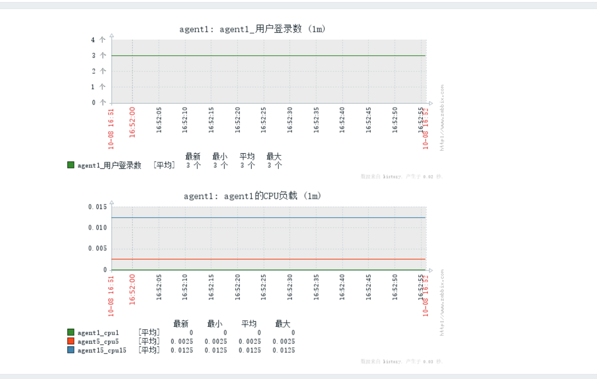

**监控项(tem)**

**应用集(applications)**

# 1、创建监控项

web管理界面-->配置-->主机-->监控项（这里我选的agent1的主机的监控项；也就是说每个主机

都是各自的监控项，选谁的就是配置谁的)-->右上角点创建监控项

- 创建监控项


> **1、监控项，值的就是你要监控linux的什么内容，是CPU负载还是流量情况啥的。**
> **2、而且每个监控项，只能监控一件事。**
> **3、如果要监控多个指标，就把多个监控项放在同一个组里，****这个组就是应用集****。**


- 创建 监控主机名的监控项


> **注意：**
> **1、新创建的监控项必须是之前从来没有创建过的**
> **2、如果此主机的某个应用集或者模板已经包含了此监控项，那么就会创建失败。**


- 效果


## 1.1 自定义监控项

自带的键值用得还是不习惯，或者有些想监控的却设有相关的键值，我们还可以自定义键值。

下面我们就来创建一个自定义的监控项：

监控agent1上的用户登录数（默认有一个键值叫system.users.num可以实现监控登录用户数，但我这里实验使用的是自己定义的键值)

1. 在被监控端agent1上，随意多打开几个终端，模拟多个登录用户

```
[root@server2 ~]# who
root     tty1         2022-10-08 13:40
root     pts/0        2022-10-08 13:40 (192.168.23.1)
root     pts/1        2022-10-08 14:58 (192.168.23.1)
root     pts/2        2022-10-08 14:59 (192.168.23.1)
[root@server2 ~]# who | wc -l            #查看登录数
4
```

1. 在被监控的agent1上，定义用户参数

```
[root@agent1 ~]vim /etc/zabbix/zabbix_agentd.conf
....
UserParameter=loginusers,who wc -l
UserParameter=test,echo "这是用于测试的"
UserParameter=fun[*],shell command  $1    #这样就可以传参了。
    #说明：loginusers是我自定义的一个键值名称（会在创建监控项时用到），后面的who|wc -l就要被监控的命令,
    #    监控的命令的返回值，就会赋给loginusers这个键值。当然后面的命令，也可以是一个脚本。
    #这是用于测试的
    
[root@agent1 ~]systemctl restart zabbix-agent
```

> **注意： UserParameter= 可以写多个，意思就是添加多个键值。**


1. 测试  ，测试键值是否生效

在server上安装一个工具：zabbix-get

```
[root@server1 ~]# yum install -y zabbix-get
[root@server1 ~]# zabbix_get -s 192.168.23.15 -k loginusers    #获取服务端的一个键值，测试成功！！！
4
[root@server1 ~]# zabbix_get -s 192.168.23.15 -k test
这是用于测试的
```

1. 图形界面，创建自定义的监控项


# 2、创建图形

- 创建图形


- 填入相关信息


- 效果   点击图像-->选择预览


- 

> **为了测试效果，可以输入以下指令，测试显示结果**
> **while : **
> **do**
> **   echo hello**
> **done;**


# 3、创建聚合图形

在上面监控项的配置里，我们定义了图形。而*聚合图形就是把多个重要常用的数据整合一起来显示，方便查看。

假设我觉得agent1上cpu负载和远程linux登录用户数这2个图形非常重要，经常要查看，我现在想把它们聚合到一起。

- 创建聚合图形


-  相关信息


- 然后就出现了这个聚合图形


-  点击那个名称，但是里面啥也没有。  所以要编辑聚合图形


- 然后就能看见两行一列的表格了。


- 点击更改，就可以在对应的位置添加上，我们之前创建好的图形了。


- 效果



- 添加到仪表盘中显示


- 显示效果


> **然后点击那个聚合图形就可以直接显示图形了。**


