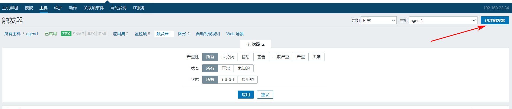
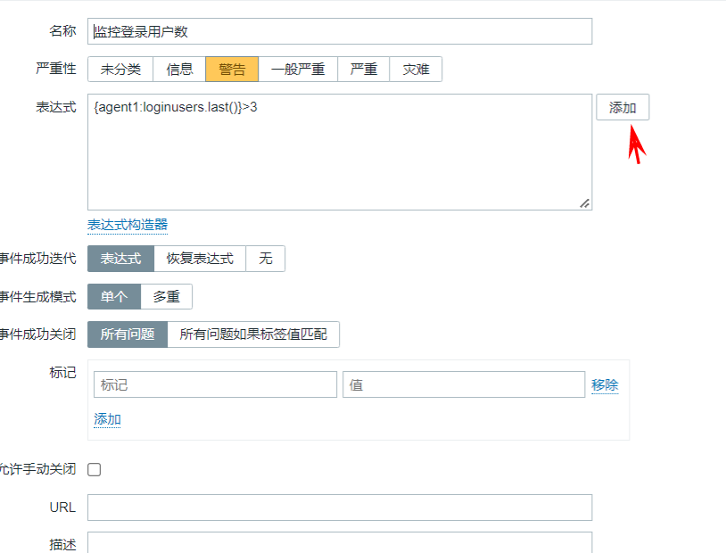
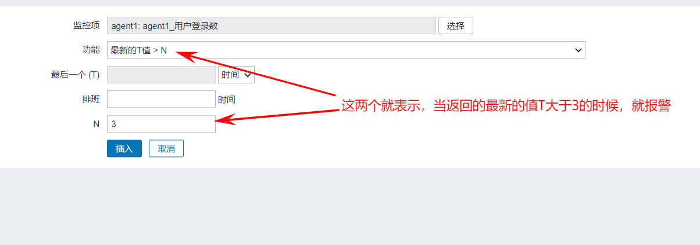
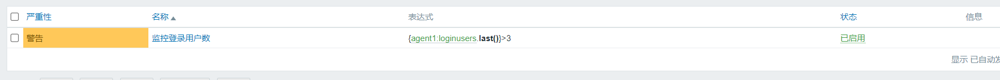
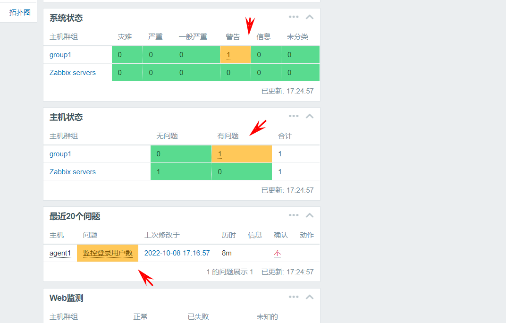
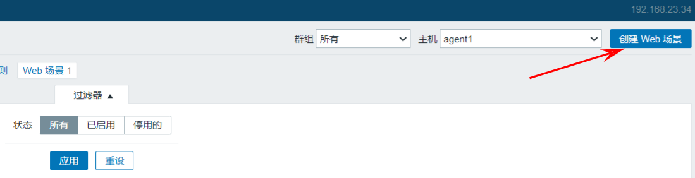
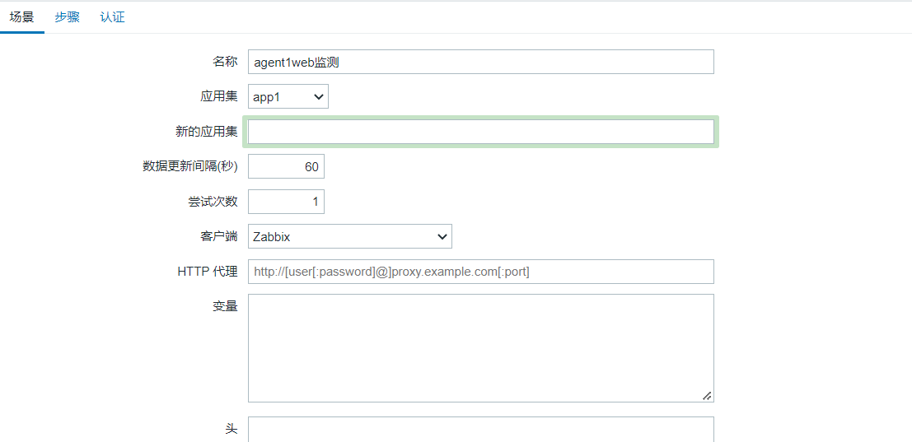
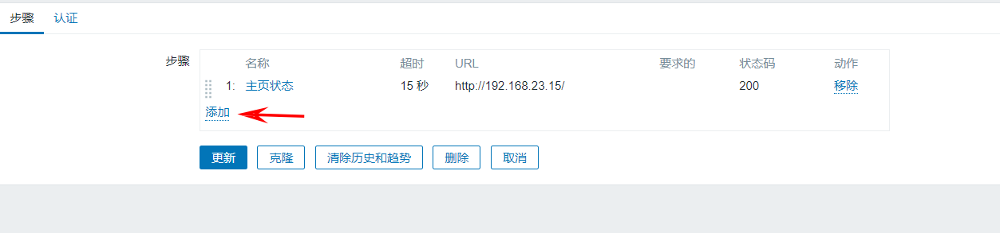
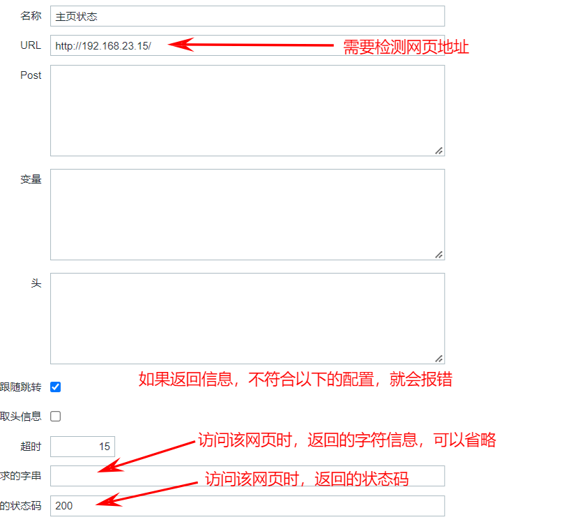
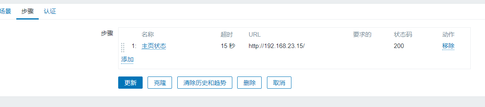

# **1、触发器（重点）**

触发器(trigger):定义监控项到达一个临界值（阈值）或者满足一个条件，就会发现状态变化(OK变为Problem,Problem变为OK

下面我把监控agent1的登录用户数做一个触发器（大于20个登录用户就警告）

1. 创建触发器

1. 编辑

1. 选择报警规则

1. 效果

1.  测试

> **1、手动添加多个用户登录**
> **2、然后查看仪表盘，是否有显示问题**

> **测试成功！！**

# 2、web检测

- 创建web场景

- 场景中填入相关信息，然后选择——>步骤

- 步骤-->选择添加

- 配置

> **注意：**
> **1、要求的字符串，只要是网页中包含这个字符串，就算认证成功。**
> **2、也可以某个文件中的内容有这个字符串，比如：httpd://localhost/test.txt  如果text.txt中包含那个字符串，也算认证成功。**

- 效果

