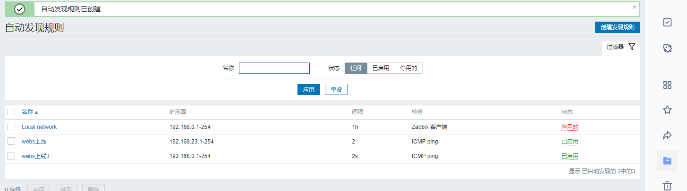

**自动发现与动作**

- 发现：假设我现在需要添加监控100台主机，这个工作量有点大。所以我可以把这100台连好网络，配置并启动好zabbix-agent服务。然后在zabbix server.上配置一个自动发现规则，自动发现这100台主机。

- 自动发现是由服务端主动发起，Zabbix Server开启发现进程，定时扫描网络中符合条件的主机。

- 动作：自动发现了这100台主机，但是还要添加监控主机和链接模板啊。这时可以通过动作来达到此目的。

咱们前面早就准备了一台agent.2,一直还没使用，这里就尝试自动发现这台agent.2。

# 步骤：

1、在每一个zabbix-agent上vim /etc/zabbix/zabbix-agent.conf，配置好对应的server，相关信息

2、登录zabbix-web页面

在配置选项中，选择动作，在右边事件源选择自动发现，然后点击创建动作；

3、添加两个触发条件，计算方式选择和

4、选择操作，然后定义四个操作选项，然后选择添加，

5、任务栏选择自动发现，点击右边的创建发现

6、由于我们是在内网，更新选择2s

检查选择ICMP ping，（能ping通是基本的条件）然后选择添加

7、选在监控，然后自动发现，查看具体的情况

