# 1、创建模板

## 1.1 创建模板

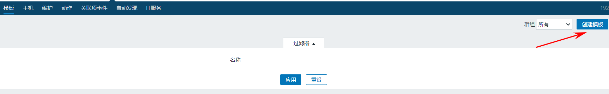

## 1.2 配置模板

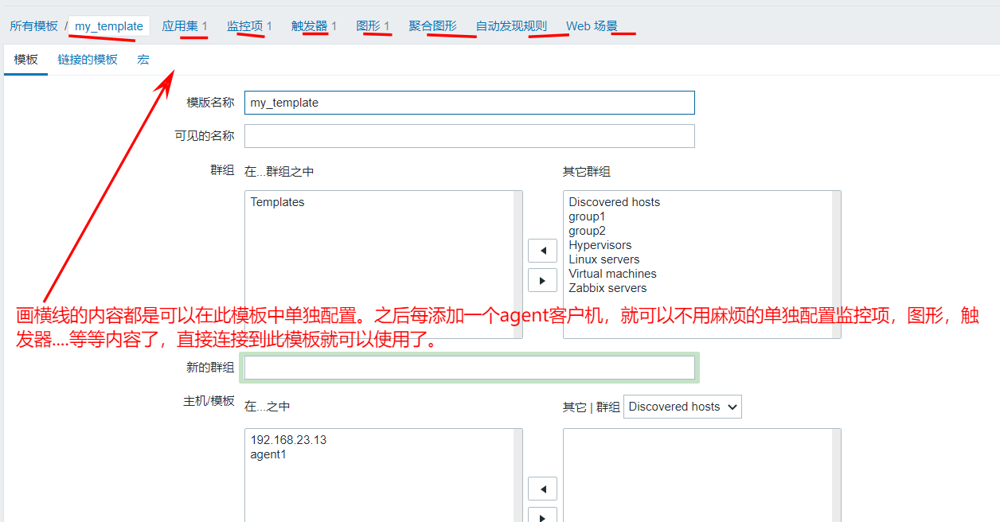

## 1.3 客户机 链接模板

1. 第一步，选择客户机，点击批量更新

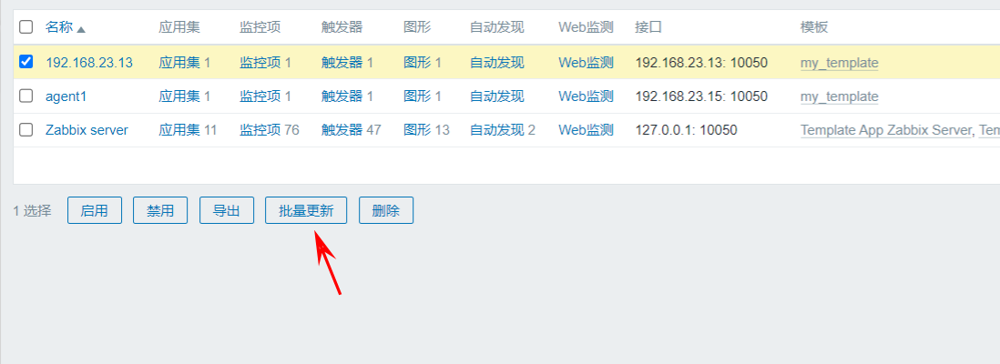

1. 

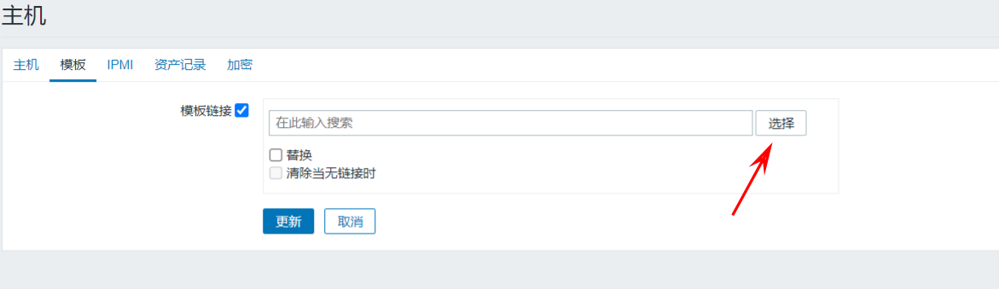

1. 选择自定义的模板

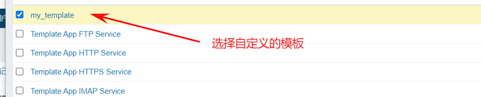

1. 选择更新即可

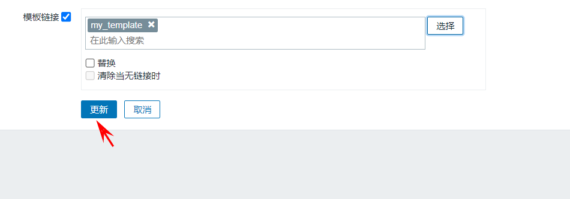

1. 效果

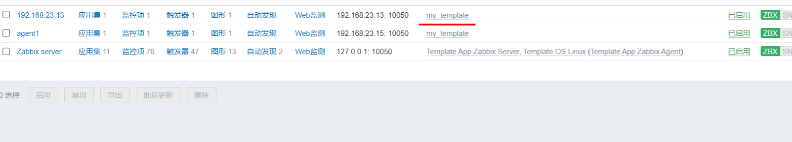

> **1、这是就可以看见已经使用了自定义的模板**
> **2、并且监控项等内容,也使用了模板中的配置.**

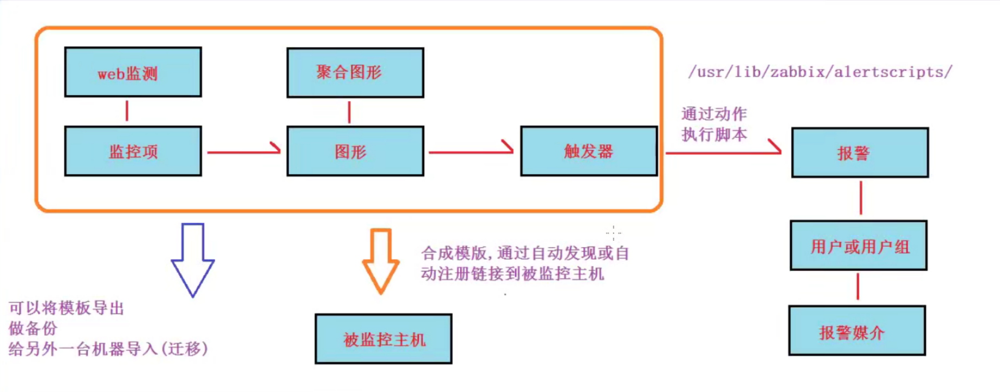

# 2、导出模板

> **1、导出模板，就是让我们辛辛苦苦配置的模板信息，数据持久化。**
> **2、要不然，万一哪天linux宕机了，数据没了，那岂不要要从新配置了。很麻烦**
> **3、所以将模板信息持久化之后，后面如果没了，一键导入即可。**
> **4、导出的格式为XML文件**

1. 选择需要导出的模板

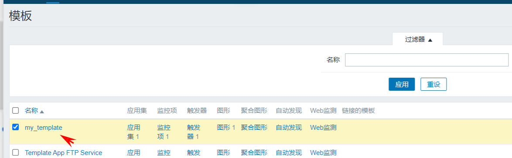

1. 然后滑到最底部，选择导出

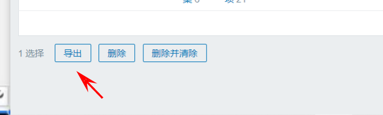

1. 然后浏览器就会将相关信息，下载下来到本地了，格式是一个XML文件。

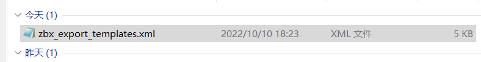

1. 文件内容为

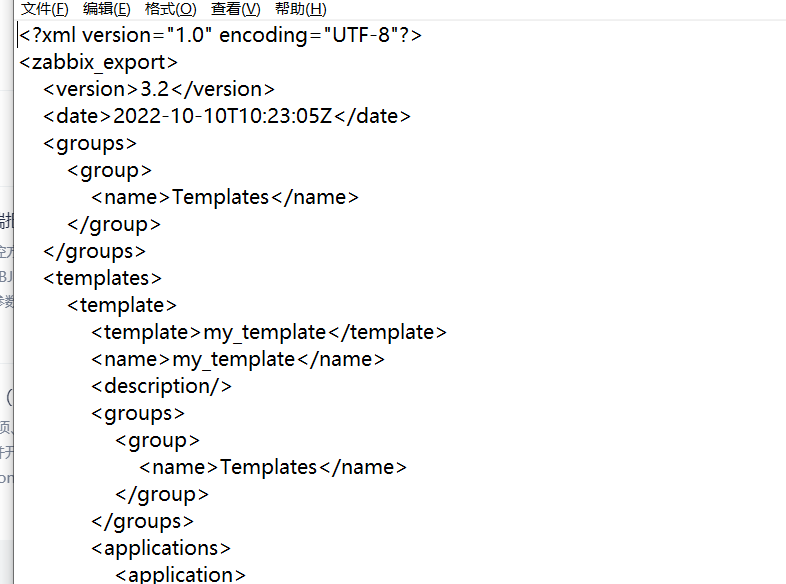

# 3、导入模板

- 选择配置-->模板-->导入

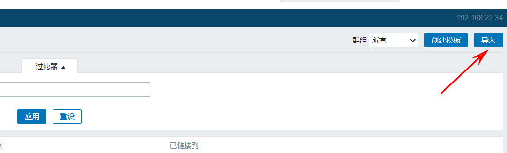