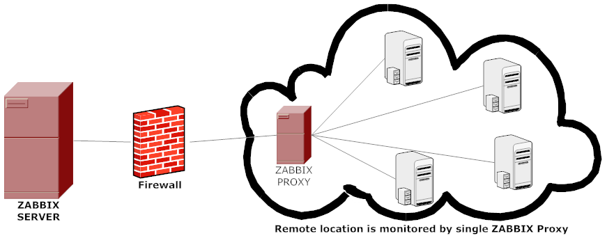
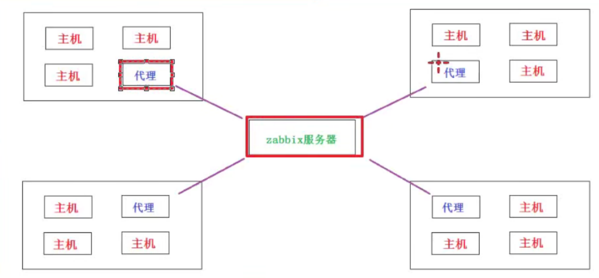
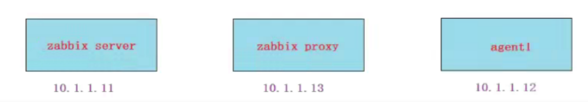
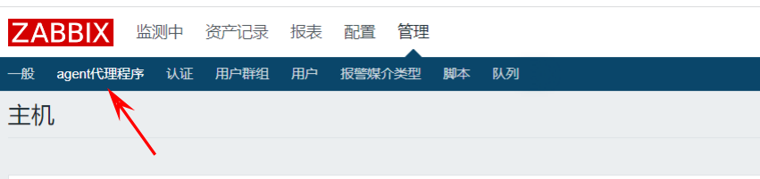
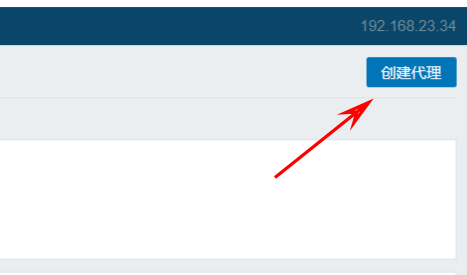
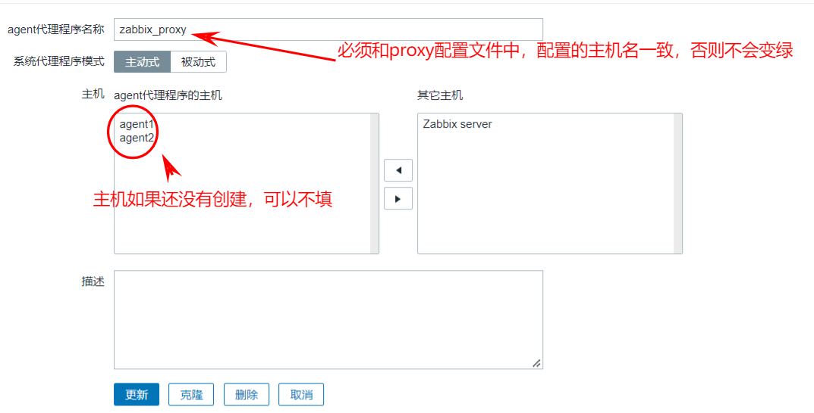
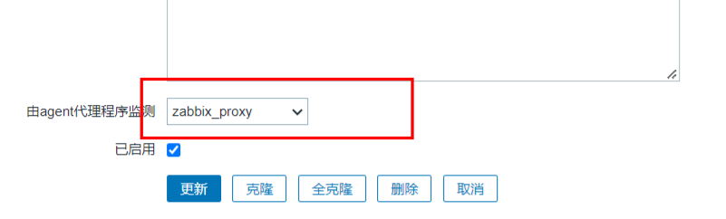
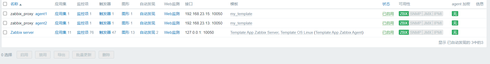

**zabbix proxy**

参考网址：[https://www.zabbix.com/documentation/3.4/zh/manual/distributed_monitoring/proxies](https://www.zabbix.com/documentation/3.4/zh/manual/distributed_monitoring/proxies)

# 1、zabbix proxy的应用场景

## 应用场景1：跨内外网监控

当zabbixⅸserver-与被监控机器不在同一个机房时，跨公网监控会很麻烦，也会带来安全隐患（比如有防火

墙的情况，需要防火墙开放的端口增多。而且像ySq数据库这类应用是不适合直接被公网连接的)



## 应用场景2：分布式监控

当监控机主机特别多，甚至分散在不同的地域机房。这个时候abbix server)压力很大，所以可以通过增加zabbix proxy来代理收集每个机房里的主机信息，再统一给zabbix server.



## zabbix proxyl的两个主要应用场景总结：

> **1.分布式监控，为zabbix server分担压力**
> **2.zabbix server!监控有防火墙的内网各服务器时，需要防火墙开放各个端口。使用zabbix proxyi在内网统一监控，然后与zabbix serveri通过公网连接，此时防火墙只需要开放zabbix server与zabbix proxy的连接就可以了。**


# 2、环境准备

```
hostnamect1 set-hostname --static zabbixproxy.cluster.com
vim /etc/hosts    #配置hosts文件
10.1.1.11    zabbixserver.cluster.com        #zabbix-server
10.1.1.12    agent1.cluster.com              #zabbix-agent
10.1.1.13    zabbixproxy.cluster.com         #zabbix-proxy
```



# 3、实现过程

## 3.1 在zabbixproxy上安装相关软件包

```
[root@zabbixproxy ~]yum install -y mariadb-server zabbix-proxy-mysql zabbix-agent
```

## 3.2 启动数据库，授权并导入数据

```
[root@zabbixproxy~]# systemctl restart mariadb
[root@zabbixproxy~]# systemctl enable mariadb
[root@zabbixproxy ]# mysql
MariaDB [(none)]>create database zabbix_proxy default charset utf8;
MariaDB [(none)]>grant all privileges on zabbix_proxy.* to zabbix@"localhost" identified by '123';
MariaDB [(none)]>flush privileges;
[root@zabbixproxy ~]zcat /usr/share/doc/zabbix-proxy-mysq1-3.4.15/schema.sql.gz |mysql zabbix_proxy -u zabbix -p123
```

## 3.3 修改zabbix_proxy上的配置文件，并重启服务

```
[root@zabbixproxy ~]vim /etc/zabbix/zabbix_proxy.conf
ProxyMode=0            #主动模式
Server=10.1.1.11       #zabbix_server的ip
Hostname=zabbixproxy.cluster.com    #这个名字和你的主机名还有后面在wb界面配置代理的名字保持一致
DBHost=localhost
DBName=zabbix_proxy
DBUser=zabbix
DBPassword=123           #打开注释，并写上密码（与前面授权一致）
ConfigFrequency=60       #主动模式下zabbix._proxy多久从zabbix_server接收一次配置数据
DataSenderFrequency=5    #主动模式下zabbix_proxy多久发送一次收集的数据给zabbixserver
[root@zabbixproxy ~]systemctl restart zabbix-proxy
[root@zabbixproxy ~]systemctl enable zabbix-proxy
```

## 3.4 如果zabbix_server也要监控zabbix_proxy的话，那么可以使用zabbix_proxy来代理自己（可选步骤）

```
[root@zabbixproxy~]#vim /etc/zabbix/zabbix_agentd.conf
Server=10.1.1.13
ServerActive=10.1.1.13    #自已代理自已，所以IP为zabbix._proxy的ip
Hostname=zabbixproxy.cluster.com
[root@zabbixproxy ~]systemctl restart zabbix-agent
[root@zabbixproxy ~]systemctl enable zabbix-agent
```

## 3.5修改agent1上的服务并重启服务

```
把服务器的ip改成zabbix_proxy的ip,而不是zabbix_server的ip
[root@agent1 ~]vim /etc/zabbix/zabbix_agentd.conf
Server=10.1.1.13            #agent的被动模式
ServerActive=10.1.1.13      #agent的主动模式
Hostname=agent1.cluster.com   #agent的上动模式必须硬加主机名
```

## 3.6  zabbix-server 图形配置代理服务

- 选择agent1代理服务



- 创建代理



- 填入相关信息



- 然后创建主机，创建方式和平时一样，但是需要将"由agent代理程序监测"选为 刚才创建的代理程序的名称



- 效果



> **配置成功！！！**
> **注意，需要加入监控项或者模板才会变绿。**
