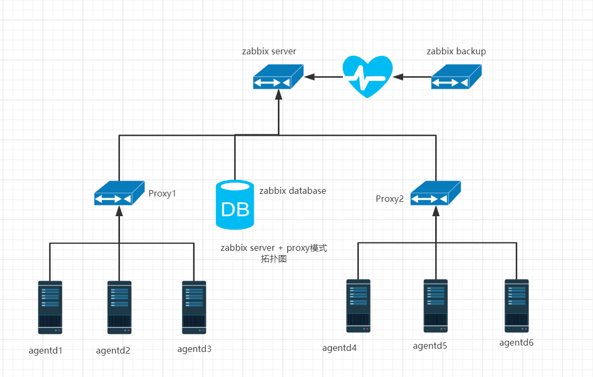

**Zabbix监控简介**

# **1、zabbix优点**

- 开源,无软件成本投入

- Server 对设备性能要求低

- 支持设备多,自带多种监控模板

- 支持分布式集中管理,有自动发现功能,可以实现自动化监控

- 开放式接口,扩展性强,插件编写容易

- 当监控的 item 比较多服务器队列比较大时可以采用主动状态,被监控客户端主动 从server 端去下载需要监控的 item 然后取数据上传到 server 端。 这种方式对服务器的负载比较小。

- Api 的支持,方便与其他系统结合

# **2、zabbix缺点**

- 需在被监控主机上安装 agent,所有数据都存在数据库里, 产生的数据据很大,瓶颈主要在数据库。

- 项目批量修改不方便

- 社区虽然成熟，但是中文资料相对较少，服务支持有限；

- 入门容易，能实现基础的监控，但是深层次需求需要非常熟悉Zabbix并进行大量的二次定制开发难度较大

- 系统级别报警设置相对比较多，如果不筛选的话报警邮件会很多；并且自定义的项目报警需要自己设置，过程比较繁琐；

- 缺少数据汇总功能，如无法查看一组服务器平均值，需进行二次开发；

# **3、zabbix组件结构**

- **Zabbix_Server：**整个监控体系中最**核心**的组件，它负责接收客户端发送的报告信息，所有配置、统计数据及操作 数据都由它组织。

- **数据库存储：**所有配置信息和Zabbix收集到的数据都被存储在数据库中。

- **Web界面**：为了从任何地方和任何平台都可以轻松的访问Zabbix, 我们提供基于Web的Zabbix界面。该界面是 Zabbix Server的一部分，通常跟Zabbix Server运行在同一台物理机器上（！如果使用SQLite,Zabbix Web界面必 须要跟Zabbix Server运行在同一台物理机器上。）

- **Zabbix_Proxy（可选）**：用于监控节点非常多的分布式环境中，它可以代理zabbix-server的功能，减轻zabbixserver的压力。

- **Zabbix_Agent**：zabbix-agent为客户端软件，用于采集各监控项目的数据，并把采集的数据传输给zabbixproxy或zabbix-server。

# **4、zabbix监控方式**

- **被动模式：**

- 被动检测：相对于agent而言；agent, server向agent请求获取配置的各监控项相关的数据，agent接收请求、获取数据并响应给server；

- **主动模式**

- 主动检测：相对于agent而言；agent(active),agent向server请求与自己相关监控项配置，主动地将server配置的监控项相关的数据发送给server；

- 主动监控能极大节约监控server 的资源。

# 5、Zabbix架构

# 6、Zabbix常用术语

- **主机**：一台你想监控的网络设备，用IP或域名表示

- **主机组：**主机的逻辑组；它包含主机和模板。一个主机组里的主机和模板之间并没有任何直接的关联。通常在给不同用户组的主机分配权限时候使用主机组。

- **监控项**：你想要接收的主机的特定数据，一个度量数据。

- **触发器**：一个被用于定义问题阈值和“评估”监控项接收到的数据的逻辑表达式 当接收到的数据高于阈值时，触发器从“OK”变成“Problem”状态。当接收到的数据低于阈值时，触发器保留/返回一个“OK”的状态。