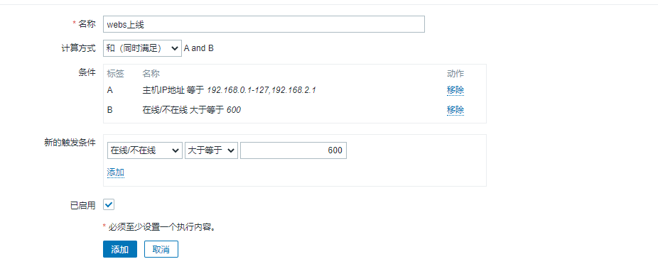
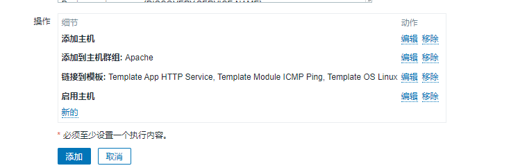
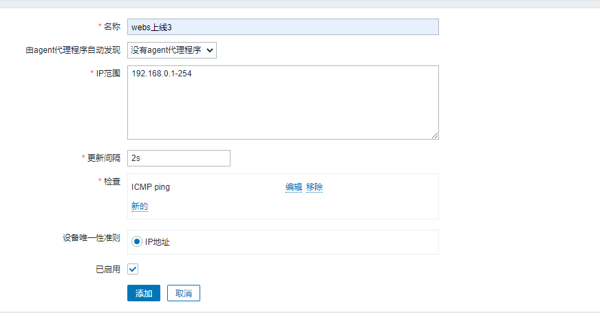
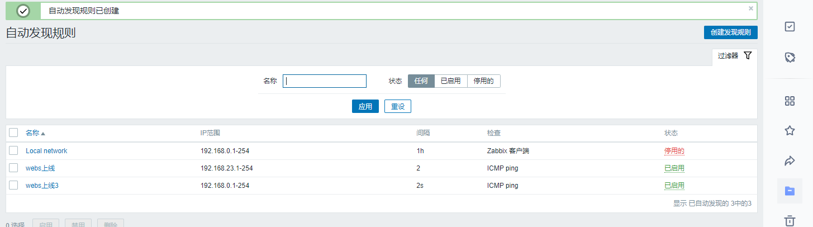
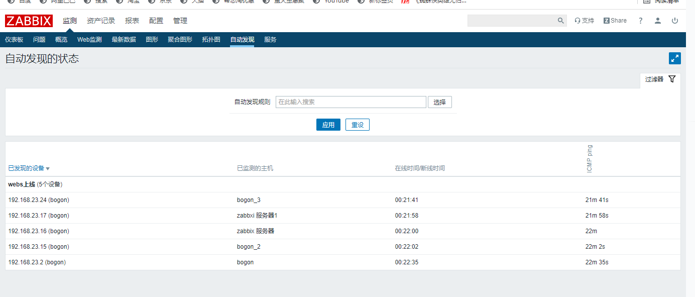

# 步骤：

1、在每一个zabbix-agent上vim /etc/zabbix/zabbix-agent.conf，配置好对应的server，相关信息

2、登录zabbix-web页面

在配置选项中，选择动作，在右边事件源选择自动发现，然后点击创建动作；

3、添加两个触发条件，计算方式选择和

4、选择操作，然后定义四个操作选项，然后选择添加，

5、任务栏选择自动发现，点击右边的创建发现

6、由于我们是在内网，更新选择2s

检查选择ICMP ping，（能ping通是基本的条件）然后选择添加

7、选在监控，然后自动发现，查看具体的情况

