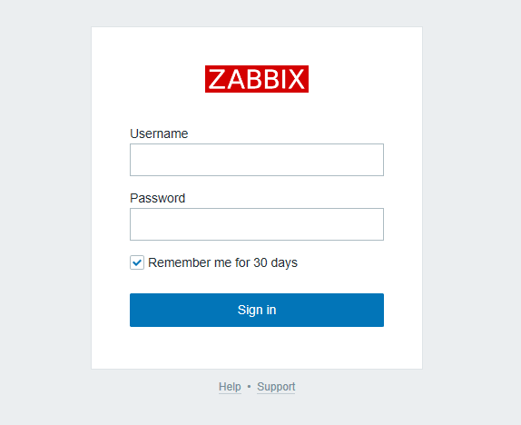
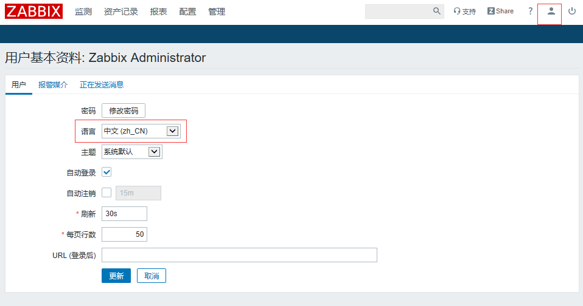
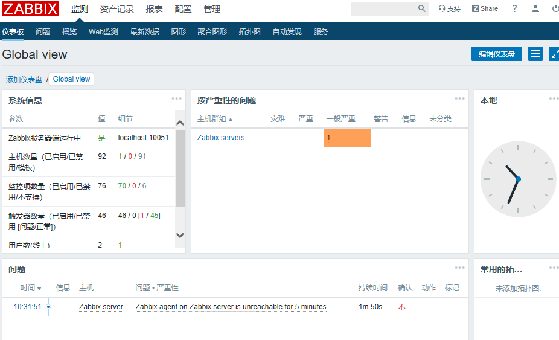

**Zabbix部署**

# 1、安装zabbix 服务端

参考网址：[https://www.zabbix.com/cn/download?zabbix=4.0&os_distribution=centos&os_version](https://www.zabbix.com/cn/download?zabbix=4.0&os_distribution=centos&os_version =7&db=mysql&ws=apache)

## 1）准备yum源，安装服务的组件

```
[root@server1 ~]# rpm -ivh http://repo.zabbix.com/zabbix/4.0/rhel/7/x86_64/zabbix-release-4.0-2.el7.noarch.rpm
[root@server1 ~]# yum install zabbix-server-mysql zabbix-web-mysql -y
```

## 2）关闭selinux、防火墙

```
[root@server1 ~]# setenforce 0
[root@server1 ~]# systemctl stop firewalld
```

# 2、准备数据库

## 1）安装数据库

```
[root@server1 ~]# yum install mariadb-server -y
[root@server1 ~]# systemctl start mariadb
[root@server1 ~]# systemctl enable mariadb
mysql> create database zabbix character set utf8 collate utf8_bin;
mysql> create user zabbix@localhost identified by 'password';
mysql> grant all privileges on zabbix.* to zabbix@localhost;
mysql> quit;
```

## 2）创建zabbix用户

- **(sql 语句中collate用来定义排序规则）**

- **（privilege:特权）**

- **on zabbix.*   :表示在zabbix数据库中的所有表（*.*：表示所有数据库中的所有表）**

- **sql 语句中 grant 授权，需要指定在什么数据库和库中的表**

```
mysql> create database zabbix character set utf8 collate utf8_bin;
mysql> create user zabbix@localhost identified by '000000';
mysql> grant all privileges on zabbix.* to zabbix@localhost;
mysql> quit;
```

# 3、修改服务的配置

## 1)导入初始架构数据

**(zcat  xxxx.gz:解压，顺便获取其中的数据）**

```
[root@server1 ~]# zcat /usr/share/doc/zabbix-server-mysql*/create.sql.gz |
 mysql -uzabbix -p zabbix
#接下来可以登录数据库检查一下有没有倒入成功：
    mysql -urpoot -p
    use zabbix;
    show trables;
```

## 2)为zabbix配置数据库

```
[root@server1 ~]# vim /etc/zabbix/zabbix_server.conf
DBPassword=000000
```

## 3)编辑前端php配置(更改时区）

```
[root@server1 ~]# vim /etc/httpd/conf.d/zabbix.conf
php_value max_execution_time 300
php_value memory_limit 128M
php_value post_max_size 16M
php_value upload_max_filesize 2M
php_value max_input_time 300
php_value always_populate_raw_post_data -1
php_value date.timezone Asia/Shanghai
```

## 4)启动服务

```
[root@server1 ~]# systemctl restart zabbix-server httpd
[root@server1 ~]# systemctl enable zabbix-server httpd
```

## 5)至此完成zabbix 服务端的部署，可以通过







# 4、客户端配置

## 1）安装软件包

```
[root@server1 ~]# rpm -ivh https://repo.zabbix.com/zabbix/4.0/rhel/7/x86_64/zabbix-release-4.0-2.el7.noarch.rpm
[root@server2 ~]# yum install zabbix-agent -y
```

## 2)修改配置文件

```
[root@server2 ~]# vim /etc/zabbix/zabbix_agentd.conf
# 主要修改以下三个参数
Server=192.168.80.30
ServerActive=192.168.80.30
Hostname=server2
```

## 3)关闭selinux、防火墙、启动服务

```
[root@server1 ~]# setenforce 0
[root@server1 ~]# systemctl stop firewalld
[root@server1 ~]# systemctl start zabbix-agent.service
```