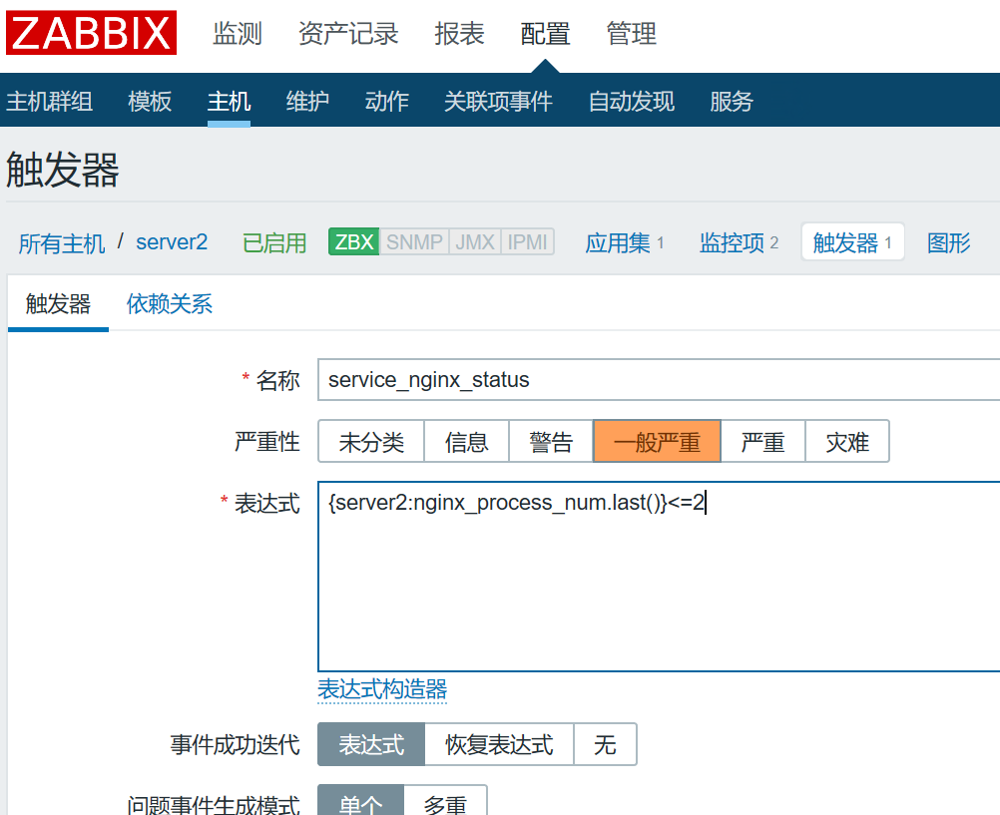

**快速使用**

# 1、自定义配置监控项

## 1)编写客户端监控项配置文件

```
[root@server2 ~]# cat /etc/zabbix/zabbix_agentd.d/userparameter_nginx.conf
UserParameter=nginx_process_num,ps -ef | grep -c [n]ginx
[root@server2 ~]# systemctl restart zabbix-agent.service
# 复杂的监控项
UserParameter=[*]_process_num,ps -ef | grep -c $1
```

## 2)验证自定义监控项是否生效

```
[root@server1 ~]# yum install zabbix-get.x86_64 -y
[root@server1 ~]# zabbix_get -s 192.168.80.40 -k nginx_process_num
9
```

## 3)web端添加监控项，加入此键值


## 4)给主机添加触发器



# 2、redis相关的自定义监控项

```
vim /usr/local/zabbix/etc/zabbix_agentd.conf.d/redis.conf
UserParameter=Redis.Status,/usr/local/redis/bin/redis-cli -h 127.0.0.1 -p
6379 ping |grep -c PONG
UserParameter=Redis_conn[*],/usr/local/redis/bin/redis-cli -h $1 -p $2 info
| grep -w "connected_clients" | awk -F':' '{print $2}'
UserParameter=Redis_rss_mem[*],/usr/local/redis/bin/redis-cli -h $1 -p $2
info | grep -w "used_memory_rss" | awk -F':' '{print $2}'
UserParameter=Redis_lua_mem[*],/usr/local/redis/bin/redis-cli -h $1 -p $2
info | grep -w "used_memory_lua" | awk -F':' '{print $2}'
UserParameter=Redis_cpu_sys[*],/usr/local/redis/bin/redis-cli -h $1 -p $2
info | grep -w "used_cpu_sys" | awk -F':' '{print $2}'
UserParameter=Redis_cpu_user[*],/usr/local/redis/bin/redis-cli -h $1 -p $2
info | grep -w "used_cpu_user" | awk -F':' '{print $2}'
UserParameter=Redis_cpu_sys_cline[*],/usr/local/redis/bin/redis-cli -h $1 -p
$2 info | grep -w "used_cpu_sys_children" | awk -F':' '{print $2}'
UserParameter=Redis_cpu_user_cline[*],/usr/local/redis/bin/redis-cli -h $1 -
p $2 info | grep -w "used_cpu_user_children" | awk -F':' '{print $2}'
UserParameter=Redis_keys_num[*],/usr/local/redis/bin/redis-cli -h $1 -p $2
info | grep -w "$$1" | grep -w "keys" | grep db$3 | awk -F'=' '{print $2}' |
awk -F',' '{print $1}'
UserParameter=Redis_loading[*],/usr/local/redis/bin/redis-cli -h $1 -p $2
info | grep loading | awk -F':' '{print $$2}'
Redis.Status --检测Redis运行状态， 返回整数
Redis_conn  --检测Redis成功连接数，返回整数
Redis_rss_mem  --检测Redis系统分配内存，返回整数
Redis_lua_mem  --检测Redis引擎消耗内存，返回整数
Redis_cpu_sys --检测Redis主程序核心CPU消耗率，返回整数
Redis_cpu_user --检测Redis主程序用户CPU消耗率，返回整数
Redis_cpu_sys_cline --检测Redis后台核心CPU消耗率，返回整数
Redis_cpu_user_cline --检测Redis后台用户CPU消耗率，返回整数
Redis_keys_num --检测库键值数，返回整数
Redis_loding --检测Redis持久化文件状态，返回整数
```

# 3、nginx相关的自定义监控项

```
vim /etc/nginx/conf.d/default.conf
 location /nginx-status
 {
   stub_status on;
   access_log off;
   allow 127.0.0.1;
   deny all;
 }
 
vim /usr/local/zabbix/etc/zabbix_agentd.conf.d/nginx.conf
UserParameter=Nginx.active,/usr/bin/curl -s "http://127.0.0.1:80/nginx-
status" | awk '/Active/ {print $NF}'
UserParameter=Nginx.read,/usr/bin/curl -s "http://127.0.0.1:80/nginx-status"
| grep 'Reading' | cut -d" " -f2
UserParameter=Nginx.wrie,/usr/bin/curl -s "http://127.0.0.1:80/nginx-status"
| grep 'Writing' | cut -d" " -f4
UserParameter=Nginx.wait,/usr/bin/curl -s "http://127.0.0.1:80/nginx-status"
| grep 'Waiting' | cut -d" " -f6
UserParameter=Nginx.accepted,/usr/bin/curl -s "http://127.0.0.1:80/nginx-
status" | awk '/^[ \t]+[0-9]+[ \t]+[0-9]+[ \t]+[0-9]+/ {print $1}'
UserParameter=Nginx.handled,/usr/bin/curl -s "http://127.0.0.1:80/nginx-
status" | awk '/^[ \t]+[0-9]+[ \t]+[0-9]+[ \t]+[0-9]+/ {print $2}'
UserParameter=Nginx.requests,/usr/bin/curl -s "http://127.0.0.1:80/nginx-
status" | awk '/^[ \t]+[0-9]+[ \t]+[0-9]+[ \t]+[0-9]+/ {print $3}'
```

# 4、TCP相关的自定义监控项

```
vim /usr/local/zabbix/share/zabbix/alertscripts/tcp_connection.sh
#!/bin/bash
function ESTAB {
/usr/sbin/ss -ant |awk '{++s[$1]} END {for(k in s) print k,s[k]}' | grep
'ESTAB' | awk '{print $2}'
}
function TIMEWAIT {
/usr/sbin/ss -ant | awk '{++s[$1]} END {for(k in s) print k,s[k]}' | grep
'TIME-WAIT' | awk '{print $2}'
}
function LISTEN {
/usr/sbin/ss -ant | awk '{++s[$1]} END {for(k in s) print k,s[k]}' | grep
'LISTEN' | awk '{print $2}'
}
$1
vim /usr/local/zabbix/etc/zabbix_agentd.conf.d/cattcp.conf
UserParameter=tcp[*],/usr/local/zabbix/share/zabbix/alertscripts/tcp_connect
ion.sh $1
tcp[TIMEWAIT] --检测TCP的驻留数，返回整数
tcp[ESTAB]  --检测tcp的连接数、返回整数
tcp[LISTEN] --检测TCP的监听数，返回整数
```

# 5、系统监控的自带选项

```
agent.ping 检测客户端可达性、返回nothing表示不可达。1表示可达
system.cpu.load --检测cpu负载。返回浮点数
system.cpu.util -- 检测cpu使用率。返回浮点数
vfs.dev.read -- 检测硬盘读取数据，返回是sps.ops.bps浮点类型，需要定义1024倍
vfs.dev.write -- 检测硬盘写入数据。返回是sps.ops.bps浮点类型，需要定义1024倍
net.if.out[br0] --检测网卡流速、流出方向，时间间隔为60S
net-if-in[br0] --检测网卡流速，流入方向（单位：字节） 时间间隔60S
proc.num[] 目前系统中的进程总数，时间间隔60s
proc.num[,,run] 目前正在运行的进程总数，时间间隔60S
###处理器信息
通过zabbix_get 获取负载值
合理的控制用户态、系统态、IO等待时间剋保证进程高效率的运行
系统态运行时间较高说明进程进行系统调用的次数比较多，一般的程序如果系统态运行时间占用过高就
需要优化程序，减少系统调用
io等待时间过高则表明硬盘的io性能差，如果是读写文件比较频繁、读写效率要求比较高，可以考虑更
换硬盘，或者使用多磁盘做raid的方案
system.cpu.swtiches --cpu的进程上下文切换，单位sps，表示每秒采样次数，api中参数
history需指定为3
system.cpu.intr  --cpu中断数量、api中参数history需指定为3
system.cpu.load[percpu,avg1]  --cpu每分钟的负载值，按照核数做平均值(Processor
load (1 min average per core))，api中参数history需指定为0
system.cpu.load[percpu,avg5]  --cpu每5分钟的负载值，按照核数做平均值(Processor
load (5 min average per core))，api中参数history需指定为0
system.cpu.load[percpu,avg15]  --cpu每5分钟的负载值，按照核数做平均值(Processor
load (15 min average per core))，api中参数history需指定为0
```

# 6、系统监控的自定义监控选项

```
###内存相关
vim /usr/local/zabbix/etc/zabbix_agentd.conf.d/catcarm.conf
UserParameter=ram.info[*],/bin/cat /proc/meminfo |awk '/^$1:{print $2}'
ram.info[Cached] --检测内存的缓存使用量、返回整数，需要定义1024倍
ram.info[MemFree] --检测内存的空余量，返回整数，需要定义1024倍
ram.info[Buffers] --检测内存的使用量，返回整数，需要定义1024倍
####TCP相关的自定义项
vim /usr/local/zabbix/share/zabbix/alertscripts/tcp_connection.sh
#!/bin/bash
function ESTAB {
/usr/sbin/ss -ant |awk '{++s[$1]} END {for(k in s) print k,s[k]}' | grep
'ESTAB' | awk '{print $2}'
}
function TIMEWAIT {
/usr/sbin/ss -ant | awk '{++s[$1]} END {for(k in s) print k,s[k]}' | grep
'TIME-WAIT' | awk '{print $2}'
}
function LISTEN {
/usr/sbin/ss -ant | awk '{++s[$1]} END {for(k in s) print k,s[k]}' | grep
'LISTEN' | awk '{print $2}'
}
$1
vim /usr/local/zabbix/etc/zabbix_agentd.conf.d/cattcp.conf
UserParameter=tcp[*],/usr/local/zabbix/share/zabbix/alertscripts/tcp_connect
ion.sh $1
tcp[TIMEWAIT] --检测TCP的驻留数，返回整数
tcp[ESTAB]  --检测tcp的连接数、返回整数
tcp[LISTEN] --检测TCP的监听数，返回整数
```