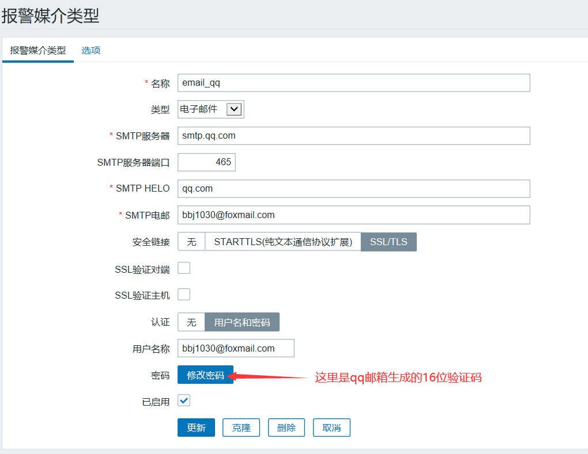
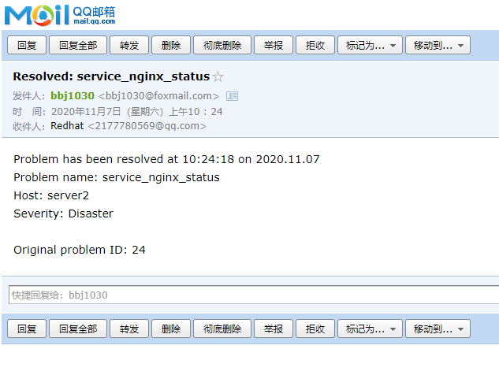

**zabbix实现邮件告警**

- 1.配置Email：管理-》报警媒介类型-》Email-》修改对应Email参数

- 2.修改admin用户的报警媒介Email：管理-》用户-》Admin-》报警媒介-》添加接收报警邮件的邮箱-》

点击更新

- 3.添加触发器：配置-》主机-》已监控的主机-》触发器-》创建触发器-》填入报警名称-》点击表达式右

边的添加-》点击监控项右边的选择-》建议选择system uptime(系统启动时间)-》结果选等于0确认插入-》更新

- 4.查看触发器状态：配置-》主机-》已监控主机里的触发器，找到新创建的触发器-》可以看到触发器对

应的值有问题和状态两种，可能需要等几分钟才会更新过来

- 5.配置发送异常报警邮件：配置-》动作-》点击启用Report problems to Zabbix administrators即可

- 6.邮箱收到报警邮件

参考博客：[https://www.cnblogs.com/biaopei/p/10535504.html](https://www.cnblogs.com/biaopei/p/10535504.html)