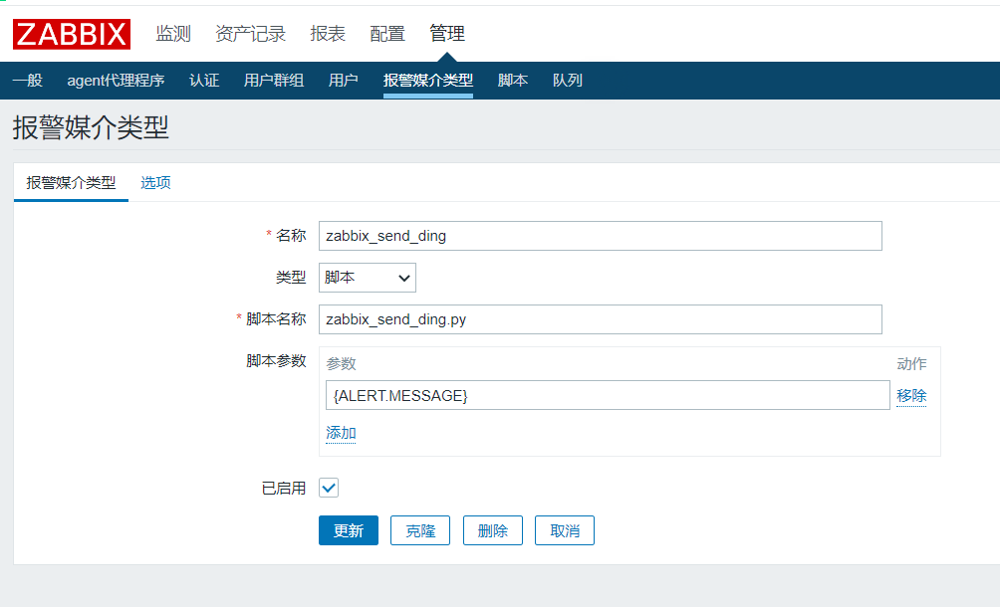
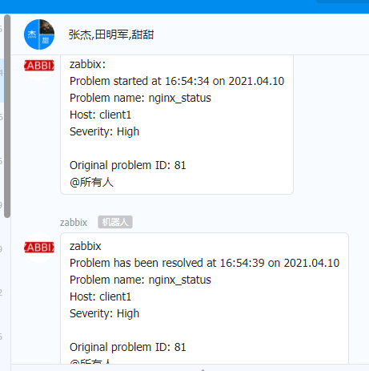

**Zabbix通过钉钉告警**

参考博客：[https://blog.csdn.net/rightlzc/article/details/100702672](https://blog.csdn.net/rightlzc/article/details/100702672)

第一步，是钉钉群聊（这个操作直接在手机上就可以拉群）

第二步，是添加群机器人（这个操作是需要在电脑端完成，手机没有权限创建机器人）

第三步，去对应的目录下准备python脚本

```
[root@server ~]# yum install -y python-requests      #脚本中会用到的一个
模块
[root@server alertscripts]# pwd
/usr/lib/zabbix/alertscripts
[root@server alertscripts]# cat zabbix_send_ding.py
#!/usr/bin/python
# -*- coding: utf-8 -*-
# Author: xxxxxxxx
import requests
import json
import sys
import os
headers = {'Content-Type': 'application/json;charset=utf-8'}
api_url = "https://oapi.dingtalk.com/robot/send?
access_token=1a047d0cdc5d0be0a438c73ad0b5e73e25b600173696fd49a2e4c1f352f4bca
4"
def msg(text):
  json_text= {
      "msgtype": "text",
  "at": {
    "atMobiles": [
      "13333333333"
   ],
      "isAtAll": True
  },
  "text": {
    "content": text
  }
 }
 print
requests.post(api_url,json.dumps(json_text),headers=headers).content
if __name__ == '__main__':
  #text = "linux + zabbix 天下第一!"
  text = sys.argv[1]
  msg(text)
[root@server alertscripts]# systemctl restart zabbix-server.service
```

第四步，测试脚本

```
[root@server alertscripts]# chmod a+x zabbix_send_ding.py
[root@server alertscripts]# ./zabbix_send_ding.py "linux+zabbix天下第一！"
{"errcode":0,"errmsg":"ok"}
```

第五步，添加告警媒介

因为我们使用的python脚本只接收一个参数（内容），所以只需要添加一个参数{ALLERT.MESSAGE}即可



第六步，添加动作

第七步，绑定用户，用户收件人写电话号码即可

最终实现效果如下图

