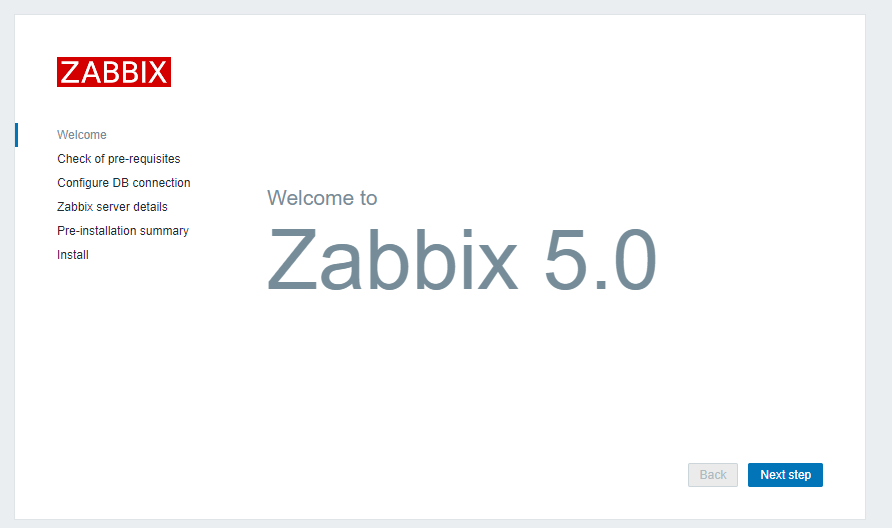
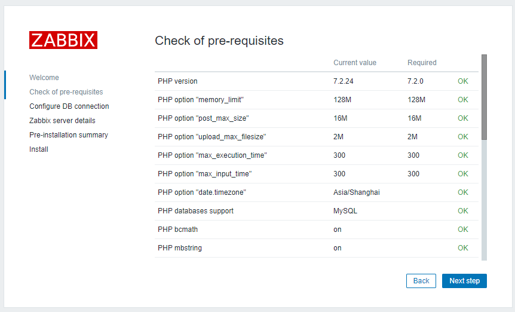
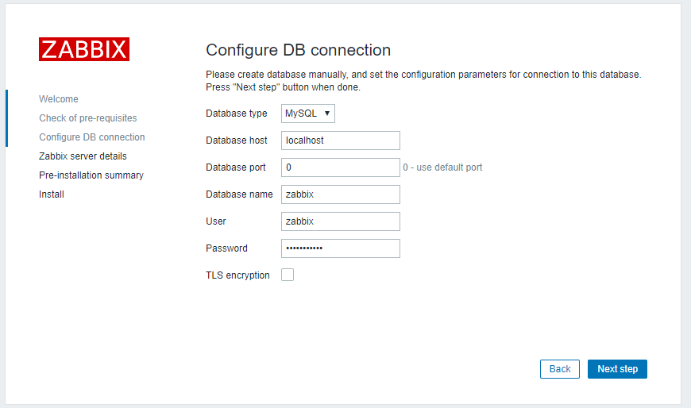
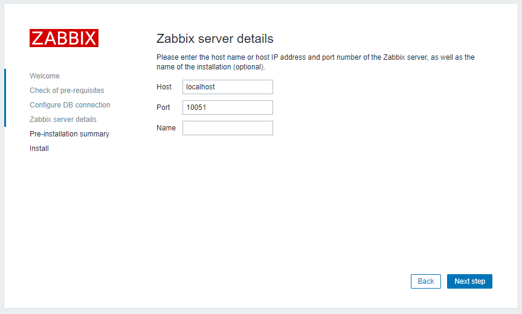
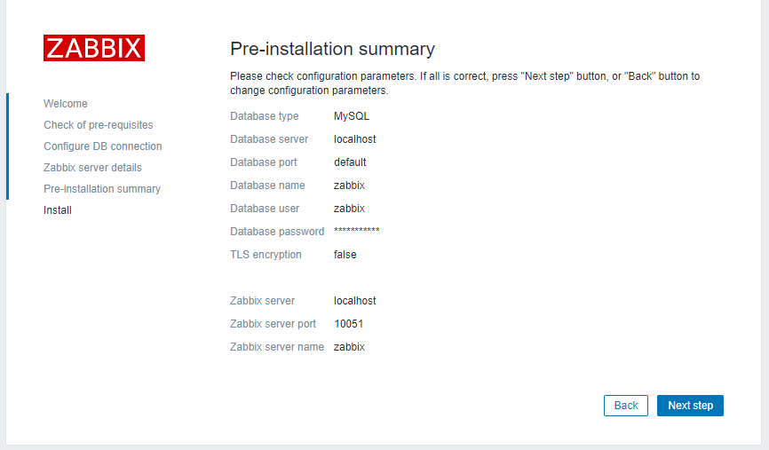
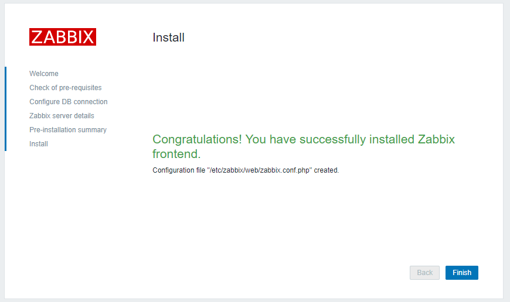
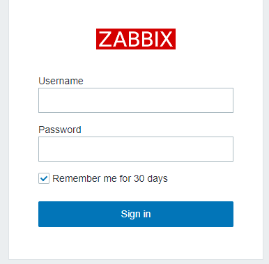
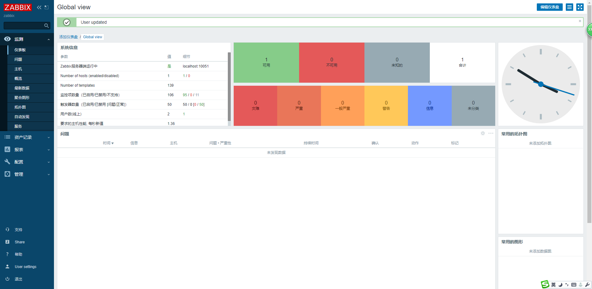
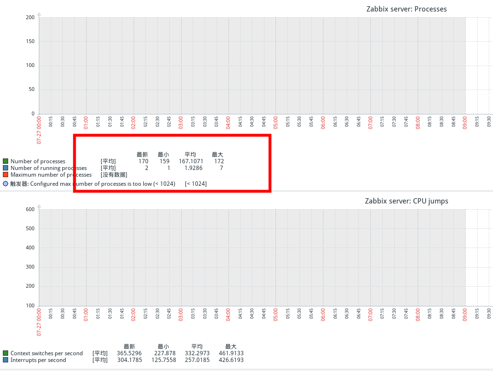
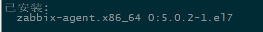

# **一、安装zabbix-server**

首先在虚拟机上把Centos7安装完毕并关闭防火墙与SElinux。

打开[Zabbix官网](https://www.zabbix.com/cn/download?zabbix=5.0&os_distribution=centos&os_version=7&db=mysql&ws=apache)选择Zabbix版本-OS系统-OS版本-数据库-WebServer

[](https://null6.cn/2020/05/14/Centos7-Zabbix5-install/1.jpg)

**2、替换阿里云Zabbix源**

shell脚本zabbix_aliyun.sh[](javascript:void(0);)

```shell
#!/bin/bash
echo -e "请给出要安装的zabbix版本号，建议使用4.x的版本  \033[31musage：./zabbix_aliyun.sh 4.0|4.4|4.5|5.0 \033[0m"
echo "例如要安装4.4版本，在命令行写上 ./zabbix_aliyun.sh 4.4"
if [ -z $1 ];then
    exit
fi
VERSION=$1
if [ -f /etc/yum.repos.d/zabbix.repo ];then
    rm -rf /etc/repos.d/zabbix.repo
fi
rpm -qa | grep zabbix-release && rpm -e zabbix-release
rpm -Uvh 
sed -i "s@zabbix/.*/rhel@zabbix/$VERSION/rhel@g" /etc/yum.repos.d/zabbix.repo
sed -i 's@repo.zabbix.com@mirrors.aliyun.com/zabbix@g' /etc/yum.repos.d/zabbix.repo
[ $? -eq 0 ] && echo "阿里云的zabbix源替换成功" || exit 1
yum clean all
yum makecache fast
```

[](javascript:void(0);)

然后执行命令：

```shell
bash zabbix_aliyun.sh 5.0
```

**3、前期准备**

```
rpm -Uvh 
yum clean all
```

**安装Zabbix server 和 agent**

```shell
yum install zabbix-server-mysql zabbix-agent
```

**安装Zabbix frontend**

```shell
yum install centos-release-scl
```

**编辑配置文件 /etc/yum.repos.d/zabbix.repo**[](javascript:void(0);)

```shell
vim /etc/yum.repos.d/zabbix.repo
[zabbix-frontend]
...
enabled=1
...
```

[](javascript:void(0);)

**安装 Zabbix frontend packages**

```shell
yum install zabbix-web-mysql-scl zabbix-apache-conf-scl
```

**安装Mysql数据库**

```shell
cd /usr/local/src/
wget 
rpm -ivh mysql57-community-release-el7-8.noarch.rpm
yum -y install mysql-server
```

** 启动Mysql**

```shell
systemctl start mysqld
```

** 获取安装时的临时密码**

```shell
grep 'temporary password' /var/log/mysqld.log
```

 ‘,LW:N3)&hQ8h’临时密码 用这个密码登录并修改密码

```shell
mysql -uroot -p',LW:N3)&hQ8h'
mysql> set password for root@localhost = password('password');
```

**创建初始数据库**

```
mysql> create database zabbix character set utf8 collate utf8_bin;
mysql> grant all privileges on zabbix.* to zabbix@localhost identified by 'password';
mysql> quit;
```

**导入初始架构和数据，系统将提示您输入新创建的密码**

```shell
zcat /usr/share/doc/zabbix-server-mysql*/create.sql.gz | mysql -uzabbix -p zabbix
```

**为Zabbix server配置数据库**

编辑配置文件 /etc/zabbix/zabbix_server.conf

```
vim /etc/zabbix/zabbix_server.conf
DBPassword=password
```

**为Zabbix前端配置PHP**

编辑配置文件 /etc/opt/rh/rh-php72/php-fpm.d/zabbix.conf

```
vim /etc/opt/rh/rh-php72/php-fpm.d/zabbix.conf
php_value[date.timezone] = Asia/Shanghai
```

**启动Zabbix server和agent进程**

启动Zabbix server和agent进程，并为它们设置开机自启

```shell
systemctl restart zabbix-server zabbix-agent httpd rh-php72-php-fpm
systemctl enable zabbix-server zabbix-agent httpd rh-php72-php-fpm
```

# 二、打开http:IP/zabbix  例：



点击“Next step”检查组件是否OK



 点击“Next step”，配置连接数据库



 

 输入zabbix帐户的密码，然后“Next step”



直接下一步



下一步



 看到上述提示，说明安装成功。点"Finish"



 用户名：Admin，密码：zabbix



 显示中文乱码解决方法

在zabbix-server服务器上安装如下文件符集

```shell
yum install wqy-microhei-fonts
```

然后替换linux上默认的字符集

```shell
cp /usr/share/fonts/wqy-microhei/wqy-microhei.ttc /usr/share/fonts/dejavu/DejaVuSans.ttf
```

重启zabbix-server，查看乱码是否解决



#  三、客户端安装

同zabbix-server服务器操作，第一步是替换阿里源。

执行如下命令：

```
yum install zabbix-agent
```



 

 配置 vim /etc/zabbix/zabbix_agentd.conf 。修改zabbix-server的IP

```
 vim /etc/zabbix/zabbix_agentd.conf 
                 
 Server=10.0.0.147                                                                                                                          
  
```

重启zabbix-agent