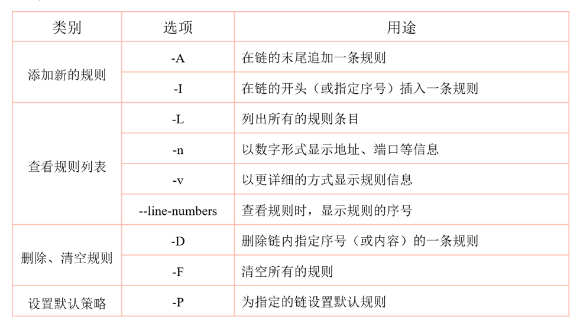

**Iptables 语法规则**

# 1、书写规则

```
语法构成：iptables [-t 表名] 选项 [链名] [条件] [-j 控制类型]
几个注意事项：
     不指定表名时，默认指 filter 表
     不指定链名时，默认指表内的所有链
     除非设置链的默认策略，否则必须指定匹配条件
     选项、链名、控制类型使用大写字母，其余均为小写
```

# 2、常见动作类型

```
ACCEPT ：允许通过
DROP ：直接丢弃，不给出任何回应
REJECT ：拒绝通过，必要时会给出提示
LOG ：记录日志信息，然后传给下一条规则继续匹配
SNAT ：修改数据包源地址
DNAT ：修改数据包目的地址
REDIRECT ：重定向
```

# 3、常见选项



# 4、配型类型分类

- 通用匹配

-  可直接使用，不依赖于其他条件或扩展

-  包括网络协议、IP 地址、网络接口等条件

- 隐含匹配

-  要求以特定的协议匹配作为前提

-  包括端口、TCP 标记、ICMP 类型等条件

- 显式匹配

-  要求以“-m 扩展模块”的形式明确指出类型

-  包括多端口、MAC 地址、IP 范围、数据包状态等条件

# 5、通用匹配

- 常见的通用匹配条件

- 协议匹配：-p 协议名

- 地址匹配：-s 源地址、-d 目的地址

- 接口匹配：-i 入站网卡、-o 出站网卡

- 代码演示示例

```
iptables -A FORWARD -s 192.168.1.11 -j REJECT
iptables -I INPUT -s 10.20.30.0/24 -j DROP
iptables -I INPUT -p icmp -j DROP
iptables -A FORWARD -p ! icmp -j ACCEPT
iptables -A INPUT -i eth1 -s 172.16.0.0/12 -j DROP
```

# 6、隐含匹配

- 常用的隐含匹配条件

-  端口匹配：--sport 源端口、--dport 目的端口

- ICMP 类型匹配：--icmp-type ICMP 类型

- 代码演示示例

```
iptables -A FORWARD -s 192.168.4.0/24 -p udp --dport 53 -j ACCEPT
iptables -A INPUT -p tcp --dport 20:21 -j ACCEPT
iptables -A INPUT -p icmp --icmp-type 8 -j DROP
iptables -A INPUT -p icmp --icmp-type 0 -j ACCEPT
iptables -A INPUT -p icmp --icmp-type 3 -j ACCEPT
iptables -A INPUT -p icmp -j DROP
```

# 7、显式匹配

常用的显式匹配条件

```
 多端口匹配
     -m multiport --sport 源端口列表
     -m multiport --dport 目的端口列表
IP 范围匹配
     -m iprange --src-range IP 范围
 MAC 地址匹配
     -m mac –mac1-source MAC 地址
 状态匹配
     -m state --state 连接状态
```

代码演示示例

```
iptables -A INPUT -p tcp -m multiport --dport 25,80,110,143 -j ACCEPT
iptables -A FORWARD -p tcp -m iprange --src-range 192.168.4.21-192.168.4.28 -j ACCEPT
iptables -A INPUT -m mac --mac-source 00:0c:29:c0:55:3f -j DROP
iptables -P INPUT DROP
iptables -I INPUT -p tcp -m multiport --dport 80-82,85 -j ACCEPT
iptables -I INPUT -p tcp -m state --state NEW,ESTABLISHED,RELATED -j ACCEPT
```

# 8、常见 Iptables 相关命令（补充）

导出（备份）规则：iptables-save 工具，可结合重定向输出保存到指定文件

导入（还原）规则：iptables-restore 工具，可结合重定向输入指定规则来源

- iptables 服务

-  脚本位置：/etc/init.d/iptables

-  规则文件位置：/etc/sysconfig/iptables

- 设置 iptables 开机启动

-  chkconfig iptables on

-  chkconfig iptables off

```
即时启动 iptables：service iptables start
即时关闭 iptables ：service iptables stop
```

防火墙规则只在计算机处于开启状态时才有效。如果系统被重新引导，这些规则就会自动被清除并重

设。要保存规则以便今，请使用以下命令：后载入

sbin/service iptables save

保存在 /etc/sysconfig/iptables 文件中的规则会在服务启动或重新启动时（包括机器被重新引导时）被应用