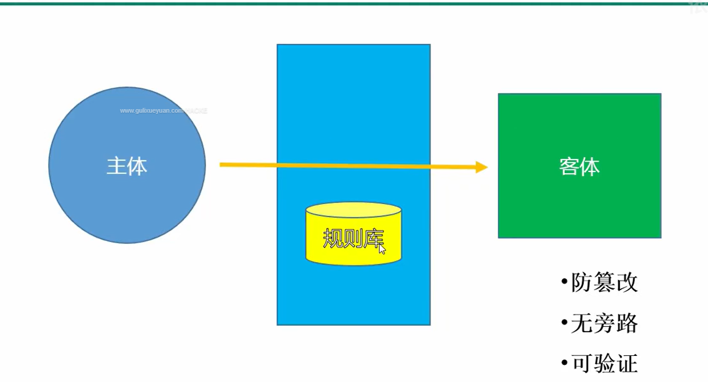
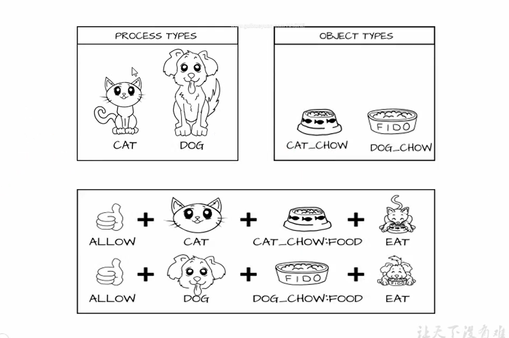
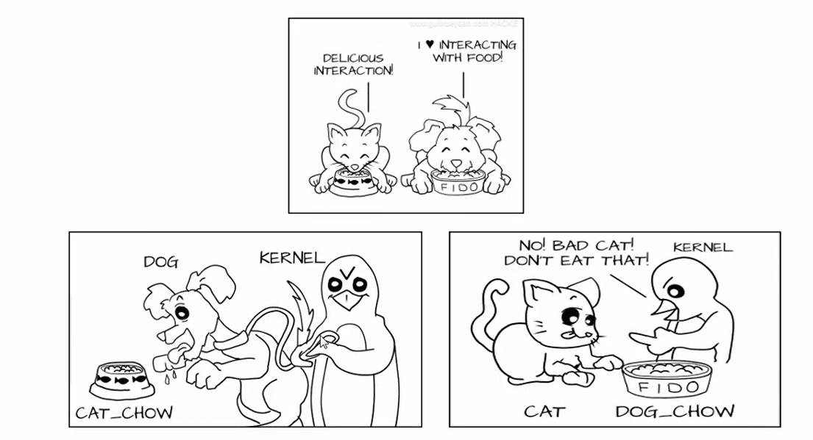
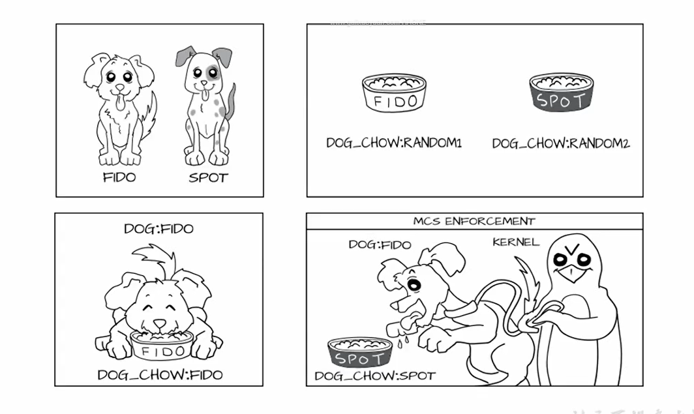
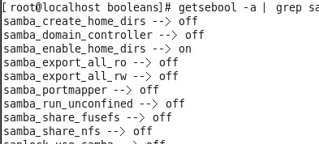

**SELinux**

# 1 、Selinux 前世今生

Linux 安全性与 Windows 在不开启防御措施时一致，为 C2 级别

**创造者：**

**Selinux 实现模型**



## Selinux 在 Linux 中的地位变化

-  2.2 ： 需要手动加载的一个外部模块

-  2.4 ：直接写到内核的一个模块

-  2.6 ：成为了一部分 Linux 发行版的内核的一部分

**特性：**

即使受到攻击，进程或者用户权限被夺去，也不会对整个系统造成重大影响

## Selinux 原理漫画解释







# 2 、安全上下文

## 1）安全上下文的定义

所有操作系统访问控制都是以关联的客体和主体的某种类型的访问控制属性为基础的。在SELinux中，

访问控制属性叫做安全上下文。所有客体（文件、进程间通讯通道、套接字、网络主机等）和主体（进

程）都有与其关联的安全上下文，一个安全上下文由三部分组成：用户、角色和类型标识符。常常用

下面的格式指定或显示安全上下文：

**用户:角色:类型**

## 2）相关配置命令

```
chcon [-R] [-t type] [-u user] [-r role] 文件
    -R ：连同该目录下的次目录也同时修改；
    -t ：后面接安全性本文的类型字段！
    -u ：后面接身份识别，例如 system_u；
    -r ：后面接角色，例如 system_r；
```

## 3）restorecon 还原成原有的 SELinux type

```
格式：restorecon [-Rv] 档案或目录
    -R ：连同次目录一起修改；
    -v ：将过程显示到屏幕上
```

# 3 、Selinux 布尔值

## 1）解释说明

Managing Boole （管理 SElinux 布尔值）：SEliux 布尔值就相当于一个开关，精确控制 SElinux 对某

个服务的某个选项的保护，比如 samba 服务



## 2)尔值配置命令

```
getsebool -a # 命令列出系统中可用的 SELinux 布尔值。
setsebool # 命令用来改变 SELinux 布尔值
```

### 案例

```
setsebool –p samba_enable_home_dirs=1 # 开启家目录是否能访问的控制
```