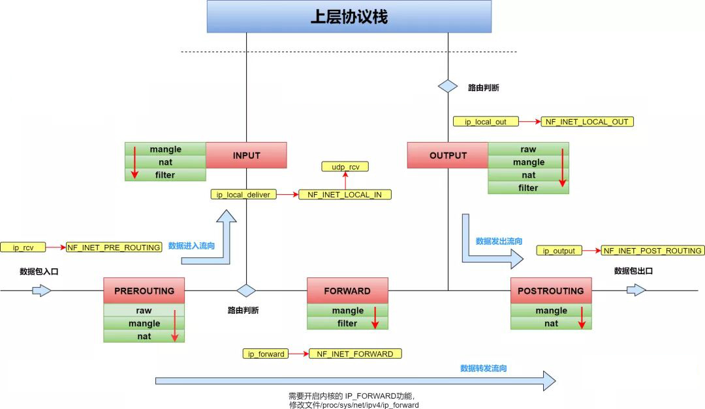
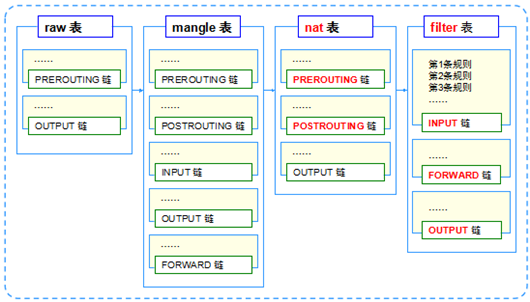

**相关防火墙概念**

# **1、防火墙相关概念
**

## **1）从逻辑上分类：
**

- 主机防火墙：为单个主机进行防护

- 网络防火墙：对网络入口进行防护，服务防火墙背后的本地局域网

- 主机防火墙（个人）和网络防火墙（集体）相辅相成!



- **从物理上分类**：

- 硬件防火墙：硬件级别实现部分防火墙功能，另一部分功能基于软件实现，性能高，成本高。

- 软件防火墙：应用软件处理逻辑运行于通用硬件平台上的防火墙，性能低，成本低

**IPTABLES**

**netfilte**

**netfilter——内核空间**

**iptables ———— 用户空间的客户端代理**

将用户空间的安全设定通过代理执行到Netfilter当中

netfilter/iptables组成Linux平台下的包过滤防火墙（免费）

Netfilter是Linux操作系统核心层的一个数据包处理模块（iptables并没有守护进程，

所以不是正真的服务，而是内核提供的功能），具有如下功能：

网络地址转换

数据包内容修改

数据包过滤的防火墙功能

## 2）原理

- IPtables根据它的rule匹配而对数据包进行：**放行（accept），拒绝（reject）和丢弃（drop）**等动作

**rule**

类型（Http、FTP和SMTP）等

- Netfilter位于内核空间中，是真正的防火墙，设置了“关卡”在Input、Output上（链）

网卡的驱动是在内核空间当中，Netfilter也是在内核空间当中，所以Iptables+netfilter 可以在内核空间
当中

设置“关卡”, 当用户去访问应用服务时，数据包是通过网卡流经内核空间之后到达用户空间。

防火墙除了软件及硬件的分类，也可对数据封包的取得方式来分类，可分为代理服务器（Proxy）及封
包

- 代理服务

- 是一种网络服务，通常就架设在路由上面，可完整的掌控局域网的对外连接。

- IP Filter

- 这种方式可以直接分析最底层的封包表头数据来进行过滤，所以包括 MAC地址, IP, TCP, UDP,

ICMP 等封包的信息都可以进行过滤分析的功能，用途非常广泛。

其实Iptables服务不是真正的防火墙，只是用来定义防火墙规则功能的"防火墙管理工具"，将定义好的规

则交由内核中的netfilter即网络过滤器来读取，从而真正实现防火墙功能。

- iptables抵挡封包的方式：

- 拒绝让 Internet 的封包进入 Linux 主机的某些 port

- 拒绝让某些来源 IP 的封包进入

- 拒绝让带有某些特殊标志( flag )的封包进入

- 分析硬件地址(MAC)来提供服务

# 2、五链四表



## 1）五链

iptables命令中设置数据过滤或处理数据包的策略叫做规则，将多个规则合成一个链，叫规则链。

规则链则依据处理数据包的位置不同分类：

- PREROUTING

- 在进行路由判断之前所要进行的规则(DNAT/REDIRECT)**（redirect:重定向）**

- INPUT

- 处理入站的数据包

- OUTPUT

- 处理出站的数据包

- FORWARD

- 处理转发的数据包

- POSTROUTING

- 在进行路由判断之后所要进行的规则(SNAT/MASQUERADE)**（masquerade:伪装）**

**不同数据包经过的链的情况**

- 如果我们需要报文转发，则不经过Input链，Outpup链

- 只需要：PREROUTING（路由前），转发（forward），路由后（postrouting）

- 常用应用场景，报文流向：

- 到本地某个进程的报文：PREROUTING‐‐> INPUT‐‐>OUTPUT ‐‐>POSTROUTING

- 由本机转发的报文：PREROUTING ‐‐> FORWARD ‐‐> POSTROUTING

- 由本机的某个进程发出报文（通常为响应报文）： OUTPUT ‐‐> POSTROUTING

## 2）四表

iptables中的规则表是用于容纳规则链，规则表默认是允许状态的，那么规则链就是设置被禁止的规

则，而反之如果规则表是禁止状态的，那么规则链就是设置被允许的规则。

- raw表

- 关闭nat上启用的连接追踪机制

- mangle表

- 拆解报文、修改报文、重新封装报文

- nat表

- 网络地址转换

- filter表

- 负责过滤功能，防火墙

- 



**规则表的先后顺序:raw→mangle→nat→filter**

## **3）**表链关系

相同规则的集合叫做表，多张表的集合叫做链不是每条链上都有四张表

- PREROUTING：raw/mangle/nat

- INPUT：mangle/filter/nat

- OUTPUT：raw/mangle/nat/filter

- POSTROUTING：mangle/nat

- FORWARD：mangle/filter

- 实际上在操作过程中，是通过表作为入口进行操作，通过表查询定义的规则，操作规则

```
开启linux路由转发功能（默认是关闭的）：
[root@eagle ~]# echo 1 > /proc/sys/net/ipv4/ip_forward
```

## 4)规则概念

- 规则：根据指定的**匹配条件**来尝试匹配每个经流“关卡”的报文，一旦匹配成功，则由规则后面指定

的

- 匹配条件

- 基本匹配条件：sip、dip

- 扩展匹配条件：sport、dport

- 扩展条件也是条件的一部分，只不过使用的时候需要用-m参数声明对应的模块

- 处理动作

- 常用动作

- accept：接受

- drop：丢弃

- reject：拒绝

- snat：源地址转换，解决内网用户同一个公网地址上上网的问题

- masquerade：是snat的一种特殊形式，使用动态的、临时会变的ip上

- dnat：目标地址转换

- redirect：在本机作端口映射

- log：记录日志，/var/log/messages文件记录日志信息，然后将数据包传递给下一条规则