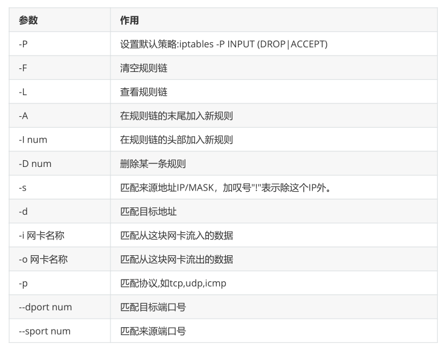

**iptables用法**

# 1、常用格式：

```
iptables [-t 表名] 选项 [链名] [条件] [-j 控制类型]
iptables –[A|I 链] [-i|o 网络接口] [-p 协议] [-s 来源ip/网域] [-d 目标ip/网域] –
j[ACCEPT|DROP]
```



# 2、查看规则

```
[root@localhost ~]# iptables [-t tables] [-L] [-nv]
参数：
-t：指定表名，默认是filter表
-L：指定链名，默认是所有链
-v：显示详细信息
-x：展开数字
-R [链名] [第几行]：修改规则
[root@eagle ~]# iptables -t filter -vxL INPUT
Chain INPUT (policy ACCEPT 0 packets, 0 bytes)
 pkts   bytes target   prot opt in   out   source       
destination    
  660  53431 ACCEPT   all -- any  any   anywhere      
anywhere       ctstate RELATED,ESTABLISHED
   4   204 ACCEPT   all -- lo   any   anywhere      
anywhere      
  32   2660 INPUT_direct all -- any  any   anywhere      
anywhere      
  32   2660 INPUT_ZONES_SOURCE all -- any  any   anywhere   
anywhere      
  32   2660 INPUT_ZONES all -- any  any   anywhere      
anywhere      
   0    0 DROP    all -- any  any   anywhere      
anywhere       ctstate INVALID
  30   2556 REJECT   all -- any  any   anywhere      
anywhere       reject-with icmp-host-prohibited
  
# 每个字段的解释
policy：当前链的默认策略，当所有规则都没有匹配成功时执行的策略
packets：当前链默认策略匹配到的包的数量
bytes：当前链默认策略匹配到的包的大小
pkts：对应规则匹配到的包数量
bytes：对应规则匹配到的包大小
target：对应规则执行的动作
prot：对应的协议，是否针对某些协议应用此规则
opt：规则对应的选项
in：数据包由哪个接口流入
out：数据包由哪个接口流出
source：源ip地址
distination：目的ip地址
```

# 3、规则操作

## 1）**清除所有规则**

```
[root@server1 ~]# iptables -t filter -F INPUT 
```

## 2）增加规则

```
[root@server1 ~]# iptables -A INPUT -s 192.168.80.1 -j DROP 
```

## 3）删除规则

```
删除规则
方法1，根据规则的编号进行删除规则
方法2，根据具体的匹配条件去删除规则
    iptables -t filter -D INPUT 3
    iptables -t filter -D INPUT [匹配条件] [处理动作]
-D只是删除某一条规则，-F是清除整条链上的规则

[root@server1 ~]# iptables -vxL INPUT --line-numbers
Chain INPUT (policy ACCEPT 4 packets, 299 bytes)
num   pkts   bytes target   prot opt in   out   source     
destination    
1     162   11052 ACCEPT   all  -- any  any   192.168.80.0/24 
anywhere      
[root@server1 ~]# iptables -t filter -D INPUT 1
[root@server1 ~]# iptables -vxL INPUT --line-numbers
Chain INPUT (policy ACCEPT 14 packets, 1020 bytes)
num   pkts   bytes target   prot opt in   out   source     
destination    
[root@server1 ~]# iptables -A INPUT -s 192.168.80.0/24 -j ACCEPT
[root@server1 ~]# iptables -vxL INPUT --line-numbers
Chain INPUT (policy ACCEPT 1 packets, 76 bytes)
num   pkts   bytes target   prot opt in   out   source     
destination    
1      10    724 ACCEPT   all  -- any  any   192.168.80.0/24 
anywhere      
[root@server1 ~]# iptables -t filter -D INPUT -s 192.168.80.0/24 -j ACCEPT
[root@server1 ~]# iptables -vxL INPUT --line-numbers
Chain INPUT (policy ACCEPT 6 packets, 428 bytes)
num   pkts   bytes target   prot opt in   out   source     
  destination
```

## 4）修改单个规则

```
[root@server1 ~]# iptables -vxL INPUT --line-numbers
Chain INPUT (policy ACCEPT 1 packets, 71 bytes)
num   pkts   bytes target   prot opt in   out   source    destination    
1     21   1440 ACCEPT   all -- any  any   192.168.80.0/24  
anywhere      
[root@server1 ~]# iptables -t filter -R INPUT 1 -s 192.168.80.0/24 -j REJECT
```

## 5）修改链的默认规则

默认规则只能写ACCEPT或者DROP，其他的不可选

```
语法：
iptables -t filter -P INPUT [处理动作]
```

## 6）保存与恢复

iptables-save > /etc/sysconfig/iptables :可以将目前防火墙的规则，保存到文件夹中，

以防万一，规则被误删除后，可以及时的恢复；

iptables-restore < /etc/sysconfig/iptables ,就可以恢复

```
iptables-save  > /etc/sysconfig/iptables
iptables-restore < /etc/sysconfig/iptables
```

## 7）转发本地端口

```
[root@localhost ~]# iptables -t nat -A PREROUTING -p tcp --dport 6666 -j
 REDIRECT --to-port 22
```

# **4、自定义链**

当默认链的规则非常多的时候，不方便管理。比如有五十条针对http的规则，有两条针对ssh规则的，有

一条针对icmp为了方便管理可以将五十条的http规则重新写到一个自定义链中

## **1）使用自定义链**

```
创建自定义链
iptables -t filter -N http_chain
引用自定义链
iptables -I INPUT -p tcp --dport 80 -j http_chain
创建规则（和五链使用方法一样）
iptables -t filter -A http_chain -s 192.168.80.1 -j REJECT
iptables -t filter -A http_chain -s 10.1.0.0/16 -j REJECT
```

## **2）删除自定义链**

```
删除引用
[root@localhost ~]# iptables -t filter -D INPUT -p tcp --dport 80 -j
 http_chain
删除链上所有规则
[root@localhost ~]# iptables -F http_chain
删除链
[root@localhost ~]# iptables -X http_chain
```

# 5、匹配条件

```
基本匹配条件
    -s：指定源ip地址
    -d：指定目的ip地址
    -p：指定协议类型
    -i：指定网卡流入，PREROUTING/INPUT/FORWARD
    -o：指定网卡流出，OUTPUT/POSTROUTING
扩展条件
-m 扩展模块
tcp/udp
    --dport：指定目的端口
    --sport：指定源端口
iprange：匹配报文的源/目的地址所在范围
    --src-range
    --dst-range
string：指定匹配报文中的字符串
    --algo：指定匹配算法，可以是bm/kmp
    --string：指定需要匹配的字符串
time：指定匹配报文的时间
    --timestart
    --timestop
    --weekdays
    --mouthdays    
    --datestart
    --datestop
connlimit：限制每个ip连接到server端的数量，不需要指定ip默认就是针对每个ip地址
    --connlimit-above：最大连接数
limit：对报文到达的速率继续限制，限制包数量
    10/second
    10/minute
    10/hour
    10/day
    --limit-burst：空闲时可放行的包数量，默认为5
state模块：用于针对tcp连接进行限制
    --state NEW：连接中的第一个包的状态是NEW
    ESTABLISHED：NEW状态后面的包是ESTABLISHED
    RELATED：与命令连接中的报文有关系，比如ftp服务有连个进程，一个是命令进程一个是数据
进程
    INVALID：如果一个包没有办法被识别，或者这个包没有任何装填，我们是能够主动屏蔽状态为INVALID的报文
    UNTRACKED：表示报文为未被追踪状态
```

# 5、案例练习

**iptables实例练习**

## 1）删除已有规则

在开始创建iptables规则之前，你也许需要删除已有规则。命令如下：

```
iptables -F
(or)
iptables –flush
```

## 2）设置链的默认策略

链的默认政策设置为”ACCEPT”（接受），若要将INPUT,FORWARD,OUTPUT链设置成”DROP”（拒绝），命令如下：

```
iptables -P INPUT DROP
iptables -P FORWARD DROP
iptables -P OUTPUT DROP
```

当INPUT链和OUTPUT链都设置成DROP时，对于每一个防火墙规则，我们都应该定义两个规则。例如：

一个传入另一个传出。在下面所有的例子中，由于我们已将DROP设置成INPUT链和OUTPUT链的默认策

略，每种情况我们都将制定两条规则。当然，如果你相信你的内部用户,则可以省略上面的最后一行。例

如：默认不丢弃所有出站的数据包。在这种情况下,对于每一个防火墙规则要求,你只需要制定一个规则

——只对进站的数据包制定规则。

## 3）阻止指定IP地址

例：丢弃来自IP地址x.x.x.x的包

```
BLOCK_THIS_IP="x.x.x.x"
iptables -A INPUT -s "$BLOCK_THIS_IP" -j DROP
```

注：当你在log里发现来自某ip地址的异常记录，可以通过此命令暂时阻止该地址的访问以做更深入分析

例：阻止来自IP地址x.x.x.x eth0 tcp的包

```
iptables -A INPUT -i eth0 -s "$BLOCK_THIS_IP" -j DROP
iptables -A INPUT -i eth0 -p tcp -s "$BLOCK_THIS_IP" -j DROP
```

## 4）允许所有SSH的连接请求

例：允许所有来自外部的SSH连接请求，即只允许进入eth0接口，并且目标端口为22的数据包

```
iptables -A INPUT -i eth0 -p tcp --dport 22 -m state --state NEW,ESTABLISHED
-j ACCEPT
iptables -A OUTPUT -o eth0 -p tcp --sport 22 -m state --state ESTABLISHED -j
ACCEPT
```

## 5）仅允许来自指定网络的SSH连接请求

例：仅允许来自于192.168.100.0/24域的用户的ssh连接请求

```
iptables -A INPUT -i eth0 -p tcp -s 192.168.100.0/24 --dport 22 -m state --
state NEW,ESTABLISHED -j ACCEPT
iptables -A OUTPUT -o eth0 -p tcp --sport 22 -m state --state ESTABLISHED -j
ACCEPT
```

## 6）允许http和https的连接请求

例：允许所有来自web - http的连接请求

```
iptables -A INPUT -i eth0 -p tcp --dport 80 -m state --state NEW,ESTABLISHED
-j ACCEPT
iptables -A OUTPUT -o eth0 -p tcp --sport 80 -m state --state ESTABLISHED -j
ACCEPT
```

例：允许所有来自web - https的连接请求

```
iptables -A INPUT -i eth0 -p tcp --dport 443 -m state --state NEW,ESTABLISHED
-j ACCEPT
iptables -A OUTPUT -o eth0 -p tcp --sport 443 -m state --state ESTABLISHED -j
ACCEPT
```

## 7）使用multiport 将多个规则结合在一起

允许多个端口从外界连入，除了为每个端口都写一条独立的规则外，我们可以用multiport将其组合成一

条规则。如下所示：

例：允许所有ssh,http,https的流量访问

```
iptables -A INPUT -i eth0 -p tcp -m multiport --dports 22,80,443 -m state --
state NEW,ESTABLISHED -j ACCEPT
iptables -A OUTPUT -o eth0 -p tcp -m multiport --sports 22,80,443 -m state --
state ESTABLISHED -j ACCEPT
```

## 8）允许从本地发起的SSH

```
iptables -A OUTPUT -o eth0 -p tcp --dport 22 -m state --state NEW,ESTABLISHED
-j ACCEPT
iptables -A INPUT -i eth0 -p tcp --sport 22 -m state --state ESTABLISHED -j
ACCEPT
```

请注意,这与允许ssh连入的规则略有不同。本例在OUTPUT链上，我们允许NEW和ESTABLISHED状态。

在INPUT链上，我们只允许ESTABLISHED状态。ssh连入的规则与之相反。

## 9.）仅允许从本地发起到一个指定的网络域的SSH请求

例：仅允许从内部连接到网域192.168.100.0/24

```
iptables -A OUTPUT -o eth0 -p tcp -d 192.168.100.0/24 --dport 22 -m state --
state NEW,ESTABLISHED -j ACCEPT
iptables -A INPUT -i eth0 -p tcp --sport 22 -m state --state ESTABLISHED -j
ACCEPT
```

## 10）允许从本地发起的HTTPS连接请求

下面的规则允许输出安全的网络流量。如果你想允许用户访问互联网，这是非常有必要的。在服务器

上，这些规则能让你使用wget从外部下载一些文件

```
iptables -A OUTPUT -o eth0 -p tcp --dport 443 -m state --state
NEW,ESTABLISHED -j ACCEPT
iptables -A INPUT -i eth0 -p tcp --sport 443 -m state --state ESTABLISHED -j
ACCEPT
```

注：对于HTTP web流量的外联请求，只需要将上述命令中的端口从443改成80即可。

## 11）负载平衡传入的网络流量

使用iptables可以实现传入web流量的负载均衡，我们可以传入web流量负载平衡使用iptables防火墙规则。

例：使用iptables nth将HTTPS流量负载平衡至三个不同的ip地址。

```
iptables -A PREROUTING -i eth0 -p tcp --dport 443 -m state --state NEW -m nth
--counter 0 --every 3 --packet 0 -j DNAT --to-destination 192.168.1.101:443
iptables -A PREROUTING -i eth0 -p tcp --dport 443 -m state --state NEW -m nth
--counter 0 --every 3 --packet 1 -j DNAT --to-destination 192.168.1.102:443
iptables -A PREROUTING -i eth0 -p tcp --dport 443 -m state --state NEW -m nth
--counter 0 --every 3 --packet 2 -j DNAT --to-destination 192.168.1.103:443
```

## 12）允许外部主机ping内部主机

```
iptables -A INPUT -p icmp --icmp-type echo-request -j ACCEPT
iptables -A OUTPUT -p icmp --icmp-type echo-reply -j ACCEPT
```

## 13）允许内部主机ping外部主机

```
iptables -A OUTPUT -p icmp --icmp-type echo-request -j ACCEPT
iptables -A INPUT -p icmp --icmp-type echo-reply -j ACCEPT
```

## 14）允许回环访问

例：在服务器上允许127.0.0.1回环访问。

```
iptables -A INPUT -i lo -j ACCEPT
iptables -A OUTPUT -o lo -j ACCEPT
```

## 15）允许内部网络域外部网络的通信

防火墙服务器上的其中一个网卡连接到外部，另一个网卡连接到内部服务器，使用以下规则允许内部网

络与外部网络的通信。此例中，eth1连接到外部网络(互联网)，eth0连接到内部网络(例如:192.168.1.x)。

```
iptables -A FORWARD -i eth0 -o eth1 -j ACCEPT 
```

## 16）允许出站的DNS连接

```
iptables -A OUTPUT -p udp -o eth0 --dport 53 -j ACCEPT
iptables -A INPUT -p udp -i eth0 --sport 53 -j ACCEPT
```

## 17）允许NIS连接

如果你使用NIS管理用户帐户，你需要允许NIS连接。如果你不允许NIS相关的ypbind连接请求，即使

SSH连接请求已被允许，用户仍然无法登录。NIS的端口是动态的，先使用命令rpcinfo –p来知道端口

号，此例中为853和850端口。

rpcinfo -p | grep ypbind

例：允许来自111端口以及ypbind使用端口的连接请求

```
iptables -A INPUT -p tcp --dport 111 -j ACCEPT
iptables -A INPUT -p udp --dport 111 -j ACCEPT
iptables -A INPUT -p tcp --dport 853 -j ACCEPT
iptables -A INPUT -p udp --dport 853 -j ACCEPT
iptables -A INPUT -p tcp --dport 850 -j ACCEPT
iptables -A INPUT -p udp --dport 850 -j ACCEPT
```

注：当你重启ypbind之后端口将不同，上述命令将无效。有两种解决方案：1）使用你NIS的静态IP 2）

编写shell脚本通过“rpcinfo - p”命令自动获取动态端口号,并在上述iptables规则中使用。

## 18）允许来自指定网络的rsync连接请求

例：允许来自网络192.168.101.0/24的rsync连接请求

```
iptables -A INPUT -i eth0 -p tcp -s 192.168.101.0/24 --dport 873 -m state --
state NEW,ESTABLISHED -j ACCEPT
iptables -A OUTPUT -o eth0 -p tcp --sport 873 -m state --state ESTABLISHED -j
ACCEPT
```

## 19）允许来自指定网络的MySQL连接请求

很多情况下，MySQL数据库与web服务跑在同一台服务器上。有时候我们仅希望DBA和开发人员从内部

网络（192.168.100.0/24）直接登录数据库，可尝试以下命令：

```
iptables -A INPUT -i eth0 -p tcp -s 192.168.100.0/24 --dport 3306 -m state --
state NEW,ESTABLISHED -j ACCEPT
iptables -A OUTPUT -o eth0 -p tcp --sport 3306 -m state --state ESTABLISHED -
j ACCEPT
```

## 20）允许Sendmail, Postfix邮件服务

Sendmail和postfix都使用了25端口，因此我们只需要允许来自25端口的连接请求即可。

```
iptables -A INPUT -i eth0 -p tcp --dport 25 -m state --state NEW,ESTABLISHED
-j ACCEPT
iptables -A OUTPUT -o eth0 -p tcp --sport 25 -m state --state ESTABLISHED -j
ACCEPT
```

## 21）允许IMAP和IMAPS

例：允许IMAP/IMAP2流量，端口为143

```
iptables -A INPUT -i eth0 -p tcp --dport 143 -m state --state NEW,ESTABLISHED
-j ACCEPT
iptables -A OUTPUT -o eth0 -p tcp --sport 143 -m state --state ESTABLISHED -j
ACCEPT
```

例：允许IMAPS流量，端口为993

```
iptables -A INPUT -i eth0 -p tcp --dport 993 -m state --state NEW,ESTABLISHED
-j ACCEPT
iptables -A OUTPUT -o eth0 -p tcp --sport 993 -m state --state ESTABLISHED -j
ACCEPT
```

## 22）允许POP3和POP3S

例：允许POP3访问

```
iptables -A INPUT -i eth0 -p tcp --dport 110 -m state --state NEW,ESTABLISHED
-j ACCEPT
iptables -A OUTPUT -o eth0 -p tcp --sport 110 -m state --state ESTABLISHED -j
ACCEPT
```

例：允许POP3S访问

```
iptables -A INPUT -i eth0 -p tcp --dport 995 -m state --state NEW,ESTABLISHED
-j ACCEPT
iptables -A OUTPUT -o eth0 -p tcp --sport 995 -m state --state ESTABLISHED -j
ACCEPT
```

## 23）防止DoS攻击

```
iptables -A INPUT -p tcp --dport 80 -m limit --limit 25/minute --limit-burst
100 -j ACCEPT
上述例子中：
-m limit: 启用limit扩展
–limit 25/minute: 允许最多每分钟25个连接（根据需求更改）。
–limit-burst 100: 只有当连接达到limit-burst水平(此例为100)时才启用上述limit/minute限
制。
```

## 24）端口转发

例：将来自422端口的流量全部转到22端口。

这意味着我们既能通过422端口又能通过22端口进行ssh连接。启用DNAT转发。

```
iptables -t nat -A PREROUTING -p tcp -d 192.168.102.37 --dport 422 -j DNAT --
to 192.168.102.37:22
除此之外，还需要允许连接到422端口的请求
iptables -A INPUT -i eth0 -p tcp --dport 422 -m state --state NEW,ESTABLISHED
-j ACCEPT
iptables -A OUTPUT -o eth0 -p tcp --sport 422 -m state --state ESTABLISHED -j
ACCEPT
```

## 25）记录丢弃的数据表

```
第一步：新建名为LOGGING的链
    iptables -N LOGGING
第二步：将所有来自INPUT链中的数据包跳转到LOGGING链中
    iptables -A INPUT -j LOGGING
第三步：为这些包自定义个前缀，命名为”IPTables Packet Dropped”
    iptables -A LOGGING -m limit --limit 2/min -j LOG --log-prefix "IPTables Packet Dropped: " --log-level 7
第四步：丢弃这些数据包
    iptables -A LOGGING -j DROP
```