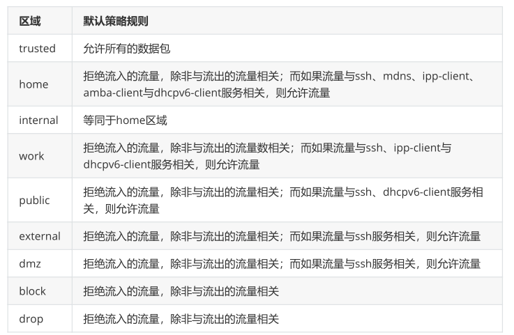
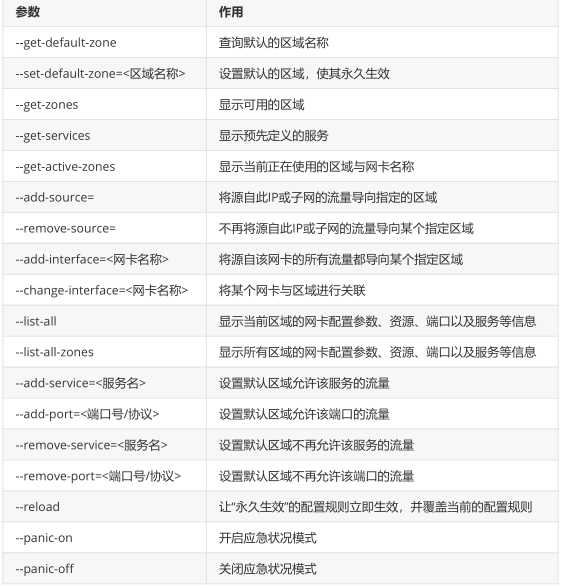

**firewalld**

# 1、firewalld中常用的区域名称及策略规则



# 2、终端管理工具

## 1)firewall-cmd命令中使用的参数以及作用



## 2)查看firewalld服务当前所使用的区域

```
[root@localhost ~]# firewall-cmd --get-default-zone
public
```

## 3)查询ens33网卡在firewalld服务中的区域

```
[root@localhost ~]# firewall-cmd --get-zone-of-interface=ens33
public
```

## 4)把firewalld服务中ens33网卡的默认区域修改为external，并在系统重启后生效。分别查看当前与永久模式下的区域名称

```
[root@localhost ~]# firewall-cmd --permanent --zone=external --change-
interface=ens33
The interface is under control of NetworkManager, setting zone to 'external'.
success
[root@localhost ~]# firewall-cmd --permanent --get-zone-of-interface=ens33
no zone
[root@localhost ~]# firewall-cmd --get-zone-of-interface=ens33
external
```

## 5)把firewalld服务的当前默认区域设置为public

```
[root@localhost ~]# firewall-cmd --set-default-zone=public
Warning: ZONE_ALREADY_SET: public
success
[root@localhost ~]# firewall-cmd --get-default-zone
public
```

## 6)启动/关闭firewalld防火墙服务的应急状况模式，阻断一切网络连接（当远程控制服务器时请慎用）

```
[root@localhost ~]# firewall-cmd --panic-on
[root@localhost ~]# firewall-cmd --panic-off
```

## 7)查询public区域是否允许请求SSH和HTTPS协议的流量

```
[root@localhost ~]# firewall-cmd --zone=public --query-service=ssh
yes
[root@localhost ~]# firewall-cmd --zone=public --query-service=https
no
```

## 8)把firewalld服务中请求HTTPS协议的流量设置为永久允许，并立即生效

```
[root@localhost ~]# firewall-cmd --zone=public --add-service=https
success
[root@localhost ~]# firewall-cmd --permanent --zone=public --add-
service=https
success
[root@localhost ~]# firewall-cmd --reload
success
[root@localhost ~]# firewall-cmd --zone=public --query-service=https
yes
```

## 9)把firewalld服务中请求HTTP协议的流量设置为永久拒绝，并立即生效

```
[root@localhost ~]# firewall-cmd --zone=public --remove-service=https --
permanent
success
[root@localhost ~]# firewall-cmd --reload
success
```

## 10)把在firewalld服务中访问8080和8081端口的流量策略设置为允许，但仅限当前生效

```
[root@localhost ~]# firewall-cmd --zone=public --add-port=8080-8081/tcp
success
[root@localhost ~]# firewall-cmd --zone=public --list-ports
8080-8081/tcp
```

## 11)把原本访问本机888端口的流量转发到22端口，要且求当前和长期均有效

firewall-cmd --permanent --zone=<区域> --add-forward-port=port= <源端口号>:proto=<协议:toport=<目标端口号>:toaddr=<目标IP地址>

```
[root@localhost ~]# firewall-cmd --permanent --zone=public --add-forward-
port=port=888:proto=tcp:toport=22:toaddr=192.168.91.128
success

```

```
[c:\~]$ ssh root@192.168.91.128 888
Connecting to 192.168.91.128:888...
Connection established.
To escape to local shell, press 'Ctrl+Alt+]'.
Last login: Thu Apr 18 16:20:23 2019 from 192.168.91.1
[root@localhost ~]#
```

firewalld中的富规则表示更细致、更详细的防火墙策略配置，它可以针对系统服务、端口号、源地址和

目标地址等诸多信息进行更有针对性的策略配置。它的优先级在所有的防火墙策略中也是最高的。比

如，我们可以在firewalld服务中配置一条富规则，使其拒绝192.168.91.0/24网段的所有用户访问本机的

ssh服务（22端口）

```
[root@localhost ~]# firewall-cmd --permanent --zone=public --add-rich-
rule="rule \
family="ipv4" \
source address="192.168.91.0/24" \
service name="ssh" \
reject"
success
[root@localhost ~]# firewall-cmd --reload
success
```

```
[c:\~]$ ssh root@192.168.91.128
Connecting to 192.168.91.128:22...
Could not connect to '192.168.91.128' (port 22): Connection failed.
```