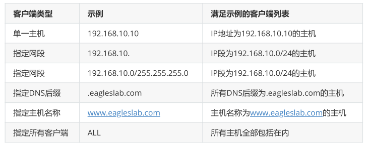

**服务的访问控制列表**

TCP Wrappers服务的控制列表文件中常用的参数



- 在配置TCP Wrappers服务时需要遵循两个原则：

- 编写拒绝策略规则时，填写的是服务名称，而非协议名称；

- 建议先编写拒绝策略规则，再编写允许策略规则，以便直观地看到相应的效果。

下面编写拒绝策略规则文件，禁止访问本机sshd服务的所有流量

```
[root@localhost ~]# vim /etc/hosts.deny
#
# hosts.deny This file contains access rules which are used to
#  deny connections to network services that either use
#  the tcp_wrappers library or that have been
#  started through a tcp_wrappers-enabled xinetd.
#
#  The rules in this file can also be set up in
#  /etc/hosts.allow with a 'deny' option instead.
#
#  See 'man 5 hosts_options' and 'man 5 hosts_access'
#  for information on rule syntax.
#  See 'man tcpd' for information on tcp_wrappers
#
#
sshd:*
```

```
[c:\~]$ ssh root@192.168.91.128
Connecting to 192.168.91.128:22...
Connection established.
To escape to local shell, press 'Ctrl+Alt+]'.
Connection closing...Socket close.
Connection closed by foreign host.
Disconnected from remote host(192.168.91.128:22) at 16:35:31.
```

在允许策略规则文件中添加一条规则，使其放行源自192.168.10.0/24网段，访问本机sshd服务的所有流量

```
[root@localhost ~]# vim /etc/hosts.allow
#
# hosts.allow This file contains access rules which are used to
#  allow or deny connections to network services that
#  either use the tcp_wrappers library or that have been
#  started through a tcp_wrappers-enabled xinetd.
#
#  See 'man 5 hosts_options' and 'man 5 hosts_access'
#  for information on rule syntax.
#  See 'man tcpd' for information on tcp_wrappers
#
sshd:192.168.91.
```