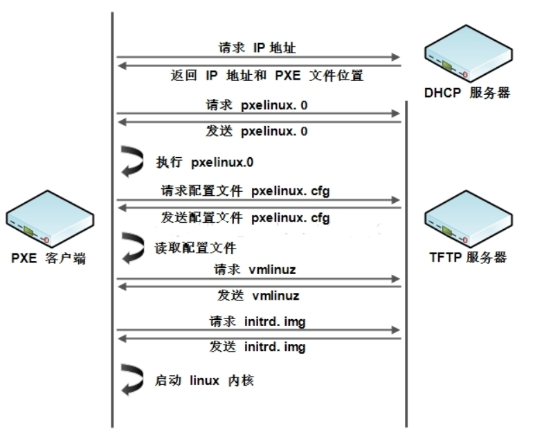

**PXE无人值守安装系统**

使用PXE+KickStart可以通过非交互模式完成无人值守安装操作系统。

PXE 客户端从DHCP服务器获取到PXE服务端的具体IP，然后再从PXE配置文件中获取vmlinuz、

initrd.img、ks.cfg、系统镜像等文件所在的服务器和位置信息。

# 1、什么是PXE?

- PXE，全名为**Pre-boot Execution Environment**，预启动执行环境

- 通过网络接口启动计算机，不依赖本地存储设备（如硬盘）或本地已经安装的操作系统

- 由Intel和Systemsoft公司于1999年9月发布的技术

- Client/Server的工作模式

# 2、批量装机软件

- Cobbler

- Kickstart是一种无人值守的安装方式。它的工作原理是在安装过程中记录人工干预填写的各种参

数，并生成一个名为ks.cfg的文件。如果在自动安装过程中出现要填写参数的情况，安装程序首先

会去查找ks.cfg文件，如果找到合适的参数，就采用所找到的参数；如果没有找到合适的参数，便

会弹出对话框让安装者手工填写。所以，如果ks.cfg文件涵盖了安装过程中所有需要填写的参数，

那么安装者完全可以只告诉安装程序从何处下载ks.cfg文件，然后就去忙自己的事情。等安装完

毕，安装程序会根据ks.cfg中的设置重启/关闭系统，并结束安装。