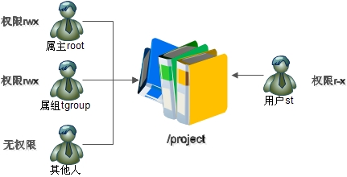
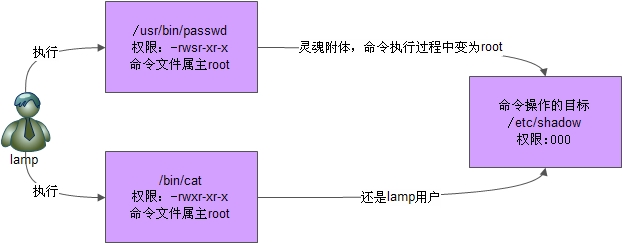

# **一、ACL权限**

## **1、ACL概述：	ACL是用于解决用户对文件身份不足的问题的；**



## **当一个文件的所属主为root，所属组为tgroup（如上图所示）other权限为0，此时有一个用户st,想访问这个文件，但是这个用户既不是root,也不在tgroup组中，所以这个用户此时的情况无法访问这个文件。**

-出于一些客观的原因，st用户不能够sudo提权，

-st用户也不能加入tgroup这个组中

-other的权限只能为0

**此时如何解决这个问题呢？**

**-ACL！**

## **2、 开启ACL （一般都是默认开启的）**

```javascript
[root@localhost ~]# dumpe2fs -h /dev/sda3
#dumpe2fs 命令是查询指定分区详细文件系统信息的命令
选项：
-h 仅显示超级块中信息，而不显示磁盘块组的详细信息。
...省略部分输出...
Default mount options: user_xattr acl
...省略部分输出...
如果没有开启，手工开启分区的 ACL 权限：
[root@localhost ~]# mount -o remount,acl /
#重新挂载根分区，并挂载加入 acl 权限
也可以通过修改/etc/fstab 文件，永久开启 ACL 权限：
[root@localhost ~]# vi /etc/fstab
UUID=c2ca6f57-b15c-43ea-bca0-f239083d8bd2 / ext4 defaults ,acl 1 1
#加入 acl
[root@localhost ~]# mount -o remount /
#重新挂载文件系统或重启动系统，使修改生效
```

# **3、ACL 基本命令**

**（ACL-Access-Control-Lists:访问控制列表）**

```javascript
setfacl    #set file acl :设置文件的ACL属性
常用选项：
-m ：添加acl设定参数 m:modify,修改
-x ：删除acl设定参数
-b ：移除所有的ACL设定参数
-R ：递归添加acl设定参数
-d ：添加默认acl设定参数（目录）
删除用户权限：setacl -x u:username filename
删除组权限：setacl -x g:groupname filename
删除整个acl权限：setfacl -b filename
setfacl    -m   u:用户名：权限    -R   文加名;    给目录递归赋予权限（只对已存在的子目录或子文件有效）
setfacl    -m d:u:用户名：权限    -R    文件名；  ACL默认权限（只对之后添加的子目录有效）
```

**设置**

```javascript
[root@xwz ~]# ll file1
-rw-r--r--. 1 centos it 0 9月  4 11:03 file1
[root@xwz ~]# getfacl file1
# file: file1
# owner: centos
# group: it
user::rw-
group::r--
other::r--
[root@xwz ~]# setfacl -m u:centos:rw file1 # 增加用户权限
[root@xwz ~]# setfacl -m u:user05:- file1 # 增加用户权限
[root@xwz ~]# setfacl -m o::rw file1 # 修改其他人权限
```

**查看、删除**

```javascript
[root@xwz ~]# ll file1 
-rw-rw-rw-+ 1 centos it 0 9月  4 11:03 file1	#有ACL权限的文件，权限标志后面会有一个“+”号

[root@xwz ~]# getfacl file1
# file: file1
# owner: centos
# group: it
user::rw-
user:centos:rw-	#这个用户获得了额外的权限
user:user05:---
group::r--
mask::rw-
other::rw-
[root@xwz ~]# setfacl -m g:hr:r file1 # 增加组权限
[root@xwz ~]# setfacl -x g:hr file1 # 删除组权限
[root@xwz ~]# setfacl -b file1 # 删除所有acl权限
[root@xwz ~]# man setfacl
[root@xwz ~]# getfacl file1 |setfacl --set-file=- file2 # 复制file1的acl给
file2
```

注意：如果给

递归与默认的区别：


```javascript
setfacl -m u:cc:rx -R soft/ 只对已经存在的文件生效
setfacl -m d:u:aa:rwx -R /test 只对以后新建的文件生效
```

# **4 、最大有效权限mask**

```javascript
[root@localhost /]# setfacl -m m:rx project/
#设定 mask 权限为 r-x。使用“m:权限”格式
[root@localhost /]# getfacl project/
# file: project/
# owner: root
# group: tgroup
user::rwx
group::rwx #effective:r-x
mask::r-x
 
#mask 权限变为了 r-x
other::---
```

# **5、删除ACL权限**

```javascript
root@localhost /]# setfacl -x u:st /project/
#删除指定用户和用户组的 ACL 权限
[root@localhost /]# setfacl -b project/
#会删除文件的所有的 ACL 权限
```

# **二、文件特殊权限 SetUID、SetGID、Sticky BIT
**

## ** 1 、 SetUID（s,special，特殊）
**

### **1）SetUID 是什么）**

SetUID 的功能可以这样理解：


-  只有可以执行的**二进制程序才**能设定 SUID 权限


-  **命令执行者要对该程序拥有 x（执行）权限**


-  命令执行者在执行该程序时获得该程序文件属主的身份（在执行程序的过程中灵魂附体为文


件的属主）


-  SetUID 权限只在该程序执行过程中有效，也就是说身份改变只在程序执行过程中有效


### **2）举例
**

```javascript
[root@localhost ~]# ll /etc/passwd
-rw-r--r-- 1 root root 1728 1 月 19 04:20 /etc/passwd
[root@localhost ~]# ll /etc/shadow
---------- 1 root root 1373 1 月 19 04:21 /etc/shadow
```

因为


```javascript
[root@localhost ~]# ll /usr/bin/passwd
-rwsr-xr-x 1 root root 25980 2 月 22 2012 /usr/bin/passwd
/usr/bin/passwd 命令拥有特殊权限 SetUID ，也就是在属主的权限位的执行权限上是 s。可以这样
来理解它：当一个具有执行权限的文件设置 SetUID 权限后，用户执行这个文件时将以文件所有者的
```


身份执行。/usr/bin/passwd 命令具有 SetUID 权限，所有者为 root （Linux 中的命令默认所有者都是 root），也就是说当普通用户使用 passwd 更改自己密码的时候，那一瞬间突然灵魂附体了，实际是在用 passwd命令所有者 root 的身份在执行 passwd 命令，root 当然可以将密码写入/etc/shadow 文件（不要忘记 root这个家伙是 superman 什么事都可以干），所以普通用户也可以修改/etc/shadow 文件，命令执行完成后该身份也随之消失

 




如果取消 SetUID 权限，则普通用户就不能修改自己的密码了

**举例2：**

**1、在test目录下有一个file文件，然后文件的权限是000**

```javascript
[root@server1 test]# ll
总用量 4
----------. 1 root root 26 1月  20 05:22 file

[root@server1 test]# cat file 	
这是一个测试文件



```

### **2、然后用普通用户进行访问，权限不足**

```javascript
[user1@server1 test]$ cat file 
cat: file: 权限不够
```

### **3、给cat命令，加上特殊权限SUID**

```javascript
[root@server1 test]# which cat
/usr/bin/cat
[root@server1 test]# chmod u+s /usr/bin/cat
[root@server1 test]# ll /usr/bin/cat
-rwsr-xr-x. 1 root root 54160 10月 30 2018 /usr/bin/cat
```

### **4、普通用户再次访问，结果访问成功**

```javascript
[user1@server1 test]$ cat file 
这是一个测试文件
```

### **总结，给cat命令赋予特殊权限SUID之后，普通用户再次执行cat命令时，cat程序默认程序的发起者是root,而不是普通用户，所以普通用户可以访问。**

如果不加上SUID，那么cat程序就会检测到，命令的发起者是普通用户，从而导致权限不足；

**备注，如果在一个脚本文件sh(sh的权限为4755）中，写入这个命令 cat file (cat的权限为755，file的权限为000），然后普通用户执行sh,那么将会报错：cat file ,权限不足；**

**原因，虽然执行sh文件时，系统默认程序发起者是root,但是当这个程序，执行到cat file时，系统会再次发起一个线程，因为cat是一个独立的二进制命令，这时候系统会再次检查程序的发起者，结果是普通用户，所以由此产生了权限不足的问题。**

### **3）危险的 SetUID
**

```javascript
[root@localhost ~]# chmod u+s /usr/bin/vim
[root@localhost ~]# ll /usr/bin/vim
-rwsr-xr-x 1 root root 1847752 4 月 5 2012 /usr/bin/vim
```

### **4）有几点建议：
**

-  关键目录应严格控制写权限。比如“/”、“/usr”等；


-  用户的密码设置要严格遵守密码三原则；


-  对系统中默认应该具有 SetUID 权限的文件作一列表，定时检查有没有这之外的文件被设置


了 SetUID 权限。


### **5）检测 SetUID 的脚本
**

```javascript
[root@localhost ~]# vi suidcheck.sh
#!/bin/bash
# Author: shenchao （E-mail: shenchao@atguigu.com）
find / -perm -4000 -o -perm -2000 > /tmp/setuid.check
#搜索系统中所有拥有 SUID 和 SGID 的文件，并保存到临时目录中。
for i in $(cat /tmp/setuid.check)
#做循环，每次循环取出临时文件中的文件名
do
grep $i /root/suid.list > /dev/null
#比对这个文件名是否在模板文件中
if [ "$?" != "0" ]
#如果在，不报错
then
echo "$i isn't in listfile! " >> /root/suid_log_$(date +%F)
#如果文件名不再模板文件中，则报错。并把报错报错到日志中
fi
done
rm -rf /tmp/setuid.check
#删除临时文件
[root@localhost ~]# chmod u+s /bin/vi
#手工给 vi 加入 SUID 权限
[root@localhost ~]# ./suidcheck.sh
#执行检测脚本
[root@localhost ~]# cat suid_log_2013-01-20
/bin/vi isn't in listfile!
#报错了，vi 不再模板文件中。代表 vi 被修改了 SUID 权限
```

## **2 、 SetGID
**

### **1）针对文件的作用
**

SGID 即可以针对

含义如下：


-  只有可执行的**二进制程序**才能设置 SGID 权限


-  命令执行者要对该程序拥**有 x（执行）权限**


-  命令执行在执行程序的时候，组身份升级为该**程序****文件的属组**


-  SetGID 权限同样只在该程序执行过程中有效，也就是说组身份改变只在程序执行过程中有效


```javascript
[root@localhost ~]# ll /var/lib/mlocate/mlocate.db
-rw-r----- 1 root slocate 1838850 1 月 20 04:29 /var/lib/mlocate/mlocate.db
```

大家发现属主权限是 r、w，属组权限是 r，但是其他人权限是 0：


```javascript
[root@localhost ~]# ll /usr/bin/locate
-rwx--s--x 1 root slocate 35612 8 月 24 2010 /usr/bin/locate
```

当普通用户 user1 执行 locate 命令时，会发生如下事情：


-  /usr/bin/locate 是**可执行二进制程序**，可以赋予 SGID


-  执行用户 user1 对/usr/bin/locate 命令拥有执行权限


-  执 行 /usr/bin/locate 命 令 时 ， 组 身 份 会 升 级 为 slocate 组 ， 而 slocate 组 对


/var/lib/mlocate/mlocate.db 数据库拥有 r 权限，所以普通用户可以使用 locate 命令查询


mlocate.db 数据库


-  命令结束，user1 用户的组身份返回为 user1 组


### **2）针对目录的作用
**

如果 SGID 针对目录设置，含义如下：


-  普通用户必须对此目录拥有 r 和 x 权限，才能进入此目录


-  普通用户在此目录中的有效组会变成此目录的属组


-  若普通用户对此目录拥有 w 权限时，新建的文件的默认属组是这个目录的属组


这样写的实在太难看明白了，举个例子：


```javascript
[root@localhost ~]# cd /tmp/
#进入临时目录做此实验。因为临时目录才允许普通用户修改
[root@localhost tmp]# mkdir dtest
#建立测试目录
[root@localhost tmp]# chmod g+s dtest
#给测试目录赋予 SGID
[root@localhost tmp]# ll -d dtest/
drwxr-sr-x 2 root root 4096 1 月 20 06:04 dtest/
#SGID 已经生效
[root@localhost tmp]# chmod 777 dtest/
#给测试目录权限，让普通用户可以写
[root@localhost tmp]# su – user1
#切换成普通用户 user1
[user1@localhost ~]$ cd /tmp/dtest/
#普通用户进入测试目录
[user1@localhost dtest]$ touch abc
#普通用户建立 abc 文件
[user1@localhost dtest]$ ll
总用量 0
-rw-rw-r-- 1 user1 root 0 1 月 20 06:07 abc
#abc 文件的默认属组不再是 user1 用户组，而变成了 dtest 组的属组 root
```

## ** 3 、 文件特殊权限之 Sticky BIT（sticky,粘）用来做共享目录
**

Sticky BIT 粘着位，也简称为 

- ** 粘着位目前只对目录有效**


-  普通用户对该目录拥有 w 和 x 权限，即普通用户可以在此目录拥有写入权限


-  如果没有粘着位，因为普通用户拥有 w 权限，所以可以删除此目录下所有文件，包括其他用


户建立的文件。一但赋予了粘着位，除了 root 可以删除所有文件，普通用户就算拥有 w 权


限，也只能删除自己建立的文件，但是不能删除其他用户建立的文件。

```javascript
[root@server1 test]# chmod o+t dir/
[root@server1 test]# ll
总用量 4
drwxr-xrwt. 2 root  root  18 1月  20 05:50 dir
--------w-. 1 user1 user1 26 1月  20 05:22 file
[root@server1 test]# 
[root@server1 test]# 
[root@server1 test]# chmod o-t ./dir
[root@server1 test]# ll
总用量 4
drwxr-xrwx. 2 root  root  79 1月  20 05:53 dir
--------w-. 1 user1 user1 26 1月  20 05:22 file

```

## **如果想要在一个目录中，设定普通用户只能删除自己创建的文件时，可以使用这个权限。**

## **4、设定文件特殊权限
**

特殊权限这样来表示：


 4 代表 SUID


 2 代表 SGID


 1 代表 SBIT


```javascript
[root@localhost ~]# chmod 4755 ftest

#赋予 SUID 权限

[root@localhost ~]# chmod 2755 ftest

#赋予 SGID 权限

[root@localhost ~]# mkdir dtest

[root@localhost ~]# chmod 1755 dtest/

#SBIT 只对目录有效，所以建立测试目录，并赋予 SBIT
```

# **三、文件系统属性 chattr 权限
**

**（ch,change,改变)(attr,attributes,属性）**

## **1、命令格式
**

[root@localhost ~]# chattr [+-=] [选项] 文件或目录名


选项：


- +: 增加权限


- -: 删除权限


- =: 等于某权限


- i**（interlock,连锁)**: 如果对文件设置 i 属性，那么不允许对文件进行删除、改名，也不能添加和修改数据；如果对目录设置 i 属性，那么只能修改目录下文件的数据，但不允许建立和删除文件。


- a**（add,增加）**: 如果对文件设置 a 属性，那么只能在文件中增加数据，但是不能删除也不能修改数据；如果对目录设置 a 属性，那么只允许在目录中建立和修改文件，但是不允许删 除


- e: Linux 中绝大多数的文件都默认拥有 e 属性。表示该文件是使用** ext **文件系统进行


存储的，而且不能使用“chattr -e”命令取消 e 属性。

```javascript
[root@xwz ~]# man chattr
----------
ATTRIBUTES(属性)
   当修改设置了'A'属性的文件时,它的atime记录不会改变.
   这可以在笔记本电脑系统中避免某些磁盘I/O处理.
   设置了`a'属性的文件只能在添加模式下打开用于写入. 只有超级用户可以设置或清除该属
性.
   设置了`c'属性的文件在磁盘上由内核自动进行压缩处理.
   从该文件读取时返回的是未压缩的数据.
   对该文件的一次写入会在保存它们到磁盘之前进行数据压缩.
   设置了`d'属性的文件不能对其运行 dump(8) 程序进行备份.
   设置了`i'属性的文件不能进行修改:你既不能删除它,
   也不能给它重新命名,你不能对该文件创建链接,      而且也不能对该文件写入任何
数据.
   只有超级用户可以设置或清除该属性.
   当删除设置了`s'属性的文件时,将对其数据块清零 并写回到磁盘上.
   当修改设置了`S'属性的文件时,             修改会同步写入到磁盘上;
这与应用
   到文件子系统上的`sync'挂载选项有相同的效果.
   当删除设置了`u'属性的文件时, 将会保存其内容. 这使得用户可以请求恢复被删除的文件.
----------------

```

## **2、查看文件系统属性 lsattr（ls，展示）
**

```javascript
[root@localhost ~]# lsattr 选项 文件名
选项：
-a 显示所有文件和目录	#all
-d 若目标是目录，仅列出目录本身的属性，而不是子文件的
```

3、举例


例 1：


```javascript
#给文件赋予 i 属性
[root@localhost ~]# touch ftest
#建立测试文件
[root@localhost ~]# chattr +i ftest
[root@localhost ~]# rm -rf ftest
rm: 无法删除"ftest": 不允许的操作
#赋予 i 属性后，root 也不能删除
[root@localhost ~]# echo 111 >> ftest
-bash: ftest: 权限不够
#也不能修改文件的数据
#给目录赋予 i 属性
[root@localhost ~]# mkdir dtest
#建立测试目录
[root@localhost dtest]# touch dtest/abc
#再建立一个测试文件 abc
[root@localhost ~]# chattr +i dtest/
#给目录赋予 i 属性
[root@localhost ~]# cd dtest/
[root@localhost dtest]# touch bcd
touch: 无法创建"bcd": 权限不够
#dtest 目录不能新建文件
[root@localhost dtest]# echo 11 >> abc
[root@localhost dtest]# cat abc
11
#但是可以修改文件内容
[root@localhost dtest]# rm -rf abc
rm: 无法删除"abc": 权限不够
#不能删除
```

例 2：


```javascript
[root@localhost ~]# mkdir -p /back/log
#建立备份目录
[root@localhost ~]# chattr +a /back/log/
#赋予 a 属性
[root@localhost ~]# cp /var/log/messages /back/log/
#可以复制文件和新建文件到指定目录
[root@localhost ~]# rm -rf /back/log/messages
rm: 无法删除"/back/log/messages": 不允许的操作
#但是不允许删除
```