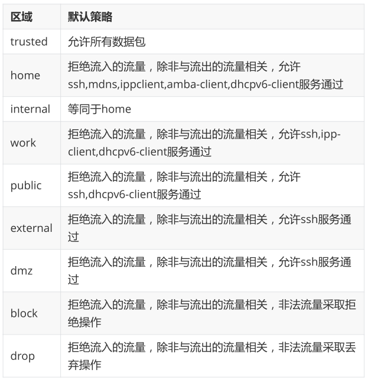

# **1、firewalld防火墙的概念**

## **1.1区域**

CentOS6x中防火墙叫做iptables

CentOS7.x 中默认使用的防火墙是firewalld

firewalld增加了区域的概念，所谓区域是指，firewalld预先准备了几套防火墙策略的集合，类似于策略的模板，用户可以根据需求选择区域。

常见区域及相应策略规则



## **1.2行模式和永久模式**

- **运行模式：**此模式下，配置的防火墙策略立即生效，但是不写入配置文件

- **永久模式**：此模式下，配置的防火墙策略写入配置文件，但是需要reload重新加载才能生效。

firewall默认采用运行模式

# **2、firewalld防火墙的配置**

## **2.1看，开启和停止firewalld服务**

命令：systemctl

作用：管理服务

语法：#systemctl [选项] firewalld

选项：

```
status：    检查指定服务的运行状况
start：    启动指定服务
stop：    停止指定服务
restart：    重启指定服务
reload：    重新加载指定服务的配置文件（并非所有服务都支持reload，通常使用restart)
enable:    开机自启
disable:   开机不自启
mask:        #注销防火墙
unmask:    #撤销注销
```

使用systemctl来管理firewalld的服务，具体命令前面已经讲过，只是服务名换成了firewalld，这里不再赘述.

# Firewalld中zone慨念及作用

区域(zone是firewalld预先准备好的防火墙策略集合，即可策略模板，用于可以根据不同的应用场景进行切换。

例如：

你有一台笔记本电脑，每天都要在公司办公室、咖啡厅和家使用。

我们来对场所进行安全性由高到低排序：家、公司办公室、咖加啡厅。

我们希望为这台笔记本电脑指定如下防火墙策略规则：

- 在家中允许访问所有服务：

- 在公司功公室内仅允许访问文件共享服务：

- 在咖啡厅仅允许上网浏览。

- 在以往，我们需要频繁地手动设置防火墙策略规则，而现在只需要预设好区域集合，

- 随时都可以自动切换了，从而极大地提升了防火墙策略的应用效率。

# FireWalld中zone分类

FireWalld不同区域之间的差异主要是每个区域对待数据包的默认行为不同

Firewalld默认共9个zone,分别为：

- block(拒绝)

- dmz(非军事化) 

- drop(丢弃)

- external(外部)

- home(家庭)

- internal(内部)

- public(公开)	Firewalld默认区域

- trusted(信任)

- work(工作区)

# FireWalld文件

Firewalld文件分为两大类：

```
/usr/lib/firewalld/services:     firewalld服务默认在此目录下定义了70多种服务，可以直接使用。
/usr/lib/firewalld/zones:       区域配置文件
/etc/firewalld/zones:           默认区域配置文件，配置文件中指定了编写完成的规则
```

firewalld文件作用：人性化管理规则；通过服务组织端口分组更加高效，如果一个服务使用若干网络端口，则服务

的配置文件就相当于提供了到这些端口的规则管理的批量操作快捷方式：

# Firewalldi语法

命今语法：

```
firewall-cmd [--zone=zone] 动作 [--permanent]
```

如果不指定-Zone选项，则为当前所在的默认区域，一permanenti选项为是否将改动写入到区域配置文件中

# Firewall的状态

```
[root@localhost ~]firewall-cmd --state        #查看状态
running
[root@localhost]#firewall-cmd --reload        #重新加载防火墙，中断用户连接，临时配置清除掉，加载配置文件中的永久配置
success
[root@localhost]#firewall-cmd --complete-reload    #重新加载防火墙，不中断用户的连接（防火墙出严重故障时使用）
success
[root@localhost~]#firewall-cmd --panic-on    #紧急模式，强制关闭所有网络连接
```

# FireWalld中动作

- 动作中查看操作

```
[root@localhost#firewall-cmd XXX
--get-icmptypes	        ##查看支持的所有ICMP类型
--get-zones		##查看所有区域
--get-default-zone	##查看当前的默认区域
--get-active-zones	##查看当前正在使用的区域
--get-services	        ##查看当前区域支持的服务a
--list-services         ##查看当前区域开放的服务列表
--list-services --zone=home    ##显示home域中当前支持的服务列表
--1ist-a11              ##查看默认区域内的所有配置，类似与iptab1es-L-n
--list-all-zones        ##查看所有区域的所有配置
```

- 更改区域操作

```
[root@localhost#firewall-cmd xxx
--set-default-zone=work##更改默认的区域
```

- 添加规则

```
--add-inerface=eth0    #临时添加了一个网卡。
--add-interface=eth0  --permanent    #将添加操作写入当前默认的配置文件中/ect/firewalld/zone/public.xml
    --reload    #重新加载配置文件。上条命令生效
--add-prot=80/tcp                 #添加端口并指定协议
--add-port=5000-6000/tcp
--add-service=http                #添加服务   
--add-source=192.168.23.12        #添加主机
-add-masquerade                    #开启ip伪装
```

- 删除规则

```
--remove-service=http  --permanent    #永久删除http服务规则，
    --reload    #重新加载配置文件文件
--remove-dport=80/tcp
--remove-masquerade    
```

- 移动规则（从当前zone移动到指定的zone)

```
--change-interface=eth0 --zone=work    #将当前zone中的interface=eth0这条规则移动到work区域
            -注意了，这不是修改原规则，就是移动。移动后，当前zone中的规则消失。
```

- 查询规则	query

```
root@server1 ~# firewall-cmd  --query-masquerade        #查询ip伪装是否开启
yes
root@server1 ~# firewall-cmd  --query-service=http      #查询是否增加了http规则
no
```

# 端口转发 

端口转发可以将指定地址访问指定的端口时，将流量转发至指定地址的指定端口。转发的目的如果不指定的话就

默认为本机，如果指定了却没指定端口，则默认使用来源端口。

注：以下部分可能需要两台主机

```
#forward_server:    公网某个服务器
#    ip:192.168.23.12
[root@localhost~]# firewall-cmd --add-masquerade     #开启ip伪装，实质就是SNAT
[root@localhost~]# firewall-cmd -add-forward-port=port=80:proto=tcp:toaddr=192.168.20.10:toport=80
        #当访问本机的80端口时，就数据包交给192.168.23.10处理，实质就是DNAT
#server:    内网服务器主机
#    ip :192.168.20.10
[root@localhost~]# systemctl start http
[root@localhost~]# systemctl stop firewalld
[root@localhost~]# curl localhost
   >> apache server
#client:    
#    ip: 192.168.23.10     
[root@localhost~]# curl 192.168.23.12
    >> apache server
```

# Rich规则

当基本firewalld语法规则不能满足配置要求时，可以使用rich规则来完成更加复杂的功能。

- Rich规则选项

```
--add-rich-rule='rule'       ##新建rich规则
--remove-rich-rule='rule'    ##删除rich规则
--query-rich-rule='rule'     ##查看单条rich规则
--list-rich-rules    
        ##查看rich规则列表
```

- 拒绝主机访问

```
[root@localhost ~]firewall-cmd --permanent --zone=public --add-rich-rule='rule family=ipv4 source address=192.168.2.20/32 reject'
[root@localhost ]firewall-cmd --reload
```

- 抛弃ICMP协议所有数据包**（自己可以ping别人，别人不能ping自己）**

```
[root@localhost ~]firewall-cmd --permanent --add-rich-rule='rule protocol value=icmp drop'
[root@localhost]#firewall-cmd --reload
##刷除
[root@localhost ~]firewall-cmd --permanent --remove-rich-rule='rule protocol value=icmp drop'
```

- 允许某一网段一段端口通过

```
[root@localhost ~]firewall-cmd --permanent --zone=public \
 --add-rich-rule='rule family=ipv4 source address=192.168.2.0/24 port port=7900-7905 protocol=tcp accept'
```

- 开启SNAT

```
[root localhost ]firewall-cmd --permanent --add-rich-rule='rule family=ipv4 source address=192.168.1.0/24 masquerade'
```

- 端口转发

```
[root@localhost ~]firewall-cmd --add-masquerade --permanent
[root@localhost ]firewall-cmd --permanent \
--add-rich-rule='rule family=ipv4 source address=192.168.2.10/24 forward-port port=80 protocol=tcp to-port=8090 to-addr=192.168.2.20'
[root@localhost ]firewall-cmd--reload
```