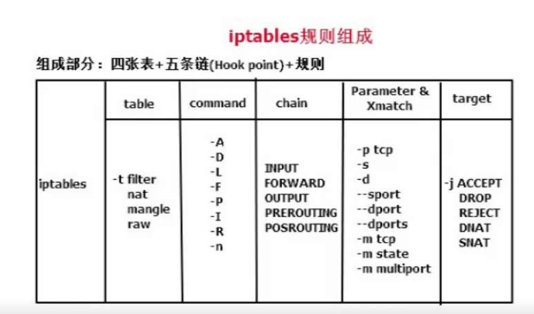

# iptables是什么？

- iptables不是防火墙，是防火墙用户代理

- ·用于把用户的安全设置添加到“安全框架”中

- ·“安全框架"是防火墙

- ·“安全框架"的名称为netfilter

- ·netfilter位于内核空间中，是Liux操作系统核心层内部的一个数据包处理模块

- ·iptables是用于在用户空间对内核空间的netfilter进行操作的命令行工具

# netfilter/.iptables.功能

netfilter/iptablesi可简称为iptables,为Linux平台下包过滤防火墙，是开源的、内核自带的、可以代替成本较高的企业级硬件防火墙，能够实现如下功能：

- 数据包过滤，即防火墙 		INPUT，OUTPUT

- ·数据包重定向，即转发		FORWARD

- ·网络地址转换，即可NAT	POSTROUTING，PREROUTING

# 扩展匹配条件：

扩展匹配又分为

扩展匹配的特点是：需要加载扩展模块，匹配规则方可生效

**隐式匹配的特点：**

**显示匹配的特点**

隐式匹配选项及功能

```
-p tcp    
--sport    :匹配报文源端口：可以给出多个端口，但只能是连续的端口范围
--dport    ：匹配报文目标端口：可以给出多个端口，但只能是连续的端口范周
--tcp-flags mask comp    ：匹配报文中的tCp协议的标志位
-p udp
    --sport ：匹配报文源端口：可以给出多个端口，但只能是连续的端口范围
    --dport :匹配报文目标端口：可以给出多个端口，但只能是连续的端口范围
--icmp-type
    O/0: echo reply  允许其他主机ping
    8/0: echo request 允许ping其他主机
```

## 显示匹配使用选项及功能

- **multiport		#多个端口**

```
iptables -I INPUT -d 192.168.2.10 -p tcp -m multiport --dports 2280 -j ACCEPT
    #在INPUT链中开放本机tCp22,tCp80端口
iptables -I OUTPUT -s 192.168.2.10 -p tcp -m multiport --sports 22,80 -j ACCEPT
    #在0 UTPUT链中开发源端口tcp22,tcp80
```

- **iprange	#多ip地址**

```
iptables -A INPUT -d 192.168.2.10 -p tcp --dport 23 -m iprange --src-range 192.168.2.11-192.168.2.21 --j ACCEPT
iptables -A OUTPUT -s 192.168.2.10 -p tcp --sport 23 -m iprange --dst-range 192.168.2.11-192.168.2.21 --j ACCEPT
```

- **time 	#指定访问时间**

```
iptables -A INPUT -d 192.168.2.10 -p tcp --dport 901 -m time --weekdays 
  Mon,Tus,Wed,Thu,Fri --timestart 08:00:00 --time-stop 18:00:00 -j ACCEPT
  
iptables -A OUTPUT -s 192.168.2.10 -p tcp --sport 901 -j ACCEPT
```

- **string	#字符串，对报文中的应用层数据字符串匹配模式匹配检测（通过算法实现）**

```
--algo{bm|kmp}:字符匹配查找时使用算法
--string"STRING":要查找的字符串
--hex-string“HEX-STRING”:要查找的字符，先编码成16进制格式
```

- **connlimit		#连接限制,限同一IP最大连接数**

```
--connlimit-upto n     ：连接数小于等于n时匹配
--connlimit-above n    ：连接数大于n时匹配
[root@localhost~]# iptables -A INPUT -m state--state ESTABLISHED,RELATED -j ACCEPT
[root@localhost~]# iptables -A INPUT-p top --syn --dport 22 -m connlimit ! --connlimit-above 2 -j ACCEPT 
    //仅允许每个客户端有两个sSh连接
//等价于： [root@localhost~]# iptables-A INPUT -p tcp --syn --dport 22 -m connlimit --connlimit-above 2 -j REJECT  //超过两个连接拒绝
[root@localhost~]# iptables -A INPUT -p tcp -syn --dport 80 -m connlimit !--connlimit-above 100 -j ACCEPT 
        //仅允许每个客户端有100个requests
[root@localhost~]# iptables-A INPUT -j REJECT
```

- **limit		#限制报文速率**

```
[root@localhost ~]# iptables-F
实验：从客户端ping本机，观察序列号
[root@localhost]# iptables -t filter-A INPUT-p tcp --syn --dport -m limit--limit 20/minute-j ACCEPT
[root@localhost]# iptables -t filter -A INPUT -j REJECT
//进入本机INPUT链的ICMP,如果匹配第一条则放行，不匹配的得被第二条拒绝，默认前5个不限
//16/second
//16/minute
//16/hour
//16/day
[root@localhost ~]iptables -t filter-A INPUT-p top --syn --dport 80 -m limit -limit 50/second -j ACCEPT
[root@localhost ~iptables -t filter -A INPUT -j REJECT
```

- **state	#追踪本机上的请求和响应之间的数据报文状态。状态有五种：**

```
--state state
NEW    新连接请求
ESTABLISHED    已建立的连接
INVALID        无法识别的连接
RELATED        相关联的连接，当前连接是一个新请求，但附属于某个已存在的连接，衍生态
UNTRACKED      未追踪的连接
```

- **icmp**

```
root@server1 ~# iptables -t filter -I INPUT -p icmp -m icmp --icmp-type echo-reply -j ACCEPT  #可以接收ping的回复数据包
    -如果iptables使用了白名单设置，那么上调规则将导致，自己可以ping通他人的主机，而他人ping不了自己。
```

- **tos		#ip协议头部type of service**

```
[root@localhost ~] #iptables-F
[root@localhost ~] #tcpdump -i etho -nn port 22 -vv    //抓取远程主机访问本机ssh数据包，观察TOS值
[root@localhost~]#tcpdump  -i  eth0 -nn port 22 -vvv    //抓取远程从本机rsync?或scp复制文件，观察ToS值
小结：都是使用22/tcp,但可以通过P报文中的TOS值来区分应用
    ssh tos 0x0 0x10
    scp tos 0x0 0x8
    rsync:tos 0x0 0x8
[root@localhost ~]# iptables -m tos -h
[root@localhost ~]# iptables -t filter -A INPUT -p tcp -dport 22 -m tos --tos 0x10 -j REJECT
[root@localhost ~]# iptables -t filter-A INPUT -j REJECT
```

- **tcp	#按TCP标记匹配**

```
Flags are:SYN ACK FIN RST URG PSH ALL NONE
[root@localhost ~]# iptables -t filter -A INPUT -p tcp -m tcp --tcp-flags SYN,ACK,FIN,RST SYN --dport 80 -j ACCEPT
[root@localhost ~]# iptables -t filter-A INPUT -p tcp --syn --dport 80 -j ACCEPT 
// --tcp-flags SYN,ACK,FIN,RST SYN        检查四个标记位SYN,ACK,FIN,RST但只有SYN标记位才匹配
//则允许三次握手中的第一次握手，等价于一5n 
```

- ** comment  #添加备注**

```
[root@localhost~]# iptables -A INPUT -s 172.16.130.7 -m comment --comment "cloud class"-j REJECT
```

- **mark**

```
[root@localhost~]# iptables -t filter -A INPUT -m mark --mark 2 -j REJECT
```

 

# iptables 动作

```
MASQUERADE:伪装，类似于SNAT,适用于动态的、临时会变的ip地址上，例如：家庭使用的宽带。
用发送数据的网卡上的IP来替换源IP,对于IP地址不固定场合使用。
```

- -j LOG

```
[root@localhost~]# service rsyslog restart
[root@localhost~]# iptables -j LOG -h
[root@localhost~]# iptables -t filter -A INPUT -p tcp --syn --dport 22 -j LOG --log-prefix "前缀"  //--syn,仅在第一次连接时纪录
[root@localhost~]# iptables -t filter -A INPUT -p tcp --syn --dport 22 -j ACCEPT
[root@localhost~]# iptables -t filter -A INPUT -j REJECT
```

- -j MARK

```
[root@localhost~]#  iptables -t mangle  -L
[root@localhost~]#  iptables-j MARK-h
[root@localhost~]#  iptables -t mangle -A PREROUTING -s 192.168.2.110 -j MARK --set-mark 1
[root@localhost~]#  iptables -t mangle -A PREROUTING -s 192.168.2.25  -j MARK --set-mark 2 //mark 最大到255
[root@localhost~]#  iptables -t filter-A INPUT -m mark --mark 1 -j ACCEPT    //按照标记匹配
[root@localhost~]#  iptables -t filter-A INPUT -m mark --mark 2 -j REJECT 
```

# 制定iptables规则策略

- 黑名单

- 默认为ACCEPT，对某些IP做限制

- 白名单

- 默认为JERECT或DROP，对某些IP开放

```
制定iptables思路
```

1.选择一张表，此表决定了数据报文处理的方式

2.选择一条链，此链决定了数据报文流经哪些位置

3.选择合适的条件，此条件决定了对数据报文做何种条件匹配

4.选择处理数据报文的动作，制定相应的防火墙规则



## **白名单**

- 方法一：（推荐使用）

```
iptables  -t filter  -p INPUT ACCEPT    #默认规则为ACCEPT
iptables -t filter -A INPUT -j DROP     #在最后一行添加DROP动作。
    -然偶将允许访问的规则统一写在DROP动作的上面。
    -但是注意了DROP上面的规则，不可以有iptables -t filter -I INPUT -j ACEPT    #这样就表示所有数据包均可通过，显示是不行的。
    -如上，这就是一个白名单了
```

- 方法二：

```
iptables -F    #清空防火墙规则
iptables -t filter -A INPUT -p tcp --dport 22  -j ACCEPT    #如果不先写这条，将无法远程连接，非常严重。
iptables -t filter -P DROP    #设置默认规则为DROP，这就是白名单。
```

## 黑名单

```
iptables -P  INPUT ACCEPT     #默认规则为DROP,注意不要轻易使用，以免造成ssh协议不能使用。
    -然后将禁止访问的规则写入即可，这就是黑名单
```

# 案例

## 示例1 访问http,vsftpd

```
yum -y install httpd vsftpd
service httpd start
service vsftpd start
service sshd start
iptables-F
iptables-I INPUT -p tcp --dport 80-j ACCEPT
iptables -I INPUT -p tcp -dport 20:21 -j ACCEPT
iptables-I INPUT -p tcp --dport 22 -j ACCEPT
iptables -A INPUT -j REJECT
iptables -nL
```

**示例1存在的问题：**

- 1.本机无法访问本机

- 例如：ping127.0.0.1

- 解决方案：iptables-I INPUT-i lo -j ACCEPT

- 2.本机无法访问其它主机

- 例如：ssh remote_host

- 解决方案：iptables-I INPUT-m state  --state ESTABLISHED,RELATED-i ACCEPT

- 3.FTP无法访问

- 方法二：使用连接追踪模块

```
[root@localhost ~]# iptables-I INPUT -m state-state ESTABLISHED,RELATED -j ACCEPT
[root@localhost ~]# iptables -I INPUT -p top -dport 20:21 -j ACCEPT
[root@localhost ~]# modprobe nf_conntrack_ftp     #临时
[root@localhost ~]vim /etc/sysconfig/iptables-config    #永久设置
IPTABLES_MODULES="nf_conntrack_ftp"
#nf_conntrack_ftp:针对数据端口连接时，将三次握手第一次的状态由NEW识别成RELATED
```

## 示例二：iptables的标准流程

```
root@server1 ~# iptables -A INPUT -i lo -j ACCEPT
root@server1 ~# iptables -A INPUT -p tcp --dport 3306 -j DROP
root@server1 ~# iptables -A INPUT -s 192.168.23.0/24 -j ACCEPT
root@server1 ~# iptables -A INPUT -p tcp --syn --dport 80 -j ACCEPT
root@server1 ~# iptables -A INPUT -p tcp --syn --dport 22 -j ACCEPT
root@server1 ~# iptables -A INPUT -p tcp --syn --dport 20:21 -j ACCEPT
```