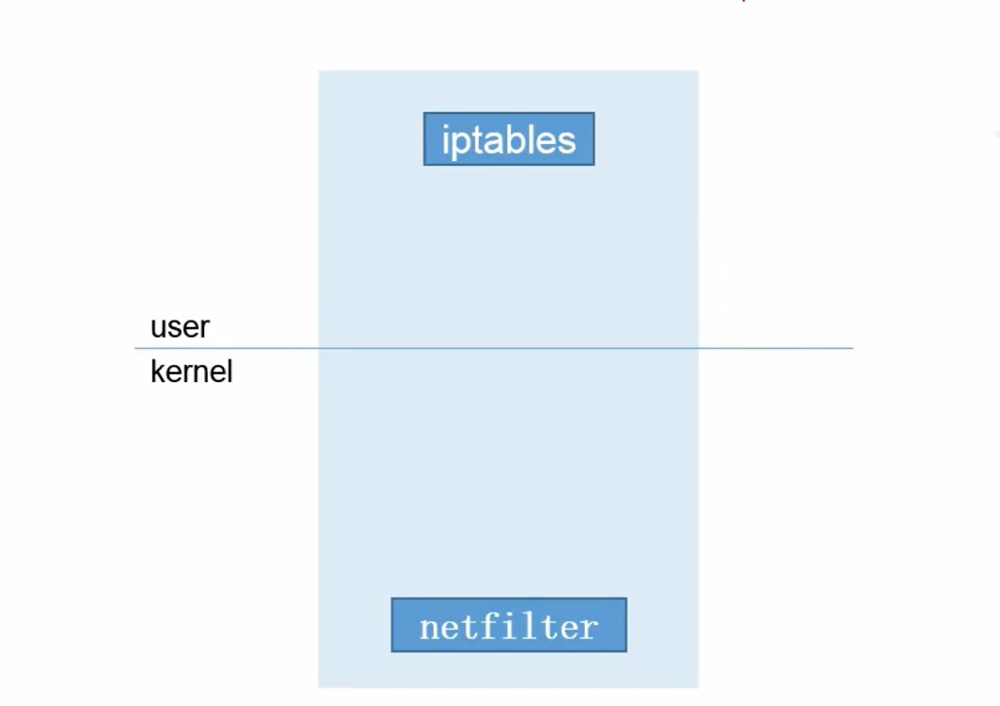
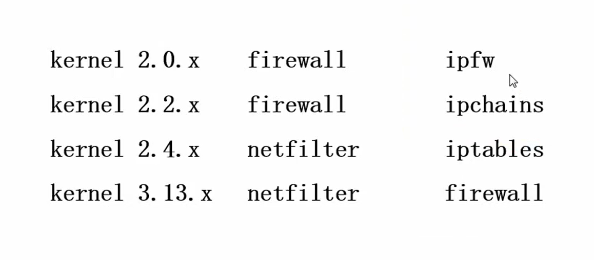
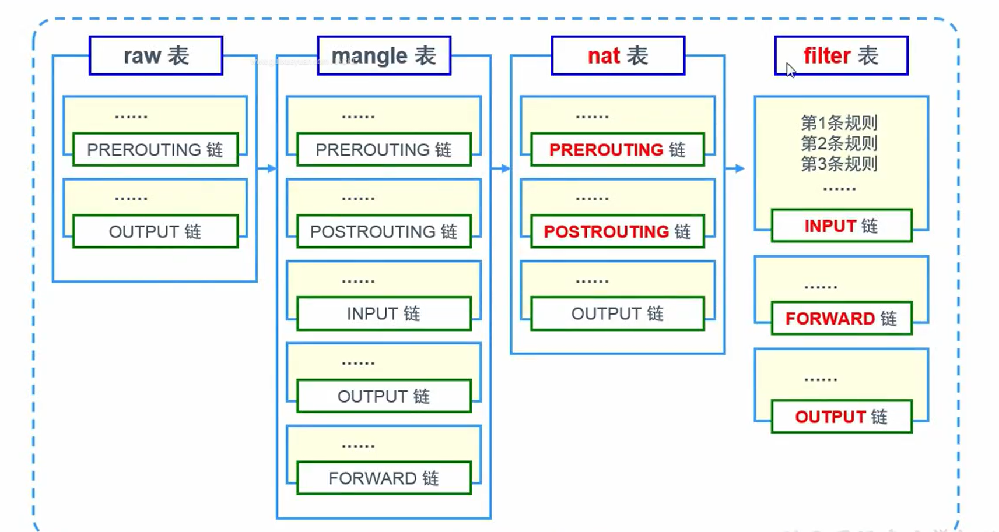
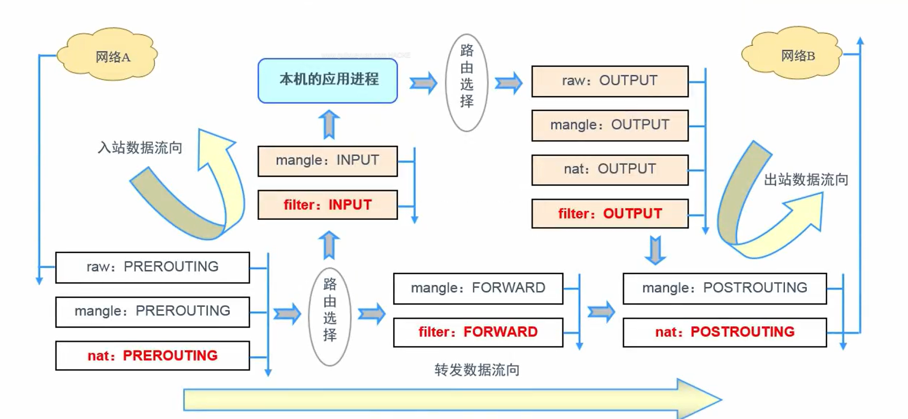

# 一、安全防御概述

## 1 、常见的攻击手段

**拒绝服务（DOS： ）：**

**口令破解**

**已知漏洞：**

## 2 、常见的安全防御设备

- 基础类防火墙：主要实现包过滤防火墙

- **IDS 类防火墙**：入侵检测系统，提供报告和事后监督为主

- **IPS 类防火墙：**入侵防御系统，分析数据包内容，根据模式匹配去阻断非法访问

- 主动安全类防火墙：对特定服务类型进行专项防御，常见设备有 waf、daf

# 二、基础类防护墙

## 1 、何为防火墙？

工作在主机边缘或者网络边缘处对数据报文进行检测，并且能够根据事先定义好的规则，对数据报文

进行相应处理的模块

## 2 、防火墙的分类

- 结构

- 软件：iptables

- 硬件：深信服 、 网御 、 华为

- 工作机制

- **包过滤防火墙**：源地址 目的地址 源端口 目标端口 连接状态

- **应用层防火墙**：URL  hostname(主机名）

- 模块

- 内核态：netfilter **（真正的防火墙）**

- 用户态：iptables **（仅仅是netfilter的管理工具）**

## 3 、Iptables 工作结构

## 4 、Iptables 历经的构造变化

## 5 、Iptables 相关原理

### **四表五链功能性介绍**

- **规则链：****承载防火墙规则**

- 1 ）入站：INPUT

- 2 ）出站：OUTPUT

- 3 ）转发：FORWARD

- 4 ）路由前应用规则：修改目标地址 PREROUTING

- 5 ）路由后应用规则：修改源地址 POSTROUTING

- **规则表**：**承载防火墙链**

- 1 ）raw ：状态跟踪，确定是否对该数据包进行状态跟踪

- 2 ）mangle ：标记 TTL，为数据包设置标记

- 3 ）nat ：实现地址转换，修改数据包中的源、目标IP地址或端口

- 4 ）filter ：过滤，确定是否放行该数据包（过滤）

### 防火墙链表结构

### 防火墙相关顺序

- 规则匹配顺序：由上至下，匹配即停止

- 表应用顺序：raw>mangle>nat>filter

- 链应用顺序

- 入站：PREROUTING>INPUT

- 出站：OUTPUT>POSTROUTING

- 转发：PREROUTING>FORWARD>POSTROUTING

### ④ 链表匹配顺序示意图

