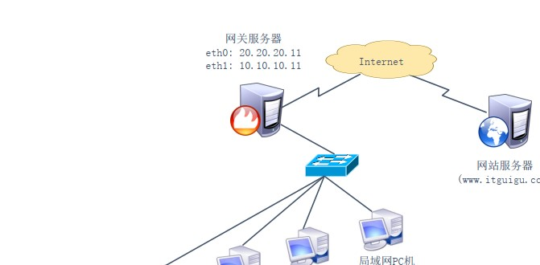
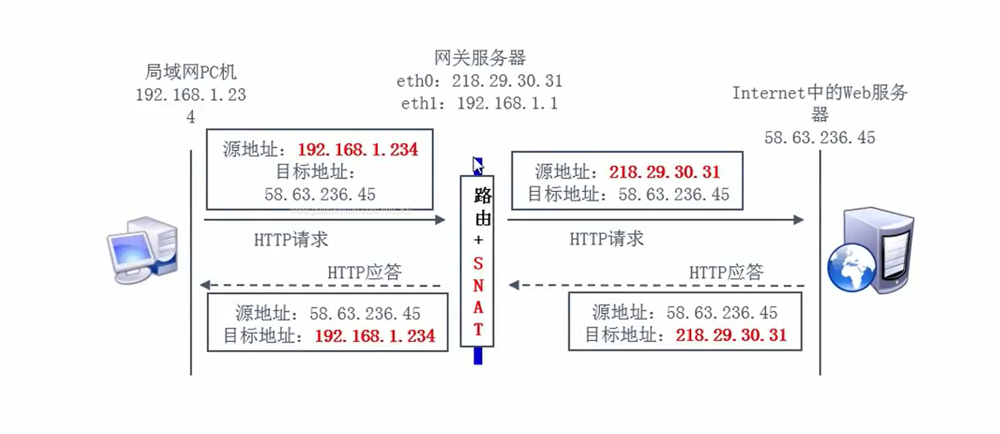
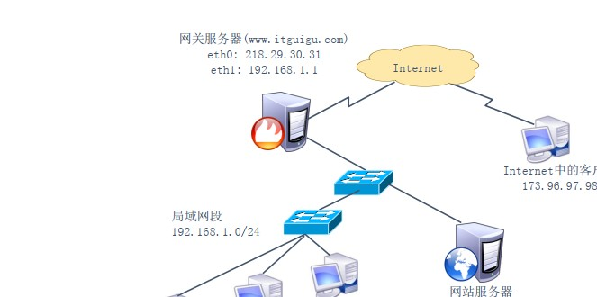
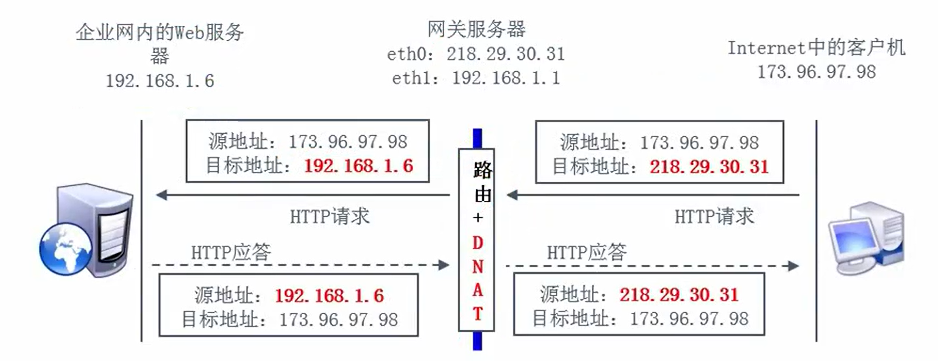

**实验SNAT：server1 通过server2上网，**

**2、DNAT 规则   （**

**SNAT 规则**

SNAT 策略的典型应用环境：局域网主机共享单个公网 IP 地址接入 Internet

# 1、SNAT 策略的原理

-  源地址转换，Source Network Address Translation

-  修改数据包的源地址

**SNAT 网络拓扑**





**启动 SNAT 转换代码记录**

- 前提条件

-  局域网各主机正确设置 IP 地址/子网掩码

- 局域网各主机正确设置默认网关地址

- Linux 网关支持 IP 路由转发

**实现方法：编写 SNAT 转换规则**

```
iptables -t nat -A POSTROUTING -s 192.168.1.0/24 -o eth0 -j SNAT --to-source 218.29.30.31
```

**MASQUERADE —— 地址伪装**

-  适用于外网 IP 地址 非固定的情况

-  对于 ADSL 拨号连接，接口通常为 ppp0、ppp1

-  将 SNAT 规则改为 MASQUERADE 即可

**实现代码**

```
iptables -t nat -A POSTROUTING -s 192.168.1.0/24 -o eth0 -j MASQUERADE
```

## 实验：server1 通过server2上网，

# 2、DNAT 规则 

DNAT 策略的典型应用环境：在 Internet 中发布位于企业局域网内的服务器

- DNAT 策略的原理

-  目标地址转换，Destination Network Address Translation

-  修改数据包的目标地址

DNAT 网络拓扑





**启动 DNAT 转换代码记录**

前提条件

 局域网的 Web 服务器能够访问 Internet

 网关的外网 IP 地址有正确的 DNS 解析记录

 Linux 网关支持 IP 路由转发

**实现方法：编写 DNAT 转换规则**

**（PREOUTING：路由前，如果不在路由前做好目标地址转换，报文到路由表后，路由表一看目标ip就是本地ip，就会直接将报文路由给本地的		应用进程，这时候源client访问的服务器就真的是路由器了，真不是我们想要的；**

**做了路由前转换目标地址，到报文到达路由表后，路有表一看，哦，目标ip是web,所以就会将报文路由给web;**

```
iptables -t nat -A PREROUTING -i eth0 -d 218.29.30.31 -p tcp --dport 80 -j DNAT --to-destination 192.168.1.6
```