MySQL+ NoSQL(Redis)


# 1.安装 gcc*

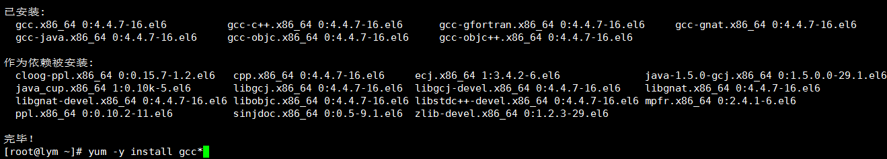

# 


2.安装所需要的包

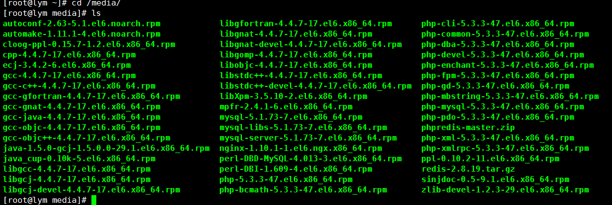


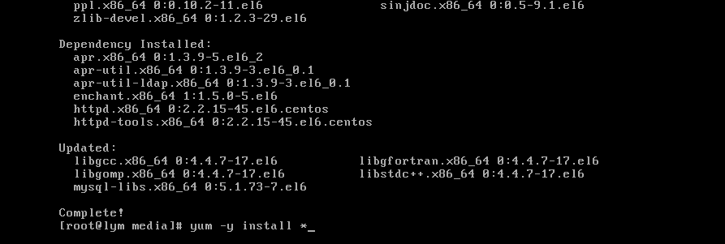


# 3.配置网站 nginx 并启动 nginx


```javascript
vim /etc/nginx/nginx.conf
```


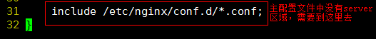


```javascript
vim /etc/nginx/conf.d/default.conf
```


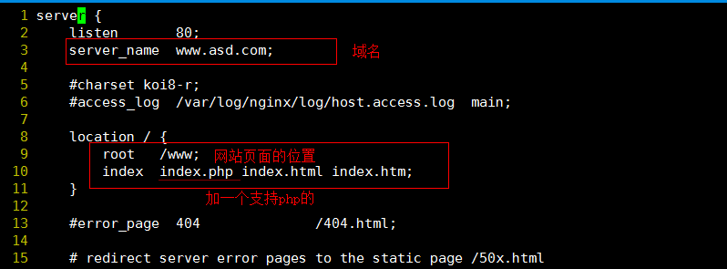


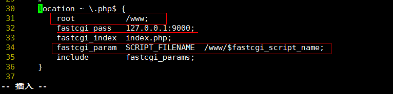


## 启动 nginx


```javascript
vim /etc/php-fpm.d/www.conf
```


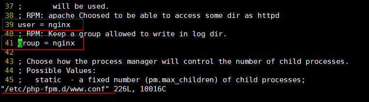


# 4.启动 php 和数据库


# 


# 5.授权，使登录数据库时使用‘123456’密码

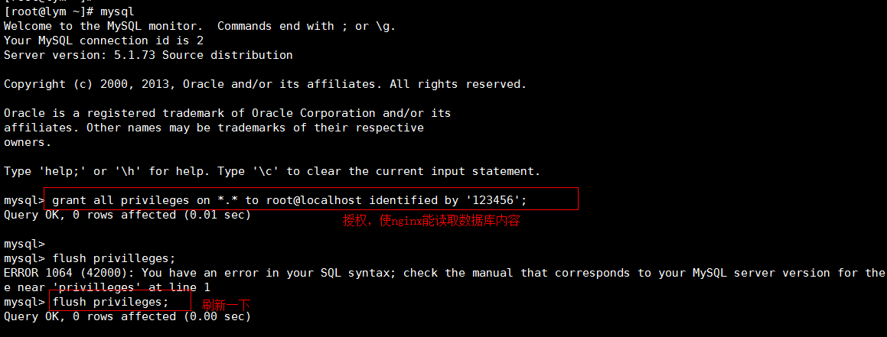

# 


6.测试网站和 php 的连通性

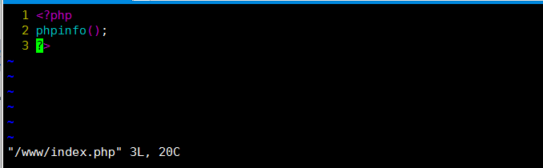


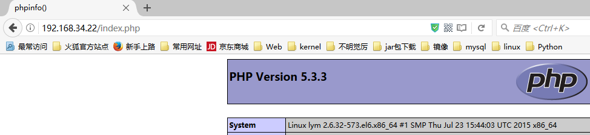

以上搭建了一个 p lnmp 环境. .


# 7.安装 redis

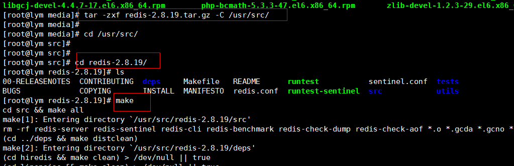

# 


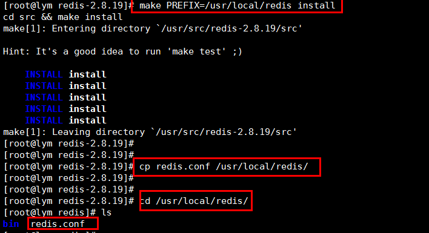


# 8.安装提供 php 和 redis 联系的软件


a. 解压

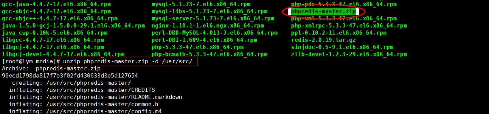


b. 安装

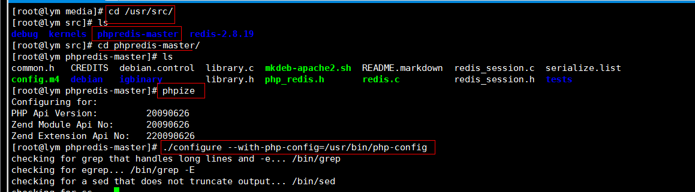


c. 让 php 支持 redis

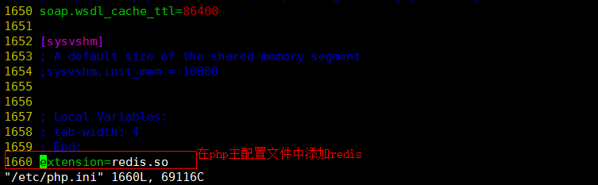


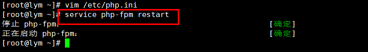


9.进入 mysql 插数据

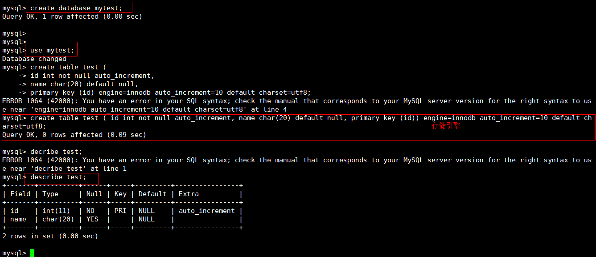


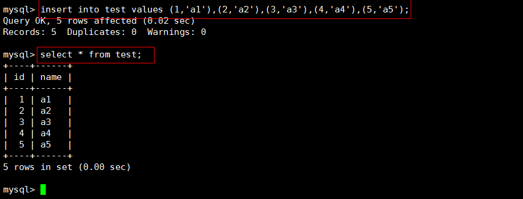

10.开启 redis,并编写脚本

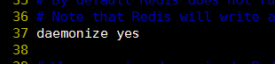


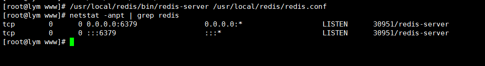


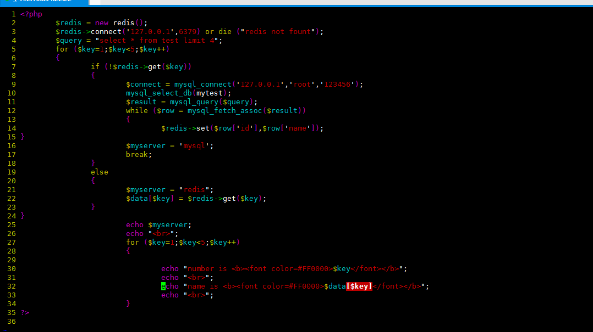

11.验证 php 访问 redis 和 mysql

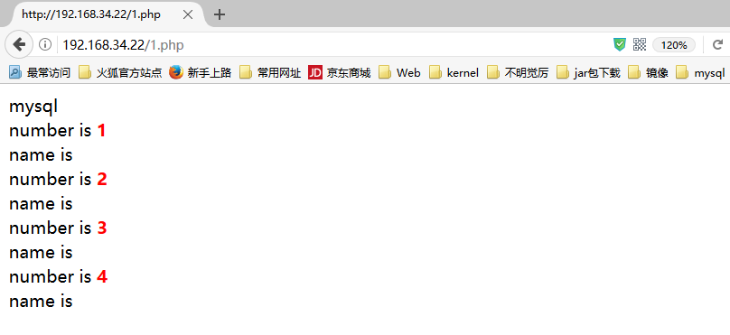


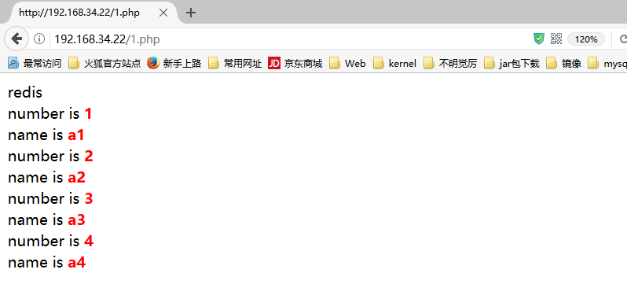

