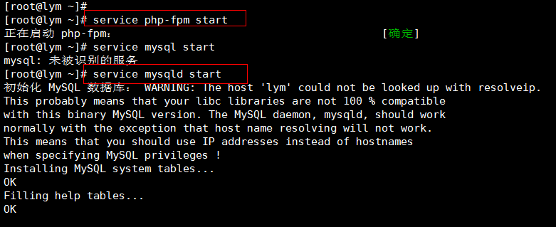
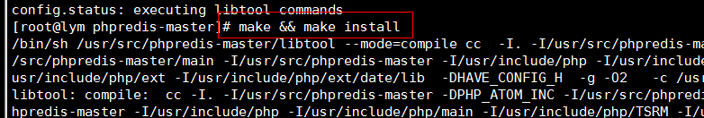

MySQL+ NoSQL(Redis)


# 1.安装 gcc*


# 


2.安装所需要的包


# 3.配置网站 nginx 并启动 nginx


```javascript
vim /etc/nginx/nginx.conf
```


```javascript
vim /etc/nginx/conf.d/default.conf
```


## 启动 nginx


```javascript
vim /etc/php-fpm.d/www.conf
```


# 4.启动 php 和数据库



# 


# 5.授权，使登录数据库时使用‘123456’密码


# 


6.测试网站和 php 的连通性


以上搭建了一个 p lnmp 环境. .


# 7.安装 redis


# 


# 8.安装提供 php 和 redis 联系的软件


a. 解压


b. 安装




c. 让 php 支持 redis


9.进入 mysql 插数据


10.开启 redis,并编写脚本


11.验证 php 访问 redis 和 mysql


