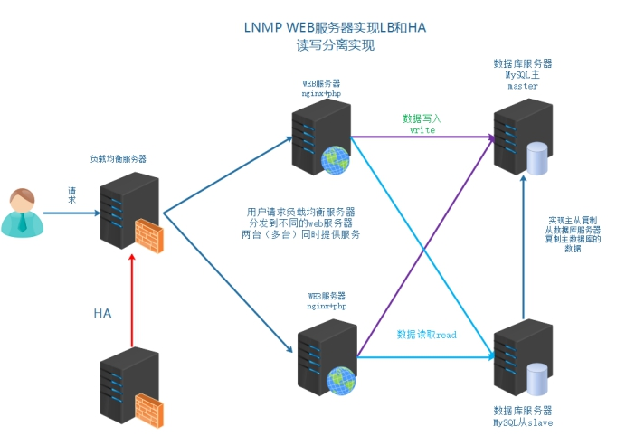
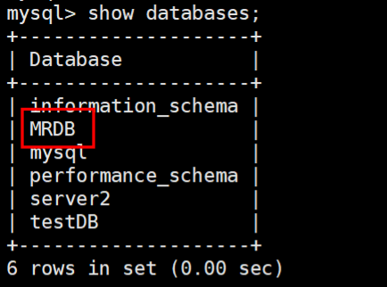

# 1、背景描述及其方案设计

```
时间：2014.6.-2015.9
发布产品类型：互联网动态站点商城
用户数量：10000-12000（用户量猛
PV:100000-500000(24小时访问次数总和)
QPS:50-100*(每秒访问次数)
DAU:2000(每日活跃用户数)
```

之前业务中是单台MySQL提供服务，使用多台MySQL数据库服务器，降低单台压力，实现集群架构的稳定性和高可用性数据的一致性完整性replication通过业务比对和分析发现，随着用户活跃增多，读取数据的请求变多，故着重解决读取数据的压力。

# 2、模拟运维设计方案


根据以上业务需求，在之前业务架构的基础上实现数据的读写分离



> **1、MySQL主从复制架构是有延迟的，这是不可避免的。**
> **2、MySQL一般不使用双主架构，因为延迟更高。**


# 3、MySQL读写分离介绍

## 3.1、读写分离的目的

数据库负载均衡：

当数据库请求增多时，单例数据库不能够满足业务需求。需要进行数据库实例的扩容。多台数据库同时相应请求。也就是说需要对数据库的请求，进行负载均衡。

但是由于数据库服务特殊原因，数据库扩容基本要求为：数据的一致性和完整性。所以要保证多台数据库实例的数据一致性和完整性，以MySQL为例来说，官方提供了主从复制机制。

**读写分离：**

数据库的负载均衡不同于其他服务的负载均衡，数据要求一致性。基于主从复制的基础上，常见的数据库负载均衡使用的是读写分离方式。

> **实际业务中，读写分离存在一个问题，不够实时性。**
> **解决方式：**
> **  1、缓存 写主库 写缓存 读缓存**
> **  2、可以部分请求读主**
> **  3、添加完数据之后，有一个跳转等待的时间（5s）,数据正在审核中。**


## 3.2 读写分离常见的实现方式

1. **业务代码的读写分离**

需要在业务代码中，判断数据操作是读还是写，读连接从数据服务器操作，写连接主数据库服务器操作以当前LNMP为例，需要通过PHP代码实现读写分离

1. **中间件代理方式的读写分离**

在业务代码中，数据库的操作，不直接连接数据库，而是先请求到中间件服务器（代理）由代理服务器，判断是读操作去从数据服务器，写操作去主数据服务器。

| MySQL Proxy | MySQL 官方测试版 不再维护 | 
| -- | -- |
| Atlas | 奇虎360基于MySQL Proxy | 
| DBProxy | 美团点评 | 
| Amoeba | 早期阿里巴巴 | 
| cobar | 阿里巴巴 | 
| MyCat | 基于阿里开源的Cobar | 
| kingshared | go语言开发 | 


也就是如下图示架构


问：如何选择？

①业务实现读写分离，操作方便，成本低，当前的开发框架基本支持读写分离

②中间件代理服务器，除了能够实现读写分离，还可以作为数据库集群的管理平台.

# 4、MySQL 读写分离案例实现

## 4.1 搭建M-S复制

主从复制的原理：主服务器开启bin-log(记录了写操作)从服务器获取到主服务器的bin-log记录到relay-log中。

从服务器在通过异步的线程方式，对于relay-log进行重放操作。


详细操纵参考：[7](note://WEB8d572cdeb5c9dcd4bed8ddb8a31927a8)

## 4.2 简单业务代码实现读写分离

```
class l
Mysql
//构造方法
//当类被实例化时，会触发此方法
public function construct(){
$this->master @new mysqli('192.168.17.100','tp5shop',$Abc3721','tp5shop');
$this->slave @new mysqli('192.168.17.105','tp5shop','$Abc3721','tp5shop')
//如果从连接报错，就连接主
if($this->slave->connect_errno){
$this->slave=$this->master;
////S0L执行方法
public function query(ssql){
//判断语句中是否存在selete
if(strpos($sql,'select')!==false){
//这是查询操作
srs $this->slave->query($sql);
}else{
$rs
$this->master->query(ssql)i
return $rs;
//2、实例化连接数据库
操作
$mysql new Mysql();
$sql "select from tpshop_goods";
$rs smysql->query($sql);
while(srow srs->fetch_assoc()){
var_dump($row[goods_name'])
```

## 4.3 MyCat实现读写分离

### 4.3.1 介绍


准备一台服务器，作为数据库的中间件服务器，配置基本环境，网卡、FQDN

```
server01 web1 192.168.17.101
server02 master 192.168.17.102
server06 slave  192.168.17.106
servert07 mycat 192.168.17.107
```

Mycat数据库中间件

国内最活跃的、性能最好的开源数据库中间件！

官方网址：[](http://www.mycat.io/)[https://github.com/MyCATApache/MyCAT-Server/](https://github.com/MyCATApache/MyCAT-Server/)

因为mycat是由java语言开发，必须使用java的允许环境进行启动和操作。

### 4.3.2 JDK1.8安装

java静态编译的编程语言代码编译成机器码执行机器码输出结果。

编译jdk javac编译java代码

运行jre编译好的机器码（可以执行文件）java

**问：公司服务器部署的java环境是jdk还是jre?**

答：jre java解析运行环境一般情况编译过的可执行的java程序，jre就够用了。

jdk javac编译的环境如果服务器上传是源代码文件就可以编译，之后再执行。

实际业务环境中，如果存在需要编译的情况，就选择dk。

①

[https://www.oracle.com/technetwork/java/javase/downloads/jdk8-downloads-2133151.html](https://www.oracle.com/technetwork/java/javase/downloads/jdk8-downloads-2133151.html)

选择下载x64架构.tar.gz包

上传mycati和jdk到soft目录下

> **注意下载的JDK 必须是JDK1.8版本，否则可能会有很多报错。**


```
shell> tar xvf jdk-8u192-linux-x64.tar.gz
shell> mv jdk1.8.0_192 /usr/local/java
```

**②配置环境变量**

```
#追加环境变量
shell echo "export PATH=/usr/local/java/bin:SPATH">>/etc/profile
shell source /etc/profile
#检测java环境变量如果看到版本信息即为成功
shell java -version
```

### 4.3.3 mycat安装和测试启动

下载地址：[](http://www.mycat.io/)[https://github.com/MyCATApache/MyCAT-Server/](https://github.com/MyCATApache/MyCAT-Server/)

**①解压安装MyCAT**

```
shell tar xvf Mycat-server-1.6.5-release-20180122220033-linux.tar.gz -C /usr/local
```

实际解压到目录即可，无需安装

**②软件目录介绍**

```
**bin **    相关软件管理命令等
conf    配置文件
logs    日志目录
```

**③启动mycat**

默认情况下启动mycat是可以启动的

```
root@server1 mycat]# /usr/local/mycat/bin/mycat console    #前台启动
root@server1 mycat]# netstat  -antlp | grep  8066
tcp6       0      0 :::8066                 :::*                    LISTEN      11379/java
```


> **bug提示：**
> **如果/usr/local/mycat/bin/mycat console  命令报错：**
> **>> wrapper  | ERROR: Could not write pid file /usr/local/mycat/logs/mycat.pid: No such file or directory**
> **解决方法：**
> **mkdir /usr/local/mycat/logs  即可。**


### 4.3.4 配置读写分离

读写分离的配置文件

```
server.xml    配置mycat的对外的用户、密码、映射数据库名称等信息
schema.xml    配置后端真实数据库的用户、密码、真实数据库名称等信息
```

Mycat是由java开发，java开发的软件大部分配置文件是xml格式。注意它的基本格式。

```
xml格式注意点：
1、xml声明信息
2、具有一个根标签
3、双标签和单标签格式
4、注意闭合标签
5、注释格式为 <!--这里是注释内容-->
```

**①查看server.xml**

默认server.xml 可以不用修改

```
shell> /usr/local/mycat/conf
shell> vim server.xml
```


> **1、TESTDB 是用于映射后端真实的数据库的数据库，后端数据库中是不存在这个数据库的，所以名称可以随便填写。**
> **还有对应的用户名和密码，也可以随便写，因为与后端真实数据库无关。**
> **2、这里填写的数据库用户和密码，是用于之后登录mycat中间件，所使用的。**


**②修改schema.xml**

schema标签里配置name的server..xml里的虚拟数据库名称，dataNode埴写后面使用的dataNode名称

dataNode标签和dataHost指定配置使用

dataHost标签里配置writeHost和readHost(密码，地址，用户名称)

> schema=>dataNode=>dataHost=>writeHost=>readHost


可以使用给大家精简过的配置为文件

```
<?xml version="1.0"?>
<!DOCTYPE mycat:schema SYSTEM "schema.dtd">
<mycat:schema xmlns:mycat="http://io.mycat/">
        
        <schema name="TESTDB" checkSQLschema="false" sqlMaxLimit="100" dataNode="dn1"></schema>
        <dataNode name="dn1" dataHost="localhost1" database="MRDB" />    
        <dataHost name="localhost1" maxCon="1000" minCon="10" balance="0"
                          writeType="0" dbType="mysql" dbDriver="native" switchType="1"  slaveThreshold="100">
                <heartbeat>select user()</heartbeat>
                <!-- can have multi write hosts -->
                <writeHost host="hostM1" url="192.168.23.18:3306" user="wr" password="123">
                        <readHost host="hostS1" url="192.168.23.17:3306" user="wr" password="123"></readHost>
                </writeHost>
                <!-- <writeHost host="hostM2" url="localhost:3316" user="root" password="123456"/> -->
        </dataHost>
</mycat:schema>
```




```
./bin/mycat resstart        #重启
```

### 4.3.5 mycat 客户端

连接mycat客户端

```
[root@server1 mycat]# mysql -h 127.0.0.1  -uroot  -p -P8066
```

执行查询命令测试结果

```
mysql> show databases;
mysql> use TESTDB;
mysql> show tables;
```

### 4.3.6 mycat管理端

连接mycat管理端

```
[root@server1 mycat]# mysql -h 127.0.0.1  -uroot  -p -P9066  #这里填写的用户名和密码，是根据server.xml配置文件中的，锁填写的。
```

执行管理命令查看

```
mysq1> show@@help;    //查看管理监控端的所有帮助命令
mysql> show@@heartbeat;//查看服务器状态
```


### 4.3.7balance属性和writeType属性

#### balance属性(关于读的)

负载均衡类型，目前的取值有3种：

```
1、balance="0",不开启读写分离机制，所有读操作都发送到当前可用的writeHost上。
2、balance="1”,全部的readHost与stand by writeHost参与select语句的负载均衡，简单的说，当双主双从模式
    (M1->S1,M2->S2,并且M1与M2互为主备)，正常情况下，M2,S1,S2都参与select语句的负载均衡。
3、balance="2",所有读操作都随机的在writeHost、readhost上分发。
4、balance="3",所有读请求随机的分发到writerHost对应的readhost执行，writerHost不负担读压力，注意
    balance=3只在1.4及其以后版本角，1,3没有。
```

#### writetype属性（关于写的）

```
1、writeType="0",所有写操作发送到配置的第一个writeHost,.第一个挂了切到还生存的第二个writeHost,,重新启
    动后已切换后的为准
2、writeType="1",所有写操作都随机的发送倒配置的writeHost,1.5以后废弃不推荐
```

#### switchType属性

```
-1表示不自动切换
1默认值，自动切换
2基于MySQL主从同步的状态决定是否切换I
```