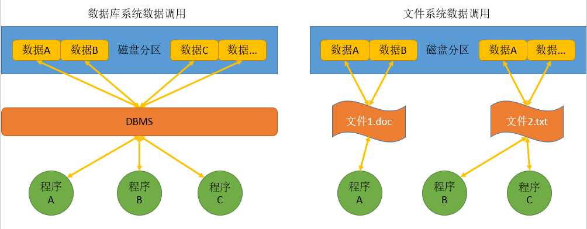
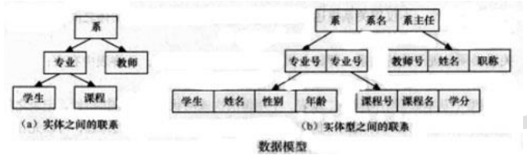
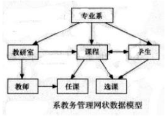
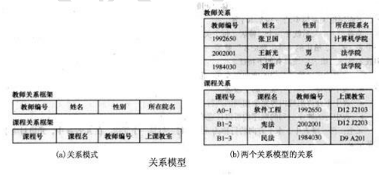
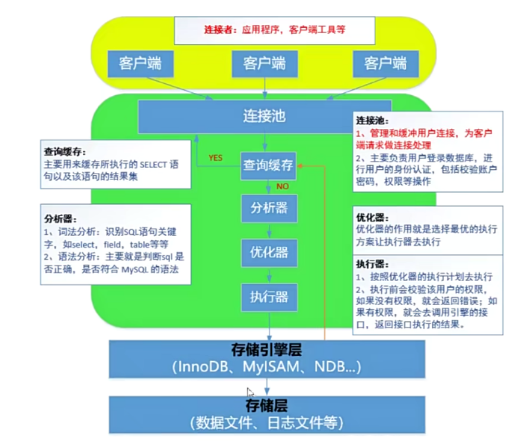



**数据库- 理论基础**

# **1.什么是数据库 ？
**

- **数据：**描述事物的符号记录，可以是数字、文字、图形、图像、声音、语言等，数据有多种形式它
们都可以经过数字化后存入计算机。

- **数据库**：存储数据的仓库，是长期存放在计算机内、有组织、可共享的大量数据的集合。数据库的
数据按照一定数据模型组织、描述和存储，具有较小的冗余度，较高的独立性和易扩展性，并为各种
用户共享，总结为以下几点：

⚫ 数据结构化

⚫ 数据的共享性高，冗余度低，易扩充

⚫ 数据独立性高

⚫ 数据由 DBMS 统一管理和控制（安全性、完整性、并发控制、故障恢复）

**解释：DBMS 数据库管理系统（能够操作和管理数据库的大型软件）**



# **2. 数据库与文件系统的区别 数据库与文件系统的区别 ？
**

- **文件系统 **：文件系统是操作系统用于明确存储设备（常见的是磁盘）或分区上的文件的方法和数		据结
构；即在存储设备上组织文件的方法。操作系统中负责管理和存储文件信息的软件机构称为文件管理
系统，简称文件系统。

- **数据库系统 **：数据库管理系统(Database Management System)是一种操纵和管理数据库的大型软件，
用于建立、使用和维护数据库，简称 DBMS。它对数据库进行统一的管理和控制，以保证数据库的安全
性和完整性。



**对比区别**

1. 管理对象不同：文件系统的管理对象是文件，并非直接对数据进行管理，不同的数据结构需要使
用不同的文件类型进行保存（举例：txt 文		件和 doc 文件不能通过修改文件名完成转换）；而数据库
直接对数据进行存储和管理

2. 存储方式不同：文件系统使用不同的文件将数据分类（.doc/.mp4/.jpg）保存在外部存储上；数
据库系统使用标准统一的数据类型进行数据保存（字母、数字、符号、时间）

3. 调用数据的方式不同：文件系统使用不同的软件打开不同类型的文件；数据库系统由 DBMS 统一调

用和管理。如下图：





**优缺点总结：**

⚫ 由于 DBMS 的存在，用户不再需要了解数据存储和其他实现的细节，直接通过 DBMS 就能获取数据，
为数据的使用带来极大便利。

⚫ 具有以数据为单位的共享性，具有数据的并发访问能力。DBMS 保证了在并发访问时数据的一致性。

⚫ 低延时访问，典型例子就是线下支付系统的应用，支付规模巨大的时候，数据库系统的表现远远
优于文件系统。

⚫ 能够较为频繁的对数据进行修改，在需要频繁修改数据的场景下，数据库系统可以依赖 DBMS 来
对数据进行操作且对性能的消耗相比文件系统比较小。

⚫ 对事务的支持。DBMS 支持事务，即一系列对数据的操作集合要么都完成，要么都不完成。在 DBMS
上对数据的各种操作都是原子级的。

# **3. 常见数据库有哪些 ？
**

⚫ 

- **关系数据库**是建立在关系模型基础上的数据库，借助于集合代数等数学概念和方法来处理数据库
中的数据。现实世界中的各种实体以及实体之间的各种联系均用关系模型来表示。简单说，关系型数
据库是由多张能互相联接的二维行列表格组成的数据库。



- **关系模型**就是指二维表格模型，因而一个关系型数据库就是由二维表及其之间的联系组成的一个
数据组织。当前主流的关系型数据库有 Oracle、DB2、Microsoft SQL Server、Microsoft Access、MySQL、
浪潮 K-DB 等。

- **实体关系模型**简称 E-R 模型，是一套数据库的设计工具，他运用真实世界中事物与关系的观念，

来解释数据库中的抽象的数据架构。实体关系模型利用图形的方式（实体-关系图）来表示数据库的概

念设计，有助于设计过程中的构思及沟通讨论。

⚫ 

- **非关系型数据库：**又被称为 NoSQL（Not Only SQL )，意为不仅仅是 SQL，是一种轻量、开源、
不兼容 SQL 功能的数据库，对 NoSQL 最普遍的定义是“非关联型的”，强调 Key-Value 存储和文
档数据库的优点，而不是单纯地反对 RDBMS（关系型数据库管理系统）



# **4. 关系型数据库 （MySQL ） 的特征及组成结构介绍
**

关系型数据库的发展历程

⚫ 层次模型



⚫ 网状模型



- **关系模型(Relation)**

关系模型以二维表结构来表示实体与实体之间的联系，关系模型的数据结构是一个“二维表框
架”组成的集合。每个二维表又可称为关系。在关系模型中，操作的对象和结果都是二维表。

关系模型是目前最流行的数据库模型。支持关系模型的数据库管理系统称为关系数据库管理系
统，Access 就是一种关系数据库管理系统。图所示为一个简单的关系模型，其中图(a)所示为关系模
式，图(b)所示为这两个关系模型的关系，关系名称分别为教师关系和课程关系，每个关系均含 3 个
元组，其主码均为“教师编号”。



在关系模型中基本数据结构就是二维表，不用像层次或网状那样的链接指针。记录之间的联系是
通过不同关系中同名属性来体现的。例如，要查找“刘晋”老师所上的课程，可以先在教师关系中根
据姓名找到教师编号“1984030”，然后在课程关系中找到“1984030”任课教师编号对应的课程名即
可。通过上述查询过程，同名属性教师编号起到了连接两个关系的纽带作用。由此可见，关系模型中
的各个关系模式不应当是孤立的，也不是随意拼凑的一堆二维表，它必须满足相应的要求。

 

**关系式数据库的组成结构和名词解释**

数据以表格的形式出现，每行为单独的一条记录，每列为一个单独的字段，许多的记录和字段组
成一张表单（table），若干的表单组成库（database）

● 

在数据库当中，表当中的行称之为记录

● 

在数据库当中，表当中的列称之为字段

● 

数据类型用于指定特定字段所包含数据的规则，它决定了数据保存在字段里的方式，包括分配给
字段的宽度，以及值是否可以是字母、数字、日期和时间等。任何数据或数据的组合都有对应的数据
类型，用于存储字母、数字、日期和时间、图像、二进制数据等。数据类型是数据本身的特征，其特

性被设置到表里的字段。

MySQL 常见基础数据类型：

- * 字符串类型（CHAR（0-255 固定长度）,VARCHAR（0-255 可变长度））

- * 数值类型（INT（整数型）、FLOAT（浮点型））

- * 日期和时间类型（DATE（年月日）、TIME（时分秒））

● 

约束是一种限制，它通过对表的行或列的数据做出限制，来确保表的数据的完整性、唯一性。

- *** 主键约束 primary key **：主键约束相当于唯一约束+非空约束的组合，主键约束列不允许重复，也
不允许出现空值。每个表最多只允许一个主键，建立主键约束可以在列级别创建，也可以在表级别创
建。当创建主键的约束时，系统默认会在所在的列和列组合上建立对应的唯一索引。

- *** 外键约束 foreign key **：外键约束是保证一个或两个表之间的参照完整性，外键是构建于一个表的
两个字段或是两个表的两个字段之间的参照关系。

- *** 唯一约束 unique **：唯一约束是指定 table 的列或列组合不能重复，保证数据的唯一性。唯一约束不
允许出现重复的值，但是可以为多个 null。同一个表可以有多个唯一约束，多个列组合的约束。在创
建唯一约束时，如果不给唯一约束名称，就默认和列名相同。唯一约束不仅可以在一个表内创建，而
且可以同时多表创建组合唯一约束。

- *** 非空约束 l not null 与 默认值 default **：非空约束用于确保当前列的值不为空值，非空约束只能出现
在表对象的列上。Null 类型特征：所有的类型的值都可以是 null，包括 int、float 等数据类型

●

索引是一个单独的、物理的数据库结构，它是某个表中一字段或若干字段值的集合。表的存储由
两部分组成，一部分用来存放数据，另一部分存放索引页面。通常，索引页面相对于数据页面来说小
得多。数据检索花费的大部分开销是磁盘读写，没有索引就需要从磁盘上读表的每一个数据页，如果
有索引，则只需查找索引页面就可以了。所以建立合理的索引，就能加速数据的检索过程。

**●**

数据库是一个多用户使用的共享资源。当多个用户并发地存取数据时，在数据库中就会产生多个
事务同时存取同一数据的情况。若对并发操作不加控制就可能会读取和存储不正确的数据，破坏数据
库的一致性。

加锁是实现数据库并发控制的一个非常重要的技术。当事务在对某个数据对象进行操作前，先向
系统发出请求，对其加锁。加锁后事务就对该数据对象有了一定的控制，在该事务释放锁之前，其他
的事务不能对此数据对象进行更新操作。

● 

存储引擎就是存储数据，建立索引，更新查询数据等等技术的实现方式。存储引擎是基于表的，
而不是基于库的。所以存储引擎也可被称为表类型。Oracle，SqlServer 等数据库只有一种存储引擎。
MySQL 提供了插件式的存储引擎架构。所以 MySQL 存在多种存储引擎，可以根据需要使用相应引擎，
或者编写存储引擎。

**MYISAM**

**INNODB**

**MEMORY**

……

● 

可以把一系列要执行的操作称为事务，而事务管理就是管理这些操作要么完全执行，要么完全不
执行

**经典案例**

**注意：mysql 中并不是所有的数据引擎都支持事务管理的，只有 innodb 支持事务管理。**



# 5、什么是事务

1)事务由一条或者多条sq语句组成：

2)在事务中的操作，这些sq语句要么都成功执行，要么都不执行，这就是一个事务。

举例说明：

1.登陆ATM机，输入密码：

2.连接数据库，验证密码；

3.验证成功，获得用户信息，比如存款余额等：

4.用户输入需要转账的金额，按下确认键：

5.从后台数据库中减掉用户账户上的对应金额(updatei语句)；

6.从后台数据库中给对方账户增加相应的金额(updatei语句)；

7.确认，退卡，走人：

# 6、事务特点(ACID)

- 原子性(Atomicity):

- 事务中的全部操作在数据库中是不可分割的，要么全部完成，要么公均不执行。

- 一致性(Consistency):

- 指事务必须使数据库从一个一致性状态变换到另一个一致性状态，也就是说一个事务执行之前和执行之后都必须处于一致性状态，不能破坏关系数据的完整性以及业务逻辑上的一致性。

- 隔离性(Isolation):

- 一个事务的执行不受其他事务的干扰，事务执行的中间结果对其他事务必须是透明的。隔离性是当多个用户并发访问数据库时，比如操作同一张表时，数据库为每一个用户开启的事务，不能被其他事务的操作所干扰，多 个并发事务之间要相互隔离。

- 持久性(Durability):

- 持久性是指一个事务一旦被提交了，那么对数据库中的数据的改变就是永久性的，即便是在数据库系统遇到故障的情况下也不会丢失提交事务的操作。

# 7、MySQL数据库版本

- **社区版：**MySQL Community Edition《GPL)

- 1.可以看做是企业版的“广泛体验版（小白鼠版）”，未经各个专有系统平台的压力测试和性能测试

- 2.基于GPL协议发布，可以随意下载使用

- 3.没有任何官方技术支持服务

- **企业版**：MySQL Enterprise Edition(commercial)

- 1.提供了比较全面的高级功能、管理工具及技术支持

- 2.安全性、稳定性、可扩展性比较好

- **集群版：**MySQL Cluster CGE(commercial)

# 8、mysql的体系结构和存储引擎

扩展：MYSQL 体系结构(MySQL => DBMS软件到底是由哪些层构成的）

