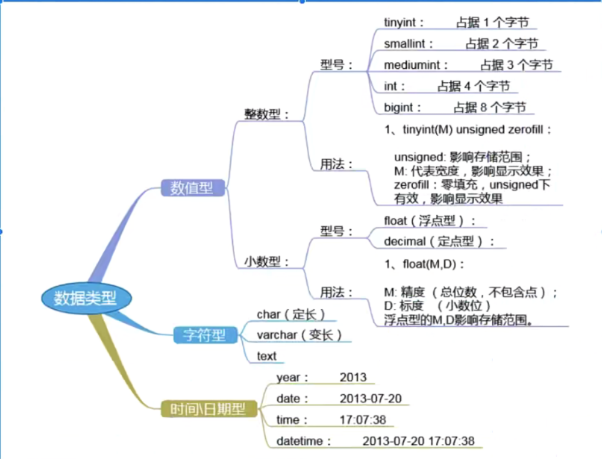

**MySQL 数据类型**

在 MySQL 中，有三种主要的类型：文本、数字和日期/时间类型。



# **1、字符串类型**

- 中文utf8编码一个字符占3个字符

- 中文jbk编码一个字符占2个字符

```javascript
//数据类型		//描述
CHAR(size)		保存固定长度的字符串（可包含字母、数字以及特殊字符）。在括号中指定字符串的长度。最多 255 个字符。
VARCHAR(size)	        保存可变长度的字符串（可包含字母、数字以及特殊字符）。在括号中指定字符串的最大长度。最多255个字符。
                  		注释：如果值的长度大于 255，则被转换为 TEXT 类型。
TINYTEXT		存放最大长度为 255 个字符的字符串。
TEXT		        存放最大长度为 65,535个字符的字符串。
BLOB		        用于 BLOBs (Binary Large OBjects)。存放最多65,535字节的数据。
MEDIUMTEXT		存放最大长度为 16,777,215个字符的字符串。
MEDIUMBLOB		用于 BLOBs (Binary Large OBjects)。存放最多16,777,215字节的数据。
LONGTEXT		存放最大长度为 4,294,967,295 个字符串。
LONGBLOB		用于 BLOBs (Binary Large OBjects)。存放最多4,294,967,295字节的数据。
ENUM(x,y,z,etc.)	枚举类型，许你输入可能值的列表。可以在 ENUM 列表中列出最大65535 个值。如果列表中不存在插入的值，则插入空值。
    			注释：这些值是按照你输入的顺序存储的。可以按照此格式输入可能的值：ENUM(’X','Y','Z')
SET		        与 ENUM类似，SET最多只能包含64个列表项，不过SET 可存储一个以上的值。
```

# **2、数值类型**

```
//数据类型        //描述
//整数类型
TINYINT(size)        -128 到 127 常规。0到 255 无符号*。在括号中规定最大位数。
SMALLINT(size)       -32768 到 32767 常规。0到 65535 无符号*。在括号中规定最大位数。
MEDIUMINT(size)      -8388608 到 8388607 普通。O to 16777215 无符号*。在括号中规定最大位数。
INT(size)            -2147483648 到 2147483647 常规。0到 4294967295 无符号*。在括号中规定最大位数。
BIGINT(size)         -9223372036854775808 到 9223372036854775807 常规。0到 18446744073709551615 无符号*。在括号中规定最大位数。
//浮点数类型
FLOAT(size,d)        带有浮动小数点的小数字。在括号中规定最大位数。在 d参数中规定小数点右侧的最大位数。精度为7位小数。
DOUBLE(size,d)       带有浮动小数点的大数字。在括号中规定最大位数。在 d参数中规定小数点右侧的最大位数。精度为15位小数。
DECIMAL(size,d)      作为字符串存储的DOUBLE类型，允许固定的小数点。
                    
```

*** 这些整数类型拥有额外的选项 UNSIGNED。通常，整数可以是负数或正数。如果
**

**添加 UNSIGNED 属性，那么范围将从 0 开始，而不是某个负数**

# **1、Date 类型**

```
//数据类型        //描述
DATE()            日期。格式：YYYY-MM-DD, 注释：支持的范围是从‘1000-01-01’到 '9999-12-31'
DATETIME()        *日期和时间的组合。格式：YYYY-MM-DD HH:MM:SS,注释：支持的范围是从 '1000-01-01 00:00:00’到 '9999-12-31 23:59:59'
TIMESTAMP()       *时间戳。TIMESTAMP值使用Unix纪元('1970-01-0100:00:00’UTC)至今的描述来存储。格式：YYYY-MM-DDHH:MM:SS
                        注释：支持的范围是从 '1970-01-01 00:00:01’UTC 到'2038-01-09 03:14:07’UTC
TIME()            时间。格式：HH:MM:SS注释：支持的范围是从 '-838:59:59'到 '838:59:59’
YEAR()            2 位或 4 位格式的年。注释：4 位格式所允许的值：1901 到 2155。2 位格式所允许的值：70 到 69，表示从 1970 到 2069
```