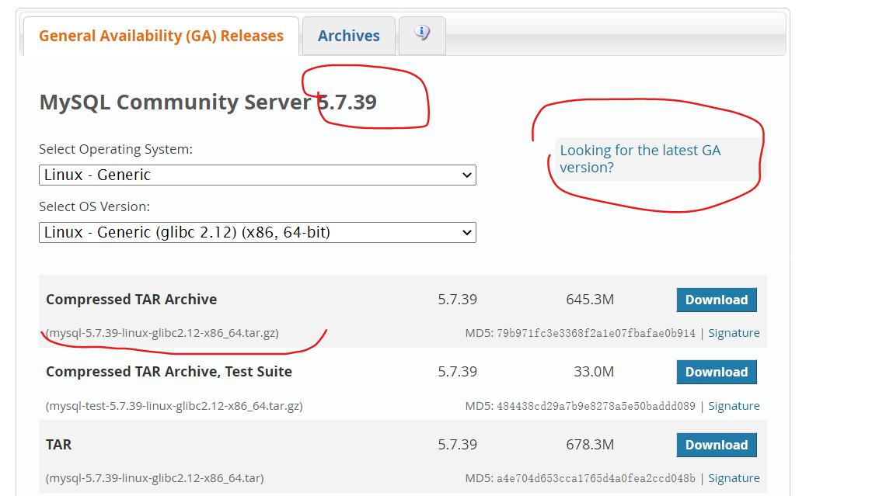
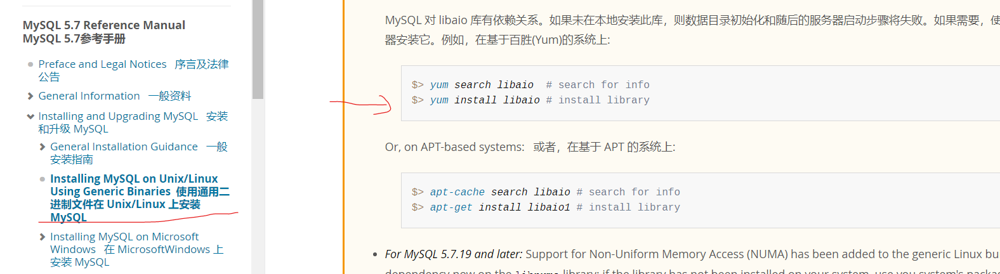
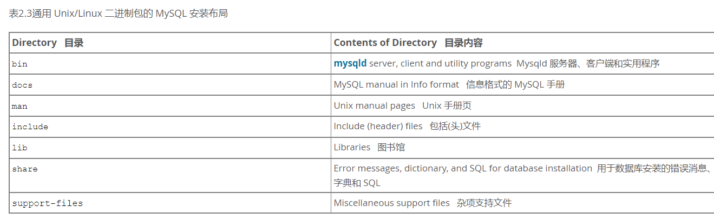

# 3、MySQL的GLIBC.版本安装

## 3.1、获取MySQL GLIBC)版本



## 3.2、学会看官方文档



## 3.3 安装依赖

```
$> yum search libaio  # search for info
$> yum install libaio # install library
```

## 3.4 解压二进制包

```
tar  xf mysql-5.7.39-linux-glibc2.12-x86_64.tar.gz
```



## 3.5 安装需求

- 安装路径		/mysql_3306

- 数据路径		/mysql_3306/data

- 端口号		3306

- 官方提供的方案

要安装和使用 MySQL 二进制发行版，命令序列如下:

```
$> groupadd mysql
$> useradd -r -g mysql -s /bin/false mysql 
$> cd /usr/local
$> tar zxvf /path/to/mysql-VERSION-OS.tar.gz
$> ln -s full-path-to-mysql-VERSION-OS mysql
$> cd mysql
$> mkdir mysql-files
$> chown mysql:mysql mysql-files
$> chmod 750 mysql-files
$> bin/mysqld --initialize --user=mysql    #初始化数据库
$> bin/mysql_ssl_rsa_setup    
$> bin/mysqld_safe --user=mysql &
# Next command is optional
$> cp support-files/mysql.server /etc/init.d/mysql.server
```

## 3.6 开始安装

- 创建mysql专用账号

```
useradd -r -s /sbin/nologin mysql
id mysql
```

- 清空系统中原有的mariadb的配置文件（/etc/my.cnf）

```
rm -f /etc/my.cnf
```

- 把mysql解压后的压缩包(GBLIC版本)移动到/根目录下，然后更名为mysql_3306

```
mv mysql-5.7.39-linux-glibc2.12-x86_64 /mysql_3306
```

- 切换到mysql工作目录/mysql_3306,创建一个mysql--files目录

```
[root@node1 src]#cd /mysq1_3306/
[root@node1 mysq1_3306]#mkdir mysql-files
[root@node1 mysq1_3306]#chown mysql:mysql mysql-files
[root@node1 mysq1_3306]#chmod 750 mysql-files
#说明：
#    mysql-files目录为secure_file-priv系统变量提供一个位置，该位置将导入和导出操作限制到特定目录。
```

- 初始化数据库（可以实现数据库的初始化，而且会产生一个随机密码)

```
bin/mysqld --initialize --user=mysql --basedir=/mysql_3306
选项说明：
--initialize        #初始化（真正开始干活）
--user=mysql        #以mysql用户的身份初始化数据库，产生文件都是mysq1作为拥有者
--basedir    #mysql其安装目录，非常重要
#运行完毕后，观察最后一行，保存「o0t账号的密码，以备后期使用。
2020-08-24T06:46:24.889735Z 1 [Note]A temporary password is generated for root@localhost:(cn_jS+*n2wh
```

- 设置安全加密连接(SSL),数据传输会采用加密形式，适合敏感数据

```
bin/mysql_ssl_rsa_setup --datadir=/mysql_3306/data
```

- 启动配置

```
cp support-files/mysql.server /etc/init.d/mysql
```

```
vim /etc/init.d/mysql    
basedir=/mysql_3306            #46行
datadir=/mysql_3306/data
```

- 启动MySQL数据库（不能使用systemctl,只能使用service)

```
service mysql start
Starting MySQL.Logging to '/mysql_3306/data/server1.err'.
 SUCCESS!            #启动成功
```

## 3.7 更改初始密码

- 使用刚才系统生成的随机密码

```
mysqladmin -uroot password "123"  -p [系统生成的随机密码]  #将root密码改成123
```

# 4、软件的安装常见问题答疑

## 问题1：为什么一定要删除/etc/my.cnf文件，不删除有何影响？

## 问题2：mysql-files文件夹到底干什么的？

## 问题3：到底怎么判断数据库是否初始化成功了？

## 问题4：为什么一定要把mysql.server放在/etc/init.d目录下，不放行不行？

## 问题5：为什么一定要改变/etc/init.d/mysql_3306中的basedir与datadir?

## 问题6：如何让mysql自动启动？

```
chkconfig --list                查询系统中的所有开机启动项
chkconfig --add mysq1_3306      必须与/etc/init.d目录下的脚本名称一致
chkconfig mysq1_3306 on         把2345四种模式全部开启(3字符界面，5图形界面)
```

# 5、MySQL GLIBC版本后续配置

- 把mysql客户端命令添加到环境变量，以后随时可以访问

```
echo export PATH=$PATH:/mysq1_3306/bin >> /etc/profile
source /etc/profile
设置完成后，我们可以在任意位置调用mysq1客户端命令
```

-  第三步：手工定义MySQL的配置文件（非常重要）

```shell
vim  /mysql_3306/my.cnf
[mysqld]
basedir=/mysql_3306
datadir=/mysql_3306/data
socket=/tmp/mysql.sock
validate_password=OFF        #关闭密码强度检测
#选项说明：
[mysqld]    代表针对服务器瑞进行配置
basedir    代表数据库的安装目录
datadir    代表数据目录，以后专门用于存放数据文件的（核心目录）
socket    代表套接字文件，专门为客户端与服务器端连接提供一个桥梁
```

- 第四步：安全配置（对于生产环境比较重要

```
mysql_secure_installation
```

一路Y,搞定！