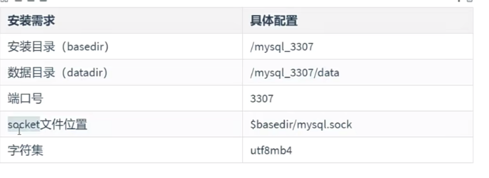

# 1、参考MySQL源码安装官方文档

官方文档：[https://dev.mysql.com/doc/refman/5.7/en/source-configuration-options.html](https://dev.mysql.com/doc/refman/5.7/en/source-configuration-options.html) 源

**码安装三步曲：配置一一>编译一一>安装**

## 1.1 软件包介绍

```
mysql-boost-5.7.31.tar.gz        #可在任意发行版的Linux下安装
```

## 1.2 安装需求



## 1.3 常用配置选项

| 配置选项	 | 描述	 | 默认值	 | 	建议值 | 
| -- | -- | -- | -- |
| CMAKE INSTALL PREFIX | 安装基目录(basedir) | /usr/local/mysql | 根据需求 | 
| MYSQL_DATADIR | 数据目录(datadir) | $basedir/data | 根据需求 | 
| SYSCONFDIR | 默认配置文件my.cnf路径 |   | /etc | 
| MYSQL_TCP_PORT | TCP/IP端口 | 3306 | 非默认端口 | 
| MYSQL_UNIX_ADDR | 套接字socket文件路径 | /tmp/mysql.sock | $basedir/ | 
| DEFAULT_CHARSET | 默认字符集 | latin1 | utf8mb4 | 
| DEFAULT_COLLATION | 默认校验规则 | latin1_swedish_ci | utf8mb4_general_ci | 
| WITH_EXTRA_CHARSETS | 扩展字符集 | all | all | 
| ENABLED_LOCAL_INFILE | 是否启用本地加载外部数据文件功能 | OFF | 建议开启 | 
| WITH_SSL | SSL支持类型 | system | 建议显式指定 | 
| WITH_BOOST | Boost库源代码的位置 |   | Boost库是构建MySQL所必需的，建议事先下载 | 


- 存储引擎相关配置项

**说明：**

以下选项值均为布尔值，0或1；0代表不编译到服务器中，1代表编译，建议都静态编译到服务器中。

其他的存储引擎可以根据实际需求在安装时通过WITH_xxxx_STORAGE_ENGINE=1的方式编译到服务器中

| 配置选项 | 描述 | 
| -- | -- |
| WITH INNOBASE STORAGE ENGINE | 将lnnoDB存储引擎插件构建为静态模块编译到服务器中；建议编译到服务器中 | 
| WITH_PARTITION_STORAGEENGINE | 是否支持分区 | 
| WITH_FEDERATED_STORAGE_ENGINE | 本地数据库是否可以访问远程mysq数据 | 
| WITH_BLACKHOLE_STORAGE_ENGINE | 黑洞存储引擎，接收数据，但不存储，直接丢弃 | 
| WITH_MYISAM_STORAGE_ENGINE | 将MYISAM存储引擎静态编译到服务器中 | 


# 2、MySQL的源码编译安装

## 2.1 安装依赖库

```
yum -y install ncurses-devel cmake libaio-devel openssl-devel gcc gcc-c++ bison
```

## 2.2 上传软件到服务器端

```
ll mysql-boost-5.7.39.tar.gz 
-rw-r--r-- 1 root root 53243335 8月   8 13:52 mysql-boost-5.7.39.tar.gz
```

## 2.3 解压

```
tar xf mysql-boost-5.7.39.tar.gz
```

## 2.4 临时扩大交换分区

- 为了避免在编译过程中，交换分区不够用导致编译失败的情况，临时扩大交换分区。

```
 dd if=/dev/zero of=/swapfile bs=1M count=2048        # 1 * 2048 = 2048 创建 2 g 的内存分区
 mkswap /swapfile
 swapon /swapfile
# free -m    #可以查看内存使用
```

## 2.5 编辑配置脚本

```
[root@node1 mysql-5.7.31]# vim myconfig.sh
cmake . -DCMAKE_INSTALL_PREFIX=/usr/local/mysql \
-DMYSQL_DATADIR=/usr/local/mysql/data \
-DMYSQ_TCP_PORT=3306 \
-DMYSQL_UNIX_ADDR=/usr/local/mysql/mysql.sock \
-DWITH_INNOBASE_STORAGE_ENGINE=1 \
-DWITH_PARTITION_STORAGE_ENGINE=1 \
-DWITH_FEDERATED_STORAGE_ENGINE=1 \
-DWITH_BLACKHOLE_STORAGE_ENGINE=1 \
-DWITH_MYISAM_STORAGE_ENGINE=1 \
-DENABLED_LOCAL_INFILE=1 \
-DEXTRA_CHARSETS=all \
-DDEFAULT_CHARSET=utf8mb4 \
-DDEFAULT_COLLATION=utf8mb4_general_ci \
-DWITH_SSL=system \
-DWITH_BOOST=/mysql/boost \
-DDOWNLOAD_BOOST=1    #（如果已经下载好，则不用再次下载）
选项说明：
-DCMAKE_INSTALL PREFIX：   安装路径
-DMYSQL_DATADIR:           数据目录
-DMYSQL_TCP_PORT:          端口号
-DMYSQL_UNIX_ADDR：        套接字文件位置
```

## 2.6 编译安装

```
# make -j2 && make install
选项说明：
-j2 ：代表同时开启多个线程共同实现编译操作，可以先检查一下自己的服务器的逻辑处理器数量
```

- 如果编译出错，要从新编译，需要删除缓存文件

```
make clean
rm  -f CMakeCache.txt
```

- **2.7 删除临时缓存分区**

```
swapoff /swapfile
 rm -fr  /swapfile
```

# 3、MySQL数据库初始化

- 删除系统自带的my.cnf文件

```
rm -f /etc/my.cnf
#如果不删除，系统就会使用这个文件，但是这个文件对我们来说没用，因为它是给mariadb用的，但我这是mysql,所以用了就会出错。
```

- 注意，进入到安装目录里面/mysql_3306

```
cd /mysql_3306/
```

- 创建mysql-files目录,并授权

```
创建系统变量'secure_file_priv'限制导入导出目录并修改权限
mkdir mysql-files
useradd -r -s /sbin/nologin mysql 
chown -R mysql:mysql /mysq1_3307
chmod 750 mysql-files
```

- 数据库初始化操作

```
bin/mysqld --initialize --user=mysql --basedir=/mysql_3306 
。。。。
2022-08-08T10:47:25.529204Z 1 [Note] A temporary password is generated for root@localhost: bC*-!56J7pca
    #随机密码：bC*-!56J7pca
   rjMIreiDA8!e
```

# 4、 启动数据库

- 拷贝mysal.server脚本到/etc/init.d目录， 然后启动数据库

```
cp support-files/mysql.server /etc/init.d/mysqld
```

- 启动数据库

```
service mysqld start    
```

- 添加环境变量

```
echo "export PATH=$PATH:/mysql_3306/bin" >> /etc/profile
source /etc/profile
```

# 5、更改初始密码

```
mysqladmin -u root password "123" -p
#如果登录不上去，就直接使用找回root的密码的方法。
    - service mysqld restart --user --skip-grant-tables    #跳过授权表，启动
    -mysql
    >> update mysql.user set authentication_string=password("123") where user="root";
    >> flush privileges
    >> exit
    -service mysql restart 重启
```

# 6、后续可选配置

- 安全配置

```
bin/mysql_secure_installation
# 一路Y
```

- 开启自启

```
chkconfig --add mysqld
chkconfig mysqld on
chkconfig --list
```

# 7、常见问题解决方法。