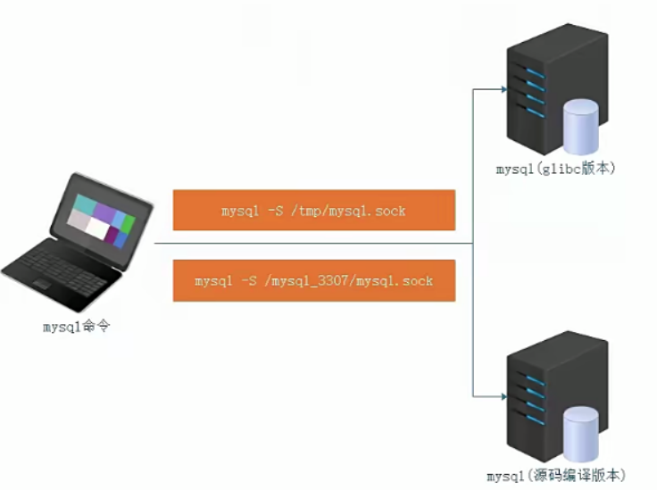

# 1、客户端工具mysql使用

```
mysql: mysql命令行工具，一般用来连接访问mysql数据库
#选项                     说明
-u,--user=name           指定登录用户名
-p,--password            指定登录密码(注意是小写p),一定要放到最后面
-h,--host=name           指定数据库的主机地址
-P,--port=XXX            指定数据库的端口号(大写P)
-S,--socket=name         指定socket文件
-e, --execute=name       使用非交互式操作(在shelt终端执行sq[语句)
```

- 案例：使用mysql客户端工具连接服务器端（用户名:root、密码：123）

```
mysql -uroot -p123
```

- 案例：连接10.1.1.100服务器上的MySQL数据库（用户名：itheima，密码： 123)

```
mysql -h 10.1.1.100-P3306 -uitheima -p
Enter password:123
```



- 案例：在不进入MySQL内部的情况下，执行SQL语句，获取数据信息

```
mysql -e "show databases;" -uroot -p
```

| information_schema | 对象信息数据库，提供对数据库元数据的访问，有关MySQL服务器的信息，例如数据库或表的名称，列的数据类型或访问权限等； | 
| -- | -- |
| mysql  | mysql数据库是 系统数据库。它包含存储MySQL服务器运行时所需的信息的表。比如权限表、对象信息表、日志系统表、时区系统表、优化器系统表、杂项系统表等。 | 
| performance_schema | MySQL5.5开始新增一个数据库，主要用于 收集数据库服务器性能；并且库里表的存储引|擎均PERFORMANCE_SCHEMA，而用户是不能创建存储引擎为PERFORMANCE_SCHEMA的表 | 
| sys | mysql5.7增加了sys系统数据库，通过这个库可以快速的了解系统的元数据信息； | 


# 2、客户端工具mysqladmin

- 常用选项

```
#选项                    #描述
-h,--host=name        指定连接数据库主机
-p,--password         指定数据库密码
-P(大),--port=#       指定数据库端口
-S,--socket=name      指定数据库socket文件
-u,--user=name        指定连接数据库用户
```

- 常用命令

| 命令 | 描述 | 
| -- | -- |
| password [new-password] | 更改密码 | 
| reload | 刷新授权表 | 
| shutdown | 停止mysql服务 | 
| status | 简短查看数据库状态信息 | 
| start-slave | 启动slave | 
| stop-slave | 停止slave | 
| variables | 打印可用变量 | 
| version | 查看当前mysq|数据库的版本信息 | 


- 案例：更改root账号的密码为root

```
mysqladmin password "新密码’ -p
    >>Enter password:'旧密码*
mysqladmin reload -p    #刷新授权表
    >> Enter password: "新密码"
```

- 案例：停止mysql

```
mysqldadmin shutdown -p        #停止数据库
```

- 案例:查看mysq|状态

```
mysqladmin status -p
    >> Enter password:123
```

- 案例:查询mysql版本

```
mysqladmin version -p
```

# 3、MySQL中的SQL语句

## 3.1、SQL语句的分类

- DDL(Data Definition Language)语句 |

- **数据定义语言**，这些语句定义了不同的数据段、数据库、表、列、索引等数据库对象的定义。常用的语句关键字主要包括 create、drop、alter、rename、truncate。

-  DML(Data Manipulation Language)语句:

- **数据操纵语句****，**用于添加、删除、更新和查询数据库记录,并检查数据完整性,常用的语句关键字主要包括 insert、delete、update等。

- DCL(Data Control Language)语句:

- **数据控制语句**，用于控制不同数据段直接的许可和访问级别的语句。这些语句定义了数店车 表 IF口口口不X[]R 口 天包括grant revoke等。

- DQL(Data Query Language)语句:

- 数据查询语句，用于从一个或多个表中检索信息。主要的语句关键字包括select

# 4、数据库(database)的基本操作

## 4.1 创建数据库

- 创建db1库

```
create database db1;
```

- 创建db1库并指定默认字符集

```
create database db1 default charset gbk;
```

如果不存在就创建数据库db1。

```
create database if not exists db1 default charset utf8;
说明：不能创建相同名字的数据库！
```

## 4.2 查询数据库

- 显示所有数据库

```
mysql> show databases;
```

- 显示某个数据库的数据结构

```
mysql> show create database db_itheima;
```

## 4.3 修改数据库信息

- 案例：把db_itheima数据库的编码格式更改为gbk

```
mysql> alter database db_itheima default charset=gbk;
```

## 4.4 删除数据库

- 案例: 删除db_itheima数据库

```
mysql> drop database db_itheima;
```

# 5、数据表(table)的基本操作

## 5.1创建数据表

```
mysql> create table 数据表名称(
字段1  字段类型 【字段约束】，
字段2  字段类型 【字段约束】,
);
mysql> create table tb_admin(
id tinyint,
username varchar(20),
password char(32)
) engine=innodb default charset=utf8;    #默认使用innodb的引擎，和utf8字符编码
```

- 根据已经存在的表，创建新的表：

```
create table table1 like table2;
#创建出的table1和table2有相同的字段和约束
```

## 5.2字段约束：

```
primary key        #主键
foreign key        #外键
auto_increment     #自动增长
not null           #不能为空
unique             #不能重复
```

### 5.2.1 删除主键约束

```
alter table table_name drop primary key;
```

### 5.2.2 修改字段约束

```
alter table table_name modify username not null    #将username字段的约束修改为not null
```

## 5.2 查询数据表

- 显示所有数据表（当前数据库)

```
mysql> use 数据库名称；
mysql> show tables;
```

- 显示数据表的创建过程（编码格式、字段等信息）

```
mysql> show create table 数据表名称;    #显示表的创建过程
或
mysql> desc 数据表名称；        #显示编码格式，字段信息
```

## 5.3修改数据表（命令前缀：alert table 表名称）

### 5.3.1 添加字段

- 基本语法:

```
mysql> alter table 数据表名称 add 新字段名称 字段类型 first|after 其他字段名称;
选项说明：
first：把新添加字段放在第一位
after 字段名称：把新添加字段放在指定字段的后面
```

- 案例: 在tb_article文章表中添加一个addtime字段，类型为date(年一月-日)

```
mysql> alter table tb_article add addtime date after content;
```

### 5.3.2修改字段名称或字段类型

- 修改字段名称与字段类型（也可以只修改名称）

```
mysql> alter table tb-admin change username user varchar(20) #将tb-admin表中的username字段名修改为user,并将类型修改为varchar(20)
```

- 仅修改字段的类型

```
mysql> alter table tb_admin modify user varchar(20);
```

### 5.3.3 删除某个字段

```
mysql> alter table tb_article drop 字段名称;    
```

### 5.3.4 修改数据表引擎（MyISAM或InnoDB）

```
mysql> alter table tb_article engine=myisam；
mysql> show create  table tb_article;
```

### 5.3.5修改数据表编码格式

```
mysql> alter table tb_admin default charset=gbk;
mysql> show create table tb_admin;
```

### 5.3.6 修改数据表的名称

```
#移动表到另一个库里并重命名
rename table db01.t1 to db02.t11;
或者
alter table dbe1.t1 rename db02.t11;
#只重命名表名不移动
rename table tt1 to tt2;
或者
alter table tt1 rename tt2;
```

### 5.3.6 删除数据表

```
mysql> drop table 表名称;
```

# 6、表记录的基本操作

## 6.1 添加纪录

```
mysql> insert into 表名称(字段1，字段2，字段3....) values (字段1的值，字段2的值，字段3的值。。。)
或
mysql> insert into 表名称 values (字段1的值，字段2的值，字段3的值。。。)
```

案例：向book表中添加id(primary key auto_incremenr),name,price.

```
insert into book(id,name,price) values (null,"数据结构",56);
或
insert into book values (null,"数据结构",56)
```

### **6.1.1 将表 a2 的数据复制到表 a1**

```
Mysql>insert into a1 (id,name) select id,name from a2;    #查询 a2 值，并写入到 a1Mysql>select * from a1;
```

## 6.2 查询记录

- 基本语法:

```
mysql> select * from 数据表名称[where查询条件];
mysql> select id,username,age from 数据表名称 [where 查询条件];
```

- 案例：查询tb_user表中的所有记录

```
mysql> select * from tb_user;
```

- 案例：查询tb_user表中的id, username以及age字段中对应的数据信息

```
mysql> select id,username,age from tb_user;
```

- 案例：只查询id=2的小伙伴信息

```
mysql> select * from tb_user where id=2;
```

- 案例：查询年龄大于23岁的小伙伴信息

```
mysql> select * from tb_user where age>23;
```

## 6.3 修改纪录

- 基本语法

```
uopdate 表名称 set 字段名="新内容" where 条件
```

案例：book表中name=python的price改成76

```
update book set price=76 where name="python"
```

## 6.4 删除纪录

- 基本语法:

```
mysql> delete from 数据表名称 [where 删除条件];
```

- 案例: 删除tb_user表中，id=1的用户信息

```
mysql> delete from tb_user where id=1;
```

## 6.5清空全部记录

- delete from与truncate清空数据表操作

```
mysql> delete from 数据表;
或
mysql> truncate  数据表；
```

delete from与truncate区别在哪里?

- delete：删除 数据记录

- 数据操作语言（DML）

- 在事务控制里，DML语句要么commit，要么rollback

- 删除大量记录速度慢，只删除数据不回收高水位线

- 可以 带条件 删除

- 这个方法，本质上还是修改纪录，它是一条一条删除的，所以很慢。

- truncate: 删除 所有数据记录

- 数据定义语言（DDL）

- 不在 事务控制里，DDL语句执行前会提交前面所有未提交的事务

- 清里大量数据 速度快，回收高水位线（high water mark)

- 不能带条件删除

- 这个方法，就可以直接理解为格式化数据表了，相当于重新写入表结构了，

- 那么原来的数据当然一下子全消失了。所以很快。

# 7、自动增长(水位线)与主键约束

## 7.1自动增长（对某个字段进行自动编号)

```
mysql> create table tb_user(
id int not null auto_increment,    #不能为空，并且自动增长
username varchar(20),
age tinyint unsigned,
gender enum('男’，保密'）,
address varchar(255)
) engine=innodb default charset=utf8;
```

## 7.2 主键约束(非空，唯一)

```
create table tb_user(
id int not null auto_increment primary key,    #主键，并且自动增长
username varchar(20),
age tinyint unsigned,
gender enum( 男’，'保密'）,
address varchar(255)
)engine=innodb default charset=utf8;
```