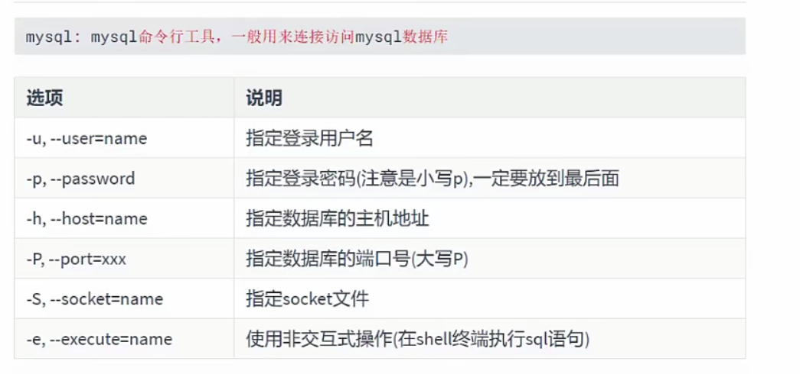
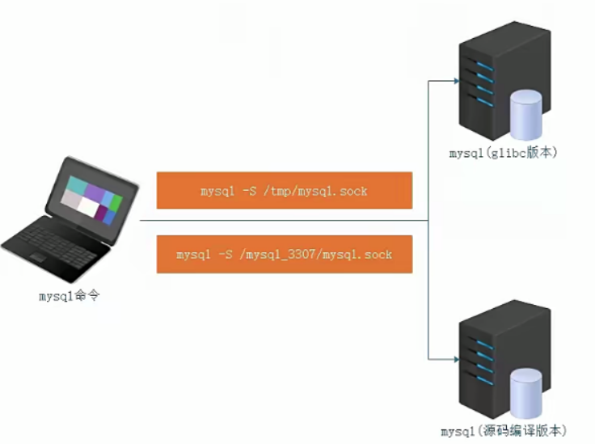
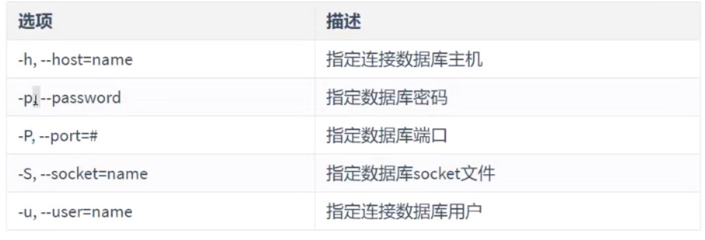

 

**MySQL 数据库- 操作基础**

MySQL 官网：[https://www.mysql.com/](https://www.mysql.com/)



# **1、MySQL 常见版本
**

⚫ MySQL Community Server 社区版本，开源免费，但不提供官方技术支持。

⚫ MySQL Enterprise Edition 企业版本，需付费，可以试用 30 天。

⚫ MySQL Cluster 集群版，开源免费。可将几个 MySQL Server 封装成一个 Server。

⚫ MySQL Cluster CGE 高级集群版，需付费

# **2、MySQL 安装 部署
**

MySQL：MySQL 客户端程序

MySQL-Server：MySQL 服务器端程序



## **2.1 源代 编译安装 ：
**

编译工具：configure、cmake、make

数据库常用的配置选项

```javascript
-DCMAKE_INSTALL_PREFIX=/PREFIX		----指定安装路径（默认的就是/usr/local/mysql）
-DMYSQL_DATADIR=/data/mysql 		----mysql 的数据文件路径
-DSYSCONFDIR=/etc 				----配置文件路径
-DWITH_INNOBASE_STORAGE_ENGINE=1 		----使用 INNOBASE 存储引擎
-DWITH_READLINE=1 				----支持批量导入 mysql 数据
-DWITH_SSL=system 				----mysql 支持 ssl
-DWITH_ZLIB=system 			----支持压缩存储
-DMYSQL_TCP_PORT=3306 			----默认端口 3306
-DENABLED_LOCAL_INFILE=1 			----启用加载本地数据
-DMYSQL_USER=mysql 			----指定 mysql 运行用户
-DMYSQL_UNIX_ADDR=/tmp/mysql.sock 		----默认套接字文件路径
-DEXTRA_CHARSETS=all 			----是否支持额外的字符集
-DDEFAULT_CHARSET=utf8 			----默认编码机制
-DWITH_DEBUG=0 				----DEBUG 功能设置
```

## **2.3 常见资料 ：
**

服务：mysqld 				端口：3306

主配置文件：/etc/my.cnf 		初始化脚本：mysql_install_db

启动命令：mysqld_safe 		数据目录 ：

套接字文件：





进程文件：



# 3、客户端工具mysql使用



- 案例：使用mysql客户端工具连接服务器端（用户名:root、密码：123）

```
mysql -uroot -p123
```

- 案例：连接10.1.1.100服务器上的MySQL数据库（用户名：itheima，密码： 123)

```
mysql -h 10.1.1.100-P3306 -uitheima -p
Enter password:123
```



- 案例：在不进入MySQL内部的情况下，执行SQL语句，获取数据信息

```
mysql -e "show databases;" -uroot -p
```

| information_schema | 对象信息数据库，提供对数据库元数据的访问，有关MySQL服务器的信息，例如数据库或表的名称，列的数据类型或访问权限等； | 
| -- | -- |
| mysql  | mysql数据库是 系统数据库。它包含存储MySQL服务器运行时所需的信息的表。比如权限表、对象信息表、日志系统表、时区系统表、优化器系统表、杂项系统表等。 | 
| performance_schema | MySQL5.5开始新增一个数据库，主要用于 收集数据库服务器性能；并且库里表的存储引|擎均PERFORMANCE_SCHEMA，而用户是不能创建存储引擎为PERFORMANCE_SCHEMA的表 | 
| sys | mysql5.7增加了sys系统数据库，通过这个库可以快速的了解系统的元数据信息； | 


# 4、客户端工具mysqladmin

- 常用选项



- 常用命令

| 命令 | 描述 | 
| -- | -- |
| password [new-password] | 更改密码 | 
| reload | 刷新授权表 | 
| shutdown | 停止mysql服务 | 
| status | 简短查看数据库状态信息 | 
| start-slave | 启动slave | 
| stop-slave | 停止slave | 
| variables | 打印可用变量 | 
| version | 查看当前mysq|数据库的版本信息 | 


- 案例：更改root账号的密码为root

```
mysqladmin password "新密码’ -p
    >>Enter password:'旧密码*
mysqladmin reload -p    #刷新授权表
    >> Enter password: "新密码"
```

- 案例：停止mysql

```
mysqldadmin shutdown -p        #停止数据库
```

- 案例:查看mysq|状态

```
mysqladmin status -p
    >> Enter password:123
```

- 案例:查询mysql版本

```
mysqladmin version -p
```

# **5. 创建和删除用户**

## **5.1 创建用户**

- **基本语法：**

```
mysql> create user‘用户名'@'被允许连接的主机名称或主机的IP地址”identified by '用户密码 ;
mysql> select user,host from mysql.user;
```

- 用户主机表示方式

```
user@'localhost'        表示user只能在本地通过socket登录数据库
user@'192.168.0.1'      表示user用户只能在192.168.0.1登录数据库
user@'192.168.0.0/24'   表示user用户可以在该网络任意的主机登录数据库
user@'%'                表示user用户可以在所有的机器上登录数据库；本机为匿名用户
```

### 5.1.1 使用grant创建用户，并授权

```
mysql> grant all on aa.a1 to abc@‘%’ identified by ‘123456’； 	#创建用户并授权
mysql> flush privileges;
```



## 5.2 删除用户

- 基本语法:

```
mysql> drop user '用户名'@'主机名称或主机的IP地址 ' ;
```

- 特别说明：

- 如果在删除用户时没有指定主机的名称或主机的IP地址，则默认删除这个账号的所有信息。

- 案例: 删除tom这个账号

```
mysql> drop user 'tom'@'localhost';
```

- 案例：删除jack这个账号

```
mysql> drop user 'jack'@'10.1.1.%";
```

- **扩展：删除MySQL账号的另外一种方式**

```
mysql> delete from mysql.user where user='root' and host='%';
mysql> flush privileges;
```

# 6、用户名及登录ip修改

特别说明：MySQL用户重命名通常可以更改两部分，一部分是用户的名称，一部分是被允许访问的主机名称或主机的IP地址。

- 基本语法:

```
mysql> rename user 旧用户信息 to 新用户信息；
```

- 案例：把用户'root'@"%"更改为'root'@"10.1.1.%*

```
mysql> rename user 'root'@'%" to 'root'@'10.1.1.%";
```

- 案例：把'tom'@'localhost"更名为"harry"@"localhost*

```
mysql> create user 'tom'@'localhost' identified by '123';
mysql> rename user 'tom'@'localhost' to 'harry'@'localhost';
```

- **扩展：使用update语句更新用户信息**

```
mysql> update mysql.user set user='harry',host='localhost' where user='tom* and host='localhost';
mysql> flush privileges;
```

# 7、权限管理

## 7.1 权限说明

所有权限说明[https://dev.mysql.com/doc/refman/5.7/en/privileges-provided.html](https://dev.mysql.com/doc/refman/5.7/en/privileges-provided.html)

```
USAGE    无权限，只有登录数据库，只可以使用test或test_*数据库
ALL      所有权限
以下权限为指定权限
select/update/delete/super/replication slave/reload...
with grant option 选项表示允许把自己的权限授予其它用户或者从其他用户收回自己的权限
```

### 7.1.2权限表

| Privilege | Grant Table Column | Context | 
| -- | -- | -- |
|   | Synonym for “all privileges” | Server administration               服务器管理 | 
|   | Alter_priv | Tables                                       数据库表 | 
|   | Alter_routine_priv | Stored routines                          储存日常事务 | 
|   | Create_priv | Databases, tables, or indexes   数据库、表或索引 | 
|   | Create_routine_priv | Stored routines                     储存日常事务 | 
|   | Create_tablespace_priv | Server administration            服务器管理 | 
|   | Create_tmp_table_priv | Tables                                    数据库表 | 
|   | Create_user_priv | Server administration             服务器管理 | 
|   | Create_view_priv | Views                                     视图 | 
|   | Delete_priv | Tables                                     数据库表 | 
|   | Drop_priv | Databases, tables, or views   数据库、表或视图 | 
|   | Event_priv | Databases                               资料库 | 
|   | Execute_priv | Stored routines                       储存日常事务 | 
|   | File_priv | File access on server host      服务器主机上的文件访问 | 
|   | Grant_priv | Databases, tables, or stored routines  数据库、表或存储例程 | 
|   | Index_priv | Tables                             数据库表 | 
|   | Insert_priv | Tables or columns          表或列 | 
|   | Lock_tables_priv | Databases                      数据库 | 
|   | Process_priv | Server administration      服务器管理 | 
|   | See  | Server administration      服务器管理 | 
|   | References_priv | Databases or tables        数据库或表 | 
|   | Reload_priv | Server administration      服务器管理 | 
|   | Repl_client_priv | Server administration      服务器管理 | 
|   | Repl_slave_priv | Server administration      服务器管理 | 
|   | Select_priv | Tables or columns           表或列 | 
|   | Show_db_priv | Server administration      服务器管理 | 
|   | Show_view_priv | Views                              视图 | 
|   | Shutdown_priv | Server administration     服务器管理 | 
|   | Super_priv | Server administration      服务器管理 | 
|   | Trigger_priv | Tables                              数据库表 | 
|   | Update_priv | Tables or columns           表或列 | 
|   | Synonym for “no privileges” | Server administration      服务器管理 | 


## 7.2 权限的保存位置

```
mysql.user            所有mysql用户的账号和密码，以及用户对全库全表权限（*.*）
mysql.db              非mysql库的授权都保存在此(db.*）
mysql.table_priv      某库某表的授权(db. table)
mysql.columns_priv    某库某表某列的授权(db.table.col1)
mysql.procs_priv      某库存储过程的授权
```

## 7.3 用户授权

- 基本语法:

```
mysql> grant 权限1,权限2 on 库.表 to 用户@主机
mysql> grant 权限(字段1,字段2....）on 库.表 to 用户@主机
```

- 案例: 给tom账号分配db_itheima的查询权限

```
mysql> grant select on db_itheima.* to 'tom'@'localhost';
mysql> flush privileges;
```

- 案例: 给tom账号分配db_itheima.tb_student数据表的权限（要求只能更改age字段)

```
mysql> grant update(age) on db_itheima.tb_student to 'tom'@'localhost';
mysql> flush privileges;
```

- 案例：添加一个root@%账号，然后分配所有权限

```
mysql> create user 'root'@'%" identified by '123';
mysql> grant all on * .* to 'root'@'%";
mysql> flush privileges;
```

## 7.4 查询用户权限

- 查询当前用户权限

```
mysql> show grants;
```

- 查询其他用户权限

```
mysql> show grants for '用户名称"@"授权的主机名称或IP地址”;
```

## 7.5 with grant option 选项

with grant option选项作用：代表此账号可以为其他用户下发权限，但是下发的权限不能超过自身权限。

```
mysql> grant all on * .* to 'amy'@'10.1.1.%" identified by '123' with grant option;
mysql> grant all on * ,* to 'harry'@'10.1.1.%' identified by '123';
```

- 如以上命令所示：

- amy拥有下发权限的功能，而harry不具备下发权限的功能。

- 如果grant授权时没有with grant option选项，则其无法为其他用户授权。

## 7.6 回收权限

- 基本语句：

```
revoke 权利 on 数据库.表 from 用户名@"登录ip";
```

```
Mysql>revoke drop,delete on aa.a1 from abc@‘%’；	#取消删除权限（登录 abc 测试）
Mysql>flush privileges;
Mysql>show grants for abc@‘%’； 			#查看指定用户的授权
Mysql>show grants for atguigu@‘%’；
```

## 7.7 创建用户并授权

```sql
mysql> grant all on aa.a1 to abc@‘%’ identified by ‘123456’； 	#创建用户并授权
mysql> flush privileges;
```

# 8、**更改密码**

## **4）用户为自己更改密码
**

```javascript
mysql>set password=password（‘123456’）;
```

## **5）root 用户为其他用户找回密码
**

```javascript
mysql>set password for atguigu@‘%’=password(‘123123’);
```

## **6）root 找回自己的密码并修改
**

关闭数据库，修改主配置文件（/etc/my.cnf）添加：skip-grant-tables

```javascript
# vim /etc/my.cnf
skip-grant-tables
```

启动数据库，空密码登录并修改密码

```javascript
update mysql.user set password=password(‘新密码’) where user=’root’;
```

删除 skip-grant-tables,重启数据库验证新密码
