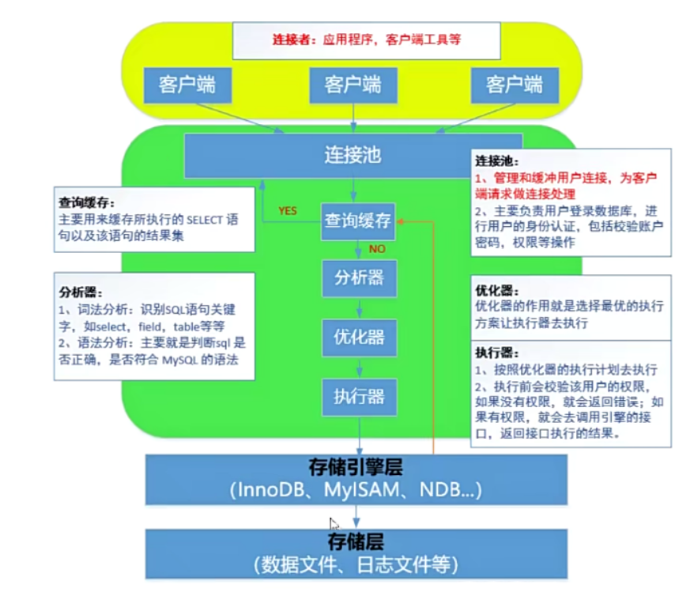
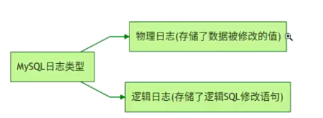
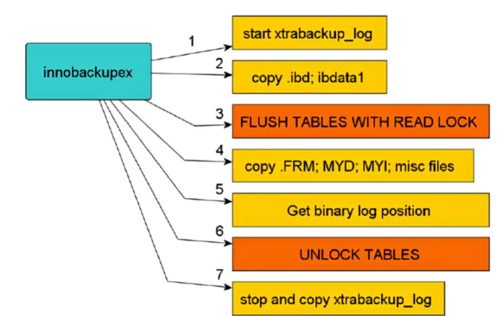
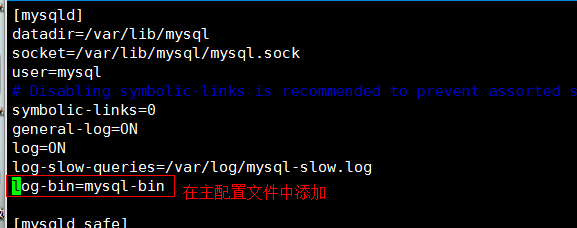
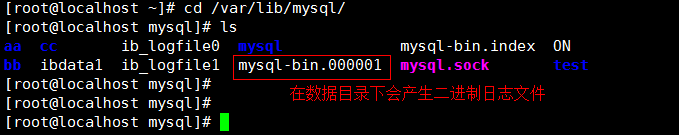
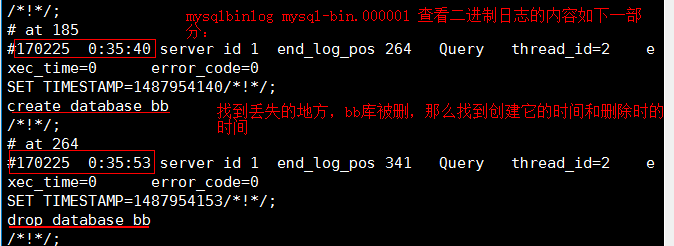
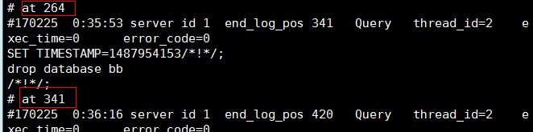

# 1、关于数据保存要知道

- 思考：备份和冗余有什么区别？

**备份：**

**冗余：**

# 2、备份什么

数据库：一堆物理文件的集合；日志文件(二进制日志)+数据文件+配置文件

- ①数据文件

- ②配置文件=>my.cnf

- ③ 日志文件 (主要是二进制日志文件）

# 3、mysql的体系结构和存储引擎

扩展：MYSQL 体系结构(MySQL => DBMS软件到底是由哪些层构成的）



存储引擎层: 简单来说，就是数据的存储方式。在MySQL中，我们可以使用 show engines 查看当前数据库版本支持哪些引擎，常见的数据存储引擎：InnoDB、MyISAM、NDB...

```
mysql> show engines;
+--------------------+---------+----------------------------------------------------------------+--------------+------+------------+
| Engine             | Support | Comment                                                        | Transactions | XA   | Savepoints |
+--------------------+---------+----------------------------------------------------------------+--------------+------+------------+
| MRG_MYISAM         | YES     | Collection of identical MyISAM tables                          | NO           | NO   | NO         |
| CSV                | YES     | CSV storage engine                                             | NO           | NO   | NO         |
| InnoDB             | DEFAULT | Supports transactions, row-level locking, and foreign keys     | YES          | YES  | YES        |
| BLACKHOLE          | YES     | /dev/null storage engine (anything you write to it disappears) | NO           | NO   | NO         |
| MyISAM             | YES     | MyISAM storage engine                                          | NO           | NO   | NO         |
| PERFORMANCE_SCHEMA | YES     | Performance Schema                                             | NO           | NO   | NO         |
| ARCHIVE            | YES     | Archive storage engine                                         | NO           | NO   | NO         |
| MEMORY             | YES     | Hash based, stored in memory, useful for temporary tables      | NO           | NO   | NO         |
| FEDERATED          | NO      | Federated MySQL storage engine                                 | NULL         | NULL | NULL       |
+--------------------+---------+----------------------------------------------------------------+--------------+------+------------+
9 rows in set (0.00 sec)
```

- 常见面试题：请简述MySQL的MyISAM引|擎与InnoDB引擎的区别

1. MyISAM引|擎：擅长数据的查询，支持全文索引

1. InnoDB引擎：Supports transactions,row-level locking, and foreign keys，支持事务处理、行级锁、支持外键。

# 4、存储层（数据文件和日志文件）

## 4.1 存储引擎到底是如何保存数据文件的？

```
mysql> create database db1 default charset=utf8;
```

- 当数据库创建完毕后，查看/mysql_3306/data文件夹，就会出现一个同名的文件夹db1。

- db1文件夹中还有一个文件db.opt ，存放内容为数据库的编码格式。

## 4.2 MyISAM引擎

```
mysql> use db1;
mysql> create table tb_user(id int, name char(1)) engine=myisam default charset=utf8;
```

创建完成后，查看db1目录信息，发现产生了3个文件

```
[root@server1 db1]# ll 
总用量 20
-rw-r----- 1 mysql mysql   61 8月  10 23:09 db.opt
-rw-r----- 1 mysql mysql 8586 8月  12 12:54 tb_user.frm    
-rw-r----- 1 mysql mysql    0 8月  12 12:54 tb_user.MYD
-rw-r----- 1 mysql mysql 1024 8月  12 12:54 tb_user.MYI
# *.frm：框架文件，定义数据表结构 
# *.MYI : INDEX索引，主要用于存放索引文件
# *.MYD：数据文件
#  所以这四个文件，就代表着数据库本身，只需要将这四个文件，拷贝一下，就相当于备份了。
#    还原时需要重启mysqld才能生效。
```

## 4.3 innodb 引擎

```
mysql> use db_itheima;
mysql> create table tb_user(id int, name char(1)) engine=innodb default charset=utf8;
```

创建完成后，查看db1目录信息，发现产生了2个文件

```
[root@server1 db1]# ll
总用量 112
-rw-r----- 1 mysql mysql    61 8月  10 23:09 db.opt
-rw-r----- 1 mysql mysql  8586 8月  12 13:00 tb_user.frm
-rw-r----- 1 mysql mysql 98304 8月  12 13:00 tb_user.ibd
#*.frm：框架文件，定义数据表结构 
#*.ibd：索引文件+数据文件
```

其实InnoDB引擎不仅仅会产生以上两个文件，其在外部data目录中也会产生一个文件

# 5、日志文件



| 日志类型 | 写入日志的信息 | 
| -- | -- |
| error错误日志 | 存放数据库的启动、停止或运行时的错误信息（找ERROR） | 
| binlog二进制日志 | 数据库的所有更改 操作（DDL/DML/DCL），不包含select或者show这类语句 | 


## **5.1 err错误日志**

**error错误日志的命令规则与存放的目录：/data目录下十 主机名称.err**

更改错误日志的存放位置:

```
vim /mysql/my.cnf
[mysqld]
.......
log_error=/mysql/data/mysql.err
```

## 5.2 binlog二进制日志

- **作用：**

- 二进制日志记录数据库的所有更改操作(DDL/DML/DCL)，不包含select或者show这类语句。

**场景:**

1. 用于 主从复制中, master主服务器将二进制日志中的更改操作发送给slave从服务器，从服务器执行这些更改操作是的和主服务器的更改相同。

1.  用于 数据的恢复 操作

- binlog二进制日志如何开启？

默认binlog日志是关闭的，可以通过修改配置文件完成开启，如下:

```
vim my.cnf
[mysqld]
log-bin=data数据目录/mysql-binlog
server-id=10            #id号无所谓，不要重复就行
#如果是rpm包安装的mysl 8.0 可以不用加server-id=10
```

# 6、备份过程须考虑的因素

- 必须制定 详细的备份计划(策略) (备份频率、时间点、周期）

- 备份数据应该放在非数据库本地，并建议有多份副本

- 必须做好 数据恢复复的演练（每隔一段时间，对备份的数据在测试环境中进行模拟恢复，保证当出现数据灾难的时候能够及时恢复数据。)

- 根据数据应用的场合、特点 选择正确的备份工具。

- 数据的一致性

- 服务的可用性

# 7、备份的类型

1. **逻辑备份**

- 备份的是“建表、建库、插入等操作所执行SQL语句**（DDL DML DCL) 。

- 适用于 中小型数据库，效率相对较低。一般在数据库正常提供服务的前提下进行，如: mysqldump、mydumper、into outfile (表的导出导入）等。

- 备份实质: 就是把要备份的数据导出成sql或.txt文件

1. **物理备份**

- 直接复制 数据库文件

- 适用于 大型数据库 环境，不受存储引擎的限制，但不能恢复到不同的MySQL版本。

- 一般是在 数据库彻底关闭或者不能完成正常供服务 的前提下进行的备份）；如:tar、cp、xtrabackup (数据库可以正常提供服务）、lvm snapshot、rsync等

- 备份的实质：对数据文件+配置文件+日志文件进行拷贝操作

1. **在线热备**（数据冗余、AB复制、主从复制）

- MySQL的replication架构，如M-S|M-S-S|M-M-S等

- 实时在线备份

# 8、备份工具

## 8.1社区版安装包中的备份工具

- mysqldump(逻辑备份，只能全量备份）

1）企业版和社区版都包含

2）本质上使用 SQL语句描述数据库 及数据并导出

3)在MYISAM引擎上锁表，Innodb引擎上锁行

4）数据量很大时不推荐使用

- mysqthotcopy(物理备份工具）

1）企业版和社区版都包含

2）perl写的一个脚本，本质上是使用锁表语句后再拷贝数据

3）只支持MYISAM数据引擎

## 8.2 企业版安装包中的备份工具

- mysqlbackup

1）在线备份

2）增量备份

3)部分备份

4）在某个特定时间的一致性状态的备份

## 8.3第三方备份工具

- XtraBackup和innobackupex(物理备份)

1. Xtrabackup是一个对InnoDB做数据备份的工具，支持在线热备份 (备份时不影响数据读写），是商业备份工具InnoDB Hotbackup的一个很好的替代品。

1. Xtrabackup有两个主要的工具: xtrabackup、innobackupex

a、xtrabackup只能备份 InnoDB和XtraDB 两种数据表，不能备份myisam类型的表。

b、innobackupex是将Xtrabackup进行封装的perl脚本，所以能同时备份处理innodb和myisam的存储引擎，但在处理myisam时需要加一个读锁。

- mydumper(逻辑备份，备份sQL语句)

多线程备份工具

[https://launchpad.net/mydumper/mydumper-0.9.1.tar.gz](https://launchpad.net/mydumper/mydumper-0.9.1.tar.gz)  2015-11-06（最后更新时间)

# 9、备份方法

- 完全备份（全备）

- 增量备份（增量备份基于全量备份）


# **10、逻辑备份**

## **10.1mysqldump 基本备份 ：**

**（dump:转储，mysqldump )**

- 本质：导出的是sql语句文件

- 优点：无论是什么存储引擎，都可以用mysqldump备成sql语句

- 缺点：速度较慢,导入时可能会出现格式不兼容的突发状况.无法直接做增量备份 .

- **提供三种级别的备份，表级，库级和全库级**

### 10.1.1 基本语法

```
mysqldump -u 用户名  数据库名 > /备份路径/备份文件名（备份整个数据库）     -p
mysqldump -u 用户名 数据库名 表1 表2 > /备份路径/备份文件名（备份数据表） -p
备份多个库：--databases 库 1，库 2
备份所有库：--all-databases
备份多个表：库名 表 1 表 2

```

### 10.1.2 表及备份与还原

- 案例：把db_itheima数据库中的tb_student数据表进行备份

```
mkdir /tmp/sqlbak
mysqldump db_itheima tb_student > /tmp/sqlbak/tb_student.sql -p
Enter password:123
```

- 还原

```
# mysq1 数据库名称 < sql文件位置 -p
Enter password: 
或
# mysql -uroot -p
Enter password:123
mysql> use db_itheima
mysql> source  [sql文件的位置]
```

### 10.1.3 库级备份

- 案例: 把db_itheima数据库进行备份

```
mysqldump --databases db_theima > /tmp/sqlbak/db_itheima.sql   -p
Enter password:123
```



**10.1.4  全库级备份**

- 开启二进制日志

```
vim my.cnf
[mysqld]
log-bin=/mysql/data/mysql-binlog
server-id=10
```

- mysqldump 高级选项说明

```
#常用选项                   #描述说明
--flush-logs,-F            开始备份前刷新日志（二进制日志）binlog.000001 => binlog.000002
--flush-privileges         备份包含mysql数据库时刷新授权表
--lock-all-tables,-x       MyISAM一致性，服务可用性（针对所有库所有表）
--lock-tables, -l          备份前锁表（针对要备份的库）
--single-transaction       适用InnoDB引擎，保证一致性，服务可用性
--master-data=2            表示将二进制日志位置和文件名写入到备份文件并在dump文件中注释掉这一行
--master-data=1            表示将二进制日志位置和文件名写入到备份文件,在dump文件中不注释这一行
--master-data参数其他说明:
    1）恢复时会执行，默认是1
    2）需要RELOAD privilege并必须打开二进制文件
    3) 这个选项会自动打开--lock-all-tables，关闭--lock-tables
```

- 全库备份

```
# mysqldump --all-databases --master-data --single-transaction > /tmp/sqlbak/all.sql -p
Enter password:123
```

### 10.1.4 小结

- 1.mysqldump工具备份的是 SQL语句，故备份不需要停服务

- 2.使用备份文件恢复时，要保证数据库处于运行状态

- 3.只能实现全库，指定库，表级别的 某一时刻的备份，本身 不能增量备份

- 4.适用于中小型 数据库

## **10.2 **mysqldump + binlog实现增量备份

### **10.2.1 核心思路**

搞明白一件事：到底什么是增量备份?

答：①要有全量备份

  ②继续增删改查

  ③再次需要备份时，不需要进行全量备份，只需要备份binlog日志文件即可（因为binlog日志记录了增删改操作的所有SQL语句）

### 10.2.2 增量备份实验步骤

第一步：建立数据库

第二步：开启二进制，然后做全库备份

第三步：继续对数据库进行增删改操作

第四步：突然发生了硬件故障，数据库丢失了

第五步：恢复全量备份导出的数据（不完整，可能只有90%）

第六步：备份二进制日志，根据其信息（导入剩余的10%的数据)

### 10.2.3增量备份实践

- 第一步准备数据

```
mysql> create database db_itheima default charset=utf8;
mysql> use db_itheima;
mysql> create table tb_student(
id int not null auto_increment,
name varchar(20),
age tinyint unsigned default 0,
gender enum('male','female'),
subject enum( 'ui','java','yunwei','python'),
primary key(id)
) engine=innodb default charset=utf8;
mysql> insert into tb_student values (null, 1.33,'male', 'java');
mysql> insert into tb_student values (null,'关羽',32,'male','yunwei');
mysql> insert into tb_student values (null,'张飞',30,'male','python');
mysql> insert into tb_student values (null, '貂蝉',18,'female','ui');
mysql> insert into tb_student values (null，'大乔',18,'female','ui');
```

- 第二步：开启二进制日志，重启服务，然后进行全库备份

```
vim my.cnf
[mysqld]
log-bin=/mysql/data/mysql-binlog
server-id=10
# service mysql_3306 restart
# mysqldump --single-transaction --flush-logs --master-data=2 --all-databases > /tmp/all.sql -p
```

- 第三步：继续对数据库进行增删改查

```
mysql> insert into tb_student values (null, 小乔',16, female','ui');
mysql> delete from tb_student where id = 3;
```

- 第四步：突然发生了硬件故障，数据库丢失了

```
# mysql -e "drop database db_itheima;" -p
Enter password:123
```

- 第五步：数据恢复，备份最新的二进制文件

```
cp /mysql/data/binlog.000003   /tmp/sqlbak/
```

- 第六步：先进行全库的恢复

```
musql </tmp/sqlbak/all.sql -p
Enter password: 123
```

- 第七步：通过binlog增量备份还原数据到100%

学会读二进制日志文件，必须通过专业的工具

```
mysqlbinlog /tmp/sqlbak/binlog.000003
# mysqlbinlog /tmp/sqlbak/binlog.000003 => 重点找事故的临界点，如drop database认at位置
# mysqlbinlog --start-position=4  --stop-positien=740  /tmp/sqlbak/binlog.000003 |mysql -p
```

到此恢复100%数据

## 10.3 msyql 客户导出逻辑数据（不是sql文件，就是单纯的有规则的文本文件）

- 导出

```
# mysql -uroot -p
Enter password:123
mysql> select * into outfile '/tmp/sqlbak/tb_student.txt' from db_itheima.tb_student;
ERROR 1290 (HY000): The MySQL server is running with the --secure-file-privoption so it cannot execute this statement
```

出现以上问题的主要原因在于我们没有指定MySQL逻辑导出时指定的路径

```
vim my.cnf
[mysqld]
secure_file_priv=/tmp/sqlbak/
# service mysqld retsart    
# setfacl -m u:mysql:rwx /tmp/sqlbak
```

- 导入

```
# mysql -uroot -p
Enter password:123
mysql> load data local infile '/tmp/sqlbak/tb_student.txt' into table tb_student;    
    #说明：该方法要求在编译数据库时要加上--enable-local-infile=1参数才可以使用
或
# mysqlimport dbname /path/file   ==》要求，导出的文件必须和数据表名称完全一致
```

- 案例: 把/etc/passwd文件中的数据导入到password数据表中

第一步：创建一个password数据表，password是mysqI保留关键字，建议使用` 两个反撇号括起来

```
mysql> use db_itheima;
mysql> CREATE TABLE "password" (
uname varchar(50) DEFAULT NULL,
pass char(2) DEFAULT NULL,
uid int(11) DEFAULT NULL,
gid int(11）DEFAULT NULL,
comment varchar(255) DEFAULT NULL,
home varchar(50）DEFAULT NULL,
shell varchar(50) DEFAULT NULL
) ENGINE=InnoDB DEFAULT CHARSET=utf8mb4;
```

第二步：把/etc/passwd文件拷贝到/tmp/sqlbak目录下，起名叫password.txt

```
cp /etc/passwd /tmp/sqlbak/password.txt
```

第三步：使用mysqlimport把password.txt文件中的内容写入到数据表

```
mysqlimport db1 --fields-terminated-by=':' --lines-terminated-by='\n' /tmp/sqlbak/password -p
选项说明
--fields-terminated-by=':'，指定导出文件的分隔符为冒号：
--lines-terminated-by='\n’，指定每一行的结尾使用的符号，\n代表换行符
```

# 11、物理备份

## 11.1 xtrabackup备份介绍

**优点:**

1. 备份过程 快速、可靠(因为是物理备份);

1. 支持增量备份，更为灵活

1.  备份过程不会打断正在执行的事务;

1.  能够基于压缩等功能节约磁盘空间和流量；

1. 自动实现备份检验;

1. 还原速度快 ;

**缺点:**

1. 只能对innodb表增量备份，myisam表增量备份时是全备

1. innobackupex备份MyISAM表之前要对全库进行加READ LOCK，阻塞写操作，若备份是在从库上进行的话会影响主从同步，造成延迟。对InnoDB表备份不会阻塞读写。

## 11.2 xtrabackup备份原理

1. innobackupex首先会启动一个xtrabackup_log 后台检测的进程，实时检测mysql的redo  log 的发现redo有新的日志写入，立刻将日志写入到日志文件xtrabackup_log中。

1. 物理 拷贝innodb的数据文件和系统表空间文件idbdata1到对应的以默认时间戳为备份目录的地方

1. 复制结束后，执行flush table with read lock 操作进行全库锁表准备备份非InnoDDB文件

1. 物理复制.frm.myd .myi等非InnoDB引擎文件到备份目录

1. 查看二进制日志的位置

1. 解锁表unlock tables

1. 停止xtrabackup_log进程



- 扩展:redo log日志?

- 事务日志或称redo日志，在mysq[中默认以ib_logfile0,ib_logfile1名称存在。

**①启动**


**② 拷贝物理文件到备份目录(**

**③ 拷贝完成后停止xtrabackup_log进程**

**注意: 此时的备份数据不能直接用于恢复，因为没有**

**④预备阶段（将备份期间xtrabackup log日志中记录的数据更改操作**

**⑤预备结束后的备份集的数据是备份结束点**

## **11.3 xtrabackup下载：2.4.26版本**

```
yum install -y percona-xtrabackup-24-2.4.26-1.el7.x86_64.rpm
```

## 11.4 xtrabackup全库备份与恢复

**备份核心思路:**

① 使用innobackupex对数据库中的所有库进行全量备份，备份完成后，其不能立即进行数据恢复（数据不完整，缺少12:00～12:30这个过程中的数据)

②预备阶段，备份过程中产生的xtrabackup_log 应用到全量备份集

③模拟故障（删除数据）=> rm -rf data/*

④动员运维工程师进行全库恢复

③ 测试验证

- 第一步：准备数据

```
mysql> create database db_itheima default charset=utf8;
mysql> use db_itheima;
mysql> create table t1(id int,name varchar(10)）engine=myisam；
mysql> insert into t1 values (1,'吕布');
mysql> create table t2(id int,name varchar(10) engine=innodb；
mysql> insert into t2 values (1,"貂蝉");
```

- 第二步：专门准备一个数据库备份账号，开通相应权限

      创建备份用户admin，并授予相应权限

```
mysql> grant reload,process,lock tables,replication client on *.* to 'admin'@'localhost' identified by '123';
mysql> flush privileges;
说明：
在数据库中需要以下权限：
RELOAD和LOCK TABLES权限：为了执行FLUSH TABLES WITH READ LOCK
REPLICATION CLIENT权限：为了获取binary log位置
PROCESS权限：显示有关在服务器中执行的线程的信息（即有关会话执行的语句的信息），允许使用SHOW ENGINE
```

- 第三步：使用innobackupex工具进行全库备份

```
innobackupex --user=admin --password=123 /full_xtrabackup
说明：备份目录默认会自动创建，也可以手动创建
IMPORTANT: Please check that the backup run completes successfully
At the end of a successful backup run innobackupex
prints "completed oK!" .
```

第一次运行报错:

```
200829 15:48:59 version_check Connecting to MySQL server with DSN
dbi:mysql:;mysql_read_default-group=xtrabackup ' as 'admin' (using
password: YES).
Failed to connect to MySQL server: DBI
connect(';mysql_read_default -group=xtrabackup','admin',...) failed: Can't
connect to local MySQL server through socket ' /var/lib/mysql/mysql.sock’(2）
at - line 1314.
200829 15:48:59 Connecting to MySQL server host: localhost, user: admin,
password: set, port: not set, socket: not set
Failed to connect to MySQL server: Can't connect to local MySQL server
through socket '/var/lib/mysql/mysql.sock' (2).
```

出现以上问题的主要原因在于我们的mysql.sock并不在/var/lib/mysqI目录下。为什么其会自动连接/var/lib/mysqI目录下的mysql.sock呢?

- 原因1：可能在/etc目录下还有my.cnf文件，影响了innobackupex的执行。

- 原因2：innobackupex拥有自己的默认配置，默认读取了/var/lib/mysql/mysql.sock文件

解决方案：

方案1：把你的套接字文件创建一个软链接，放置于/var/lib/mysql/mysql.sock文件中

```
ln -s /tmp/mysql.sock /var/lib/mysql/mysql.sock
```

方案2：在innobackupex中添加—个-S选项，执行套接字

```
innobackupex -S /tmp/mysql.sock --user=admin --password=123 /full_xtrabackup 
```

- 第四步：预备阶段，把备份这段时间内产生的日志整合到全量备份中

```
innobackupex --user=admin --password=123 --apply-log  /full_xtrabackup/2022-08-13_11-35-59/
```

- 第五步：模拟数据库故障

```
rm -rf /mysql_3306/data/*
pkill mysqld
```

- 第六步：快速的恢复数据库中的数据

```
rm -rf /mysql_3306/data/*
innobackupex --copy-back /full_xtrabackup/2020-08-29_15-59-22
```

第一次恢复报错:

```
innobackupex version 2.4.7 based on MySQL server 5.7.13 Linux (x86_64)
(revision id: 05f1fcf)
Error: datadir must be specified .
```

出现以上问题的主要原因在于，innobackupex工具无法找到MySQL中的数据目录

解决方案：把my.cnf配置文件传递给innobackupex，让其自动识别这个文件中的datadir

```
innobackupex --defaults-file=/mysql_3306/my.cnf --copy-back /full_xtrabackup/2020-08-29_15-59-22
```

- 第七步：恢复数据时，一定要记得更改/mysq[_3306/data目录下的文件拥有者以及所属组权限，否则mysql无法启动

```
chown -R mysql.mysql /mysql_3306/data
```

- 第八步: 启动MySQL，测试其是否正常

```
service mysqld start
mysql -p
Enter password:123
```

## 11.5、xtrabackup增量备份与恢复

什么是增量？增量一定要有一个前提，必须要先有一个全量。

① 全量备份

② 把全量备份产生的日志整合到全量备份

③ 进行数据的增删改操作

④ 增量备份

⑤ 把增量备份及增量备份产生的日志文件全部整合到全量备份中

⑥ 模拟故障

⑦ 数据恢复

⑧ 启动数据库，测试验证数据

- 第一步：准备数据

```
mysql> create database db_itheima default charset=utf8;
mysql> use db_itheima;
mysql> create table t1(id int,name varchar(10)）engine=myisam；
mysql> insert into t1 values (1,'吕布');
mysql> create table t2(id int,name varchar(10) engine=innodb；
mysql> insert into t2 values (1,"貂蝉");
```

- 第二步：专门准备一个数据库备份账号，开通相应权限

      创建备份用户admin，并授予相应权限

```
mysql> grant reload,process,lock tables,replication client on *.* to 'admin'@'localhost' identified by '123';
mysql> flush privileges;
```

- 第三步：全库备份

```
innobackupex --user=admin --password=123 /full_xtrabackup
```

- 第四步：把全备过程中产生的日志进行整合 (特别注意)

```
innobackupex --user=admin --password=123 --apply-log  /full_xtrabackup/2020-08-29_17-06-48/
```

- 第五步：修改数据（进行增删改操作，让其产生增量数据）

```
mysql -p
Enter password:123
mysql> insert into db_itheima.t1 values (2, "王朗");
mysql> insert into db_itheima.t1 values (3,"袁术");
```

- 第六步：做增量备份

```
innobackupex --user=admin --password=123 --incremental /incre_backup --incremental-basedir=/full_xtrabackup/2019-01-23_23-59-58/
选项说明：
--incremental             增量备份目录
--incremental-basedir     这个增量是相对于哪个全量的
```

- 第七步：把增量备份产生的数据以及日志文件整合到全量备份中

```
innobackupex --apply-log  --redo-only /full_xtrabackup/2019-01-23_23-59-58/ --incremental-dir=/incre_backup/2019-01-24_00-13-41/
说明：
1.--redo-only除了最后一个不用加之外，其他的增量应用都要加，最后一个应用的时候可以直接进
    回滚未提交事务阶段;如果加了也没事，服务启动的时候会进入recovery过程，来回滚
2.应用增量备份的时候只能按照备份的顺序来应用。如果应用顺序错误，那么就不可用。如果无汁
    确定顺序，可以使用xtrabackup-checkpoints来确定顺序。
```

到此，增量备份就全部结束了！

- 第八步：模拟数据库故障

```
rm -rf /mysq1_3306/data/*
pkill mysqld
```

- 第九步：数据恢复

```
innobackupex --defaults-file=/mysql_3306/my.cnf --copy-back /full_xtrabackup/2020-08-29_17-06-48
 chown -R mysql:mysql /mysql/data
```

# **2、mysqlhotcopy 备份 ：**

**(hotcopy:热拷贝，在数据库工作时，就可以对数据库进行备份）
**

```javascript
备份：mysqlhotcopy --flushlog -u=’用户’ -p=’密码’  备份目录
还原：cp -a 备份目录 数据目录（/var/lib/mysql）
```

# **3、mysql- binlog 日志备份 ：
**

二进制日志（log-bin 日志）：所有对数据库状态更改的操作（create、drop、update 等）

修改 my.cnf 配置文件开启 binlog 日志记录功能

```javascript
service  mysqld stop	#关闭MySQL服务
# vim /etc/my.cnf
log-bin=mysql-binlog     #mysql-binlog 指定日志的前缀
service mysqld start	
```

- 查看二进制文件

```javascript
[root@localhost ~]# cd /var/lib/mysql/
[root@localhost mysql]# ls
....
 mysql-binlog.000001  	#这就是重启后生成的二进制文件；
 
```

按时间还原：

```javascript
--start-datetime
--stop-datetime
格式：mysqlbinlog --start-datetime ‘YY-MM-DD HH:MM:SS’ 
>    	      --stop-datetime ‘YY-MM-DD
  HH:MM:SS’ 二进制日志 | mysql -uroot -p
```

按文件大小还原：

```javascript
--start-position
--stop-position
```

## **mysql- -g binlog 日志备份 示例 ：
**

开启二进制日志





查看二进制日志文件





按时间还原：

如果数据库中的 bb 库被删，需要还原




查看二进制日志内容





还原并查看



```javascript
mysqlbinlog --start-datetime=‘2018-09-11 14:24:00’ --stop-datetime=‘2018-09-11 14:28:00’
mysql-bin.000006 | mysql –uroot –p123123
```

**注：所选时间段一定要完整包含所有动作（可以在原来基础上稍微增加点时间）**

按文件大小还原：还原到 bb 库被删除的数据状态

1.查看 bb 库被删除前后的文件大小





还原并查看
