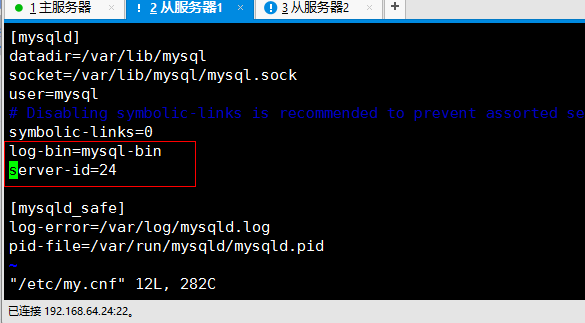
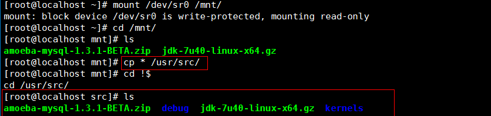
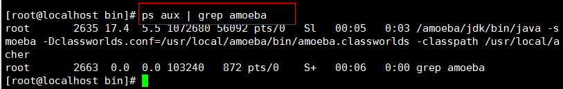
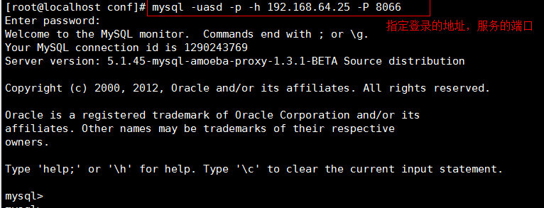



**MySQL 集群**

# **1. MySQL 主从备份）**

# 1、集群的主要类型

- 高可用集群（High Available Cluster, HA Cluster)

高可用集群是指通过特殊的软件把独立的服务器连接起来，组成一个能够提供故障切换(Fail Over) 功能的集群


- 计算方法:

```
1年=365天=8760小时
99%= 8760 * 1%=8760**0.01 = 87.6小时=3.65天99.9 = 8760 * 0.1%=8760**0.001 = 8.76小时
99.99 = 8760 * 0.0001 = 0.876小时 = 0.876 * 60=52.6分钟
99.999 = 8760 * 0.00001 = 0.0876小时 = 0.0876 * 60 = 5.26分钟
```

# 2、常用的集群架构

- MySQL Replication

- MySQL Cluster

- MySQL Group Replication (MGR)   ) 5.7.17  多主一从

- MariaDB Galera Cluster

- MHA |Keepalived|HeartBeat|Lvs，Haproxy等技术构建高可用集群

# 3、MySQL Replcation (Mysql 复制)

- Replication可以实现将数据从一台数据库服务器（master）复制到一台到多台数据库服务器(slave)

- 默认情况下，属于**异步**复制，所以无需维持长连接

## 3.1、MySQL复制原理（重点）

简单来说, master将数据库的改变写入 二进制日志，slave同步这些二进制日志，并根据这些二进制日志进行 数据重演操作，实现数据异步同步。


**详细描述:**

当主从同步配置完毕后:

1. slave端的IO线程发送请求给master端的binlog dump线程

1. master端binlog dump线程 获取二进制日志 信息( 文件名和位置信息 )发送给slave端的IO线程

1. salve端lo线程获取到的内容 依次 写到slave端relay log(中继日志)里，并把master端的bin-log文件名和位置记录到**master.info**里

1. salve端的**SQL线程**，检测到relay log中内容更新，就会解析relay log里更新的内容，并执行这些操作，从而达到和master数据一致

- 扩展：relay log中继日志

- 作用：记录从(slave)服务器接收来自主(master)服务器的二进制日志.

- 场景：用于主从复制

master主服务器将自己的二进制日志发送给slave从服务器，slave先保存在自己的中继日志中，然后再执行自己本地的relay log里的sql达到数据库更改和master保持一致。

- 如何开启?

默认中继日志 没有开启，可以通过修改配置文件完成开启，如下：

```
vim my.cnf
[mysqld]
#指定二进制日志存放位置及文件名
relay-log=/path/xxxx.log
```

# 4、复制架构概述

## 4.1 主从架构 （双机热备）


## 4.2 级联复制


**优点：**

**缺点**

## 4.3 并联复制（一主多从）


**优点：**

**缺点**

## 4.4 双主架构（了解）


**特点:**

从命名来看，两台master好像都能接受读、写请求，但实际上，往往运作的过程中，同一时刻只有其中一台master会接受

# 5、主从复制架构（AB复制）

## 5.1 传统AB复制架构(M-S)

说明：在配置MySQL主从架构时，必须保证数据库的版本高度一版本为5.7.31

## 5.2 核心思路


1. slave必须安装相同版本的mysqI数据库软件

1. master端必须开启二进制日志；slave端必须开启 relay log日志

1. master端和slave端的server-id号 不能一致

1. slave端配置向master来同步数据

1. master端必须创建一个复制用户

1. 保证master和slave端初始数据一致

1. 配置主从复制（slave端）

## 5.3 环境规划

```
编号      主机名称            主机IP地址            角色信息
1        MASTER主服务器       master.itcast.cn     10.1.1.10
2        SLAVE从服务器        slave.itcast.cn      10.1.1.100
```

## 5.4 时间同步

```
ntpdate ntp1.aliyun.com
```

## 5.5 master 配置my.cnf (重点开启二进制日志)

```
vim my.cnf
[mysqld]
basedir=/usr/local/mysql
datadir=/usr/local/mysql/data
socket=/tmp/mysql.sock
port=3306
log-error=/usr/local/mysql/data/master.err
log-bin=/usr/local/mysql/data/binlog           #=> 一定要开启二进制日志    
server-id=10
character_set_server=utf8mb4                    #=>utf8mb4相当于utf8升级版
配置完成后，重启mysqld服务
service mysqld restart
chkconfig --add mysqld
chkconfig mysqld on
```

## 5.6 slave 配置my.cnf文件

```
# vim my.cnf
[mysqld]
basedir=/usr/local/mysql
datadir=/usr/local/mysql/data
socket=/tmp/mysql.sock
port=3310
log-error=/usr/local/mysql/slave.err
relay-log=/usr/local/mysql/data/relaylog        #开启中继日志
server-id=100
character_set_server=utf8mb4
```

## 5.7 把master主服务器的数据目录同步到slave从服务器

- 把MASTER服务器中的mysqld停止掉

```
service mysqld stop
```

- 把MASTER服务器中的/usr/local/mysql/data目录下的auto.cnf文件删除

```
rm -rf /usr/local/mysql/data/auto.cnf
```

- 把MASTER服务器中/usr/local/mysq|中的data目录拷贝一份到SLAVE从服务器的/usr/local/mysqI目录

```
rsync -av /usr/local/mysql/data root@10.1.1.100:/usr/local/mysql/
```

- 同步完成后，把主服务器与从服务器中的mysqld启动

```
service mysqld start
```

## 5.8 常见问题解决方案

- ☆常见错误1: MySQL没有安装在/usr/local/mysqI目录中， service也无法启动

```
service mysqld start
```

无法启动的原因可能是你的MySQL并没有安装在/usr/local/mysq1目录中，因为/etc/init.d/mysqld脚本中的basedir与datadir默认指向的都是/usr/local/mysql所以如果我们更换了mysql的安装位置，则必须更改/etc/init.d/mysqld脚本中basedir与datadir目录

```
vim /etc/init.d/mysqld
basedir=你的安装路径
datadir=你的安装路径/data
```

- ☆常见问题3：因为my.cnf配置文件导致mysql无法启动

```
vim my.cnf
[mysqld]
basedir=/usr/local/mysql        =>    家装路径
datadir=/usr/local/mysql/data    =>    数据目录
socket=/tmp/mysql.sock        =>    GLIBC默认就是/tmp/mysql.sock
port=3310
log-error=/usr/local/mysql/slave.err
relay-log=/usr/local/mysql/data/relaylog
server-id=100
character_set_server=utf8mb4
```

启动报错:

```
Starting MySQL.2020-08-31T07:17:06.554270Z mysqld_safe error: log-error set
to '/usr/local/mysql/slave.err', however file don't exists. Create writable
for user 'mysql'.
ERROR！The server quit without updating PID file
(/usr/local/mysql/data/slave.itcast.cn.pid).
```

产生以上问题的主要原因在于mysql这个用户对/usr/local/mysql文件夹没有写入权限

```
# ll -d /usr/local/mysql
drwxr-xr-x 11 7161 31415 174 Aug 31 15:16 /usr/local/mysql
发现文件拥置与所位晋都是两个数字。正常应该是文件拥有细的名称。旧
组，则以两个数字代替文件拥有者与所属组的显示。
```

解决方案：

方案一：建议把错误日志，丢在数据目录中

```
vim my.cnf
log-error=/usr/local/mysql/data/slave.err
```

方案二：直接更改/usr/local/mysqI目录的权限

```
chown -R mysql.mysql /usr/local/mysql
```

## 5.9 配置MASTER-SLAVE主从同步

- 在MASTER主服务器中创建一个账号，专门用于实现数据同步

MySQL5.7及以下版本:

```
mysql> grant replication slave on * * to 'slave'@'10.1.1.%" identified by'123’;
```

MySQL新版本中:

```
mysql> lereate user 'slave'@*10.1.1.%" identified by '123';
mysql> grant replication slave on * .* to 'slave'@*18.1.1.%";
mysql> flush privileges;
```

- 在MASTER中锁表，然后查看二进制文件的名称及位置(Position)

```
mysql> flush tables with read lock;
mysql> show master status;
```

- 在SLAVE从服务器中，使用change master to指定主服务器，并实现数据同步

```
mysql> change master to
-> master_host='10.1.1.10',
-> master_user='slave',
-> master_password='123',
-> master_port=3306,
-> master_log_file='binlog.000002' ,
-> master_log-pos=597;
master_host：主机的IP地址
master_user：主机的user账号
master password：主机的user账号密码
master_port：主机MySQL的端口号
master_log_file：二进制日志文件名称
master_log-pos：二进制日志文件位置
```

- 启动slave数据同步

```
mysql> start slave;
mysql> show slave status\G;
查看连接master的具体情况，如果如下显示YES，则连接成功
Slave_IO_Running: Yes
Slave_SQL_Running: Yes
```

- master上解锁

```
mysql> unlock tables；
Query OK, 0 rows affected (0.00 sec)
```

# 6、 基于GTIDs的主从复制架构(M-S)

## 6.1、GTIDs概述

- ·什么是GTIDs以及有什么特点?

1. GTIDs(Global transaction identifiers)全局事务标识符，是mysql 5.6新加入的一项技术

1. 当使用GTIDs时，每一个事务都可以被 识别并且跟踪

1.  添加新的slave或者当发生故障需要将master身份或者角色迁移到slave上时，都无需考虑是哪一个二进制日志以及哪个position值，极大简化了相关操作

1. GTIDs是完全基于事务的，因此不支持MYISAM存储引擎

1. GTIDs由source_id和transaction_id组成 :

1）source_id来自于server_uuid,可以在auto.cnf中看到

2）transation_id是一个序列数字，自动生成

- **使用GTIDs的限制条件有哪些?**

1.不支持非事务引擎（MyISAM），因为可能会导致多个gtid分配给同一个事务

2.createtable…select-语句不支持（主库语法报错)

3. create/drop temporary table 语句不支持

4.必须使用enforce-gtid-consistency参数

5. sql-slave-skip-counter不支持(传统的跳过错误方式)

6.GTID复制环境中必须要求统一开启和GTID或者关闭GTID

7. 在mysql 5.6.7之前，使用mysqLupgrade 命令会出现问题

在生产环境中，大多数情况下使用的MySQL5.6基本上都是从5.5或者更低的版本升级而来,这就意味着之前的mysql replication方案是基于传统的方式部署，并且已经在运行，因此,接下来我们就利用已有的环境升级至基于GITDs的Replication。

- 思路

1.修改配置文件支持GTIDs (主+从)

2.重启数据库(主+从)

3.为了保证数据一致性,master和slave设置为只读模式(主+从)

4.从服务器上重新配置同步 （从）

## 6.2、基于GTIDs的主从复制实践

### 6.2.1 修改配置文件支持GTIDs

- MASTER => my.cnf

```
vim my .cnf
....
log-bin=binlog
gtid-mode=on
log-slave-updates=1
enforce-gtid-consistency
```

- SLAVE => my.cnf

```
vim my.cnf
...
log-bin=/usr/local/mysql/data/binlog    必须要开启二进制
gtid-mode=on
log-slave-updates=1
enforce-gtid-consistency
skip-slave-start    => 当MASTER主服务器GTIDs没有启动时，跳过SLAVE服务器的启动
```

### 6.2重起主从数据库服务

```
[root@dbe1 ~]# service mysql restart
```

### 6.3 主从设置只读模式

```
mysql> set @@global.read_only=ON;
```

### 6.4 SLAVE重新配置change master to

```
mysql> stop slave;
mysql> reset slave ;
mysql> change master to 
master_host='10.1.1.10',
master_user='slave',
master_password='123',
master_port=3306,
master_auto_position=1;
注意：
1.确保有复制用户
2.主要区别于传统复制的参数是：master_auto_position=1
mysql> start slave ;
mysql> show slave status G
```

### 6.5 关闭主从服务器的只读模式

```
mysql> set @@global.read_only=OFF;
```

### 6.6 SLAVE从服务器不小心写入数据解决方案

- 方法一：

```
指定需要跳过的GTIDs编号
SET GTID_NEXT='aaa-bbb-ccc-ddd:N' ;
BEGIN;COMMIT;                 #开始一个空事务
SET GTID_NEXT='AUTOMATIC';    #使用下一个自动生成的全局事务ID。
举例说明：
mysql> stop slave;
mysql> SET @@SESSION.GTID_NEXT= '4d7b25a3-eb56-11ea-9ae8-000c29d1f40a:3'/*!*/;
mysql> BEGIN;
mysql> commit;
mysql> SET @@SESSION.GTID_NEXT= 'AUTOMATIC';
mysql> start slave ;
mysql> show slave status\G
说明：需要跳过哪个事务，需要手动查看relaylog文件得到
[root@slave1 data]# ../bin/mysqlbinlog relay.0eoee3|less
# at 756
#181015 12:04:45 server id 10 end_log-pos 817 CRC32 0x5374f49e
GTID
[commit=yes]
SET @@SESSION.GTID_NEXT= 044e6392-cf9b-11e8-a748-000c294ca304:3"/*!*/:
```

- 方法二：

- 重新同步

# 7、半同步复制

## 7.1 概述


所谓的半同步复制就是master每commit—个事务(简单来说就是做一个改变数据的操作）,要确保slave接受完主服务器发送的binlog日志文件 并写入到自己的中继日志relay log里，然后会给master信号，告诉对方已经接收完毕，这样master才能把事物成功 commit 。这样就保

证了master-slave的 数据绝对的一致（但是以牺牲 master的性能为代价 ).但等待时间也是可以调整的。

## 7.2 主要步骤

- 第一步：准备一套M-S的主从架构（建议使用基于GTIDs架构设计）

- 第二步: 给MASTER与SLAVE安装plugin插件(Csasedir/lib/plugin/)

MASTER:

```
mysql> install plugin rpl_semi_sync_master soname 'semisync_master.so';
mysql> show global variables like 'rpl_semi_sync_master%' ;
```

SLAVE:

```
mysql> install plugin rpl_semi_sync_slave soname 'semisync_slave.so';
mysql> show global variables like 'rpl_semi_sync_slave%';
```

- 第三步：激活MASTER与SLAVE服务器中的半同步复制插件

MASTER:

```
mysql> set global rpl_semi_sync_master_enabled =on;
mysql> show global variables like "rpl_semi_sync_master%";
    >> rpl_semi_sync_master_enabled    ==> ON 
 mysql> show global status  like "rpl_semi_sync_master%";
     >> Rpl_semi_sync_master_status   ==> ON    
```

SLAVE:

```
mysql> set global rpl_semi_sync_slave_enabled=on;
mysql> show global variables like "rpl_semi_sync_slave%";
     >> rpl_semi_sync_slave_enabled  ==> ON 
```

第四步：在SLAVE服务器中重启IO线程

```
mysql> stop slave IO_THREAD;
mysql> start slave IO_THREAD;
mysql> show global status  like "rpl_semi_sync_slave%";
    >> Rpl_semi_sync_slave_status  ==>  ON  
```

- 第五步：测试验证半同步复制

当slave从库的IO_Thread 线程将binlog日志接受完毕后，要给master—个确认，如果超过10s未收到slave的接收确认信号，那么就会自动转换为传统的异步复制模式。

1）master插入一条记录，查看slave是否有成功返回

```
mysql> insert into db_itheima.tb_student values (null,'j');
mysql> show global status like 'rpl_semi_sync%_yes_tx';
+-----------------------------+-------+
| Variable_name               | Value |
+-----------------------------+-------+
| Rpl_semi_sync_master_yes_tx | 1     |        #表示这次事物成功从slave返回一次确认信号
+-----------------------------+-------+
1 row in set (0.00 sec)
```

2）模拟slave服务器故障

SLAVE:

```
service mysqld stop
```

MASTER:

```
insert into db_itheima.tb_student values (null,'k");
```

3）再次启动slave，查看同步模式

```
mysql> show global status like 'rpl_semi_sync% ;
如需要再次半同步复制，则按照以上步骤重新开启就可以
mysql> set global rpl_semi_sync_slave_enabled=on;
mysql> stop slave IO_THREAD;
mysql> start slave IO_THREAD;
或者可以将该参数写入到配置文件中：
master：rpl_semi_sync_master_enabled=1
slave：rpl_semi_sync_slave_enabled=1
```

master需要等到slave确认后才能提交，如果等不到确认消息，master等待10s种后自动变成异步同步;slave启起来后，master上改变的数据还是会自动复制过来，数据又回到一致。

## 7.3 outtime时间修改（默认10s）

```
set global rpl_semi_sync_master_timeout=1000;
```

## 7.4 卸载插件

```
mysql> select plugin_name,load_option from information_schema.plugins;
mysql> uninstall plugin plugin_name;
```

# **2. MySQL 主主备份**

# **
**

## **1）. 以 1 为主，2 为从配置一遍主从
**

在主配置文件中配置一下（开启二进制日志和其他内容）




## **2） 在 2 上做相同的配置**


## **
**



## **3） 启动服务器**


## **
**

1 为主 2 为从：

在主服务器(1)上授权




在从服务器(2)上保存授权信息




2 为主 1 为从：

在主服务器(2)上授权






在从服务器(1)上保存授权信息




1 和 2 都执行 start slave（互为主从）




测试






# **3. MySQL 一主多 从**

# **
**

主服务器配置

开启二进制日志，并启动 mysql




在主服务器上授权




从服务器配置

开启二进制日志，并启动 mysql





保存授权信息







**#在另一台从服务器上做相同的配置（注意 id 不能相同）**

测试




# **4. MySQL 多主一从
**

主服务器配置




开启二进制日志，启动服务



授权




在主服务器 2 上做相同的操作




授权




从服务器操作

对主配置文件操作






初始化数据库，生成目录 mysqla,mysqlb







设置 mysqla,mysqlb 目录及以下文件的属主为 mysql(防止出现权限问题)




启动从服务器线程





登录并保存授权信息









测试




# **5. MySQL 中间件- -Amoeba
**

**中间件**

以无限扩展（注：真实环境中并非如此）

**数据库的中间件：**

mysql proxy (官方版本) 性能低，需要 lua 脚本

atlas 性能低，响应时间长

amoeba 陈思儒研发的

## **一．先搭建一个主从关系的服务器
**

在主、从服务器上安装 mysql mysql-server






1.开启二进制日志




2.在主服务器上授权，从服务器上保存授权信息，并开启从服务线程。




3.关闭从服务器线程，为了做读写分离时，测试有明显的实验效果（实际生产环境中不能停掉。。）






## **二．配置读写分离
**

### **1.安装 gcc 环境（amoeba 需要源码安装）**




### **2.拷贝第三方软件,创建单独的目录**





### **3.先安装 jdk(amoeba 是由 java 语言编写的，所以先安装 jdk),配置 java 环境**






### **4.声明用 java 写出来的程序如何调用（/etc/pro**







### **5.安装 amoeba**


配置 amoeba 这个软件




<server>.....</server>区域





<dbServerList>......</dbServerList>区域







由于只提供了一个服务器模板，需要自己复制另一个填写关于读的







启动 amoeba，修改一下启动脚本：/usr/local/amoeba/bin/amoeba




**注意：将-Xss128k 修改为 –Xss256
**

**#在主和从服务器上进行指定用户授权，授权目的为了让 amoeba 能连接到主从服务器进行查询。**

nohup bash -x /usr/local/amoeba/bin/amoeba &

把这个放到后台 退出终端也可以继续运行




ps aux | grep amoeba

查看一下运行的程序 查看到的话就说明程序已经运行了起来





测试（安装一个 MySQL 软件包才可以连接）







在主、从服务器上创建表 a1，在主服务器的表中插入数据




之后在客户端登录测试

读取池的效果：






写入池效果




 

以上测试纯粹为了实验效果，在实际生产中，主从开启，主服务器上写入的数据也会同步到从服务器
中
