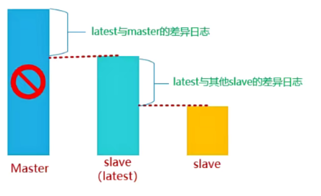

# 1、MHA简介

MHA (Master High Availability) 目前在MySQL高可用方面是一个相对成熟的解决方案，它由日本DeNA公司youshimaton (现就职于Facebook公司）开发，是一套优秀的作为MySQL高可用性环境下|故障切换和主从提升 的高可用软件。在MySQL故障切换过程中，MHA能做到在0~30秒之内自动完成数据库的故障切换操作，并且在进行故障切换的过程中，MHA能在较大程度 上保证数据的一致性，以达到真正意义上的高可用。

# 2、MHA工作原理



1.当master出现故障时，通过对比slave之间I/O线程读取master上binlog的位置，选取最接近的slave做为最新的slave(latestslave) 。

2.其它slave通过与latest slave对比 生成差异中继日志，并应用。

3. 在latest slave上 应用从master保存的binlog，同时将latest slave提升为master .

4.最后在其它slave上应用相应的差异中继日志并开始从新的master开始复制.

# 3、MHA组件

## 3.1 有哪些组件

- MAA Manager(管理节点)

- MHA Manager可以单独部署在一台独立的机器上管理个master-slave集群，也可以部署在一台slave节点上。

- MHA Node (数据节点)

- MHA Node运行在 每台MySQL服务器上，MHA Manager会定时探测集群中的master节点，当master出现故障时，它可以自动将数据的slave提升为新的master，然后将所有其他的slave重新指向新的master。整个故障转移过程对应用程序完全透明。

## 3.2 组件介绍

• MHA Manager

运行一些工具，比如masterha_manager工具实现自动监控MySQL Master和实现 master故障切换，其它工具手动实现master故障切换、在线mater转移、连接检查等等。一个Manager可以管理多个master-slave集群

• MHA Node

部署在所有运行MySQL的服务器上，无论是master还是slave。主要有三个作用:

1）保存二进制日志

如果能够访问故障master，会拷贝master的二进制日志

2）应用差异中继日志

从拥有最新数据的slave上生成差异中继日志，然后应用差异日志。

3）清除中继日志

在不停止SQL线程的情况下删除中继日志

# 4、MHA 工具介绍

## 4.1Manager工具

```
工具                            说明
masterha_check_ssh              检查MHA的SSH配置
masterha_check_repl             检查MySQL复制
masterha_manager                启动MHA
 #选项
    --conf=/etc/mha/app1.conf     
    --remove_dead_master_conf   #故障切换之后，将挂掉的master节点配置，从配置文件中删除。
    --ignore_last_failover      #如果最近一次故障切换失败，还会再次尝试。不设置，如果上一次失败了，就不会继续了。
masterha_stop                   关闭MHA
    --conf=/etc/mha/app1.conf 
masterha_check_status           检测当前MHA运行状态
masterha_master_monitor         监测master是否宕机
masterha_master_switch          控制故障转移(自动或手动)
masterha_conf_host              添加或删除配置的server信息
```

## 4.2 Node工具

```
工具                         说明
save_binary_logs             保存和复制master的二进制日志
apply_diff_relay_logs        识别差异的中继日志事件并应用于其它slave
filter_mysq[binlog           去除不必要的ROLLBACK事件(MHA已不再使用这个工具）
purge_relay_logs             清除中继日志(不会阻塞sQL线程)
```

# 5、MHA 环境准备

## 5.1 部署规划

```
角色                IP            主机名              server-id         功能           备注
MHA-Manager        10.1.1.40     mgr.heima.cc         -                管理节点
MHA-Node (Master)  10.1.1.10     master.heima.cc      10               数据节点         写
MHA-Node (Slave1)  10.1.1.20     slave1.heima.cc      20               数据节点         读
MHA-Node (Slave2)  10.1.1.30     slave2.heima.cc      30               数据节点         读
```

## 5.2 系统和软件版本

下载：[https://github.com/HACK-WU/mha4mysql/archive/refs/heads/master.zip](https://github.com/HACK-WU/mha4mysql/archive/refs/heads/master.zip)

```
系统版本			MySQL版本		MHA版本
CentOS 7.6		MySQL-5.7.31 		mha4mysql-manager-0.57     mha4mysql-node-0.57
```

## 5.3 安装依赖包

- **注意：所有服务器均需要安装**

```
yum -y install perl-DBD-MySQL \
perl-Config-Tiny \
perl-Time-HiRes \
perl-Mail-Sender \
perl-Mail-Sendmail \
perl-MIME-Base32 \
perl-MIME-Charset \
perl-MIME-EncWords \
perl-Params-Classify \
perl-Params-Validate.x86_64 \
perl-Log-Dispatch \
perl-Parallel-ForkManager \
net-tools 
```

## 5.4 时间同步 所有服务器

```
ntpdate ntp1.aliyum.com
```

## 5.5 部署MySQL主从复制环境

数据库安装位置: /usr/local/mysql

数据库的数据目录: /usr/local/mysql/data

套接字文件：/tmp/mysql.sock

端口设置: 3306

配置文件位置:/usr/local/mysql/my.cnf (MySQL =>安装目录下 => /etc目录下）

## 5.6 master主服务器 安装配置**（GLIBC）**

- 第一步：使用脚本安装mysq软件

```
vim mysql.sh
#!/bin/bash
yum install libaio -y
tar -xf mysq1-5.7.31-linux-glibc2.12-x86_64.tar.gz
mv mysql-5.7.31-linux-glibc2.12-x86_64 /usr/local/mysql
useradd -r -s /sbin/nologin mysql
rm -rf /etc/my.cnf
cd /usr/local/mysql
mkdir mysql-files
chown mysql:mysql mysql-files
chmod 750 mysql-files
bin/mysqld --initialize --user=mysql --basedir=/usr/local/mysq1 &> /root/password.txt    #初始密码位置
bin/mysql_ssl_rsa_setup --datadir=/usr/local/mysql/data
cp support-files/mysql.server /etc/init.d/mysqld
service mysqld start
echo 'export PATH=SPATH:/usr/local/mysql/bin' >> /etc/profile
source /etc/profile
```

- 第三步设置mysql密码

```
mysqladmin -uroot password "123" -p
```

第四步：进行安全初始化

```
mysql_secure_installation
```

- 第五步：编写MASTER主机中my.cnf配置文件

```
vim /usr/local/mysql/my.cnf
[mysqld]
basedir=/usr/local/mysql
datadir=/usr/local/mysql/data
socket=/tmp/mysql.sock
port=3306
log-error=/usr/local/mysql/data/master.err
log-bin=/usr/local/mysql/data/binlog
server-id=10
character_set_server=utf8mb4
gtid-mode=on
log-slave-updates=1
enforce-gtid-consistency
```

## 5.7 slave 从服务器 安装配置（GLIBC）

第一步：上传MySQL软件到服务器端

第二步：使用脚本安装MySQL，但是不需要进行初始化

```
vim mysql.sh
#!/bin/bash
yum install libaio -y
tar -xf mysql-5.7.31-linux-glibc2.12-x86_64.tar.gz
rm -rf /usr/local/mysql
mv mysql-5.7.31-linux-glibc2.12-x86_64  /usr/local/mysql
useradd -r -s /sbin/nologin mysql
rm -rf /etc/my.cnf
cd /usr/local/mysql
mkdir mysql-files
chown mysql:mysql mysql-files
chmod 750 mysql-files
cp support-files/mysql.server /etc/init.d/mysqld
echo 'export PATH=SPATH:/usr/local/mysql/bin' >> /etc/profile
source /etc/profile
```

- 第三步：使用rsync把MASTER服务器中的data数据目录同步到SLAVE1与SLAVE2

MASTER:

```
rm -rf /usr/local/mysql/data/auto.cnf
rsync -av /usr/local/mysql/data root@10.1.1.20:/usr/local/mysql/
rsync -av /usr/local/mysql/data root@10.1.1.30:/usr/local/mysql/
```

第四步：给SLAVE1与SLAVE2配置my.cnf文件

SLAVE1:

```
vim /usr/local/mysql/my .cnf
[mysqld]
basedir=/usr/local/mysql
datadir=/usr/local/mysql/data
socket=/tmp/mysql.sock
port=3306
log-error=/usr/local/mysql/data/slave.err
log-bin=/usr/local/mysql/data/binlog
relay-log=/usr/local/mysql/data/relaylog
server-id=20
character_set_server=utf8mb4
gtid-mode=on
log-slave-updates=1
enforce-gtid-consistency
skip-slave-start
```

## 5.8 配置主从数据同步

- 第一步：在MASTER服务器中创建一个slave同步账号

```
mysql> create user 'slave'@'10.1.1.%" identified by '123';
mysql> grant replication slave on * * to 'slave'@'10.1.1.%’;
mysql> flush privileges;
```

第二步：创建一个mha账号（方便后期MHA监控主从同步状态)

```
mysql> create user 'mha'@'10.1.1.40 identified by '123';
mysql> grant all privileges on * .* to 'mha'@'10.1.1.40';
mysql> flush privileges;
```

第三步：在SLAVE1与SLAVE2中配置主从数据同步

```
mysql> change master to
master_host='10.1.1.10',
master_port=3306,
master_user='slave',
master_password='123',
master_auto_position=1;
mysql> start slave;
mysql> show slave status\G
```

# 6、MHA 软件的安装

## 6.1不同节点安装软件

说明：在所有节点安装 mha-node 软件包，在 mha管理端再安装 mha-manager 软件包

下载地址：[https://github.com/HACK-WU/mha4mysql/archive/refs/heads/master.zip](https://github.com/HACK-WU/mha4mysql/archive/refs/heads/master.zip)

```
[root@mha ~]# yum -y install mha4mysql-node-0.57-0.el7.noarch.rpm
[root@master ~]# yum -y install mha4mysql-node-0.57-0.el7.noarch.rpm
[root@slave1 ~]# yum -y install mha4mysql-node-0.57-0.el7.noarch.rpm
[root@slave2 -]# yum -y install mha4mysql-node-0.57-0.el7.noarch.rpm
[root@mha ~]# yum -y install mha4mysql-manager-0.57-0.el7.noarch.rpm
#如果已经提前安装依赖软件，则大家可以使用rpm -ivh直接安装
```

## 6.2 配置ssh互信（免密登录）

说明：

1. 在生产环境中几乎都是禁止root远程登陆服务器的，所以ssh免密码登陆要在admin用户下进行配置，这是处于安全角度考虑出发。

1. admin用户可以是任意普通用户

1.  该普通用户用于mha的管理节点远程访问mysq[复制组中的所有主机，完成一些其他工作

- 第一步：在所有机器上创建一个普通账号admin，密码123

```
useradd admin
echo 123|password --stdin admin
```

- 第二步：配置mha主机到其他主机的admin用户互信

```
mha端：
[root@mha -]# su - admin
[admin@mha -] ssh-keygen -P "" -f ~/.ssh/id_rsa
[admin@mha -] cd .ssh/
[admin@mha .sshl] ls
id_rsa  id_rsa.pub
[admin@mha .ssh] mv id_rsa.pub authorized_keys
[admin@mha .ssh] for i in 10 20 30;do scp -r ../.ssh/ 10.1.1.$i:～/;done
测试免密登录：
[admin@mgr .ssh] ssh 10.1.1.10
[admin@mgr .ssh] ssh 10.1.1.20
[admin@mgr .ssh] ssh 10.1.1.30
```

## 6.3 配置admin用户的sudo权限

- MASTER主机上

```
[root@master ～]# vim /etc/sudoers.d/admin
User_Alias MYSQL_USERS = admin        #User_Alias 表示具有sudo权限的用 户 列表；Host_Alias表示主机的列表
Runas_Alias MYSQL_RUNAS = root        #Runas_Alias 表示用户以什么身份登录
Cmnd_Alias MYSQL_CMNDS = /sbin/ifconfig,/sbin/arping    #Cmnd_Alias 表示允许执行命令的列表
MYSQL_USERS ALL = (MYSQL_RUNAS) NOPASSWD: MYSQL_CMNDS
```

把这个权限分发给SLAVE1与SLAVE2—份 (当故障发生时，从服务器也可以自己设置VIP)

```
for i in 20 30 : do scp /etc/sudoers .d/admin 10.1.1.Si:/etc/sudoers.d/;done
```

测试admin用户是否可以挂载VIP（只能在MASTER机器上挂载VIP）

```
su - admin
[admin@master ~]s sudo /sbin/ifconfig ens33:1 10.1.1.100 broadcast 10.1.1.255 netmask 255.255.255.0
[admin@master ～]s sudo /sbin/arping -fqc 5 -w 5 -I ens33 -s 10.1.1.100 -U
10.1.1.10
[admin@master ~]$ ip a
补充：
arpinq：用来向局域的其它主机发送ARP请求的指，可以用来测试局内的某个IP是否已被使用,并显示对应ip的MAC地址
    #如果有多个网卡使用了这个IP，那么探测结果也会显示多个不同的MAK地址，则证明这个ip被多个网卡使用，需要及时处理。
-f：收到第一个响应包后退出。
-q：quite模式，不显示输出。
-C：发送指定的count个ARP REQUEST包后停止。如果指定了-w参数，则会等待相同数量的ARP REPLY包，直到超时为止。
-W：指定一个船时时间，单位为秒，arpinq在到达指定时间后退出，无论期间发送或接收 多少在这种情况下，
        arping在发送完指定的count （-c）个包后开不会停止等待到超时或发送的count个包都进行了回应后才会退出。
-I：指定设备名，用来发送ARP REQUEST包的网络设备的名称。
-D：重复地址探测模式，用来检测有没有IP地址冲突，如果没有IP冲突则返回。
-S：设置发送ARP包的IP资源地址
-U：元地出的（) ARP模式天申新别MARP CACHE中的本机的信息，不需要响应。
-h：显示帮助页。
```

## 6.4 创建mha相关配置文件

- MHA服务器：创建工作目录

```
[root@mha -]# mkdir /etc/mha/                    #mha配置文件目录
[root@mha -]# mkdir -p /data/mha/masterha/app1    #mha工作目录
[root@mha ~]# chown -R admin.admin /data/mha      #mha数据目录
```

- 创建mha局部配置文件

```shell
yum -y install mha4mysql-manager-0.56-0.el6.noarch.rpm \
mha4mysql-node-0.56-0.el6.noarch.rpm
mkdir /etc/mha
cat /etc/mha/app1.conf
[server default]
user=mhauser
password=mhauser123456
ssh_user=root
master_binlog_dir=/var/lib/mysql
remote_workdir=/data/log/masterha
manager_workdir=/usr/local/mha
manager_log=/usr/local/mha/manager.log
# MHA到master的监控之间出现问题,MHA Manager将会尝试从slave1和slave2登录到master上
secondary_check_script=/usr/bin/masterha_secondary_check -s 10.1.1.20 -s 10.1.1.30 --user=admin --port=22 --master_host=10.1.1.10 --master_port=3307
# 设置自动failover时候的切换脚本
master_ip_failover_script="/etc/mha/master_ip_failover.sh"
# 设置手动切换时候的切换脚本
#master_ip_online_change_script="/etc/mha/master_ip_online_change.sh"
# 设置故障发生后关闭故障主机脚本
# shutdown_script="/etc/mha/power_manager"
 
ping_interval=1
repl_user=repluser
repl_password=repluser123456
 
[server1]
hostname=10.0.0.21
candidate_master=1    #可以成为 master
ignore_fail=1        #如果此节点宕机，则自动忽略这个配置，但是需要配合--ignore_fail_on_start启动才有效果
port=3306
 
[server2]
hostname=10.0.0.22
candidate_master=1
ignore_fail=1
 
[server3]
hostname=10.0.0.23
no_master=1            #不可以成为master
 
# ssh检测,授权检测,启动MHA
chmod +x /etc/mha/app1.conf
mkdir /usr/local/mha
 
masterha_check_ssh --conf=/etc/mha/app1.conf
masterha_check_repl --conf=/etc/mha/app1.conf
masterha_manager --conf=/etc/mha/app1.conf  2>&1 &
masterha_check_status --conf=/etc/mha/app1.conf
```

- master_ip_failover.sh

```
#!/usr/bin/env perl


use strict;
use warnings FATAL => 'all';

use Getopt::Long;
use MHA::DBHelper;

my (
  $command,        $ssh_user,         $orig_master_host,
  $orig_master_ip, $orig_master_port, $new_master_host,
  $new_master_ip,  $new_master_port,  $new_master_user,
  $new_master_password
);

my $vip = '192.168.23.100/24';      #VIP地址
my $key = '1';                      # 网卡后面的那个数字，比如ens33:1
    #    my $vip = shift;     
    #   my $key = shift;
    #    使用shift参数，就可以在调用脚本时加上参数了，这样可以随意更改VIP，很方便 。
    #    比如：master_ip_failover 192.168.23.100 1                                     

my $ssh_start_vip = "/sbin/ifconfig ens33:$key $vip";  
my $ssh_stop_vip = "/sbin/ifconfig ens33:$key down"; 
my $ssh_Bcast_arp= "/sbin/arping -I ens33 -c 3 -A 192.168.23.100"; 

GetOptions(
  'command=s'             => \$command,
  'ssh_user=s'            => \$ssh_user,
  'orig_master_host=s'    => \$orig_master_host,
  'orig_master_ip=s'      => \$orig_master_ip,
  'orig_master_port=i'    => \$orig_master_port,
  'new_master_host=s'     => \$new_master_host,
  'new_master_ip=s'       => \$new_master_ip,
  'new_master_port=i'     => \$new_master_port,
  'new_master_user=s'     => \$new_master_user,
  'new_master_password=s' => \$new_master_password,
);

exit &main();

sub main {
  if ( $command eq "stop" || $command eq "stopssh" ) {

    # $orig_master_host, $orig_master_ip, $orig_master_port are passed.
    # If you manage master ip address at global catalog database,
    # invalidate orig_master_ip here.
    my $exit_code = 1;
    eval {

      # updating global catalog, etc
      &stop_vip();            #调用这个线程	
      $exit_code = 0;
    };
    if ($@) {
      warn "Got Error: $@\n";
      exit $exit_code;
    }
    exit $exit_code;
  }
  elsif ( $command eq "start" ) {

    # all arguments are passed.
    # If you manage master ip address at global catalog database,
    # activate new_master_ip here.
    # You can also grant write access (create user, set read_only=0, etc) here.
    my $exit_code = 10;
    eval {
      my $new_master_handler = new MHA::DBHelper();

      # args: hostname, port, user, password, raise_error_or_not
      $new_master_handler->connect( $new_master_ip, $new_master_port,
        $new_master_user, $new_master_password, 1 );

      ## Set read_only=0 on the new master
      $new_master_handler->disable_log_bin_local();
      print "Set read_only=0 on the new master.\n";
      $new_master_handler->disable_read_only();

  
      print "Creating app user on the new master..\n";
      FIXME_xxx_create_user( $new_master_handler->{dbh} );
      $new_master_handler->enable_log_bin_local();
      $new_master_handler->disconnect();

       
      &start_vip();	    #调用这个线程
      $exit_code = 0;
    };
    if ($@) {
      warn $@;

      # If you want to continue failover, exit 10.
      exit $exit_code;
    }
    exit $exit_code;
  }
  elsif ( $command eq "status" ) {

    # do nothing
    exit 0;
  }
  else {
    &usage();
    exit 1;
  }
}

sub start_vip() {        #定义一个线程
    `ssh $ssh_user\@$new_master_host \" $ssh_start_vip \"`;    #这里面其实就是linux命令，是一个ssh命令
 #    exit 0;
}

sub stop_vip() {        #定义一个线程
     return 0  unless  ($ssh_user);
    `ssh $ssh_user\@$orig_master_host \" $ssh_stop_vip \"`;
#     exit 0;
}
sub usage {
  print
"Usage: master_ip_failover --command=start|stop|stopssh|status --orig_master_host=host --orig_master_ip=ip --orig_master_port=port --new_master_host=host --new_master_ip=ip --new_master_port=port\n";
}

```

## 6.5 检测SSH互信以及MySQL主从状态

```
[admin@mha -]# masterha_check_ssh --conf=/etc/mha/app1.conf    #检测SSH互信
[admin@mha -]# masterha_check_repl --conf=/etc/mha/app1.conf    #检测集群状态
```

## 6.6、检查MHA状态，然后运行MHA (监控开始)

MHA:

```
#开启MHA Manager监控：
admln@mha ~]$ nohup masterha_manager --conf=/etc/mha/app1.conf --remove_dead_master_conf --ignore_last_failover --ignore_fail_on_start &
#再次查看监控状态：
[admin@mha -]$ masterha_check_status --conf=/etc/mha/app1.conf
app1 (pid:8913) is running(0:PING_OK), master:10.1.1.10
#手动停止监控命令:
masterha_stop --conf=/etc/mha/app1.conf
```

# 7、自动Failover测试

## 7.1、在MASTER服务器安装测试工具

```
[root@master ~]# yum -y install sysbench 
```

## 7.2 插入测试数据

```
master服务器上创建测试库test
mysql> create database test charset utf8mb4 ;
Query OK, 1 row affected (0.17 sec)
mysql> grant all on *.* to 'mha'@'localhost' identified by '123';
Query OK, a rows affected (0.14 sec)
mysql> flush privileges;
Query OK, 0 rows affected (0.11 sec)
mysql> exit
Byeex
[root@master ~]# sysbench /usr/share/sysbench/oltp_read_only.lua \
 --mysql-host=192.168.23.22  --mysql-port=3306 --mysql-user=mha \
 --mysql-password=123  --mysql-socket=/var/lib/mysql/mysql.sock \
 --mysql-db=test  --db-driver=mysql  --tables=1 \
 --table-size=100000 --report-interval=10 --threads=128 --time=120 prepare
 
mysql> select count(*) from sbtest1;
+----------+
| count(*) |
+----------+
|   100000 |
+----------+
1 row in set (0.01 sec)
```

# 8、模拟故障

MHA服务器：监控日志

```
tailf ....log
```

- MASTER服务器

```
systemctl stop mysqld
```