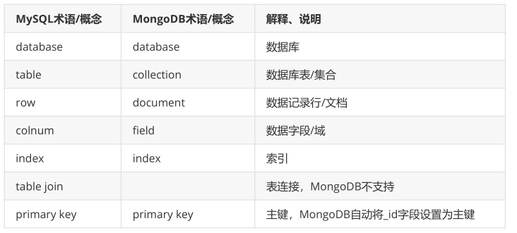

**MongoDB介绍**

# 1、业务应用场景

传统的关系型数据库（如MySQL），在数据操作的“三高”需求以及应对Web2.0的网站需求面前，显得力不从心。

## **1）解释：“三高”需求：**

- High performance - 对数据库高并发读写的需求。

- Huge Storage - 对海量数据的高效率存储和访问的需求。

- High Scalability && High Availability- 对数据库的高可扩展性和高可用性的需求。

## **2）具体的应用场景如：**

- 1）社交场景，使用 MongoDB 存储存储用户信息，以及用户发表的朋友圈信息，通过地理位置索引实现附近的人、地点等功能。

- 2）游戏场景，使用 MongoDB 存储游戏用户信息，用户的装备、积分等直接以内嵌文档的形式存储，方便查询、高效率存储和访问。

- 3）物流场景，使用 MongoDB 存储订单信息，订单状态在运送过程中会不断更新，以 MongoDB 内嵌数组的形式来存储，一次查询就能将 订单所有的变更读取出来。

- 4）物联网场景，使用 MongoDB 存储所有接入的智能设备信息，以及设备汇报的日志信息，并对这些信息进行多维度的分析。

- 5）视频直播，使用 MongoDB 存储用户信息、点赞互动信息等。

## 3）什么时候选择MongoDB？

- 在架构选型上，除了上述的三个特点外，如果你还犹豫是否要选择它？可以考虑以下的一些问题：

- 应用不需要事务及复杂 join 支持

- 新应用，需求会变，数据模型无法确定，想快速迭代开发

- 应用需要2000-3000以上的读写QPS（更高也可以） 应用需要TB甚至 PB 级别数据存储

- 应用发展迅速，需要能快速水平扩展

- 应用要求存储的数据不丢失

- 应用需要99.999%高可用

- 应用需要大量的地理位置查询、文本查询

- 如果上述有1个符合，可以考虑 MongoDB，2个及以上的符合，选择 MongoDB 绝不会后悔。

# 2、什么是MongoDB？

MongoDB是一个开源、高性能、无模式的文档型数据库，当初的设计就是用于简化开发和方便扩展，是NoSQL数据库产品中的一种。是最 像关系型数据库（MySQL）的非关系型数据库。

它支持的数据结构非常松散，是一种类似于 JSON 的 格式叫BSON，所以它既可以存储比较复杂的数据类型，又相当的灵活。

MongoDB中的记录是一个文档，它是一个由字段和值对（field:value）组成的数据结构。MongoDB文档类似于JSON对象，即一个文档认 为就是一个对象。字段的数据类型是字符型，它的值除了使用基本的一些类型外，还可以包括其他文档、普通数组和文档数组。

# 3、体系结构

MySQL和MongoDB的对比

# 4、数据类型

# 5、MongoDB的特点

（1）高性能： MongoDB提供高性能的数据持久性。特别是, 对嵌入式数据模型的支持减少了数据库系统上的I/O活动。 索引支持更快的查询，并且可以包含来自嵌入式文档和数组的键。（文本索引解决搜索的需求、TTL索引解决历史数据自动过期的需求、地 理位置索引可用于构建各种 O2O 应用）mmapv1、wiredtiger、mongorocks（rocksdb）、in-memory 等多引擎支持满足各种场景需求。Gridfs解决文件存储的需求。

（2）高可用性： MongoDB的复制工具称为副本集（replica set），它可提供自动故障转移和数据冗余。

（3）高扩展性： MongoDB提供了水平可扩展性作为其核心功能的一部分。 分片将数据分布在一组集群的机器上。（海量数据存储，服务能力水平扩展） 从3.4开始，MongoDB支持基于片键创建数据区域。在一个平衡的集群中，MongoDB将一个区域所覆盖的读写只定向到该区域内的那些 片。

（4）丰富的查询支持： MongoDB支持丰富的查询语言，支持读和写操作(CRUD)，比如数据聚合、文本搜索和地理空间查询等。

（5）其他特点：如无模式（动态模式）、灵活的文档模型