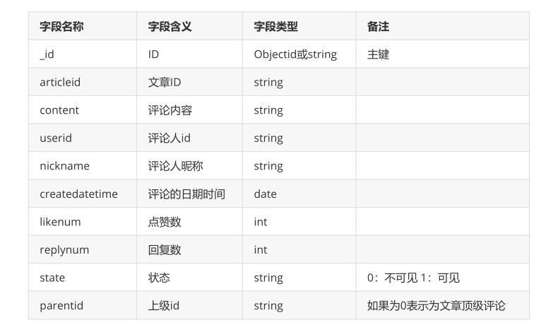

**数据库命令**

# 1、字段解释

数据库：articledb，专栏文章的评论



# 2、数据库操作

数据库名可以是满足以下条件的任意UTF-8字符串。

1. 不能是空字符串（"")。

1. 不得含有' '（空格)、.、$、/、\和\0 (空字符)。

1. 应全部小写。

1. 最多64字节。

## 1）选择和创建数据库

```
# 选择数据库，如果数据库不存在则自动创建
use 数据库名称
> use articledb
switched to db articledb
```

## 2）查看所有数据库

```
show dbs
show databases
> show dbs
admin  0.000GB
config  0.000GB
local  0.000GB
> show databases
admin  0.000GB
config  0.000GB
local  0.000GB
有一些数据库名是保留的，可以直接访问这些有特殊作用的数据库。
admin： 从权限的角度来看，这是"root"数据库。要是将一个用户添加到这个数据库，这个用户自动
继承所有数据库的权限。一些特
定的服务器端命令也只能从这个数据库运行，比如列出所有的数据库或者关闭服务器。
local: 这个数据永远不会被复制，可以用来存储限于本地单台服务器的任意集合
config: 当Mongo用于分片设置时，config数据库在内部使用，用于保存分片的相关信息。
```

## 3）查看当前所在数据库

```
# 如果没有创建出数据库，默认的数据库为test
> db
articledb
```

## 4）删除当前所在数据库

```
> db.dropDatabase() 
```

# 3、集合操作

集合的命名规范：

1. 集合名不能是空字符串""。

1. 集合名不能含有\0字符（空字符)，这个字符表示集合名的结尾。

1. 集合名不能以"system."开头，这是为系统集合保留的前缀。

1. 用户创建的集合名字不能含有保留字符。有些驱动程序的确支持在集合名里面包含，这是因为某些

系统生成的集合中包含该字符。除 非你要访问这种系统创建的集合，否则千万不要在名字里出现$。

## 1）创建一个名为 mycollection 的普通集合

```
> db.createCollection("mycollection")
```

## 2）查看当前所在库的所有集合

```
> show collections;
mycollection
> show tables;
mycollection
```

## 3）删除mycollection集合

```
删除成功返回结果为true，删除失败返回结果为false
> db.mycollection.drop()
true
```

# **4、文档操作**

文档（document）的数据结构和 JSON 基本一样。

所有存储在集合中的数据都是 BSON 格式。

## **1）JSON示例：**

```
{
"employees": [
{ "firstName":"Bill" , "lastName":"Gates" },
{ "firstName":"George" , "lastName":"Bush" },
{ "firstName":"Thomas" , "lastName":"Carter" }
]
}
```

## **2）单个文档插入，使用insert或者save方法插入文档**

```
db.comment.insert({"articleid":"100000","content":"今天天气真好，阳光明
媚","userid":"1001","nickname":"Rose","createdatetime":new
Date(),"likenum":NumberInt(10),"state":null})
WriteResult({ "nInserted" : 1 })
解释说明
1. 如果插入数据的集合不存在，则会隐式地创建出此集合
2. mongo中的数字，默认情况下是double类型，如果要存整型，必须使用函数NumberInt(整型数字)
3. 插入当前日期使用 new Date()
4. 插入的数据没有指定 _id ，会自动生成主键值
5. 如果某字段没值，可以赋值为null，或不写该字段
```

## **3）文档内容相关**

- 文档中的键/值对是有序的。

- 文档中的值不仅可以是在双引号里面的字符串，还可以是其他几种数据类型（甚至可以是整个

- 嵌入的文档)。

- MongoDB区分类型和大小写。

- MongoDB的文档不能有重复的键。

- 文档的键是字符串。除了少数例外情况，键可以使用任意UTF-8字符。

- 键不能含有\0 (空字符)。这个字符用来表示键的结尾。

- .和$有特别的意义，只有在特定环境下才能使用。

- 以下划线"_"开头的键是保留的(不是严格要求的)。

## **4）批量插入多行数据**

```
db.comment.insertMany([
 {"_id":"1","articleid":"100001","content":"我们不应该把清晨浪费在手机上，健康很
重要，一杯温水幸福你我他。","userid":"1002","nickname":"相忘于江
湖","createdatetime":new Date("2019-08-
05T22:08:15.522Z"),"likenum":NumberInt(1000),"state":"1"},
 {"_id":"2","articleid":"100001","content":"我夏天空腹喝凉开水，冬天喝温开
水","userid":"1005","nickname":"伊人憔悴","createdatetime":new Date("2019-08-
05T23:58:51.485Z"),"likenum":NumberInt(888),"state":"1"},
 {"_id":"3","articleid":"100001","content":"我一直喝凉开水，冬天夏天都
喝。","userid":"1004","nickname":"杰克船长","createdatetime":new Date("2019-08-
06T01:05:06.321Z"),"likenum":NumberInt(666),"state":"1"},
 {"_id":"4","articleid":"100001","content":"研究表明，刚烧开的水千万不能喝，因为
烫嘴。","userid":"1003","nickname":"凯撒","createdatetime":new Date("2019-08-
06T11:01:02.521Z"),"likenum":NumberInt(3000),"state":"1"}
]);
提示
插入时指定了 _id ，则主键就是该值。
如果某条数据插入失败，将会终止插入，但已经插入成功的数据不会回滚掉。
```

## **5）查询所有数据**

```
> db.comment.find()
> db.comment.find({})
```

## **6）查询指定文档**

```
> db.comment.find({userid:'1003'}) 
```

## **7）转换为JSON格式输出**

```
> db.comment.find().pretty()
```

## **8）投影查询**

```
> db.comment.find({userid:"1003"},{userid:1,nickname:1})
> db.comment.find({},{userid:1,nickname:1})
> db.comment.find({},{userid:1,nickname:1,_id:0})
```

## **9）覆盖修改**

```
> db.comment.update({_id:"1"},{userid:"10000"})
> db.comment.find({userid:"10000"})
{ "_id" : "1", "userid" : "10000" }
```

## **10）局部修改**

```
为了只修改部分数据需要使用$set修改器
> db.comment.update({_id:"2"},{$set:{likenum:NumberInt(889)}})
```

## **11)批量修改**

```
db.comment.update({userid:"1003"},{$set:{nickname:"凯撒大帝"}},{multi:true})
```

## **12)删除文档**

```
# 删除全部文档
db.comment.remove({})
# 删除指定文档
db.comment.remove({_id:"1"})
```

# 5、文档的更多查询

## 1）统计所有记录数量

```
db.comment.count() 
```

## 2）按条件统计记录

```
db.comment.count({userid:"1003"}) 
```

## 3）分页查询

```
# limit是限制行数，skip是查询的起始位置
>db.COLLECTION_NAME.find().limit(NUMBER).skip(NUMBER)
```

## 4)排序查询

```
使用 1 和 -1 来指定排序的方式，其中 1 为升序排列，而 -1 是用于降序排列。
db.COLLECTION_NAME.find().sort({KEY:1})
```

## 5)正则表达式查询

```
db.collection.find({field:/正则表达式/})
正则表达式采用的是js的语法
db.comment.find({content:/开水/})
```

## 6)比较查询

```
db.集合名称.find({ "field" : { $gt: value }}) // 大于: field > value
db.集合名称.find({ "field" : { $lt: value }}) // 小于: field < value
db.集合名称.find({ "field" : { $gte: value }}) // 大于等于: field >= value
db.集合名称.find({ "field" : { $lte: value }}) // 小于等于: field <= value
db.集合名称.find({ "field" : { $ne: value }}) // 不等于: field != value
db.comment.find({likenum:{$gt:NumberInt(700)}})
```

## 7)包含查询

```
# $in表示userid在其中的
db.comment.find({userid:{$in:["1003","1004"]}})
# $nin表示userid不在其中的
db.comment.find({userid:{$nin:["1003","1004"]}})
```

## 8)条件连接查询

```
$and:[ { },{ },{ } ]
$or:[ { },{ },{ } ]
db.comment.find({$and:[{likenum:{$gte:NumberInt(700)}},{likenum:
{$lt:NumberInt(2000)}}]})
```

# 6、命令小结

```
选择切换数据库：use articledb
插入数据：db.comment.insert({bson数据})
查询所有数据：db.comment.find();
条件查询数据：db.comment.find({条件})
查询符合条件的第一条记录：db.comment.findOne({条件})
查询符合条件的前几条记录：db.comment.find({条件}).limit(条数)
查询符合条件的跳过的记录：db.comment.find({条件}).skip(条数)
修改数据：db.comment.update({条件},{修改后的数据}) 或db.comment.update({条件},
{$set:{要修改部分的字段:数据})
修改数据并自增某字段值：db.comment.update({条件},{$inc:{自增的字段:步进值}})
删除数据：db.comment.remove({条件})
统计查询：db.comment.count({条件})
模糊查询：db.comment.find({字段名:/正则表达式/})
条件比较运算：db.comment.find({字段名:{$gt:值}})
包含查询：db.comment.find({字段名:{$in:[值1，值2]}})或db.comment.find({字段名:
{$nin:[值1，值2]}})
条件连接查询：db.comment.find({$and:[{条件1},{条件2}]})或db.comment.find({$or:
[{条件1},{条件2}]})
```