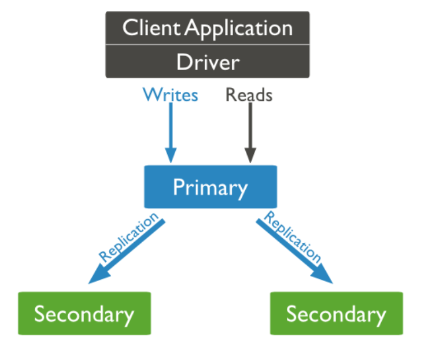

**副本集**

# 1、简介

MongoDB中的副本集（Replica Set）是一组维护相同数据集的mongod服务。 副本集可提供冗余和高

可用性，是所有生产部署的基础。

也可以说，副本集类似于有自动故障恢复功能的主从集群。通俗的讲就是用多台机器进行同一数据的异

步同步，从而使多台机器拥有同一数据的多个副本，并且当主库宕掉时在不需要用户干预的情况下自动

切换其他备份服务器做主库。而且还可以利用副本服务器做只读服务器，实现读写分离，提高负载。

## （1）冗余和数据可用性

复制提供冗余并提高数据可用性。 通过在不同数据库服务器上提供多个数据副本，复制可提供一定级别

的容错功能，以防止丢失单个数据库服务器。 在某些情况下，复制可以提供增加的读取性能，因为客户

端可以将读取操作发送到不同的服务上， 在不 同数据中心维护数据副本可以增加分布式应用程序的数据

位置和可用性。 您还可以为专用目的维护其他 副本，例如灾难恢复，报告或备份。

## （2）MongoDB中的复制

副本集是一组维护相同数据集的mongod实例。 副本集包含多个数据承载节点和可选的一个仲裁节点。

在承载数据的节点中，一个且仅一个成员被视为主节点，而其他节点被视为次要（从）节点。 主节点接

收所有写操作。 副本集只能有一个主要能够确认具有{w：“most”}写入关注的写入; 虽然在某 些情况

下，另一个mongod实例可能暂时认为自己也是主要的。主要记录其操作日志中的数据集的所有 更改，

即oplog。

## （3）主从复制和副本集区别

主从集群和副本集最大的区别就是副本集没有固定的“主节点”；整个集群会选出一个“主节点”，当其挂

掉后，又在剩下的从节点中选中其他节点为“主节点”，副本集总有一个活跃点(主、primary)和一个或多

个备份节点(从、secondary)。

# 2、副本集的三个角色

- 主要成员（Primary）：主要接收所有写操作。就是主节点。

- 副本成员（Replicate）：从主节点通过复制操作以维护相同的数据集，即备份数据，不可写操作，

但可 以读操作（但需要配置）。是默认的一种从节点类型。

- 仲裁者（Arbiter）：不保留任何数据的副本，只具有投票选举作用。当然也可以将仲裁服务器维护

为副 本集的一部分，即副本成员同时也可以是仲裁者。也是一种从节点类型。

**关于仲裁者的额外说明：**

您可以将额外的mongod实例添加到副本集作为仲裁者。 仲裁者不维护数据集。 仲裁者的目的是通过

响应其他副本集成员的心跳和选举请求来维护副本集中的仲裁。 因为它们不存储数据集，所以仲裁器可

以是提供副本集仲裁功能的好方法，其资源成本比具有数据集的全功能副本集成员更便宜。

如果您的副本集具有偶数个成员，请添加仲裁者以获得主要选举中的“大多数”投票。 仲裁者不需要专用硬件。

仲裁者将永远是仲裁者，而主要人员可能会退出并成为次要人员，而次要人员可能成为选举期间的主要人员。

如果你的副本+主节点的个数是偶数，建议加一个仲裁者，形成奇数，容易满足大多数的投票。

如果你的副本+主节点的个数是奇数，可以不加仲裁者。




# 3、副本集搭建

## 1）准备三台节点

```
# 在三台节点的配置文件中都需要加上以下配置，并且replSetName的值三台节点必须一致
replication:
oplogSizeMB: 2048
replSetName: my_repl
```

## 2）分别启动三个实例

## 3）主节点初始化，并添加副本

```
> rs.initiate()
{
  "info2" : "no configuration specified. Using a default configuration for
the set",
  "me" : "127.0.0.1:27017",
  "ok" : 1,
  "operationTime" : Timestamp(1602764647, 1),
  "$clusterTime" : {
    "clusterTime" : Timestamp(1602764647, 1),
    "signature" : {
      "hash" : BinData(0,"AAAAAAAAAAAAAAAAAAAAAAAAAAA="),
            "keyId" : NumberLong(0)
   }
 }
}
my_repl:SECONDARY>
my_repl:PRIMARY>
提示：
1）“ok”的值为1，说明创建成功。
2）命令行提示符发生变化，变成了一个从节点角色，此时默认不能读写。稍等片刻，回车，变成主节
点。
```

# 4）查看副本节点配置

```
my_repl:PRIMARY> rs.conf()
{
  "_id" : "my_repl",
  "version" : 1,
  "protocolVersion" : NumberLong(1),
  "writeConcernMajorityJournalDefault" : true,
  "members" : [
   {
      "_id" : 0,
      "host" : "127.0.0.1:27017",
      "arbiterOnly" : false,
      "buildIndexes" : true,
      "hidden" : false,
      "priority" : 1,
      "tags" : {
       
     },
      "slaveDelay" : NumberLong(0),
      "votes" : 1
   }
 ],
  "settings" : {
    "chainingAllowed" : true,
    "heartbeatIntervalMillis" : 2000,
    "heartbeatTimeoutSecs" : 10,
    "electionTimeoutMillis" : 10000,
    "catchUpTimeoutMillis" : -1,
    "catchUpTakeoverDelayMillis" : 30000,
    "getLastErrorModes" : {
     
   },
    "getLastErrorDefaults" : {
      "w" : 1,
      "wtimeout" : 0
   },
    "replicaSetId" : ObjectId("5f883f6730b7d82e37e0dcca")
 }
}
1） "_id" : "my_repl" ：副本集的配置数据存储的主键值，默认就是副本集的名字
2） "members" ：副本集成员数组，此时只有一个： "host" : "127.0.0.1:27017" ，该成员
不
是仲裁节点： "arbiterOnly" : false ，优先级（权重值）： "priority" : 1,
3） "settings" ：副本集的参数配置。
```

## 5）添加副本集

```
# 从节点包括仲裁节点是不需要做任何操作的，只需要正常启动即可，剩下的交给主节点去添加
# 添加副本节点
myrs:PRIMARY> rs.add("192.168.80.136:27017")
# 添加仲裁节点
myrs:PRIMARY> rs.addArb("192.168.80.137:27017")
```

## 6）设置从节点可读

```
rs.slaveOk()
```