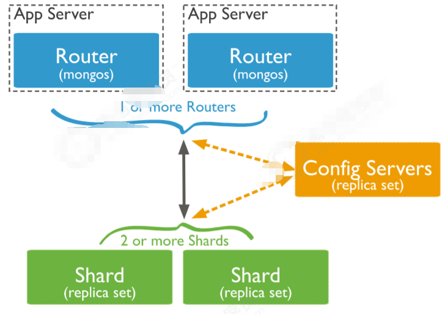

**分片集群**

# 1、概念

分片（sharding）是一种跨多台机器分布数据的方法， MongoDB使用分片来支持具有非常大的数据集

和高吞吐量操作的部署。

换句话说：分片(sharding)是指将数据拆分，将其分散存在不同的机器上的过程。有时也用分区

(partitioning)来表示这个概念。将数据分散到不同的机器上，不需要功能强大的大型计算机就可以储存

更多的数据，处理更多的负载。

具有大型数据集或高吞吐量应用程序的数据库系统可以会挑战单个服务器的容量。例如，高查询率会耗

尽服务器的CPU容量。工作集大小大于系统的RAM会强调磁盘驱动器的I / O容量。

有两种解决系统增长的方法：垂直扩展和水平扩展。

垂直扩展意味着增加单个服务器的容量，例如使用更强大的CPU，添加更多RAM或增加存储空间量。可

用技术的局限性可能会限制单个机器对于给定工作负载而言足够强大。此外，基于云的提供商基于可用

的硬件配置具有硬性上限。结果，垂直缩放有实际的最大值。 水平扩展意味着划分系统数据集并加载多

个服务器，添加其他服务器以根据需要增加容量。虽然单个机 器的总体速度或容量可能不高，但每台机

器处理整个工作负载的子集，可能提供比单个高速大容量服务器更高的效率。扩展部署容量只需要根据

需要添加额外的服务器，这可能比单个机器的高端硬件的总体 成本更低。权衡是基础架构和部署维护的

复杂性增加。

MongoDB支持通过分片进行水平扩展。

# 2、分片集群包含的组件

- 分片（存储）：每个分片包含分片数据的子集。 每个分片都可以部署为副本集。

- mongos（路由）：mongos充当查询路由器，在客户端应用程序和分片集群之间提供接口。

- config servers（“调度”的配置）：配置服务器存储群集的元数据和配置设置。 从MongoDB 3.4开

始，必须将配置服务器部署为副本集（CSRS）。



```
路由节点mongos
 * 提供集群单一入口
 * 转发应用端请求
 * 选择合适数据节点进行读写
 * 合并多个数据节点的返回
 * 无状态
 * 建议至少两个
配置节点mongod
 * 提供集群元数据存储
 * 分片数据分布的映射
数据节点mongod
 * 以复制集为单位
 * 横向扩展
 * 最大1024分片
 * 分片之间数据不重复
 * 所有分片在一起才可以完整工作
```

# 3、集群部署

## 1）规划

```
10个实例：38017-38026
（1）configserver:38018-38020
3台构成的复制集（1主两从，不支持arbiter）38018-38020（复制集名字configsvr）
（2）shard节点：
sh1：38021-23  （1主两从，其中一个节点为arbiter，复制集名字sh1）
sh2：38024-26  （1主两从，其中一个节点为arbiter，复制集名字sh2）
（3） mongos:
38017
```

## 2）分片节点准备

### 目录准备

```
mkdir -p /mongodb/38021/conf /mongodb/38021/log /mongodb/38021/data
mkdir -p /mongodb/38022/conf /mongodb/38022/log /mongodb/38022/data
mkdir -p /mongodb/38023/conf /mongodb/38023/log /mongodb/38023/data
mkdir -p /mongodb/38024/conf /mongodb/38024/log /mongodb/38024/data
mkdir -p /mongodb/38025/conf /mongodb/38025/log /mongodb/38025/data
mkdir -p /mongodb/38026/conf /mongodb/38026/log /mongodb/38026/data
```

### 第一组副本集搭建：端口号21-23，一主一从一监控

```
cat > /mongodb/38021/conf/mongodb.conf <<EOF
systemLog:
destination: file
path: /mongodb/38021/log/mongodb.log 
logAppend: true
storage:
journal:
 enabled: true
dbPath: /mongodb/38021/data
directoryPerDB: true
 #engine: wiredTiger
wiredTiger:
 engineConfig:
  cacheSizeGB: 1
  directoryForIndexes: true
 collectionConfig:
  blockCompressor: zlib
 indexConfig:
  prefixCompression: true
net:
bindIp: 192.168.80.10,127.0.0.1
port: 38021
replication:
oplogSizeMB: 2048
replSetName: sh1
sharding:
clusterRole: shardsvr
processManagement:
fork: true
EOF
\cp /mongodb/38021/conf/mongodb.conf /mongodb/38022/conf/
\cp /mongodb/38021/conf/mongodb.conf /mongodb/38023/conf/
sed 's#38021#38022#g' /mongodb/38022/conf/mongodb.conf -i
sed 's#38021#38023#g' /mongodb/38023/conf/mongodb.conf -i
```

### 第二组副本集搭建：端口号24-26，一主一从一监控

```
cat > /mongodb/38024/conf/mongodb.conf <<EOF
systemLog:
destination: file
path: /mongodb/38024/log/mongodb.log 
logAppend: true
storage:
journal:
 enabled: true
dbPath: /mongodb/38024/data
directoryPerDB: true
wiredTiger:
 engineConfig:
  cacheSizeGB: 1
  directoryForIndexes: true
 collectionConfig:
  blockCompressor: zlib
 indexConfig:
  prefixCompression: true
net:
bindIp: 192.168.80.10,127.0.0.1
port: 38024
replication:
oplogSizeMB: 2048
replSetName: sh2
sharding:
clusterRole: shardsvr
processManagement:
fork: true
EOF
\cp /mongodb/38024/conf/mongodb.conf /mongodb/38025/conf/
\cp /mongodb/38024/conf/mongodb.conf /mongodb/38026/conf/
sed 's#38024#38025#g' /mongodb/38025/conf/mongodb.conf -i
sed 's#38024#38026#g' /mongodb/38026/conf/mongodb.conf -i
```

### 启动所有节点，并搭建副本集

```
mongod -f /mongodb/38021/conf/mongodb.conf --fork
mongod -f /mongodb/38022/conf/mongodb.conf --fork
mongod -f /mongodb/38023/conf/mongodb.conf --fork
mongod -f /mongodb/38024/conf/mongodb.conf --fork
mongod -f /mongodb/38025/conf/mongodb.conf --fork
mongod -f /mongodb/38026/conf/mongodb.conf  --fork
ps -ef |grep mongod
mongo --port 38021
use admin
config = {_id: 'sh1', members: [
            {_id: 0, host: '192.168.80.10:38021'},
            {_id: 1, host: '192.168.80.10:38022'},
            {_id: 2, host:
'192.168.80.10:38023',"arbiterOnly":true}]
     }
rs.initiate(config)
mongo --port 38024
use admin
config = {_id: 'sh2', members: [
            {_id: 0, host: '192.168.80.10:38024'},
            {_id: 1, host: '192.168.80.10:38025'},
            {_id: 2, host:
'192.168.80.10:38026',"arbiterOnly":true}]
     }
rs.initiate(config)
```

## 3）config节点配置

### 目录创建

```
mkdir -p /mongodb/38018/conf /mongodb/38018/log /mongodb/38018/data
mkdir -p /mongodb/38019/conf /mongodb/38019/log /mongodb/38019/data
mkdir -p /mongodb/38020/conf /mongodb/38020/log /mongodb/38020/data
```

### 配置文件准备

```
cat > /mongodb/38018/conf/mongodb.conf <<EOF
systemLog:
destination: file
path: /mongodb/38018/log/mongodb.conf
logAppend: true
storage:
journal:
 enabled: true
dbPath: /mongodb/38018/data
directoryPerDB: true
 #engine: wiredTiger
wiredTiger:
 engineConfig:
  cacheSizeGB: 1
  directoryForIndexes: true
 collectionConfig:
  blockCompressor: zlib
 indexConfig:
  prefixCompression: true
net:
bindIp: 192.168.80.10,127.0.0.1
port: 38018
replication:
oplogSizeMB: 2048
replSetName: configReplSet
sharding:
clusterRole: configsvr
processManagement:
fork: true
EOF
\cp /mongodb/38018/conf/mongodb.conf /mongodb/38019/conf/
\cp /mongodb/38018/conf/mongodb.conf /mongodb/38020/conf/
sed 's#38018#38019#g' /mongodb/38019/conf/mongodb.conf -i
sed 's#38018#38020#g' /mongodb/38020/conf/mongodb.conf -i
```

### 启动所有节点

```
mongod -f /mongodb/38018/conf/mongodb.conf 
mongod -f /mongodb/38019/conf/mongodb.conf
mongod -f /mongodb/38020/conf/mongodb.conf
mongo --port 38018
use admin
config = {_id: 'configReplSet', members: [
            {_id: 0, host: '192.168.80.10:38018'},
            {_id: 1, host: '192.168.80.10:38019'},
            {_id: 2, host: '192.168.80.10:38020'}]
     }
rs.initiate(config) 
注：configserver 可以是一个节点，官方建议复制集。configserver不能有arbiter。
新版本中，要求必须是复制集。
注：mongodb 3.4之后，虽然要求config server为replica set，但是不支持arbiter
```

## 4）mongos节点配置

### 目录创建

```
mkdir -p /mongodb/38017/conf /mongodb/38017/log 
```

### 准备配置文件

```
cat > /mongodb/38017/conf/mongos.conf <<EOF
systemLog:
destination: file
path: /mongodb/38017/log/mongos.log
logAppend: true
net:
bindIp: 192.168.80.10,127.0.0.1
port: 38017
sharding:
configDB:
configReplSet/192.168.80.10:38018,192.168.80.10:38019,192.168.80.10:38020
processManagement:
fork: true
EOF
```

### 启动mongos

```
mongos -f /mongodb/38017/conf/mongos.conf 
```

## 5）使用分片

### 分片集群添加节点

```
连接到其中一个mongos（192.168.80.10），做以下配置
（1）连接到mongs的admin数据库
# su - mongod
$ mongo 192.168.80.10:38017/admin
（2）添加分片
db.runCommand( { addshard :
"sh1/192.168.80.10:38021,192.168.80.10:38022,192.168.80.10:38023",name:"shar
d1"} )
db.runCommand( { addshard :
"sh2/192.168.80.10:38024,192.168.80.10:38025,192.168.80.10:38026",name:"shar
d2"} )
（3）列出分片
mongos> db.runCommand( { listshards : 1 } )
（4）整体状态查看
mongos> sh.status();
```

### 激活数据库分片功能

```
mongo --port 38017 admin
admin> ( { enablesharding : "数据库名称" } )
eg：
admin> db.runCommand( { enablesharding : "test" } )
```

### 指定分片键对集合分片

```
### 创建索引
use test
> db.vast.ensureIndex( { id: 1 } )
### 开启分片
use admin
> db.runCommand( { shardcollection : "test.vast",key : {id: 1} } )
```

### 分片验证

```
admin> use test
test> for(i=1;i<10000000;i++){
db.vast.insert({"id":i,"name":"zhenjiang","age":70,"date":new Date()}); }
test> db.vast.stats()
shard1:
mongo --port 38021
db.vast.count();
shard2:
mongo --port 38024
db.vast.count();
```