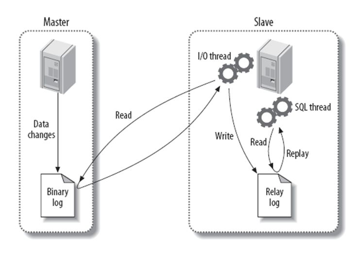

**主从复制原理**

# 1、复制过程

1. 主服务器上任何的更新操作会被写入到二进制日志文件中

1. 从服务器上的IO线程：

1. 检测主服务器的二进制日志文件的变化

1. 同步主服务器的二进制日志文件到本地的中继日志中

1. 从服务器上的sql线程负责读取和执行中继日志中的sql语句

# 2、应用场景

- 一主多从会去对应读写分离

- 写操作由主服务器

- 读操由从服务器

- 主服务器上：drop ……

- 要去做备份操作：在服务器上通过LVM快照进行备份

- 主服务器挂掉了，用户不可以进行写入操作

- 高可用模型：多主架构

- 任何一台服务器既是主服务器也是从服务器

- 高可用架构：MHA架构



# 3、实验

## 1）主库相关操作

### 修改配置文件

```
[root@server2 ~]# cat /etc/my.cnf
[mysqld]
......
server_id =1
log_bin=mysql-bin
......
[root@server2 ~]# systemctl restart mariadb.service
```

### 创建主从复制用户

```
[root@server2 ~]# mysql -uroot -p1
MariaDB [(none)]> grant replication slave on *.* to rep@'192.168.80.%'
identified by '123456'
```

### 记录主库位置点

```
MariaDB [(none)]> show master status;
+------------------+----------+--------------+------------------+
| File       | Position | Binlog_Do_DB | Binlog_Ignore_DB |
+------------------+----------+--------------+------------------+
| mysql-bin.000001 |    395 |       |         |
+------------------+----------+--------------+------------------+
1 row in set (0.00 sec)
```

## 2）从库相关操作

### 修改从库配置文件

```
[root@server3 ~]# cat /etc/my.cnf
......
server_id =5
......
[root@server3 ~]# systemctl restart mariadb.service
```

### 从库开始连接主库

```
MariaDB [(none)]> change master to
master_host='192.168.80.129',master_port=3306,master_user='rep',master_passw
ord='123456',master_log_file='mysql-bin.000001',master_log_pos=395;
Query OK, 0 rows affected (0.00 sec)
MariaDB [(none)]> start slave;
Query OK, 0 rows affected (0.01 sec)
MariaDB [(none)]> show slave status\G;
*************************** 1. row ***************************
       Slave_IO_State: Waiting for master to send event
......
      Slave_IO_Running: Yes
     Slave_SQL_Running: Yes
......
```

### 验证结果

```
# 在主库上建库
MariaDB [(none)]> create database db1;
Query OK, 1 row affected (0.00 sec)
# 在从库上查库
MariaDB [(none)]> show databases;
+--------------------+
| Database      |
+--------------------+
| information_schema |
| db1        |
| mysql       |
| performance_schema |
+--------------------+
```