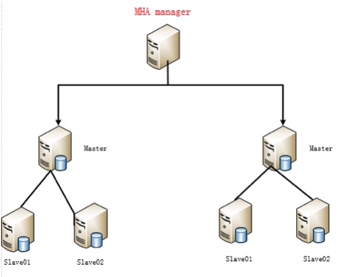
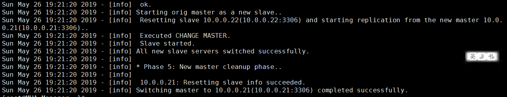

**MHA架构**

扩展自行研究此部分

# 1、简介：

MHA能够在较短的时间内实现自动故障检测和故障转移，通常在10-30秒以内;在复制框架中，MHA能够

很好地解决复制过程中的数据一致性问题，由于不需要在现有的replication中添加额外的服务器，仅需

要一个manager节点，而一个Manager能管理多套复制，所以能大大地节约服务器的数量;另外，安装简

单，无性能损耗，以及不需要修改现有的复制部署也是它的优势之处。

MHA还提供在线主库切换的功能，能够安全地切换当前运行的主库到一个新的主库中(通过将从库提升为

主库),大概0.5-2秒内即可完成。

# 2、工作流程：

- 1)把宕机的master二进制日志保存下来。

- 2)找到binlog位置点最新的slave。

- 3)在binlog位置点最新的slave上用relay log（差异日志）修复其它slave。

- 4)将宕机的master上保存下来的二进制日志恢复到含有最新位置点的slave上。

- 5)将含有最新位置点binlog所在的slave提升为master。

- 6)将其它slave重新指向新提升的master，并开启主从复制。

架构图：



# 3、部署

自行百度完成MHA架构的部署，这里给大家提供一篇参考博客：[https://www.cnblogs.com/fawaikuangtu123/p/10927888.html](https://www.cnblogs.com/fawaikuangtu123/p/10927888.html)

# 1.优势

  相较于其它HA软件,MHA的目的在于维持MySQL Replication中

a.当master出现故障时,通过对比slave之间读取master binlog的位置,

b.其它slave

c.在latest slave上

d.最后在

  在MHA实现Master故障切换过程中,MHA Node会试图访问故障的master(通过SSH),如果可以访问(不是硬件故障,比如InnoDB数据文件损坏等),会保存二进制文件,以最大程度保证数据不丢失.

MHA软件的架构:由两部分组成,Manager工具包和Node工具包,

```
Manager工具包主要包括以下几个工具:
masterha_check_ssh              检查MHA的SSH配置状况
masterha_check_repl             检查MySQL复制状况
masterha_manger                 启动MHA
masterha_check_status           检测当前MHA运行状态
masterha_master_monitor       检测master是否宕机
masterha_master_switch          控制故障转移（自动或者手动）
masterha_conf_host               添加或删除配置的server信息
```

Node工具包(这些工具通常由MHA Manager的脚本触发,无需人为操作)主要包括以下几个工具:

```
save_binary_logs        保存和复制master的二进制日志
apply_diff_relay_logs   识别差异的中继日志事件并将其差异的事件应用于其他的slave
purge_relay_logs        清除中继日志(不会阻塞SQL线程)
```

# 2.基于半同步复制部署一主两从

10.0.0.20  MHA-Manager

10.0.0.21  MariaDB-21  

10.0.0.22  MariaDB-22  

10.0.0.23  MariaDB-23  

在MHA-Manager上生成一对密钥,将这对密钥和know_hosts文件拷贝给其余主机,不需要所有主机都生成密钥对相互拷贝

```
ssh-keygen
ssh-copy-id 10.0.0.20
ssh-copy-id 10.0.0.21
ssh-copy-id 10.0.0.22
ssh-copy-id 10.0.0.23
scp -r id_rsa known_hosts root@10.0.0.21:/root/.ssh/
scp -r id_rsa known_hosts root@10.0.0.22:/root/.ssh/
scp -r id_rsa known_hosts root@10.0.0.23:/root/.ssh/
```

先搭建一主两从,在21、22、23上安装MariaDB

```
cat /etc/yum.repos.d/mariadb.repo
[mariadb]
name=MariaDB
baseurl=http://mirrors.ustc.edu.cn/mariadb/yum/10.2/centos7-amd64/
gpgkey=http://mirrors.ustc.edu.cn/mariadb/yum/RPM-GPG-KEY-MariaDB
gpgcheck=1
 
yum -y install MariaDB-server MariaDB-client
# 安装包在最下面第一篇博客中会有百度云链接
yum -y install mha4mysql-node-0.56-0.el6.noarch.rpm
systemctl start mariadb
# 除了将密码改为mariadb123456,其余步骤都按Y
/usr/bin/mysql_secure_installation
 
# 在Master和Slave首次启动时,安装插件,开启半同步复制
# mariadb10.3无需安装插件可以直接命令开启
mysql -uroot -pmariadb123456
# 在MariaDB-21、MariaDB-22上均安装这两个模块,因为指不定哪天MariaDB-22就上位了
install plugin rpl_semi_sync_master soname 'semisync_master.so';
install plugin rpl_semi_sync_slave soname 'semisync_slave.so';
set global rpl_semi_sync_master_enabled = 1;
set global rpl_semi_sync_slave_enabled = 1;
grant replication slave on *.* to 'repluser'@'10.0.0.%' identified by 'repluser123456';
flush privileges;
 
# 在MariaDB-23上仅开启开启从同步模块
# 不用给它授权用户,因为我们会在MHA中设置,它不会有机会成为master
install plugin rpl_semi_sync_slave soname 'semisync_slave.so';
set global rpl_semi_sync_slave_enabled = 1;
```

修改三台MariaDB的配置文件

```
# MariaDB-21配置文件
cat /etc/my.cnf.d/server.cnf
[mysqld]
skip_name_resolve = ON
innodb_file_per_table = ON
server-id = 21
log-bin = master-bin
relay_log_purge = 0
rpl_semi_sync_master_enabled = 1
rpl_semi_sync_master_timeout = 3000
rpl_semi_sync_slave_enabled = 1
 
# MariaDB-22配置文件
cat /etc/my.cnf.d/server.cnf
[mysqld]
skip_name_resolve = ON
innodb_file_per_table = ON
server-id = 22
log-bin = master-bin
relay_log_purge = 0
rpl_semi_sync_master_enabled = 1
rpl_semi_sync_master_timeout = 3000
rpl_semi_sync_slave_enabled = 1
 
# MariaDB-23配置文件
cat /etc/my.cnf.d/server.cnf
[mysqld]
skip_name_resolve = ON
innodb_file_per_table = ON
server-id = 23
log-bin = master-bin
relay_log_purge = 0
rpl_semi_sync_slave_enabled = 1
```

重启三台mariadb,加载配置文件

```
systemctl restart mariadb.service
 
# 查看10.0.0.21上的Position位置
show master status\G
File: master-bin.000001
Position: 657
# 在10.0.0.22、23上配置主从同步
change master to master_host='10.0.0.21',master_user='repluser',
master_password='repluser123456',master_log_file='master-bin.000001',master_log_pos=657;
start slave;
 
# 在10.0.0.21上授权用户,mhauser用于MHA管理各节点,两台Slave会同步这两个用户
grant all on *.* to 'mhauser'@'10.0.0.%' identified by 'mhauser123456';
flush privileges;
```

# 3.安装mha-manager

```
yum -y install mha4mysql-manager-0.56-0.el6.noarch.rpm \
mha4mysql-node-0.56-0.el6.noarch.rpm
mkdir /etc/mha
cat /etc/mha/app1.conf
[server default]
user=mhauser
password=mhauser123456
ssh_user=root
master_binlog_dir=/var/lib/mysql
remote_workdir=/data/log/masterha
manager_workdir=/usr/local/mha
manager_log=/usr/local/mha/manager.log
 
ping_interval=1
repl_user=repluser
repl_password=repluser123456
 
[server1]
hostname=10.0.0.21
candidate_master=1
 
[server2]
hostname=10.0.0.22
candidate_master=1
 
[server3]
hostname=10.0.0.23
no_master=1
 
# ssh检测,授权检测,启动MHA
chmod +x /etc/mha/app1.conf
mkdir /usr/local/mha
 
masterha_check_ssh --conf=/etc/mha/app1.conf
masterha_check_repl --conf=/etc/mha/app1.conf
masterha_manager --conf=/etc/mha/app1.conf  2>&1 &
masterha_check_status --conf=/etc/mha/app1.conf
```

# 4.故障切换

在10.0.0.21上关闭mariadb

mysqladmin -uroot -p "shutdown"

可以看到

如果想让21重新变成master,先将master指向22

```
change master to master_host='10.0.0.22',master_user='repluser',
master_password='repluser123456',master_log_file='master-bin.000001',master_log_pos=657;
start slave;
# 再在mha-manager手动执行切换命令
masterha_master_switch --conf=/etc/mha/app1.conf --master_state=alive \
--new_master_host=10.0.0.21 --new_master_port=3306 --orig_master_is_new_slave
```

下面这张图是10.0.0.21重新上线后,手动切换其为master的截图



MHA配置VIP,利用GITD等都没有做,但是下面几篇参考博客都写得不错

 

有些MHA的注意事项,附带网盘链接:[https://blog.51cto.com/11010461/2130309](https://blog.51cto.com/11010461/2130309)

他的个人博客写的还行:[https://blogteching.com/](https://blogteching.com/)

长跑者1号[https://blog.51cto.com/11233559/2110751](https://blog.51cto.com/11233559/2110751)

可行性很高,他的每篇博客都写的很多,譬如这篇,搭建了10种MySQL架构,

MHA配置VIP可以[https://www.cnblogs.com/kevingrace/p/5662839.html](https://www.cnblogs.com/kevingrace/p/5662839.html)

兔样兔森破[https://blog.51cto.com/arkling/category3.html](https://blog.51cto.com/arkling/category3.html)

运维那些事

包括自动切换和手动切换:[https://www.ywnds.com/?p=8129](https://www.ywnds.com/?p=8129)

漠效[https://blog.csdn.net/gx_1_11_real/article/category/7735883](https://blog.csdn.net/gx_1_11_real/article/category/7735883)

MariaDB的GTID介绍:[https://www.tuicool.com/articles/raaMfeV](https://www.tuicool.com/articles/raaMfeV)

 