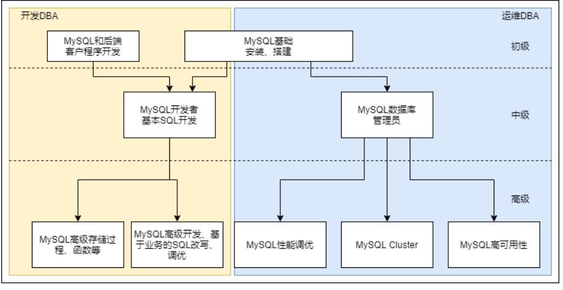
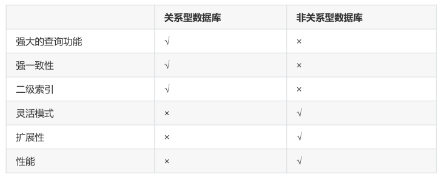

**DBA简介**

# 1、DBA工作内容

- 数据管理

- 增删改查

- 用户管理

- grant all on . to all@'%' identified by '123';

- 敲完这条命令就可以等着被开除了( • ̀ω•́ )✧

- root，运维用户ops，程序连接用户(只读用户，读写用户)

- 集群管理

- 数据备份、恢复

- 逻辑备份

- 物理备份

- 冷备

- 热备

- 温备

- 全备

- 增量备份

- 差异备份

- 监控

- 进程，端口

- 集群状态

- 主从复制 延时情况

- SQL读写速率

- slowlog

# 2、什么是数据

数据(data)是事实或观察的结果，是对客观事物的逻辑归纳，是用于表示客观事物的未经加工的的原始素材。

数据可以是连续的值，比如声音、图像，称为模拟数据。也可以是离散的，如符号、文字，称为数字数据。

在计算机系统中，数据以二进制信息单元0,1的形式表示。

**数据的定义:**

等进行记载的物理符号或这些物理符号的组合。它是可识别的、抽象的符号。*

# 3、什么是数据库管理系统

DBMS（database management system）

# 4、数据库管理系统种类

## 1）功能对比

## 2）特点对比

- 关系型数据库（RDBMS）的特点：

- 二维表

- 典型产品Oracle传统企业，MySQL互联网企业

- 数据存取是通过SQL（Structured Query Language结构化查询语言）

- 最大特点数据安全性方面强（ACID）

- 非关系型数据库（NoSQL：Not only SQL）的特点：

- 不是否定关系型数据库，而是做关系型数据库的补充

# 5、数据库市场

- MySQL的市场应用

- 中、大型互联网公司

- 市场空间：互联网领域第一

- 趋势明显

- 同源产品：MariaDB、PerconaDB

- 类似产品

- 微软：SQLserver

- 微软和sysbase合作开发的产品，后来自己开发，windows平台

- 三、四线小公司，传统行业在用

- IBM：DB2

- 市场占有量小

- 目前只有：国有银行（人行，中国银行，工商银行等）、中国移动应用

- PostgreSQL

- MongoDB

- Redis

# 6、MySQL发展史

- 979年，报表工具Unireg出现。

- 1985年，以瑞典David Axmark为首，成立了一家公司（AB前身），ISAM引擎出现。

- 1990年，提供SQL支持。

- 1999年-2000年，MySQL AB公司成立，并公布源码，开源化。

- 2000年4月BDB引擎出现，支持事务。

- 2008年1月16日 MySQL被Sun公司收购。

- 2009年4月20日Oracle收购Sun公司，MySQL转入Oracle门下