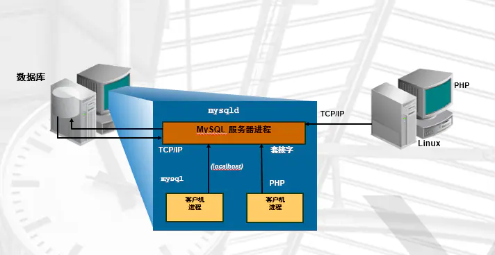
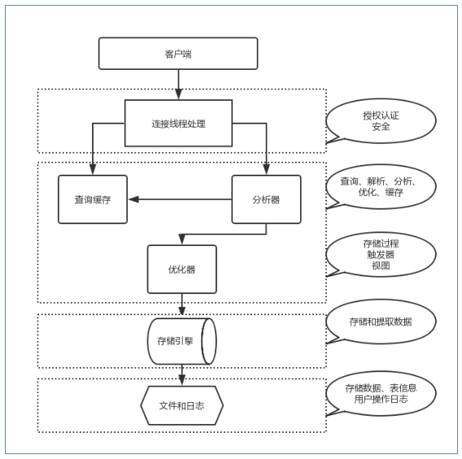
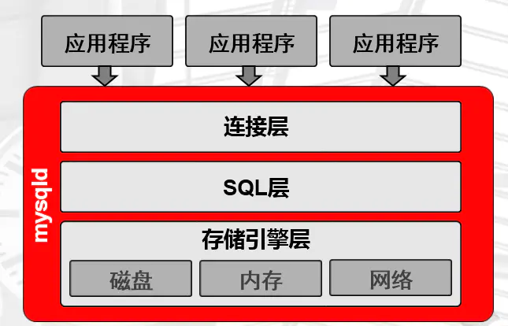

**MySQL体系结构**

# 1、C/S(客户端/服务端)模型介绍



# 2、连接方式

TCP/IP连接

```
[root@localhost ~]# mysql -uroot -p777 -h 192.168.80.128 -P3306 
```

socket方式连接

```
[root@localhost ~]# mysql -uroot -p -S /tmp/mysql.sock 
```

# 3、实例介绍

实例=mysqld后台守护进程+Master Thread +干活的Thread+预分配的内存

公司=老板+经理+员工+办公室

# 4、工作流程



1. 首先，最上层的服务并不是MySQL独有的，大多数给予网络的客户端/服务器的工具或者服务都有

类似的架 构。比如：连接处理、授权认证、安全等。

1. 第二层的架构包括大多数的MySQL的核心服务。包括：查询解析、分析、优化、缓存以及所有的内

置函数 （例如：日期、时间、数学和加密函数）。同时，所有的跨存储引擎的功能都在这一层实

现：存储过程、触发 器、视图等。

1.  第三层包含了存储引擎。存储引擎负责MySQL中数据的存储和提取。服务器通过API和存储引擎进

行通信。这 些接口屏蔽了不同存储引擎之间的差异，使得这些差异对上层的查询过程透明化。存储

引擎API包含十几个底 层函数，用于执行“开始一个事务”等操作。但存储引擎一般不会去解析

SQL（InnoDB会解析外键定义，因为其 本身没有实现该功能），不同存储引擎之间也不会相互通

信，而只是简单的响应上层的服务器请求。

1. 第四层包含了文件系统，所有的表结构和数据以及用户操作的日志最终还是以文件的形式存储在硬盘上

# 5、程序结构

把工作流程相同功能划分为一个结构里，可以形成MySQL的体系结构，如下图。值得一提的是MySQL存

储引擎层使用的是插件式结构，可以根据场景不同选择不同的存储引擎。不同的存储引擎对于上层的应

用程序或者是底层的文件系统是透明的。我们把MySQL的体系结构称为插件式存储引擎结构。



- 连接层功能

- 提供连接协议：TCP/IP 、SOCKET

- 提供验证：用户、密码，IP，SOCKET

- 提供专用连接线程：接收用户SQL，返回结果

```
通过以下语句可以查看到连接线程基本情况
MariaDB [(none)]> show processlist;
+----+------+-----------+------+---------+------+-------+------------------+-
---------+
| Id | User | Host   | db  | Command | Time | State | Info       |
Progress |
+----+------+-----------+------+---------+------+-------+------------------+-
---------+
|  2 | root | localhost | NULL | Sleep  | 6792 |    | NULL       |
  0.000 |
|  4 | root | localhost | NULL | Query  |   0 | NULL | show processlist |
  0.000 |
+----+------+-----------+------+---------+------+-------+------------------+-
---------+
```

- SQL层（重点）

- 接收上层传送的SQL语句

- 语法验证模块：验证语句语法,是否满足SQL_MODE

- 语义检查：判断SQL语句的类型

- DDL ：数据定义语言

- DCL ：数据控制语言

- DML ：数据操作语言

- DQL： 数据查询语言

- 权限检查：用户对库表有没有权限

- 解析器：对语句执行前，进行预处理，生成解析树(执行计划)，说白了就是生成多种执行方案

- 优化器：根据解析器得出的多种执行计划，进行判断，选择最优的执行计划。代价模型：资源

（CPU IO MEM）的耗损评估性能好坏

- 执行器：根据最优执行计划，执行SQL语句，产生执行结果

- 提供查询缓存（默认是没开启的），会使用redis tair替代查询缓存功能

- 提供日志记录（日志管理章节）：binlog，默认是没开启的。

- 存储引擎层

- 负责根据SQL层执行的结果，从磁盘上拿数据

- 将16进制的磁盘数据，交由SQL结构化化成表

- 连接层的专用线程返回给用户

# 6、逻辑结构

- 库

- 库名

- 属性

- 用文件系统的目录来存储

```
[root@localhost mysql]# ll
总用量 28700
-rw-rw----. 1 mysql mysql   16384 9月  6 20:31 aria_log.00000001
-rw-rw----. 1 mysql mysql    52 9月  6 20:31 aria_log_control
-rw-rw----. 1 mysql mysql 18874368 9月  6 20:31 ibdata1
-rw-rw----. 1 mysql mysql  5242880 9月  6 20:31 ib_logfile0
-rw-rw----. 1 mysql mysql  5242880 9月  6 19:45 ib_logfile1
drwx------. 2 mysql mysql   4096 9月  6 19:45 mysql
srwxrwxrwx. 1 mysql mysql     0 9月  6 20:31 mysql.sock
drwx------. 2 mysql mysql   4096 9月  6 19:45 performance_schema
drwx------. 2 mysql mysql     6 9月  6 19:45 test
=====================================================================
MariaDB [(none)]> show databases;
+--------------------+
| Database      |
+--------------------+
| information_schema |
| mysql       |
| performance_schema |
| test        |
+--------------------+
```

- 表

- 表名

- 属性

- 列，列名，列属性

- 数据行

- 用文件系统的文件来存储

```
[root@localhost mysql]# cd mysql/
[root@localhost mysql]# ll
总用量 1000
-rw-rw----. 1 mysql mysql  8820 9月  6 19:45 columns_priv.frm
-rw-rw----. 1 mysql mysql    0 9月  6 19:45 columns_priv.MYD
-rw-rw----. 1 mysql mysql  4096 9月  6 19:45 columns_priv.MYI
-rw-rw----. 1 mysql mysql  9582 9月  6 19:45 db.frm
-rw-rw----. 1 mysql mysql   880 9月  6 19:45 db.MYD
-rw-rw----. 1 mysql mysql  5120 9月  6 19:45 db.MYI
-rw-rw----. 1 mysql mysql  10239 9月  6 19:45 event.frm
-rw-rw----. 1 mysql mysql    0 9月  6 19:45 event.MYD
......
-rw-rw----. 1 mysql mysql  10630 9月  6 19:45 user.frm
-rw-rw----. 1 mysql mysql   544 9月  6 20:22 user.MYD
-rw-rw----. 1 mysql mysql  2048 9月  6 20:30 user.MYI
=====================================================================
MariaDB [(none)]> use mysql
Reading table information for completion of table and column names
You can turn off this feature to get a quicker startup with -A
Database changed
MariaDB [mysql]> show tables;
+---------------------------+
| Tables_in_mysql      |
+---------------------------+
| columns_priv       |
| db            |
| event           |
| func           |
......
| user           |
+---------------------------+
```