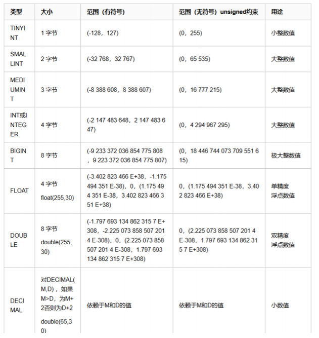
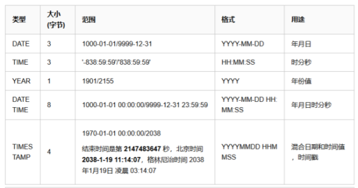
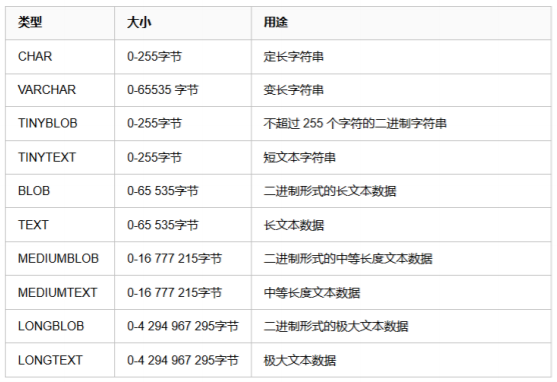
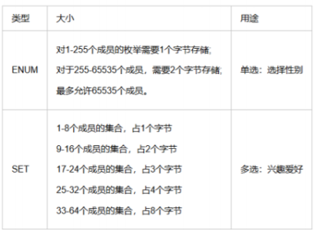

**数据类型**

# 1、整数类型



## 1)INT整数示例

```
# 创建表一个是默认宽度的int，一个是指定宽度的int(5)
mysql> create table t1 (id1 int,id2 int(5));
Query OK, 0 rows affected (0.02 sec)
# 像t1中插入数据1，1
mysql> insert into t1 values (1,1);
Query OK, 1 row affected (0.01 sec)
# 可以看出结果上并没有异常
mysql> select * from t1;
+------+------+
| id1 | id2 |
+------+------+
| 1 | 1 |
+------+------+
row in set (0.00 sec)
# 那么当我们插入了比宽度更大的值，会不会发生报错呢？
mysql> insert into t1 values (111111,111111);
Query OK, 1 row affected (0.00 sec)
# 答案是否定的，id2仍然显示了正确的数值，没有受到宽度限制的影响
mysql> select * from t1;
+------------+--------+
| id1 | id2 |
+------------+--------+
| 0000000001 | 00001 |
| 0000111111 | 111111 |
+------------+--------+
rows in set (0.00 sec)
# 修改id1字段 给字段添加一个unsigned表示无符号
mysql> alter table t1 modify id1 int unsigned;
Query OK, 0 rows affected (0.01 sec)
Records: 0 Duplicates: 0 Warnings: 0
mysql> desc t1;
+-------+------------------+------+-----+---------+-------+
| Field | Type |
 Null | Key | Default | Extra |
+-------+------------------+------+-----+---------+-------+
| id1 | int(10) unsigned | YES | | NULL | |
| id2 | int(5) | YES | | NULL | |
+-------+------------------+------+-----+---------+-------+
rows in set (0.01 sec)
# 当给id1添加的数据大于214748364时，可以顺利插入
mysql> insert into t1 values (2147483648,2147483647);
Query OK, 1 row affected (0.00 sec)
# 当给id2添加的数据大于214748364时，会报错
mysql> insert into t1 values (2147483647,2147483648);
ERROR 1264 (22003): Out of range value for column 'id2' at row 1
```

## 2)小数示例

```
# 创建表的三个字段分别为float，double和decimal参数表示一共显示5位，小数部分占2位
mysql> create table t2 (id1 float(5,2),id2 double(5,2),id3 decimal(5,2));
Query OK, 0 rows affected (0.02 sec)
# 向表中插入1.23，结果正常
mysql> insert into t2 values (1.23,1.23,1.23);
Query OK, 1 row affected (0.00 sec)
mysql> select * from t2;
+------+------+------+
| id1 | id2 | id3 |
+------+------+------+
| 1.23 | 1.23 | 1.23 |
+------+------+------+
row in set (0.00 sec)
# 向表中插入1.234，会发现4都被截断了
mysql> insert into t2 values (1.234,1.234,1.234);
Query OK, 1 row affected, 1 warning (0.00 sec)
mysql> select * from t2;
+------+------+------+
| id1 | id2 | id3 |
+------+------+------+
| 1.23 | 1.23 | 1.23 |
| 1.23 | 1.23 | 1.23 |
+------+------+------+
rows in set (0.00 sec)
# 向表中插入1.235发现数据虽然被截断，但是遵循了四舍五入的规则
mysql> insert into t2 values (1.235,1.235,1.235);
Query OK, 1 row affected, 1 warning (0.00 sec)
mysql> select * from t2;
+------+------+------+
| id1 | id2 | id3 |
+------+------+------+
| 1.23 | 1.23 | 1.23 |
| 1.23 | 1.23 | 1.23 |
| 1.24 | 1.24 | 1.24 |
+------+------+------+
rows in set (0.00 sec)
# 建新表去掉参数约束
mysql> create table t3 (id1 float,id2 double,id3 decimal);
Query OK, 0 rows affected (0.02 sec)
# 分别插入1.234
mysql> insert into t3 values (1.234,1.234,1.234);
Query OK, 1 row affected, 1 warning (0.00 sec)
# 发现decimal默认值是(10,0)的整数
mysql> select * from t3;
+-------+-------+------+
| id1 | id2 | id3 |
+-------+-------+------+
| 1.234 | 1.234 | 1 |
+-------+-------+------+
row in set (0.00 sec)
# 当对小数位没有约束的时候，输入超长的小数，会发现float和double的区别
mysql> insert into t3 values
(1.2355555555555555555,1.2355555555555555555,1.2355555555555555555555);
Query OK, 1 row affected, 1 warning (0.00 sec)
mysql> select * from t3;
+---------+--------------------+------+
| id1 | id2 | id3 |
+---------+--------------------+------+
| 1.234 | 1.234 | 1 |
| 1.23556 | 1.2355555555555555 | 1 |
+---------+--------------------+------+
rows in set (0.00 sec)
```

# 2、日期时间类型



## 1）data/time/datatime示例

```
mysql> create table t4 (d date,t time,dt datetime);
Query OK, 0 rows affected (0.02 sec)
mysql> desc t4;
+-------+----------+------+-----+---------+-------+
| Field | Type | Null | Key | Default | Extra |
+-------+----------+------+-----+---------+-------+
| d | date | YES | | NULL | |
| t | time | YES | | NULL | |
| dt | datetime | YES | | NULL | |
+-------+----------+------+-----+---------+-------+
rows in set (0.01 sec)
mysql> insert into t4 values (now(),now(),now());
Query OK, 1 row affected, 1 warning (0.01 sec)
mysql> select * from t4;
+------------+----------+---------------------+
| d | t | dt |
+------------+----------+---------------------+
| 2018-09-21 | 14:51:51 | 2018-09-21 14:51:51 |
+------------+----------+---------------------+
row in set (0.00 sec)
mysql> insert into t4 values (null,null,null);
Query OK, 1 row affected (0.01 sec)
mysql> select * from t4;
+------------+----------+---------------------+
| d | t | dt |
+------------+----------+---------------------+
| 2018-09-21 | 14:51:51 | 2018-09-21 14:51:51 |
| NULL | NULL | NULL |
+------------+----------+---------------------+
rows in set (0.00 sec)
```

## 2）timestamp示例

```
mysql> create table t5 (id1 timestamp);
Query OK, 0 rows affected (0.02 sec)
mysql> desc t5;
+-------+-----------+------+-----+-------------------+-----------------------------
+
| Field | Type | Null | Key | Default | Extra |
+-------+-----------+------+-----+-------------------+-----------------------------
+
| id1 | timestamp | NO | | CURRENT_TIMESTAMP | on update CURRENT_TIMESTAMP |
+-------+-----------+------+-----+-------------------+-----------------------------
+
row in set (0.00 sec)
# 插入数据null，会自动插入当前时间的时间
mysql> insert into t5 values (null);
Query OK, 1 row affected (0.00 sec)
mysql> select * from t5;
+---------------------+
| id1 |
+---------------------+
| 2018-09-21 14:56:50 |
+---------------------+
row in set (0.00 sec)
#添加一列 默认值是'0000-00-00 00:00:00'
mysql> alter table t5 add id2 timestamp;
Query OK, 0 rows affected (0.02 sec)
Records: 0 Duplicates: 0 Warnings: 0
mysql> show create table t5 \G;
*************************** 1. row ***************************
Table: t5
Create Table: CREATE TABLE `t5` (
`id1` timestamp NOT NULL DEFAULT CURRENT_TIMESTAMP ON UPDATE
CURRENT_TIMESTAMP,
`id2` timestamp NOT NULL DEFAULT '0000-00-00 00:00:00'
) ENGINE=InnoDB DEFAULT CHARSET=utf8
row in set (0.00 sec)
ERROR:
No query specified
# 手动修改新的列默认值为当前时间
mysql> alter table t5 modify id2 timestamp default current_timestamp;
Query OK, 0 rows affected (0.02 sec)
Records: 0 Duplicates: 0 Warnings: 0
mysql> show create table t5 \G;
*************************** 1. row ***************************
Table: t5
Create Table: CREATE TABLE `t5` (
`id1` timestamp NOT NULL DEFAULT CURRENT_TIMESTAMP ON UPDATE
CURRENT_TIMESTAMP,
`id2` timestamp NOT NULL DEFAULT CURRENT_TIMESTAMP
) ENGINE=InnoDB DEFAULT CHARSET=utf8
row in set (0.00 sec)
ERROR:
No query specified
mysql> insert into t5 values (null,null);
Query OK, 1 row affected (0.01 sec)
mysql> select * from t5;
+---------------------+---------------------+
| id1 | id2 |
+---------------------+---------------------+
| 2018-09-21 14:56:50 | 0000-00-00 00:00:00 |
| 2018-09-21 14:59:31 | 2018-09-21 14:59:31 |
+---------------------+---------------------+
rows in set (0.00 sec) 
```

## 3）timestamp示例2

```
mysql> create table t6 (t1 timestamp);
Query OK, 0 rows affected (0.02 sec)
mysql> desc t6;
+-------+-----------+------+-----+-------------------+-----------------------------
+
| Field | Type | Null | Key | Default | Extra |
+-------+-----------+------+-----+-------------------+-----------------------------
+
| t1 | timestamp | NO | | CURRENT_TIMESTAMP | on update CURRENT_TIMESTAMP |
+-------+-----------+------+-----+-------------------+-----------------------------
+
row in set (0.01 sec)
mysql> insert into t6 values (19700101080001);
Query OK, 1 row affected (0.00 sec)
mysql> select * from t6;
+---------------------+
| t1 |
+---------------------+
| 1970-01-01 08:00:01 |
+---------------------+
row in set (0.00 sec)
# timestamp时间的下限是19700101080001
mysql> insert into t6 values (19700101080000);
ERROR 1292 (22007): Incorrect datetime value: '19700101080000' for column
't1' at row 1
mysql> insert into t6 values ('2038-01-19 11:14:07');
Query OK, 1 row affected (0.00 sec)
# timestamp时间的上限是2038-01-19 11:14:07
mysql> insert into t6 values ('2038-01-19 11:14:08');
ERROR 1292 (22007): Incorrect datetime value: '2038-01-19 11:14:08' for
column 't1' at row 1
```

## 4）year示例

```
mysql> create table t7 (y year);
Query OK, 0 rows affected (0.02 sec)
mysql> insert into t7 values (2018);
Query OK, 1 row affected (0.00 sec)
mysql> select * from t7;
+------+
| y |
+------+
| 2018 |
+------+
row in set (0.00 sec)
```

# 3、字符串类型



## 1）字符串示例

```
mysql> create table t9 (v varchar(4),c char(4));
Query OK, 0 rows affected (0.01 sec)
mysql> insert into t9 values ('ab ','ab ');
Query OK, 1 row affected (0.00 sec)
# 在检索的时候char数据类型会去掉空格
mysql> select * from t9;
+------+------+
| v | c |
+------+------+
| ab | ab |
+------+------+
row in set (0.00 sec)
# 来看看对查询结果计算的长度
mysql> select length(v),length(c) from t9;
+-----------+-----------+
| length(v) | length(c) |
+-----------+-----------+
| 4 | 2 |
+-----------+-----------+
row in set (0.00 sec)
# 给结果拼上一个加号会更清楚
mysql> select concat(v,'+'),concat(c,'+') from t9;
+---------------+---------------+
| concat(v,'+') | concat(c,'+') |
+---------------+---------------+
| ab + | ab+ |
+---------------+---------------+
row in set (0.00 sec)
# 当存储的长度超出定义的长度，会截断
mysql> insert into t9 values ('abcd ','abcd ');
Query OK, 1 row affected, 1 warning (0.01 sec)
mysql> select * from t9;
+------+------+
| v | c |
+------+------+
| ab | ab |
| abcd | abcd |
+------+------+
rows in set (0.00 sec)
```

# 4、ENUM和SET类型

- ENUM中文名称叫枚举类型，它的值范围需要在创建表时通过枚举方式显示。ENUM只允许从值集

合中选取单个 值，而不能一次取多个值。

SET和ENUM非常相似，也是一个字符串对象，里面可以包含0-64个成员。根据成员的不同，存储

- 上也有所不同。 set类型可以允许值集合中任意选择1或多个元素进行组合。对超出范围的内容将不

允许注入，而对重复的值将进行自动去重



- 示例

```
mysql> create table t10 (name char(20),gender enum('female','male'));
Query OK, 0 rows affected (0.01 sec)
# 选择enum('female','male')中的一项作为gender的值，可以正常插入
mysql> insert into t10 values ('nezha','male');
Query OK, 1 row affected (0.00 sec)
# 不能同时插入'male,female'两个值，也不能插入不属于'male,female'的值
mysql> insert into t10 values ('nezha','male,female');
ERROR 1265 (01000): Data truncated for column 'gender' at row 1
mysql> create table t11 (name char(20),hobby set('抽烟','喝酒','烫头','翻车'));
Query OK, 0 rows affected (0.01 sec)
# 可以任意选择set('抽烟','喝酒','烫头','翻车')中的项，并自带去重功能
mysql> insert into t11 values ('yuan','烫头,喝酒,烫头');
Query OK, 1 row affected (0.01 sec)
mysql> select * from t11;
+------+---------------+
| name | hobby |
+------+---------------+
| yuan | 喝酒,烫头 |
+------+---------------+
row in set (0.00 sec)
# 不能选择不属于set('抽烟','喝酒','烫头','翻车')中的项，
mysql> insert into t11 values ('alex','烫头,翻车,看妹子');
```