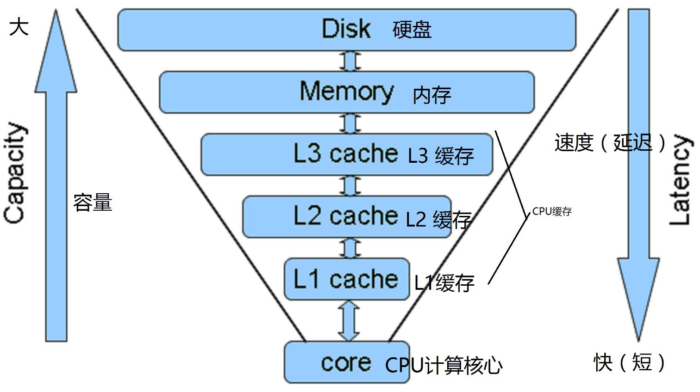
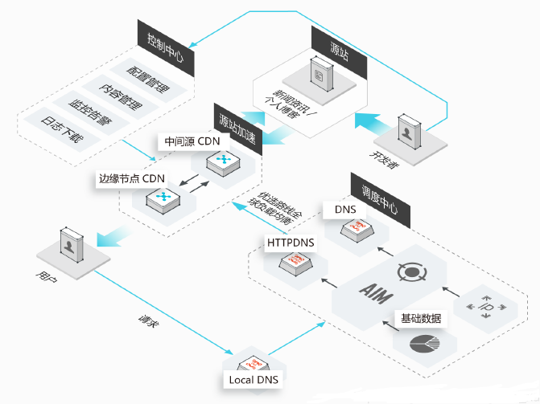
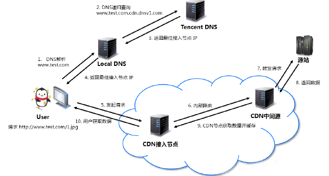
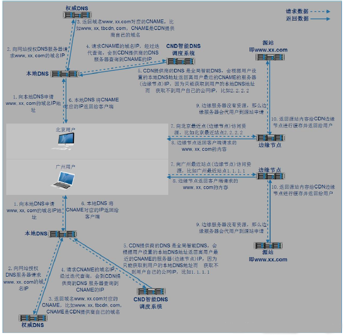
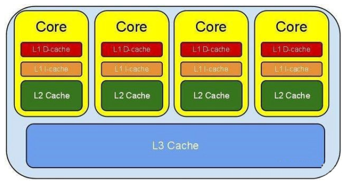
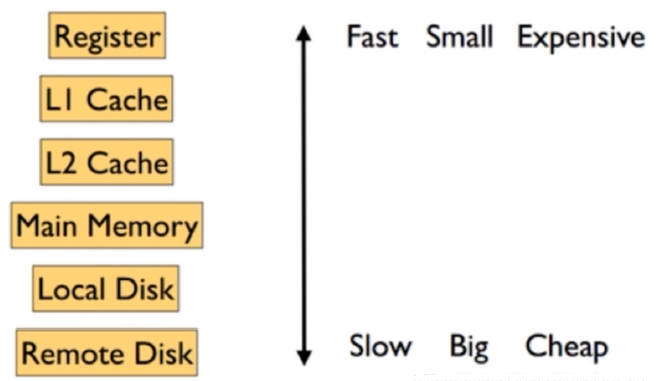

# **1、缓存的概念**

缓存是为了调节速度不一致的两个或多个不同的物质的速度，在中间对速度较快的一方起到一个加速访

问速度较慢的一方的作用，比如 CPU 的一级、二级缓存是保存了 CPU 最近经常访问的数据，内存是保存 CPU 经常访问硬盘的数据，而且硬盘也有大小不一的缓存，甚至是物理服务器的 raid 卡有也缓存为了起到加速 CPU 访问硬盘数据的目的，因为 CPU 的速度太快了， CPU 需要的数据硬盘往往不能在短时间内满足 CPU 的需求，因此 PCU 缓存、内存、 Raid 卡以及硬盘缓存就在一定程度上满足了 CPU 的数据需求，即 CPU 从缓存读取数据可以大幅提高 CPU 的工作效率。

## 1）缓存的保存位置

- 客户端：浏览器

- 内存：本地服务器、远程服务器

- 硬盘：本机硬盘、远程服务器硬盘

## 2）缓存的特性

- 自动过期：给缓存的数据加上有效时间，超出时间后自动过期删除

- 过期时间：强制过期，源网站更新图片后 CDN 是不会更新的，需要强制是图片缓存过期

- 命中率：即缓存的读取命中率

# 2、系统缓存

## buffer 与 cache

- **buffer：**缓冲也叫写缓冲，一般用于写操作，可以将数据先写入内存再写入磁盘，buffer 一般用于写缓

冲，用于解决不同介质的速度不一致的缓冲，先将数据临时写入到里自己最近的地方，以提高写入速

度，CPU 会把数据先写到内存的磁盘缓冲区，然后就认为数据已经写入完成看，然后由内核在后续的时

间再写入磁盘，所以服务器突然断电会丢失内存中的部分数据。

- **cache：**缓存也叫读缓存，一般用于读操作，CPU 读文件从内存读，如果内存没有就先从硬盘读到内存

再读到 CPU，将需要频繁读取的数据放在里自己最近的缓存区域，下次读取的时候即可快速读取。

# 3、用户层缓存

## DNS 缓存

- 默认为 60 秒，即 60 秒之内在访问同一个域名就不再进行 DNS 解析

- 查看 chrome 浏览器的 DNS 缓存：chrome://net-internals/#dns

- DNS 预获取，仅在HTML5中支持，当一个页面中包含多个域名的时候浏览器会先尝试解析域名并

进行缓存，之后再使用的时候即可直接使用不需要再进行DNS 解析

# 4、浏览器缓存

## 1）最后修改时间

系统调用会获取文件的最后修改时间，如果没有发生变化就返回给浏览器304 的状态码，表示没有发生

变化，然后浏览器就使用的本地的缓存展示资源。

## 2)Etag标记

基于Etag标记是否一直做判断页面是否发生过变化，比如基于Nginx的Etag on来实现

## 3)过期时间 expires

以上两种都需要发送请求，即不管资源是否过期都要发送请求进行协商，这样会消耗不必要的时间，因

此有了缓存的过期时间

Expire 是 HttpHeader 中代表资源的过期时间，由服务器端设置。如果带有 Expire ，则在 Expire 过期

前不会发生 Http 请求，直接从缓存中读取。用户强制 F5 例外

第一次请求资源时,响应报文带有资源的过期时间，默认为30天，当前此方式使用的比较多，但是无法保

证客户的时间都是准确并且一致的，因此会加入一个最大生存周期，使用用户本地的时间计算缓存数据

是否超过多少天，假如过期时间Expires:为2028年，但是缓存的最大生存周期Cache-Control: max-

age=315360000，计算为天等于3650天即10年

## 4)混合使用和缓存刷新

通常 Last-Modified,Etag,Expire 是一起混合使用的

- 特别是 Last-Modified 和 Expire 经常一起使用，因为 Expire 可以让浏览器完全不发起 Http 请

求，而当浏览器强制 F5 的时候又有 Last-Modified ，这样就很好的达到了浏览器段缓存的效果。

- Etag 和 Expire 一起使用时，先判断 Expire ，如果已经过期，再发起 Http 请求，如果 Etag 变化

了，则返回 200 响应。如果 Etag 没有变化,则返回 304 响应。

- Last-Modified,Etag,Expires 三个同时使用时。先判断 Expire ，然后发送 Http 请求，服务器先判

断 last-modified ，再判断 Etag ，必须都没有过期，才能返回 304 响应。

### 缓存刷新

第一次访问,获取最新数据,返回 200响应码

鼠标点击二次访问 (Cache),输入地址后回车,浏览器对所有没有过期的内容直接使用本地缓存。

F5或点刷新按钮, 会向服务器发送请求缓存协商信息,last-modified和etag会有影响,但expires本地

过期时间不受影响,无变化返回304

按Ctrl+F5强制刷新,所有缓存不再使用,直接连接服务器,获取最新数据,返回200响应码

## 5)cookie 和 session

- Cookie是访问某些网站以后在本地存储的一些网站相关的信息，下次再访问的时候减少一些步骤,比如加

密后的账户名密码等信息

- Cookies是服务器在客户端浏览器上存储的小段文本并随每一个请求发送至同一个服务器，是一种实现

客户端保持状态的方案。

- session称为会话信息，位于web服务器上，主要负责访问者与网站之间的交互，当浏览器请求http地址

时，可以基于之前的session实现会话保持、session共享等。

# 5、CDN 缓存

## 1）什么是CDN

内容分发网络（Content Delivery Network，CDN）是建立并覆盖在承载网上，由不同区域的服务器组

成的分布式网络。将源站资源缓存到全国各地的边缘服务器，利用全球调度系统使用户能够就近获取，

有效降低访问延迟，降低源站压力,提升服务可用性。

**常见的CDN服务商**

百度CDN：[https://cloud.baidu.com/product/cdn.html](https://cloud.baidu.com/product/cdn.html)

阿里CDN：[https://www.aliyun.com/product/cdn?spm=5176.8269123.416540.50.728y8n](https://www.aliyun.com/product/cdn?spm=5176.8269123.416540.50.728y8n)

腾讯CDN：[https://www.qcloud.com/product/cdn](https://www.qcloud.com/product/cdn)

腾讯云CDN收费介绍：[https://cloud.tencent.com/document/product/228/2949](https://cloud.tencent.com/document/product/228/2949)

## 2）用户请求CDN流程

假设您的业务源站域名为www.test.com，域名接入 CDN 开始使用加速服务后，当您的用户发起HTTP

请求时，实际的处理流程如下图所示：

详细说明如下：

- 1、用户向www.test.com下的某图片资源（如：1.jpg）发起请求，会先向 Local DNS 发起域名解析请求。

- 2. 当 Local DNS 解析www.test.com时，会发现已经配置了

CNAMEwww.test.com.cdn.dnsv1.com，解析请求会发送至 Tencent DNS（GSLB），GSLB 为腾

讯云自主研发的调度体系，会为请求分配最佳节点 IP。

- 3. Local DNS 获取 Tencent DNS 返回的解析 IP。

- 4. 用户获取解析 IP。

- 5. 用户向获取的 IP 发起对资源 1.jpg 的访问请求。

- 6. 若该 IP 对应的节点缓存有 1.jpg，则会将数据直接返回给用户（10），此时请求结束。若该节点未

缓存 1.jpg，则节点会向业务源站发起对 1.jpg 的请求（6、7、8），获取资源后，结合用户自定义

配置的缓存策略，将资源缓存至节点（9），并返回给用户（10），此时请求结束。

## 3）利用 302 实现转发请求重定向至最优服务器集群

因为中国网络较为复杂，依赖DNS就近解析的调度，仍然会存在部分请求调度失效、调度生效慢等问题。

比如:腾讯云利用在全国部署的302重定向服务器集群，能够为每一个请求实时决策最优的服务器资源，

精准解决小运营商的调度问题，提升用户访问质量, 能最快地把用户引导到最优的服务器节点上，避开性

能差或者异常的节点。

## 4）CDN 分层缓存

提前对静态内容进行预缓存，避免大量的请求回源，导致主站网络带宽被打满而导致数据无法更新，另

外CDN可以将数据根据访问的热度不同而进行不同级别的缓存，例如:访问量最高的资源访问CDN 边缘

节点的内存，其次的放在SSD或者SATA，再其次的放在云存储，这样兼顾了速度与成本。

比如: 腾讯云CDN节点，根据用户的数据冷热不同，动态的进行识别，按照cache层次进行数据的存储，

在访问频率到40%-90%的数据，首先放在OC边缘节点内存cache中，提供8G-64G的数据空间存储;在访

问频率到30%-50%的数据，放在OC节点SSD/SATA硬盘cache中，提供1T-15T的数据空间存猪，其他的

比较冷的数据，放在云存储中，采用回源拉取的方式进行处理。这样在成本和效率中计算出最优平衡

点，为客户提供服务。

## 5）CDN主要优势

**CDN 有效地解决了目前互联网业务中网络层面的以下问题：**

- 用户与业务服务器地域间物理距离较远，需要进行多次网络转发，传输延时较高且不稳定。

- 用户使用运营商与业务服务器所在运营商不同，请求需要运营商之间进行互联转发。

- 业务服务器网络带宽、处理能力有限，当接收到海量用户请求时，会导致响应速度降低、可用性降低。

- 利用CDN防止和抵御DDos等攻击,实现安全保护

# 6、应用层缓存

Nginx、PHP等web服务可以设置应用缓存以加速响应用户请求，另外有些解释性语言，比如：

PHP/Python/Java不能直接运行，需要先编译成字节码，但字节码需要解释器解释为机器码之后才能执

行，因此字节码也是一种缓存，有时候还会出现程序代码上线后字节码没有更新的现象。所以一般上线

新版前,需要先将应用缓存清理,再上线新版

另外可以利用动态页面静态化技术,加速访问,比如:将访问数据库的数据的动态页面,提前用程序生成静态

页面文件html.电商网站的商品介绍,评论信息非实时数据等皆可利用此技术实现

# 7、数据层缓存

- 分布式缓存服务

- Redis

- Memcached

- 数据库

- MySQL 查询缓存

- innodb缓存、MyISAM缓存

# 8、硬件缓存

## 1）CPU缓存

CPU缓存(L1的数据缓存和L1的指令缓存)、二级缓存、三级缓存

