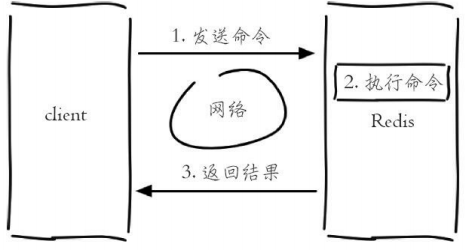
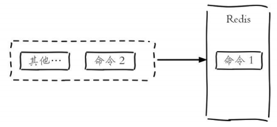

**Redis介绍**

# 1、Redis是什么

Redis 是一个使用 C 语言写成的，开源的 key-value 数据库。和Memcached类似，它支持存储的value

类型相对更多， 包括string(字符串)、list(链表)、set(集合)、zset(sorted set –有序集合)和hash（哈希类

型）。这些数据类型都支持 push/pop、add/remove及取交集并集和差集及更丰富的操作，而且这些操

作都是原子性的。在此基础上，redis支持各 种不同方式的排序。与memcached一样，为了保证效率，

数据都是缓存在内存中。区别的是redis会周期性的把更新的数据写入磁盘或者把修改操作写入追加的记

录文件，并且在此基础上实现了master-slave(主从)同步。

# 2、特点

- 速度快，redis虽然式单线程架构，但是由于redis的数据是运行在内存中的，所以redis的运行速度非常快

- 支持丰富的数据类型，具有五大基本数据类型

- 支持事务

- 丰富的功能特性

# 3、Redis单线程架构

- redis是单线程来处理命令的，所以一条命令从客户端到达服务端不会立刻被执行，所有命令都会

进入一个队列中，然后被执行。当然发送命令、返回结果、命令排队并不是像排队那么简单，

redis采用了I/O多路复用的技术来解决I/O的问题

- 既然是单线程架构为什么redis还能这么快？

- 第一，纯内存访问，Redis将所有数据放在内存中，内存的响应时间大约为100纳秒，这是

redis达到每秒万级别的访问的重要基础

- 第二，非阻塞I/O，Redis使用epoll作为I/O多路复用技术的实现，再加上Redis自身的事件处

理模型将epoll中的连接

- 第三，单线程避免了线程切换和竞态产生的消耗

- 客户端与服务端请求过程

- 所有命令在一个队列里等待被执行

# 4、Redis应用场景

- 建过期功能：缓存，session会话保存，优惠券国企

- 列表：排行榜

- 天然计数器：帖子浏览数、视频播放数、评论留言数

- 集合：兴趣标签，广告投放

- 消息队列：ELK

- 文章列表