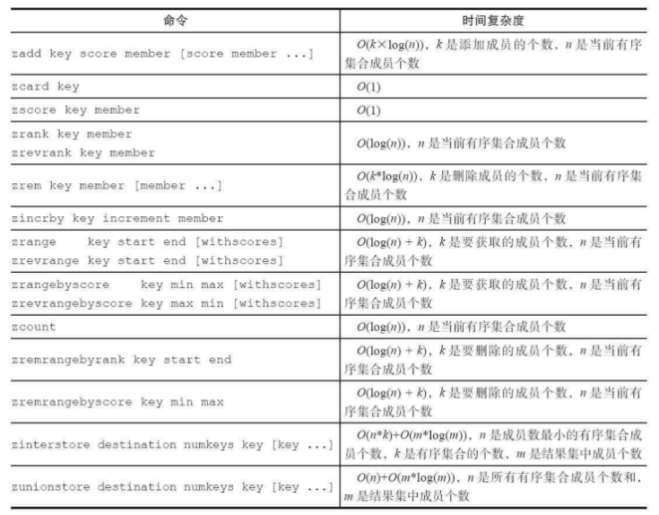

**redis基础命令**

命令手册: [http://redisdoc.com/index.html](http://redisdoc.com/index.html)

# 1、全局命令

## 1）KEYS * ：查看所有键，该命令在生产环境中慎用，会一次性读取所有键，可能会导致阻塞

```
127.0.0.1:6379> KEYS *
1) "k3"
2) "k1"
3) "k4"
4) "k2"
```

## 2）dbsize：查看当前数据库中的所有键的数量

```
127.0.0.1:6379> DBSIZE
(integer) 4
```

## 3)exists key：检查某个键是否存在，存在返回1，不存在返回0

```
127.0.0.1:6379> EXISTS k1
(integer) 1
127.0.0.1:6379> EXISTS k5
(integer) 0
```

## 4)del key：删除键，可以只删除一个键也可以同时删除多个键，删除成功后会返回成功删除键的个数，删除失败会返回0

```
127.0.0.1:6379> DEL k1 k4
(integer) 2
127.0.0.1:6379> keys *
1) "k3"
2) "k2"
```

## 5）expire key seconds：给键设置过期时间，当超过过期时间后会自动删除键

## 6）ttl命令会返回键过期时间

- 大于等于0的整数，键剩余过期的时间

- -2：键不存在

```
127.0.0.1:6379> EXPIRE k3 20
(integer) 1
127.0.0.1:6379> TTL k3
(integer) 13
127.0.0.1:6379> TTL k3
(integer) -2
127.0.0.1:6379> TTL k2
(integer) -1
127.0.0.1:6379> get k2
"v2"
127.0.0.1:6379> get k3
(nil)
```

## 7）查看键的数据结构类型，数据结构类型有五大基本数据类型，现在以字符串为例

```
127.0.0.1:6379> TYPE k2
string
```

# 2、字符串命令

**字符串类型是redis最基础的数据结构，而且其他集中数据结构都是在字符串类型基础上构建的**

## 1)设置值

```
127.0.0.1:6379>
127.0.0.1:6379> SET key value [EX seconds] [PX milliseconds] [NX|XX]
ex seconds：为键设置秒级过期时间
px milliseconds：为键设置毫秒级过期时间
nx：键必须不存在，才可以设置成功，用于添加
xx：与nx相反，键必须存在，才可以设置成功，用于更新
(setex key seconds value   setnx key value它们的作用和ex和nx选项是一样的)
当前键hello不存在：
127.0.0.1:6379> exists hello
(integer) 0
设置键为hello，值为world的键值对：
127.0.0.1:6379> set hello world
OK
因为键hello已存在，所以setnx失败，返回结果为0：
127.0.0.1:6379> setnx hello redis
(integer) 0
因为键hello已存在，所以set xx成功，返回结果为OK：
127.0.0.1:6379> set hello jedis xx
OK
```

## 2)获取值

```
下面操作获取键hello的值：
127.0.0.1:6379> get hello
"world"
如果要获取的键不存在，则返回nil（空）：
127.0.0.1:6379> get not_exist_key
(nil)
```

## 3)批量设置值

```
127.0.0.1:6379> mset a 1 b 2 c 3 d 4
OK
```

## 4）批量获取值

```
127.0.0.1:6379> mget a b c d
1) "1"
2) "2"
3) "3"
4) "4"
```

## 5）计数

```
incr key
incr命令用于对值做自增操作，返回结果分为三种情况：
·值不是整数，返回错误。
·值是整数，返回自增后的结果。
·键不存在，按照值为0自增，返回结果为1。
例如对一个不存在的键执行incr操作后，返回结果是1：
127.0.0.1:6379> exists key
(integer) 0
127.0.0.1:6379> incr key
(integer) 1
再次对键执行incr命令，返回结果是2：
127.0.0.1:6379> incr key
(integer) 2
如果值不是整数，那么会返回错误：
127.0.0.1:6379> set hello world
OK
127.0.0.1:6379> incr hello
(error) ERR value is not an integer or out of range
```

## 6）不常用命令（扩展）

```
（1）追加值
append key value
append可以向字符串尾部追加值，例如：
127.0.0.1:6379> get key
"redis"
127.0.0.1:6379> append key world
(integer) 10
127.0.0.1:6379> get key
"redisworld"
（2）字符串长度
strlen key
例如，当前值为redisworld，所以返回值为10：
127.0.0.1:6379> get key
"redisworld"
127.0.0.1:6379> strlen key
(integer) 10
下面操作返回结果为6，因为每个中文占用3个字节：
83
127.0.0.1:6379> set hello "世界"
OK
127.0.0.1:6379> strlen hello
(integer) 6
（3）设置并返回原值
getset key value
getset和set一样会设置值，但是不同的是，它同时会返回键原来的值，
例如：
127.0.0.1:6379> getset hello world
(nil)
127.0.0.1:6379> getset hello redis
"world"
（4）设置指定位置的字符
setrange key offeset value
下面操作将值由pest变为了best：
127.0.0.1:6379> set redis pest
OK
127.0.0.1:6379> setrange redis 0 b
(integer) 4
127.0.0.1:6379> get redis
"best"
（5）获取部分字符串
getrange key start end
start和end分别是开始和结束的偏移量，偏移量从0开始计算，例如下面
84
操作获取了值best的前两个字符。
127.0.0.1:6379> getrange redis 0 1
"be"
```

# 3、列表命令

列表（list）类型是用来存储多个有序的字符串，是一种线性结构可以充当栈和队列的角色

## 1）添加操作

```
（1）从右边插入元素
rpush key value [value ...]
下面代码从右向左插入元素c、b、a：
127.0.0. 1:6379> rpush listkey c b a
(integer) 3
lrange0-1命令可以从左到右获取列表的所有元素：
127.0.0.1:6379> lrange listkey 0 -1
1) "c"
2) "b"
3) "a"
108
（2）从左边插入元素
lpush key value [value ...]
使用方法和rpush相同，只不过从左侧插入，这里不再赘述。
（3）向某个元素前或者后插入元素
linsert key before|after pivot value
linsert命令会从列表中找到等于pivot的元素，在其前（before）或者后
（after）插入一个新的元素value，例如下面操作会在列表的元素b前插入
java：
127.0.0.1:6379> linsert listkey before b java
(integer) 4
返回结果为4，代表当前命令的长度，当前列表变为：
127.0.0.1:6379> lrange listkey 0 -1
1) "c"
2) "java"
3) "b"
4) "a"
```

## 2）查找

```
（1）获取指定范围内的元素列表
lrange key start end
lrange操作会获取列表指定索引范围所有的元素。索引下标有两个特点：第一，索引下标从左到右分别
是0到N-1，但是从右到左分别是-1到-N。
第二，lrange中的end选项包含了自身，这个和很多编程语言不包含end不太相同，例如想获取列表的
第2到第4个元素，可以执行如下操作：
127.0.0.1:6379> lrange listkey 1 3
1) "java"
2) "b"
3) "a"
（2）获取列表指定索引下标的元素
lindex key index
例如当前列表最后一个元素为a：
127.0.0.1:6379> lindex listkey -1
"a"
（3）获取列表长度
llen key
例如，下面示例当前列表长度为4：
127.0.0.1:6379> llen listkey
(integer) 4
```

## 3)删除

```
（1）从列表左侧弹出元素
lpop key
110
如下操作将列表最左侧的元素c会被弹出，弹出后列表变为java、b、
a：
127.0.0.1:6379>t lpop listkey
"c"
127.0.0.1:6379> lrange listkey 0 -1
1) "java"
2) "b"
3) "a"
（2）从列表右侧弹出
rpop key
它的使用方法和lpop是一样的，只不过从列表右侧弹出，这里不再赘
述。
（3）删除指定元素
lrem key count value
lrem命令会从列表中找到等于value的元素进行删除，根据count的不同
分为三种情况：
·count>0，从左到右，删除最多count个元素。
·count<0，从右到左，删除最多count绝对值个元素。
·count=0，删除所有。
例如向列表从左向右插入5个a，那么当前列表变为“a a a a a java b a”，
下面操作将从列表左边开始删除4个为a的元素：
127.0.0.1:6379> lrem listkey 4 a
(integer) 4
127.0.0.1:6379> lrange listkey 0 -1
1) "a"
2) "java"
3) "b"
4) "a"
（4）按照索引范围修剪列表
ltrim key start end
例如，下面操作会只保留列表listkey第2个到第4个元素：
127.0.0.1:6379> ltrim listkey 1 3
OK
127.0.0.1:6379> lrange listkey 0 -1
1) "java"
2) "b"
3) "a"
```

## 4）修改

```
修改指定索引下标的元素：
lset key index newValue
下面操作会将列表listkey中的第3个元素设置为python：
127.0.0.1:6379> lset listkey 2 python
OK
127.0.0.1:6379> lrange listkey 0 -1
1) "java"
2) "b"
3) "python"
```

# 4、哈希命令

几乎所有编程语言都提供了hash类型，他们的叫法可能是哈希、字典、关联数组。常常会使用

hash数据类型存储关系型数据库中的表

## 1）设置值

```
hset key field value
127.0.0.1:6379> hset user:1 name tom
(integer) 1
```

## 2）获取值

```
hget key field
127.0.0.1:6379> hget user:1 name
"tom"
```

## 3)删除field

```
hdel key field [field ...]
hdel会删除一个或多个field，返回结果为成功删除field的个数
127.0.0.1:6379> hdel user:1 name
(integer) 1
127.0.0.1:6379> hdel user:1 age
(integer) 0
```

## 4)计算field个数

```
hlen key
127.0.0.1:6379> hset user:1 name tom
(integer) 1
127.0.0.1:6379> hset user:1 age 23
(integer) 1
127.0.0.1:6379> hset user:1 city tianjin
(integer) 1
127.0.0.1:6379> hlen user:1
(integer) 3
```

## 5)批量设置或获取field-value

```
hmget key field [field ...]
hmset key field value [field value ...]
hmset和hmget分别是批量设置和获取field-value，hmset需要的参数是key
和多对field-value，hmget需要的参数是key和多个field
127.0.0.1:6379> hmset user:1 name mike age 12 city tianjin
OK
127.0.0.1:6379> hmget user:1 name city
1) "mike"
2) "tianjin"
```

## 6)判断field是否存在

```
hexists key field
127.0.0.1:6379> hexists user:1 name
(integer) 1
```

## 7)获取所有field

```
hkeys key
hkeys命令应该叫hfields更为恰当，它返回指定哈希键所有的field
127.0.0.1:6379> hkeys user:1
1) "name"
2) "age"
3) "city"
```

## 8)获取所有value

```
hvals key
下面操作获取user：1全部value：
127.0.0.1:6379> hvals user:1
1) "mike"
2) "12"
3) "tianjin"
```

## 9)获取所有的field-value

```
hgetall key
下面操作获取user：1所有的field-value：
127.0.0.1:6379> hgetall user:1
1) "name"
2) "mike"
3) "age"
4) "12"
5) "city"
6) "tianjin"
```

# 5、集合命令

集合（set）类型也是用来保存多个的字符串元素，集合中不允许有重复出现的元素，集合的元素

是没有顺序的不能够通过下标来获得值

## 1）添加元素

```
sadd key element [element ...]
返回结果为添加成功的元素个数
127.0.0.1:6379> exists myset
(integer) 0
127.0.0.1:6379> sadd myset a b c
(integer) 3
127.0.0.1:6379> sadd myset a b
(integer) 0
```

## 2）删除元素

```
srem key element [element ...]
返回结果为成功删除元素个数
127.0.0.1:6379> srem myset a b
(integer) 2
127.0.0.1:6379> srem myset hello
(integer) 0
```

## 3）计算元素个数

```
scard key
122
scard的时间复杂度为O（1），它不会遍历集合所有元素，而是直接用Redis内部的变量
127.0.0.1:6379> scard myset
(integer) 1
```

## 4）判断元素是否在集合中

```
sismember key element
如果给定元素element在集合内返回1，反之返回0：
127.0.0.1:6379> sismember myset c
(integer) 1
```

## 5）随机从集合中返回指定元素个数

```
srandmember key [count]
[count]是可选参数，如果不写默认为1
127.0.0.1:6379> srandmember myset 2
1) "a"
2) "c"
127.0.0.1:6379> srandmember myset
"d"
```

## 6)从集合随机弹出元素

```
spop key
spop操作可以从集合中随机弹出一个元素，例如下面代码是一次spop后，集合元素变为"d b a"：
127.0.0.1:6379> spop myset
"c"
127.0.0.1:6379> smembers myset
1) "d"
2) "b"
3) "a"
```

## 7)获取所有元素

```
smembers key
下面代码获取集合myset所有元素，并且返回结果是无序的：
127.0.0.1:6379> smembers myset
1) "d"
2) "b"
3) "a"
```

## 8)交集运算

```
127.0.0.1:6379> sadd user:1:follow it music his sports
(integer) 4
127.0.0.1:6379> sadd user:2:follow it news ent sports
(integer) 4
sinter key [key ...]
例如下面代码是求user：1：follow和user：2：follow两个集合的交集，返回结果是sports、it：
127.0.0.1:6379> sinter user:1:follow user:2:follow
1) "sports"
2) "it"
```

## 9)并集运算

```
suinon key [key ...]
例如下面代码是求user：1：follow和user：2：follow两个集合的并集，返回结果是sports、it、
his、news、music、ent：
127.0.0.1:6379> sunion user:1:follow user:2:follow
1) "sports"
2) "it"
3) "his"
4) "news"
5) "music"
6) "ent"
```

## 10)差集运算

```
sdiff key [key ...]
例如下面代码是求user：1：follow和user：2：follow两个集合的差集，返回结果是music和his：
127.0.0.1:6379> sdiff user:1:follow user:2:follow
1) "music"
2) "his"
```

## 11）将交集、并集、差集的结果保存

```
sinterstore destination key [key ...]
suionstore destination key [key ...]
sdiffstore destination key [key ...]
集合间的运算在元素较多的情况下会比较耗时，所以Redis提供了上面三个命令（原命令+store）将集
合间交集、并集、差集的结果保存在
destination key中，例如下面操作将user：1：follow和user：2：follow两个集合的交集结果
保存在user：1_2：inter中，user：1_2：inter本身也是集合类型：
127.0.0.1:6379> sinterstore user:1_2:inter user:1:follow user:2:follow
(integer) 2
127.0.0.1:6379> type user:1_2:inter
set
127.0.0.1:6379> smembers user:1_2:inter
1) "it"
2) "sports"
```

# 6、有序集合命令

- 有序集合保留了集合不能有重复成员的特性，不同的是有序集合中的元素是可以排序的。但是它和

列表使用索引下标作为排序依据不同的是它给每个元素设置一个分数（score）作为排序的依据

## 1）添加成员

```
zadd key score member [score member ...]
下面操作向有序集合user：ranking添加用户tom和他的分数251：
127.0.0.1:6379> zadd user:ranking 251 tom
(integer) 1
127.0.0.1:6379> zadd user:ranking 1 kris 91 mike 200 frank 220 tim 250
martin
(integer) 5
有关zadd命令有两点需要注意：
Redis3.2为zadd命令添加了nx、xx、ch、incr四个选项：
nx：member必须不存在，才可以设置成功，用于添加。
xx：member必须存在，才可以设置成功，用于更新。
h：返回此次操作后，有序集合元素和分数发生变化的个数
incr：对score做增加，相当于后面介绍的zincrby。
```

## 2)计算成员个数

```
zcard key
例如下面操作返回有序集合user：ranking的成员数为5，和集合类型的
scard命令一样，zcard的时间复杂度为O（1）。
127.0.0.1:6379> zcard user:ranking
(integer) 5
```

## 3)计算某个成员的分数

```
zscore key member
tom的分数为251，如果成员不存在则返回nil：
127.0.0.1:6379> zscore user:ranking tom
"251"
127.0.0.1:6379> zscore user:ranking test
(nil)
```

## 4)计算某个成员的排名

```
zrank key member
zrevrank key member
zrank是从分数从低到高返回排名，zrevrank反之。例如下面操作中，tom
在zrank和zrevrank分别排名第5和第0（排名从0开始计算）。
127.0.0.1:6379> zrank user:ranking tom
(integer) 5
127.0.0.1:6379> zrevrank user:ranking tom
(integer) 0
```

## 5)删除成员

```
zrem key member [member ...]
下面操作将成员mike从有序集合user：ranking中删除。
127.0.0.1:6379> zrem user:ranking mike
(integer) 1
返回结果为成功删除的个数。
```

## 6)增加成员的分数

```
zincrby key increment member
下面操作给tom增加了9分，分数变为了260分：
127.0.0.1:6379> zincrby user:ranking 9 tom
"260"
```

## 7)返回指定排名范围的成员

```
zrange key start end [withscores]
zrevrange key start end [withscores]
有序集合是按照分值排名的，zrange是从低到高返回，zrevrange反之。
下面代码返回排名最低的是三个成员，如果加上withscores选项，同时会返
回成员的分数：
127.0.0.1:6379> zrange user:ranking 0 2 withscores
1) "kris"
2) "1"
3) "frank"
4) "200"
5) "tim"
6) "220"
127.0.0.1:6379> zrevrange user:ranking 0 2 withscores
1) "tom"
2) "260"
3) "martin"
4) "250"
5) "tim"
6) "220"
```

## 8)返回指定分数范围的成员

```
zrangebyscore key min max [withscores] [limit offset count]
zrevrangebyscore key max min [withscores] [limit offset count]
其中zrangebyscore按照分数从低到高返回，zrevrangebyscore反之。例如
下面操作从低到高返回200到221分的成员，withscores选项会同时返回每个
成员的分数。[limit offset count]选项可以限制输出的起始位置和个数：
127.0.0.1:6379> zrangebyscore user:ranking 200 tinf withscores
1) "frank"
2) "200"
3) "tim"
4) "220"
127.0.0.1:6379> zrevrangebyscore user:ranking 221 200 withscores
1) "tim"
2) "220"
3) "frank"
4) "200"
同时min和max还支持开区间（小括号）和闭区间（中括号），-inf和
+inf分别代表无限小和无限大：
127.0.0.1:6379> zrangebyscore user:ranking (200 +inf withscores
1) "tim"
2) "220"
3) "martin"
4) "250"
5) "tom"
6) "260"
```

## 9)返回指定分数范围的成员个数

```
zcount key min max
下面操作返回200到221分的成员的个数：
127.0.0.1:6379> zcount user:ranking 200 221
(integer) 2
```

## 10)删除指定排名内的升序元素

```
zremrangebyrank key start end
下面操作删除第start到第end名的成员：
127.0.0.1:6379> zremrangebyrank user:ranking 0 2
(integer) 3
```

## 11）删除指定分数范围的成员

```
zremrangebyscore key min max
下面操作将250分以上的成员全部删除，返回结果为成功删除的个数：
127.0.0.1:6379> zremrangebyscore user:ranking (250 +inf
(integer) 2
```

## 12）交集运算

```
127.0.0.1:6379> zadd user:ranking:1 1 kris 91 mike 200 frank 220 tim 250
martin
251 tom
(integer) 6
127.0.0.1:6379> zadd user:ranking:2 8 james 77 mike 625 martin 888 tom
(integer) 4
zinterstore destination numkeys key [key ...] [weights weight [weight ...]]
[aggregate sum|min|max]
这个命令参数较多，下面分别进行说明：
destination：交集计算结果保存到这个键。
numkeys：需要做交集计算键的个数。
key[key...]：需要做交集计算的键。
weights weight[weight...]：每个键的权重，在做交集计算时，每个键中
的每个member会将自己分数乘以这个权重，每个键的权重默认是1。
aggregate sum|min|max：计算成员交集后，分值可以按照sum（和）、
min（最小值）、max（最大值）做汇总，默认值是sum。
127.0.0.1:6379> zinterstore user:ranking:1_inter_2 2 user:ranking:1
user:ranking:2
(integer) 3
127.0.0.1:6379> zrange user:ranking:1_inter_2 0 -1 withscores
1) "mike"
2) "168"
3) "martin"
4) "875"
5) "tom"
6) "1139"
如果想让user：ranking：2的权重变为0.5，并且聚合效果使用max，可以
执行如下操作：
127.0.0.1:6379> zinterstore user:ranking:1_inter_2 2 user:ranking:1
user:ranking:2 weights 1 0.5 aggregate max
(integer) 3
127.0.0.1:6379> zrange user:ranking:1_inter_2 0 -1 withscores
1) "mike"
2) "91"
3) "martin"
4) "312.5"
5) "tom"
6) "444"
```

## 13)并集运算

```
zunionstore destination numkeys key [key ...] [weights weight [weight ...]]
[aggregate sum|min|max]
该命令的所有参数和zinterstore是一致的，只不过是做并集计算，例如
下面操作是计算user：ranking：1和user：ranking：2的并集，weights和
aggregate使用了默认配置，可以看到目标键user：ranking：1_union_2对分值
做了sum操作：
127.0.0.1:6379> zunionstore user:ranking:1_union_2 2 user:ranking:1
user:ranking:2
(integer) 7
127.0.0.1:6379> zrange user:ranking:1_union_2 0 -1 withscores
1) "kris"
2) "1"
3) "james"
4) "8"
5) "mike"
6) "168"
7) "frank"
8) "200"
9) "tim"
10) "220"
11) "martin"
12) "875"
13) "tom"
14) "1139"
```

## 14）命令的时间复杂度（了解）

