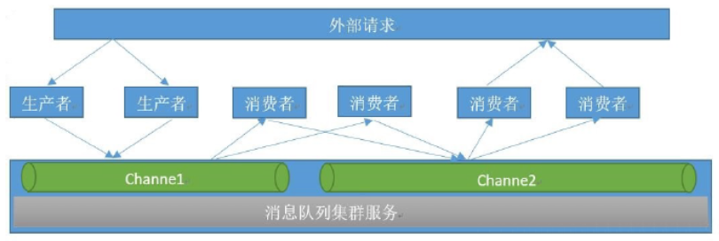

**Redis丰富特性**

Redis除了提供五大基本数据类型，还提供了丰富的功能强大的附加功能

- 慢查询分析：通过慢查询分析，找到有问题的命令进行优化。

- Redis Shell：功能强大的Redis Shell会有意想不到的实用功能。

- Pipeline：通过Pipeline（管道或者流水线）机制有效提高客户端性能。

- 事务与Lua：制作自己的专属原子命令。

- Bitmaps：通过在字符串数据结构上使用位操作，有效节省内存，为开 发提供新的思路。

- HyperLogLog：一种基于概率的新算法，难以想象地节省内存空间。 ·发布订阅：基于发布订阅模

式的消息通信机制。

- GEO：Redis3.2提供了基于地理位置信息的功能。

# 1、慢查询分析

## 1）可以通过config set命令动态修改参数，并使配置持久化到配置文件中

```
config set slowlog-log-slower-than 20000 # 单位为微秒
config set slowlog-max-len 1000
config rewrite
```

## 2）获取慢查询日志

```
slowlog get [n]
下面操作返回当前Redis的慢查询，参数n可以指定条数：
127.0.0.1:6379> slowlog get
1) 1) (integer) 666
176
2) (integer) 1456786500
3) (integer) 11615
4) 1) "BGREWRITEAOF"
2) 1) (integer) 665
2) (integer) 1456718400
3) (integer) 12006
4)  1) "SETEX"
  2) "video_info_200"
  3) "300"
  4) "2"
...
可以看到每个慢查询日志有4个属性组成，分别是慢查询日志的标识
id、发生时间戳、命令耗时、执行命令和参数
```

## 3)获取慢查询日志列表当前的长度

```
slowlog len
例如，当前Redis中有45条慢查询：
127.0.0.1:6379> slowlog len
(integer) 45
```

## 4)慢查询日志重置

```
slowlog reset
实际是对列表做清理操作，例如：
127.0.0.1:6379> slowlog len
(integer) 45
127.0.0.1:6379> slowlog reset
OK
127.0.0.1:6379> slowlog len
(integer) 0
```

# 2、Redis shell

## 1）redis-cli 详解

### -r（repeat）选项代表将命令执行多次，例如下面操作将会执行三次ping 命令

```
redis-cli -r 3 ping
PONG
PONG
PONG
```

### -i（interval）选项代表每隔几秒执行一次命令，但是-i选项必须和-r选 项一起使用，下面的操作会每隔1秒执行一次ping命令，一共执行5次

```
$ redis-cli -r 5 -i 1 ping
PONG
PONG
PONG
PONG
PONG
```

### -x选项代表从标准输入（stdin）读取数据作为redis-cli的最后一个参 数，例如下面的操作会将字符串world作为set hello的值：

```
$ echo "world" | redis-cli -x set hello
OK
```

- -c（cluster）选项是连接Redis Cluster节点时需要使用的，-c选项可以防 止moved和ask异常

- 如果Redis配置了密码，可以用-a（auth）选项，有了这个选项就不需要 手动输入auth命令

- 略

## 2）redis-server 详解

- redis-server- -test-memory可以用来检测当前操作系统能否稳定地分配指定容量的内存给 Redis，

通过这种检测可以有效避免因为内存问题造成Redis崩溃，例如下面 操作检测当前操作系统能否提

供1G的内存给Redis

```
redis-server --test-memory 1024 
```

- 整个内存检测的时间比较长。当输出passed this test时说明内存检测完 毕

## 3）redis-benchmark详解

- redis-benchmark可以为Redis做基准性能测试，它提供了很多选项帮助开 发和运维人员测试Redis

的相关性能

- -c（clients）选项代表客户端的并发数量（默认是50）。

- -n（num）选项代表客户端请求总量（默认是100000）。

- -q选项仅仅显示redis-benchmark的requests per second信息。

- 在一个空的Redis上执行了redis-benchmark会发现只有3个键, 如果想向Redis插入更多的键，可以

执行使用-r（random）选项，可以向 Redis插入更多随机的键。

# 3、Pipeline

- Redis提供了批量操作命令（例如mget、mset等），有效地节约RTT。但 大部分命令是不支持批量

操作的，例如要执行n次hgetall命令，并没有 mhgetall命令存在，需要消耗n次RTT。

- Pipeline（流水线）机制能改善上面这类问题，它能将一组Redis命令进 行组装，通过一次RTT传输

给Redis，再将这组Redis命令的执行结果按顺序返回给客户端


```
echo -en
'*3\r\n$3\r\nSET\r\n$5\r\nhello\r\n$5\r\nworld\r\n*2\r\n$4\r\nincr\r\
n$7\r\ncounter\r\n' | redis-cli --pipe
```

# 4、Bitmaps

## 1）设置值

```
setbit key offset value
127.0.0.1:6379> setbit unique:users:2016-04-05 0 1
(integer) 0
127.0.0.1:6379> setbit unique:users:2016-04-05 5 1
(integer) 0
127.0.0.1:6379> setbit unique:users:2016-04-05 11 1
(integer) 0
127.0.0.1:6379> setbit unique:users:2016-04-05 15 1
(integer) 0
127.0.0.1:6379> setbit unique:users:2016-04-05 19 1
(integer) 0
```


## 2）获取值

```
getbit key offset
127.0.0.1:6379> getbit unique:users:2016-04-05 8
(integer) 0
```

## 3）获取Bitmaps指定范围值为1的个数

```
bitcount [start][end]
下面操作计算2016-04-05这天的独立访问用户数量：
127.0.0.1:6379> bitcount unique:users:2016-04-05
(integer) 5
[start]和[end]代表起始和结束字节数，下面操作计算用户id在第1个字节
到第3个字节之间的独立访问用户数，对应的用户id是11，15，19。
127.0.0.1:6379> bitcount unique:users:2016-04-05 1 3
(integer) 3
```

## 4）Bitmaps间的运算

```
bitop是一个复合操作，它可以做多个Bitmaps的and（交集）、or（并
集）、not（非）、xor（异或）操作并将结果保存在destkey中。
bitop op destkey key[key....]
计算出2016-04-04和2016-04-03两天都访问过网站的用户数
127.0.0.1:6379> bitop and unique:users:and:2016-04-04_03 unique: users:2016-
04-03
unique:users:2016-04-03
(integer) 2
127.0.0.1:6379> bitcount unique:users:and:2016-04-04_03
(integer) 2
```

# 5、消息队列

消息队列: 把要传输的数据放在队列中

功能: 可以实现多个系统之间的解耦,异步,削峰/限流等

常用的消息队列应用: kafka,rabbitMQ,redis


消息队列主要分为两种,这两种模式Redis都支持

- 生产者/消费者模式

- 发布者/订阅者模式

## 1）生产者消费者模式

在生产者/消费者(Producer/Consumer)模式下，上层应用接收到的外部请求后开始处理其当前步骤的操

作，在执行完成后将已经完成的操作发送至指定的频道(channel,逻辑队列)当中，并由其下层的应用监听

该频道并继续下一步的操作，如果其处理完成后没有下一步的操作就直接返回数据给外部请求，如果还

有下一步的操作就再将任务发布到另外一个频道，由另外一个消费者继续监听和处理。此模式应用广泛

## 2)模式介绍

生产者消费者模式下，多个消费者同时监听一个队列，但是一个消息只能被最先抢到消息的消费者消

费，即消息任务是一次性读取和处理，此模式在分布式业务架构中很常用，比较常用的消息队列软件还

有RabbitMQ、Kafka、RocketMQ、ActiveMQ等。



## 3)队列介绍

队列当中的消息由不同的生产者写入，也会有不同的消费者取出进行消费处理，但是一个消息一定是只

能被取出一次也就是被消费一次。


- 生产者发布消息

```
[root@localhost ~]# redis-cli
127.0.0.1:6379> lpush channel1 msg1
(integer) 1
127.0.0.1:6379> lpush channel1 msg2
(integer) 2
127.0.0.1:6379> lpush channel1 msg3
(integer) 3
127.0.0.1:6379> lpush channel1 msg4
(integer) 4
127.0.0.1:6379> lpush channel1 msg5
(integer) 5
```

- 查看队列所有消息

```
127.0.0.1:6379> lrange channel1 0 -1
1) "msg5"
2) "msg4"
3) "msg3"
4) "msg2"
5) "msg1"
```

- 消费者消费消息

```
127.0.0.1:6379> rpop channel1
"msg1"
127.0.0.1:6379> rpop channel1
"msg2"
127.0.0.1:6379> rpop channel1
"msg3"
127.0.0.1:6379> rpop channel1
"msg4"
127.0.0.1:6379> rpop channel1
"msg5"
127.0.0.1:6379> rpop channel1
(nil)
```

# 6、发布订阅

Redis提供了基于“发布/订阅”模式的消息机制，此种模式下，消息发布 者和订阅者不进行直接通信，发

布者客户端向指定的频道（channel）发布消 息，订阅该频道的每个客户端都可以收到该消息

## 1）发布消息

```
publish channel message
下面操作会向channel：sports频道发布一条消息“Tim won the
championship”，返回结果为订阅者个数，因为此时没有订阅，所以返回结果
为0：
127.0.0.1:6379> publish channel:sports "Tim won the championship"
(integer) 0
```

## 2)订阅消息

```
subscribe channel [channel ...]
订阅者可以订阅一个或多个频道，下面操作为当前客户端订阅了
channel：sports频道：
127.0.0.1:6379> subscribe channel:sports
Reading messages... (press Ctrl-C to quit)
1) "subscribe"
2) "channel:sports"
3) (integer) 1
```

## 3)取消订阅

```
unsubscribe [channel [channel ...]]
客户端可以通过unsubscribe命令取消对指定频道的订阅，取消成功后，
不会再收到该频道的发布消息：
127.0.0.1:6379> unsubscribe channel:sports
1) "unsubscribe"
2) "channel:sports"
3) (integer) 0
```

## 4）按照模式订阅和取消订阅

```
psubscribe pattern [pattern...]
punsubscribe [pattern [pattern ...]]
除了subcribe和unsubscribe命令，Redis命令还支持glob风格的订阅命令
psubscribe和取消订阅命令punsubscribe，例如下面操作订阅以it开头的所有
频道：
127.0.0.1:6379> psubscribe it*
Reading messages... (press Ctrl-C to quit)
1) "psubscribe"
2) "it*"
```

## 5）查询订阅

```
（1）查看活跃的频道
pubsub channels [pattern]
所谓活跃的频道是指当前频道至少有一个订阅者，其中[pattern]是可以
指定具体的模式：
127.0.0.1:6379> pubsub channels
1) "channel:sports"
2) "channel:it"
3) "channel:travel"
127.0.0.1:6379> pubsub channels channel:*r*
1) "channel:sports"
2) "channel:travel"
（2）查看频道订阅数
pubsub numsub [channel ...]
当前channel：sports频道的订阅数为2：
127.0.0.1:6379> pubsub numsub channel:sports
1) "channel:sports"
2) (integer) 2
（3）查看模式订阅数
pubsub numpat
当前只有一个客户端通过模式来订阅：
127.0.0.1:6379> pubsub numpat
(integer) 1
```

# 7、GEO

Redis3.2版本提供了GEO（地理信息定位）功能，支持存储地理位置信 息用来实现诸如附近位置、摇一

摇这类依赖于地理位置信息的功能，对于需 要实现这些功能的开发者来说是一大福音。

## 1）增加地理位置信息

```
geoadd key longitude latitude member [longitude latitude member ...]
127.0.0.1:6379> geoadd cities:locations 116.28 39.55 beijing
(integer) 1
127.0.0.1:6379> geoadd cities:locations 116.28 39.55 beijing
(integer) 0
27.0.0.1:6379> geoadd cities:locations 117.12 39.08 tianjin 114.29 38.02
shijiazhuang 118.01 39.38 tangshan 115.29 38.51 baoding
(integer) 4
```

## 2）获取地理位置信息

```
geopos key member [member ...]
下面操作会获取天津的经维度：
127.0.0.1:6379> geopos cities:locations tianjin
1) 1) "117.12000042200088501"
2) "39.0800000535766543"
```

## 3）获取两个地理位置的距离

```
geodist key member1 member2 [unit]
其中unit代表返回结果的单位，包含以下四种：
m（meters）代表米。
km（kilometers）代表公里。
mi（miles）代表英里。
ft（feet）代表尺。
127.0.0.1:6379> geodist cities:locations tianjin beijing km
"89.2061"
```

## 4）获取指定位置范围内的地理信息位置集合

```
georadius key longitude latitude radiusm|km|ft|mi [withcoord] [withdist]
[withhash] [COUNT count] [asc|desc] [store key] [storedist key]
georadiusbymember key member radiusm|km|ft|mi [withcoord] [withdist]
[withhash] [COUNT count] [asc|desc] [store key] [storedist key]
withcoord：返回结果中包含经纬度。
withdist：返回结果中包含离中心节点位置的距离。
withhash：返回结果中包含geohash，有关geohash后面介绍。
COUNT count：指定返回结果的数量。
asc|desc：返回结果按照离中心节点的距离做升序或者降序。
store key：将返回结果的地理位置信息保存到指定键。
storedist key：将返回结果离中心节点的距离保存到指定键
127.0.0.1:6379> georadiusbymember cities:locations beijing 150 km
1) "beijing"
2) "tianjin"
3) "tangshan"
4) "baoding"
```

## 5）删除地理位置信息

```
GEO没有提供删除成员的命令，但是因为GEO的底层实现是zset，所以
可以借用zrem命令实现对地理位置信息的删除
zrem key member
```