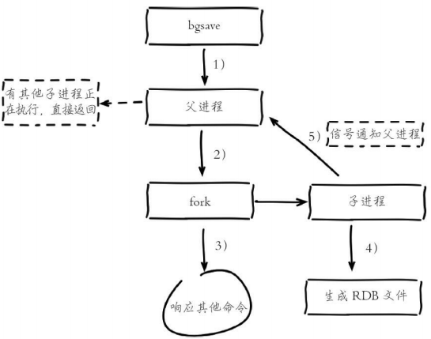
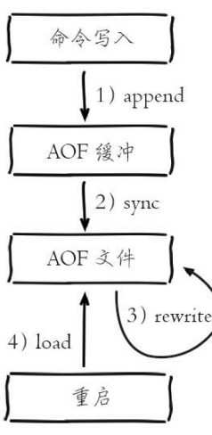
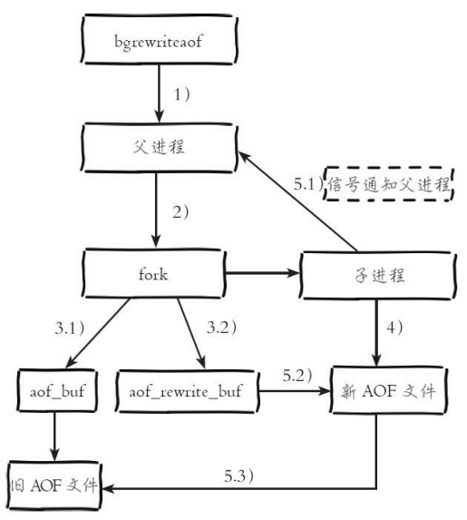
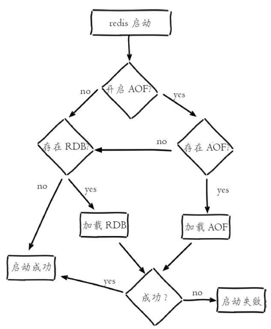

**数据持久化**

Redis支持RDB和AOF两种持久化机制，持久化功能能有效地避免因进程退出造成的数据丢失问题，当下

次重启时利用之前之间持久化的文件即可实现数据恢复。简单点说，redis是将数据运行在内存中的，如

果出现服务挂掉或者服务器宕机都可以导致数据全部丢失，为了解决这个问题redis提供了两种解决方

案，分别是rdb、aof

# 1、RDB持久化

## 1）简介

RDB持久是把当前数据生成快照保存到硬盘的过程

触发RDB持久化过程为手动触发和自动触发

- 优点

- RDB是一个非常紧凑(compact)的文件，它保存了redis 在某个时间点上的数据集。这种文件

非常适合用于进 行备份和灾难恢复。

- RDB 在恢复大数据集时的速度比 AOF 的恢复速度要快。

- 缺点

- RDB方式数据没办法做到实时持久化/秒级持久化。因为bgsave每次运行都要执行fork操作创

建子进程，属于 重量级操作(内存中的数据被克隆了一份，大致2倍的膨胀性需要考虑)，频繁

执行成本过高(影响性能)

- RDB文件使用特定二进制格式保存，Redis版本演进过程中有多个格式的RDB版本，存在老版

本Redis服务无 法兼容新版RDB格式的问题(版本不兼容)

- 在一定间隔时间做一次备份，所以如果redis意外down掉的话，就会丢失最后一次快照后的所

有修改(数据有 丢失)

## 2）触发方式

- 自动触发：主配置文件中的save字段

```
分别表示每900秒数据发生一次改变、每300秒数据发生10次改变、每60秒数据发生10000
次改变会自动触发rdb持久化机制
save 900 1
save 300 10
save 60 10000
```

- 手动触发

- save命令：阻塞当前Redis服务器，直到RDB过程完成为止，对于内存 比较大的实例会造成

长时间阻塞，线上环境不建议使用。

- bgsave命令：Redis进程执行fork操作创建子进程，RDB持久化过程由子 进程负责，完成后

自动结束。阻塞只发生在fork阶段，一般时间很短。

- 默认情况下执行shutdown命令时，如果没有开启AOF持久化功能则 自动执行bgsave

## 3）BGSAVE流程说明



1、执行bgsave命令，Redis父进程判断当前是否存在正在执行的子进 程，如RDB/AOF子进程，如果

存在bgsave命令直接返回。

2. 父进程执行fork操作创建子进程，fork操作过程中父进程会阻塞，通 过info stats命令查看

latest_fork_usec选项，可以获取最近一个fork操作的耗 时，单位为微秒。

3. 父进程fork完成后，bgsave命令返回“Background saving started”信息 并不再阻塞父进程，可以

继续响应其他命令。

4. 子进程创建RDB文件，根据父进程内存生成临时快照文件，完成后 对原有文件进行原子替换。执行

lastsave命令可以获取最后一次生成RDB的 时间，对应info统计的rdb_last_save_time选项。

5. 进程发送信号给父进程表示完成，父进程更新统计信息，

## 4）运维提示

- 当遇到坏盘或磁盘写满等情况时，可以通过config set dir{newDir}在线 修改文件路径到可用的磁

盘路径，之后执行bgsave进行磁盘切换，同样适用 于AOF持久化文件。

- Redis默认采用LZF算法对生成的RDB文件做压缩处理，压缩后的 文件远远小于内存大小，默认开

启，可以通过参数config set rdbcompression{yes|no}动态修改。

- 如果想要恢复相关数据，只需要将相关的RDB文件拷贝到相关的目录下面即可，redis启动时会自动

将rdb文件里的内容加载到内存中。

# 2、AOF持久化

## 1）简介

- AOF（append only file）持久化：以独立日志的方式记录每次写命令，重启时再重新执行AOF文

件中的命令达到恢复数据的目的。

- AOF的主要作用是解决了数据持久化的实时性，目前已经是Redis持久化的主流方式。

- 优点

- AOF 持久化的方法提供了多种的同步频率，即使使用默认的同步频率每秒同步一次，Redis 最

多也就丢失 1 秒的数据而已。

- AOF 文件使用 Redis 命令追加的形式来构造，因此，即使 Redis 只能向 AOF 文件写入命令的

片断，使用 redis-check-aof 工具也很容易修正 AOF 文件。

- AOF 文件的格式可读性较强，这也为使用者提供了更灵活的处理方式。例如，如果我们不小

心错用了 FLUSHALL 命令，在重写还没进行时，我们可以手工将最后的 FLUSHALL 命令去

掉，然后再使用 AOF 来恢 复数据。

- 缺点

- 对于具有相同数据的的 Redis，AOF 文件通常会比 RDB 文件体积更大。

- 虽然 AOF 提供了多种同步的频率，默认情况下，每秒同步一次的频率也具有较高的性能。但

在 Redis 的负载 较高时，RDB 比 AOF 具好更好的性能保证。

- RDB 使用快照的形式来持久化整个 Redis 数据，而 AOF 只是将每次执行的命令追加到 AOF

文件中，因此从 理论上说，RDB 比 AOF 方式更健壮。官方文档也指出，AOF 的确也存在一

些 BUG，这些 BUG 在 RDB 没有 存在。

## 2）使用AOF

开启AOF功能需要设置配置：appendonly yes，默认不开启。AOF文件名 通过appendfilename配

置设置，默认文件名是appendonly.aof。保存路径同 RDB持久化方式一致，通过dir配置指定。

```
appendonly yes # 将配置文件中appendonly字段设置为yes即可
```

## 3）工作流程



1. 所有的写入命令会追加到aof_buf（缓冲区）中。

1. AOF缓冲区根据对应的策略向硬盘做同步操作。

1. 随着AOF文件越来越大，需要定期对AOF文件进行重写，达到压缩 的目的。

1. 当Redis服务器重启时，可以加载AOF文件进行数据恢复。

## 4）重写机制

随着命令不断写入AOF，文件会越来越大，为了解决这个问题，Redis 引入AOF重写机制压缩文件体积。

重写后的AOF文件会变小，原因如下

- 进程内已经超时的数据不再写入文件。

- 旧的AOF文件含有无效命令，如del key1、hdel key2、srem keys、set a111、set a222等。

重写使用进程内数据直接生成，这样新的AOF文件只保 留最终数据的写入命令。

- 多条写命令可以合并为一个，如：lpush list a、lpush list b、lpush list c可以转化为：lpush

list a b c。为了防止单条命令过大造成客户端缓冲区溢 出，对于list、set、hash、zset等类型

操作，以64个元素为界拆分为多条。

- 手动触发：直接调用bgrewriteaof命令

- 自动触发：根据auto-aof-rewrite-min-size和auto-aof-rewrite-percentage参 数确定自动触发时机。



1. 执行AOF重写请求。

1. 父进程执行fork创建子进程，开销等同于bgsave过程。

3.1 主进程fork操作完成后，继续响应其他命令。所有修改命令依然写 入AOF缓冲区并根据

appendfsync策略同步到硬盘，保证原有AOF机制正确 性。

3.2 由于fork操作运用写时复制技术，子进程只能共享fork操作时的内 存数据。由于父进程依然响

应命令，Redis使用“AOF重写缓冲区”保存这部 分新数据，防止新AOF文件生成期间丢失这部分数

据。

1. 子进程根据内存快照，按照命令合并规则写入到新的AOF文件。每 次批量写入硬盘数据量由配置

aof-rewrite-incremental-fsync控制，默认为 32MB，防止单次刷盘数据过多造成硬盘阻塞。

5.1 新AOF文件写入完成后，子进程发送信号给父进程，父进程更新 统计信息，具体见info persistence

下的aof_*相关统计。

5.2 父进程把AOF重写缓冲区的数据写入到新的AOF文件。

5.3 使用新AOF文件替换老文件，完成AOF重写。

## 5）重启加载持久化文件



1. AOF持久化开启且存在AOF文件时，优先加载AOF文件

1. AOF关闭或者AOF文件不存在时，加载RDB文件

1. 加载AOF/RDB文件成功后，Redis启动成功。

1. AOF/RDB文件存在错误时，Redis启动失败并打印错误信息。